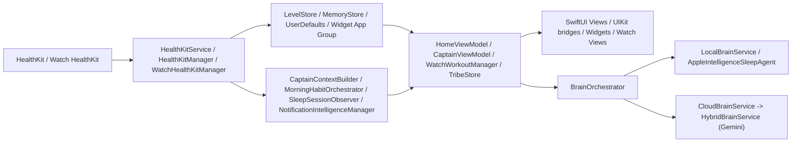

# AiQo Master Blueprint 10

Date of audit: 2026-04-07  
Repository root: `/Users/mohammedraad/Desktop/AiQo`

## 1. Executive Summary
AiQo is a large, Arabic-first SwiftUI iOS app with meaningful product breadth already implemented across wellness, coaching, sleep, gym, kitchen, watch, widgets, HealthKit, and Supabase, but it is not yet submission-safe. Based on the live codebase, TestFlight readiness is approximately **58%** and App Store readiness is approximately **42%**. The biggest blockers are: **missing main-app HealthKit usage strings** (`AiQo/Info.plist:4-86`), **a live spiritual / angel-number notification system still scheduled from app launch** (`AiQo/App/AppDelegate.swift:149-151`, `AiQo/Services/Notifications/ActivityNotificationEngine.swift:1-520`, `AiQo/Services/Notifications/NotificationIntelligenceManager.swift:8-9`), and **monetization still implemented as two runtime tiers instead of the agreed Core / Pro / Intelligence structure** (`AiQo/UI/Purchases/PaywallView.swift:148-151`, `AiQo/Core/Purchases/SubscriptionProductIDs.swift:5-16`, `AiQo/Core/Purchases/SubscriptionTier.swift:4-25`, `AiQo/Resources/AiQo_Test.storekit:17-79`).

Delta vs Blueprint 7: **`AiQo_Master_Blueprint_7.md` was not found in the codebase**, so this audit compared the current tree to the latest available blueprint, `AiQo_Master_Blueprint_9.md`. The live tree is materially larger now (current audit: **415 Swift files / 105,025 Swift LOC**, versus Blueprint 9's lower count in `AiQo_Master_Blueprint_9.md`), Tribe is still hidden and partly mock-backed (`AiQo/Info.plist:74-79`, `AiQo/Tribe/Repositories/TribeRepositories.swift:18-31`, `AiQo/Tribe/TribeStore.swift:55-67`), the watch companion is much more substantial (`AiQoWatch Watch App/*`), but the notification layer still contains the spiritual/angel-number system that should already be gone (`AiQo/Services/Notifications/ActivityNotificationEngine.swift:1-520`, `AiQo/Services/Notifications/NotificationIntelligenceManager.swift:147-230`).

## 2. Project Topology
### Targets
Targets found in the Xcode project:

| Target | Purpose | Evidence |
| --- | --- | --- |
| `AiQo` | Main iOS app | `AiQo.xcodeproj/project.pbxproj:1089`, `AiQo.xcodeproj/project.pbxproj:1157` |
| `AiQoTests` | iOS unit tests | `AiQo.xcodeproj/project.pbxproj:1183`, `AiQo.xcodeproj/project.pbxproj:1205` |
| `AiQoUITests` | iOS UI tests | `AiQo.xcodeproj/project.pbxproj:1226`, `AiQo.xcodeproj/project.pbxproj:1247` |
| `AiQoWidgetExtension` | iOS widget | `AiQo.xcodeproj/project.pbxproj:1279`, `AiQo.xcodeproj/project.pbxproj:1311` |
| `AiQoWatch Watch App` | watchOS companion app | `AiQo.xcodeproj/project.pbxproj:1345`, `AiQo.xcodeproj/project.pbxproj:1382` |
| `AiQoWatch Watch AppTests` | watch unit tests | `AiQo.xcodeproj/project.pbxproj:1406`, `AiQo.xcodeproj/project.pbxproj:1429` |
| `AiQoWatch Watch AppUITests` | watch UI tests | `AiQo.xcodeproj/project.pbxproj:1451`, `AiQo.xcodeproj/project.pbxproj:1473` |
| `AiQoWorkoutLiveAttributesExtension` | Live Activity / ActivityKit target | `AiQo.xcodeproj/project.pbxproj:1507`, `AiQo.xcodeproj/project.pbxproj:1540` |
| `Watch Widget Extension` / `AiQoWatchWidgetExtension` | watch widget target | `AiQo.xcodeproj/project.pbxproj:1571`, `AiQo.xcodeproj/project.pbxproj:1603` |

### Folder Structure Tree
Depth-3 structural view from the live repo:

```text
AiQo/
├── AiQo/
│   ├── App/
│   ├── Core/
│   ├── DesignSystem/
│   ├── Features/
│   ├── Premium/
│   ├── Resources/
│   ├── Services/
│   ├── Tribe/
│   └── UI/
├── AiQoWatch Watch App/
│   ├── Design/
│   ├── Models/
│   ├── Services/
│   ├── Shared/
│   └── Views/
├── AiQoWidget/
├── AiQoWatchWidget/
├── AiQoTests/
├── AiQoUITests/
├── AiQoWatch Watch AppTests/
├── AiQoWatch Watch AppUITests/
└── Configuration/
```

### Codebase Size
- Relevant audited files: **449** total files, including Swift, plist, entitlements, storekit, xcconfig, markdown, strings, privacy manifests, and `project.pbxproj` (computed from the files listed in `## Methodology`).
- Swift files: **415**
- Swift LOC: **105,025**

Largest 10 Swift files by LOC:

| File | LOC |
| --- | ---: |
| `AiQo/Features/Profile/ProfileScreen.swift` | 2072 |
| `AiQo/Features/Home/VibeControlSheet.swift` | 1495 |
| `AiQo/Features/Gym/PhoneWorkoutSummaryView.swift` | 1422 |
| `AiQoWatch Watch App/WorkoutManager.swift` | 1344 |
| `AiQo/Features/Gym/CinematicGrindViews.swift` | 1204 |
| `AiQo/Features/Captain/CaptainScreen.swift` | 1147 |
| `AiQo/Tribe/TribeModuleComponents.swift` | 1146 |
| `AiQo/Features/Gym/Quests/Views/QuestDetailSheet.swift` | 1043 |
| `AiQo/Features/Tribe/TribeView.swift` | 1028 |
| `AiQo/PhoneConnectivityManager.swift` | 1009 |

### Third-Party Dependencies
SPM pins found in `AiQo.xcodeproj/project.xcworkspace/xcshareddata/swiftpm/Package.resolved:3-95`:

| Package | Version |
| --- | --- |
| `SDWebImage` | `5.21.6` |
| `SDWebImageSwiftUI` | `3.1.4` |
| `supabase-swift` | `2.36.0` |
| `swift-asn1` | `1.5.0` |
| `swift-clocks` | `1.0.6` |
| `swift-concurrency-extras` | `1.3.2` |
| `swift-crypto` | `4.2.0` |
| `swift-http-types` | `1.4.0` |
| `swift-system` | `1.6.4` |
| `xctest-dynamic-overlay` | `1.7.0` |

## 3. Architecture Map
### Layer Breakdown
- **Views**: SwiftUI-heavy feature surfaces under `AiQo/Features/*`, `AiQo/UI/*`, and the watch-specific `AiQoWatch Watch App/Views/*`.
- **ViewModels**: Captain, Home, Kitchen, Legendary Challenges, watch workout, and Tribe include explicit view models such as `AiQo/Features/Captain/CaptainViewModel.swift`, `AiQo/Features/Home/HomeViewModel.swift`, `AiQo/Features/Kitchen/KitchenViewModel.swift`, `AiQo/Features/LegendaryChallenges/ViewModels/LegendaryChallengesViewModel.swift`, and `AiQoWatch Watch App/Services/WatchWorkoutManager.swift`.
- **Services**: HealthKit, notifications, Supabase, crash reporting, analytics, purchases, Spotify, and voice live under `AiQo/Services/*` and `AiQo/Core/*`.
- **Stores**: `MemoryStore`, `EntitlementStore`, `AccessManager`, `LevelStore`, `UserProfileStore`, `TribeStore`, `ArenaStore`, and others act as stateful singletons (`AiQo/Core/MemoryStore.swift:8-35`, `AiQo/Core/Purchases/EntitlementStore.swift:4-54`, `AiQo/Premium/AccessManager.swift:4-106`, `AiQo/Tribe/TribeStore.swift:6-27`).
- **Models**: SwiftData and plain Swift models appear across Captain, Legendary Challenges, Tribe, Kitchen, watch sync, widgets, and HealthKit summaries.
- **Orchestrators / coordinators**: `BrainOrchestrator`, `CaptainContextBuilder`, `MorningHabitOrchestrator`, `SleepSessionObserver`, `NotificationIntelligenceManager`, and `AppFlowController` are the main orchestration nodes (`AiQo/Features/Captain/BrainOrchestrator.swift:11-52`, `AiQo/Features/Captain/CaptainContextBuilder.swift:133-212`, `AiQo/Services/Notifications/MorningHabitOrchestrator.swift:5-123`, `AiQo/Features/Sleep/SleepSessionObserver.swift:5-35`, `AiQo/Services/Notifications/NotificationIntelligenceManager.swift:5-69`, `AiQo/App/SceneDelegate.swift:16-235`).

### Data Flow


### `BrainOrchestrator`
Actual implemented routing is strict, not aspirational:

```swift
switch request.screenContext {
case .sleepAnalysis:
    return .local
case .gym, .kitchen, .peaks, .myVibe, .mainChat:
    return .cloud
}
```

Source: `AiQo/Features/Captain/BrainOrchestrator.swift:83-90`

Additional real behavior:
- Sleep requests can be intercepted and force-routed to `.sleepAnalysis` even when initiated from another screen (`AiQo/Features/Captain/BrainOrchestrator.swift:95-109`).
- Cloud failure skips local fallback for network / Apple Intelligence availability cases and returns a network error instead (`AiQo/Features/Captain/BrainOrchestrator.swift:176-190`).
- Sleep fallback uses **aggregated summary only**, not raw stages, when it falls back to cloud (`AiQo/Features/Captain/BrainOrchestrator.swift:128-158`, `AiQo/Features/Captain/BrainOrchestrator.swift:225-260`).

### `PrivacySanitizer`
What it strips today:

```swift
private let maxConversationMessages = 4
private let stepsBucketSize = 50
private let caloriesBucketSize = 10
```

Source: `AiQo/Features/Captain/PrivacySanitizer.swift:21-25`

```swift
RedactionRule(pattern: #"[A-Z0-9._%+-]+@[A-Z0-9.-]+\.[A-Z]{2,}"#, template: "[REDACTED]")
RedactionRule(pattern: #"(?<!\d)(?:\+?\d[\d\-\s\(\)]{7,}\d)"#, template: "[REDACTED]")
RedactionRule(pattern: #"\b[0-9A-F]{8}\-[0-9A-F]{4}\-[1-5][0-9A-F]{3}\-[89AB][0-9A-F]{3}\-[0-9A-F]{12}\b"#, template: "[REDACTED]")
```

Source: `AiQo/Features/Captain/PrivacySanitizer.swift:32-47`

```swift
CaptainContextData(
    steps: bucketedNonNegativeInt(context.steps, bucketSize: stepsBucketSize, maximum: maximumSteps),
    calories: bucketedNonNegativeInt(context.calories, bucketSize: caloriesBucketSize, maximum: maximumCalories),
    vibe: "General",
```

Source: `AiQo/Features/Captain/PrivacySanitizer.swift:269-275`

It also strips EXIF / GPS from kitchen images by re-encoding JPEG thumbnails (`AiQo/Features/Captain/PrivacySanitizer.swift:175-210`).

## 4. Feature Inventory
| Feature | Status | Files Involved | Info.plist Flag | Known Issues | Apple Risk |
| --- | --- | --- | --- | --- | --- |
| Sleep Architecture / هندسة النوم | 🟡 Partial | `AiQo/Features/Sleep/SleepDetailCardView.swift`, `AiQo/Features/Sleep/AppleIntelligenceSleepAgent.swift`, `AiQo/Features/Sleep/SleepSessionObserver.swift`, `AiQo/Features/Captain/BrainOrchestrator.swift` | None found | Sleep routing and observer exist, but iOS HealthKit usage strings are missing from main app plist | HealthKit disclosure risk |
| Smart Wake / الاستيقاظ الذكي | 🟡 Partial | `AiQo/Features/Sleep/SmartWakeEngine.swift`, `AiQo/Features/Sleep/SmartWakeViewModel.swift`, `AiQo/Services/Notifications/MorningHabitOrchestrator.swift` | None found | AlarmKit usage text exists, but full launch-readiness depends on permission and launch compliance | AlarmKit / notification timing |
| Alchemy Kitchen / مطبخ الكيمياء | 🟡 Partial | `AiQo/Features/Kitchen/KitchenScreen.swift`, `AiQo/Features/Kitchen/SmartFridgeCameraViewModel.swift`, `AiQo/Features/Kitchen/NutritionTrackerView.swift`, `AiQo/Features/Captain/CloudBrainService.swift` | None found | Fridge scanner sends image to Gemini; fallback items are returned on failure | Privacy / nutrition claims |
| Zone 2 Coaching | 🟡 Partial | `AiQo/Features/Gym/HandsFreeZone2Manager.swift`, `AiQo/Features/Gym/LiveWorkoutSession.swift`, `AiQo/Features/Gym/WorkoutSessionViewModel.swift` | None found | Implemented in gym stack, but not independently compliance-audited here | Workout / HealthKit accuracy |
| XP / Leveling | ✅ Shipped | `AiQo/Core/Models/LevelStore.swift`, `AiQo/Shared/LevelSystem.swift`, `AiQo/Features/Home/LevelUpCelebrationView.swift` | None found | Broadly integrated; no immediate blocker found in this audit | Low |
| Tribe / إمارة | ⚫️ Hidden via flag | `AiQo/Info.plist`, `AiQo/Tribe/TribeStore.swift`, `AiQo/Tribe/Repositories/TribeRepositories.swift`, `AiQo/Services/SupabaseArenaService.swift` | `TRIBE_FEATURE_VISIBLE`, `TRIBE_BACKEND_ENABLED`, `TRIBE_SUBSCRIPTION_GATE_ENABLED` | Hidden, still mock-backed in user-facing flows, backend repository still delegates to mocks | Mock-data launch blocker |
| Legendary Challenges | 🟡 Partial | `AiQo/Features/LegendaryChallenges/Views/RecordProjectView.swift`, `AiQo/Features/LegendaryChallenges/Views/WeeklyReviewView.swift`, `AiQo/Features/LegendaryChallenges/ViewModels/RecordProjectManager.swift` | None found | Weekly review sends current weight + review text to Gemini | Privacy / health-adjacent coaching |
| HRR / قياس المحرك | 🟡 Partial | `AiQo/Features/LegendaryChallenges/ViewModels/HRRWorkoutManager.swift`, `AiQo/Premium/AccessManager.swift` | None found | Gated to Intelligence Pro; not fully traced to a complete user flow in this audit | Health claim sensitivity |
| My Vibe | 🟡 Partial | `AiQo/Features/MyVibe/MyVibeScreen.swift`, `AiQo/Core/SpotifyVibeManager.swift`, `AiQo/Features/Captain/PromptRouter.swift` | None found | Active feature, but Spotify permissions / external dependency behavior still matter | Spotify / privacy |
| Captain Hamoudi Memory / كابتن حمودي | 🟡 Partial | `AiQo/Core/CaptainMemory.swift`, `AiQo/Core/MemoryStore.swift`, `AiQo/Core/MemoryExtractor.swift`, `AiQo/Features/Captain/CaptainViewModel.swift` | None found | Memory cap is tier-dependent; no separate `captainLanguage` setting found | Privacy / retention |
| AiQoWatch | 🟡 Partial | `AiQoWatch Watch App/AiQoWatchApp.swift`, `AiQoWatch Watch App/WorkoutManager.swift`, `AiQoWatch Watch App/Views/WatchHomeView.swift`, `AiQoWatch Watch App/Services/WatchHealthKitManager.swift` | None found | Real workout stack exists, but home view still shows hardcoded water | Health accuracy |
| Notifications | 🔴 Broken | `AiQo/App/AppDelegate.swift`, `AiQo/Services/Notifications/ActivityNotificationEngine.swift`, `AiQo/Services/Notifications/NotificationIntelligenceManager.swift`, `AiQo/Core/SmartNotificationScheduler.swift` | Background task identifiers in `AiQo/Info.plist` | Spiritual / angel-number system still live; no 23:00-07:00 global quiet-hours enforcement found | App Review content + notification abuse |
| Onboarding | 🟡 Partial | `AiQo/App/SceneDelegate.swift`, `AiQo/Features/Onboarding/OnboardingWalkthroughView.swift`, `AiQo/Features/First screen/LegacyCalculationViewController.swift` | None found | Many steps implemented; HealthKit request path exists; launch readiness still blocked by missing plist strings | HealthKit permission flow |
| Paywall | 🔴 Broken | `AiQo/UI/Purchases/PaywallView.swift`, `AiQo/Core/Purchases/SubscriptionProductIDs.swift`, `AiQo/Core/Purchases/SubscriptionTier.swift`, `AiQo/Resources/AiQo_Test.storekit` | None found | Still two tiers, not three; no direct subscription management deep link found | StoreKit subscription disclosure |

## 5. Captain Hamoudi System
### Six-Layer Prompt Architecture
The six-layer prompt architecture is explicitly implemented in `CaptainPromptBuilder`:

```swift
return [
    layerIdentity(language: request.language, firstName: firstName),
    layerMemory(profileSummary: request.userProfileSummary),
    layerBioState(data: request.contextData, language: request.language),
    layerCircadianTone(data: request.contextData, language: request.language),
```

Source: `AiQo/Features/Captain/CaptainPromptBuilder.swift:16-21`

```swift
    layerScreenContext(request: request),
    layerOutputContract(screenContext: request.screenContext, language: request.language)
]
```

Source: `AiQo/Features/Captain/CaptainPromptBuilder.swift:21-25`

Layer mapping:

| Layer | Actual implementation |
| --- | --- |
| Identity | `CaptainPromptBuilder.layerIdentity` (`AiQo/Features/Captain/CaptainPromptBuilder.swift:28-133`) |
| Memory | `CaptainPromptBuilder.layerMemory` (`AiQo/Features/Captain/CaptainPromptBuilder.swift:135-147`) |
| Bio-state | `CaptainPromptBuilder.layerBioState` fed by `CaptainContextBuilder.buildContextData()` (`AiQo/Features/Captain/CaptainPromptBuilder.swift:149-188`, `AiQo/Features/Captain/CaptainContextBuilder.swift:191-212`) |
| Circadian tone | `CaptainPromptBuilder.layerCircadianTone` using `BioTimePhase` (`AiQo/Features/Captain/CaptainPromptBuilder.swift:190-206`, `AiQo/Features/Captain/CaptainContextBuilder.swift:6-76`) |
| Screen context | `CaptainPromptBuilder.layerScreenContext` (`AiQo/Features/Captain/CaptainPromptBuilder.swift:208-260`) |
| Output contract | `CaptainPromptBuilder.layerOutputContract` (same file, below line 260) and `PromptRouter.generateSystemPrompt` for local path (`AiQo/Features/Captain/PromptRouter.swift:15-58`) |

### Voice Pipeline
Current voice pipeline is a configurable remote TTS integration with explicit references to **ElevenLabs** in comments, not Fish Speech:
- Config plumbing: `AiQo/Info.plist:14-21`, `Configuration/Secrets.template.xcconfig:7-10`
- API resolver: `AiQo/Core/CaptainVoiceAPI.swift`
- Playback / synthesis orchestration: `AiQo/Core/CaptainVoiceService.swift`
- Cache layer comments still reference ElevenLabs: `AiQo/Core/CaptainVoiceService.swift:238`, `AiQo/Core/CaptainVoiceCache.swift:6`, `AiQo/Core/CaptainVoiceCache.swift:37`

No `Fish Speech`, `FishSpeech`, or migration code was found in the repo (`rg` across `AiQo` and `Configuration` returned none). Migration path is therefore **not found in codebase**.

### Memory Store
Captain memory is a SwiftData model in `AiQo/Core/CaptainMemory.swift`. The cap is actually enforced in `MemoryStore.set(...)`, but it is **tier-based**, not always 200:

```swift
let count = (try? context.fetchCount(countDescriptor)) ?? 0
if count >= maxMemories {
    removeLowestConfidence()
}
```

Source: `AiQo/Core/MemoryStore.swift:57-62`

`maxMemories` comes from `AccessManager.shared.captainMemoryLimit` (`AiQo/Core/MemoryStore.swift:14-16`), and that limit is:

```swift
switch activeTier {
case .intelligencePro:
    return 500
default:
    return 200
}
```

Source: `AiQo/Premium/AccessManager.swift:57-63`

Chat history cap enforcement is separate and is set to 200 persisted messages (`AiQo/Core/MemoryStore.swift:275-289`).

### Language Switching Logic
No `captainLanguage` setting was found in the codebase. The active language primitives are:
- app language: `AiQo/Core/AppSettingsStore.swift:13-39`
- notification language override: `notificationLanguage` in `AiQo/Services/Notifications/NotificationIntelligenceManager.swift:44` and `AiQo/Core/Models/NotificationPreferencesStore.swift`

This means Captain does **not** have a dedicated `captainLanguage` setting in code today. Notification language does not fully respect the app setting, because `performInactivityCheckAndNotifyIfNeeded` hardcodes Arabic:

```swift
let body = await notificationComposer.composeInactivityNotification(
    metrics: metrics,
    now: now,
    language: .arabic,
```

Source: `AiQo/Services/Notifications/NotificationIntelligenceManager.swift:331-335`

## 6. Monetization & StoreKit 2
### Current StoreKit Files
`AiQo/Resources/AiQo_Test.storekit` contains two recurring subscriptions:
- `com.mraad500.aiqo.standard.monthly` at `9.99` with one free introductory week (`AiQo/Resources/AiQo_Test.storekit:25-47`)
- `com.mraad500.aiqo.intelligencepro.monthly` at `39.99` with one free introductory week (`AiQo/Resources/AiQo_Test.storekit:56-79`)

`AiQo/Resources/AiQo.storekit` still contains old non-renewing products:
- `aiqo_nr_30d_individual_5_99` (`AiQo/Resources/AiQo.storekit:4-17`)
- `aiqo_nr_30d_family_10_00` (`AiQo/Resources/AiQo.storekit:18-31`)

### Paywall State vs Agreed 3-Tier Structure
The current paywall does **not** match the intended Core / Pro / Intelligence structure.

Proof:

```swift
Text(copy(
    ar: "خطان شهريتان متجدّدتان عبر StoreKit 2: AiQo Standard و AiQo Intelligence Pro.",
    en: "Two monthly subscription tiers through StoreKit 2: AiQo Standard and AiQo Intelligence Pro."
))
```

Source: `AiQo/UI/Purchases/PaywallView.swift:148-151`

Runtime product IDs are also only two:

```swift
static let standardMonthly = "com.mraad500.aiqo.standard.monthly"
static let intelligenceProMonthly = "com.mraad500.aiqo.intelligencepro.monthly"
static let allCurrentIDs: Set<String> = [
    standardMonthly,
    intelligenceProMonthly
]
```

Source: `AiQo/Core/Purchases/SubscriptionProductIDs.swift:5-16`

And runtime tiers are only:

```swift
enum SubscriptionTier: Int, Comparable {
    case none = 0
    case standard = 1
    case intelligencePro = 2
}
```

Source: `AiQo/Core/Purchases/SubscriptionTier.swift:4-8`

Gaps vs three-tier model:
- No `Core` runtime tier.
- No `Pro` runtime tier.
- No third StoreKit subscription product in the active config.
- Paywall copy, sort order, and entitlement mapping still assume two tiers.

### Entitlement Gating
Current gating is implemented in `AccessManager`:
- Standard unlocks Captain, Gym, Kitchen, My Vibe, Challenges, data tracking, and Captain notifications (`AiQo/Premium/AccessManager.swift:35-42`)
- Intelligence Pro unlocks Peaks, HRR, weekly AI workout plan, record projects, extended memory, and intelligence model (`AiQo/Premium/AccessManager.swift:45-63`)

Tribe gating is effectively bypassed when `TRIBE_SUBSCRIPTION_GATE_ENABLED` is `false`:

```swift
if TribeFeatureFlags.subscriptionGateEnabled == false {
    entitlementSnapshot = EntitlementSnapshot(
        hasTribeAccess: true,
        hasIntelligenceProAccess: true,
        activePlan: .intelligencePro,
```

Source: `AiQo/Premium/AccessManager.swift:217-224`

### Free Trial
There are two trial mechanisms in play:
- StoreKit introductory 1-week free trial in `AiQo/Resources/AiQo_Test.storekit:29-35` and `AiQo/Resources/AiQo_Test.storekit:60-66`
- App-managed 7-day free trial in `AiQo/Premium/FreeTrialManager.swift:5-16`

The app-managed trial starts independently of StoreKit:

```swift
let now = nowProvider()
defaults.set(now, forKey: Keys.trialStartDate)
KeychainTrialHelper.writeTrialStartDate(now)
```

Source: `AiQo/Premium/FreeTrialManager.swift:42-48`

So free-trial implementation is **mixed** and could be confusing from a policy and analytics perspective.

### Apple Guideline Check
| Requirement | Status | Evidence |
| --- | --- | --- |
| Restore purchases button | ✅ | `AiQo/UI/Purchases/PaywallView.swift:304-309`, `AiQo/UI/Purchases/PaywallView.swift:468-473`, `AiQo/Core/Purchases/PurchaseManager.swift:203-216` |
| Terms link | ✅ | `AiQo/UI/LegalView.swift:48-82` |
| Privacy link | ✅ | `AiQo/UI/LegalView.swift:48-82` |
| Subscription management deep link | ❌ | No direct `showManageSubscriptions`, `open(URL)`, or Settings deep link found in paywall/legal code |
| No misleading tier copy | ❌ | Live code still declares only two tiers while historical and requested product direction expects three |

## 7. HealthKit & Privacy Compliance
### Requested HealthKit Types
Main iOS HealthKit authorization requests:
- Read: `stepCount`, `heartRate`, `restingHeartRate`, `heartRateVariabilitySDNN`, `walkingHeartRateAverage`, `activeEnergyBurned`, `distanceWalkingRunning`, `dietaryWater`, `vo2Max`, `sleepAnalysis`, `appleStandHour`, `workoutType` (`AiQo/Services/Permissions/HealthKit/HealthKitService.swift:43-74`)
- Write: `dietaryWater`, `heartRate`, `restingHeartRate`, `heartRateVariabilitySDNN`, `vo2Max`, `distanceWalkingRunning`, `workoutType` (`AiQo/Services/Permissions/HealthKit/HealthKitService.swift:75-101`)

Onboarding requests even more:
- Additional read types: `distanceCycling`, `oxygenSaturation`, `bodyMass`, `appleStandTime`, `activitySummaryType` (`AiQo/App/SceneDelegate.swift:108-125`)
- Additional write type: `bodyMass` (`AiQo/App/SceneDelegate.swift:127-136`)

Watch app requests:
- Read: `stepCount`, `activeEnergyBurned`, `distanceWalkingRunning`, `heartRate`, `sleepAnalysis`, `workoutType`
- Write: `workoutType`

Source: `AiQoWatch Watch App/Services/WatchHealthKitManager.swift:13-28`

### Usage Description Audit
The main iOS app plist contains `NSAlarmKitUsageDescription`, but **does not contain** `NSHealthShareUsageDescription` or `NSHealthUpdateUsageDescription` (`AiQo/Info.plist:4-86`).

The watch app plist does contain both HealthKit keys:
- `NSHealthShareUsageDescription` (`AiQoWatch-Watch-App-Info.plist:5-6`)
- `NSHealthUpdateUsageDescription` (`AiQoWatch-Watch-App-Info.plist:7-8`)

Arabic and English `InfoPlist.strings` files only localize camera usage:
- `AiQo/Resources/ar.lproj/InfoPlist.strings:1`
- `AiQo/Resources/en.lproj/InfoPlist.strings:1`

Conclusion: **main app HealthKit usage descriptions are missing and not localized**. This is a submission blocker.

### Raw Health Data Sent to Gemini or External APIs
Hard rejection risk audit:

- `CloudBrainService` sanitizes and buckets context before cloud transit (`AiQo/Features/Captain/CloudBrainService.swift:23-37`, `AiQo/Features/Captain/PrivacySanitizer.swift:77-101`, `AiQo/Features/Captain/PrivacySanitizer.swift:269-275`).
- `BrainOrchestrator` keeps `.sleepAnalysis` local and only cloud-falls back with aggregated summary text (`AiQo/Features/Captain/BrainOrchestrator.swift:83-90`, `AiQo/Features/Captain/BrainOrchestrator.swift:128-158`, `AiQo/Features/Captain/BrainOrchestrator.swift:225-260`).
- `HybridBrainService` sends sanitized request bodies to Gemini (`AiQo/Features/Captain/HybridBrainService.swift:286-350`).

However, other external Gemini calls exist:
- `WeeklyReviewView` sends current weight, performance, feedback, rating, and obstacle text in the system prompt (`AiQo/Features/LegendaryChallenges/Views/WeeklyReviewView.swift:315-366`, `AiQo/Features/LegendaryChallenges/Views/WeeklyReviewView.swift:342`)
- `MemoryExtractor` sends sanitized user and assistant text to Gemini for structured extraction (`AiQo/Core/MemoryExtractor.swift:189-235`, `AiQo/Core/MemoryExtractor.swift:211-235`)
- `SmartFridgeCameraViewModel` sends fridge images to Gemini after image sanitization (`AiQo/Features/Kitchen/SmartFridgeCameraViewModel.swift:131-182`)

I did **not** find a direct path that sends raw HealthKit sleep stages or unbucketed Captain health context to Gemini in the Captain cloud path, but there are still external AI calls carrying personal wellness data outside the strict Captain routing.

### Background Delivery / Observers
Active observers and background delivery in code:
- `SleepSessionObserver` enables background delivery for `sleepAnalysis` and installs an `HKObserverQuery` (`AiQo/Features/Sleep/SleepSessionObserver.swift:40-76`)
- `MorningHabitOrchestrator` enables background delivery for `stepCount` and installs an `HKObserverQuery` (`AiQo/Services/Notifications/MorningHabitOrchestrator.swift:142-190`)
- `AIWorkoutSummaryService` is started from app delegate and onboarding flow (`AiQo/App/AppDelegate.swift:145-147`, `AiQo/App/SceneDelegate.swift:81-83`), and its implementation lives inside `AiQo/Services/Notifications/NotificationService.swift`

Tear-down behavior:
- No explicit observer teardown or background-delivery disable path was found for `SleepSessionObserver` or `MorningHabitOrchestrator`; they only guard repeated startup with `hasStartedObserver` / `hasStartedStepObserver`.

## 8. Supabase & Backend
### Tables Used
From live query code:
- `profiles` (`AiQo/Services/SupabaseService.swift:58-63`, `AiQo/Services/SupabaseService.swift:91-107`, `AiQo/Services/SupabaseService.swift:140-144`)
- `arena_tribe_participations` (`AiQo/Services/SupabaseArenaService.swift:172-177`)
- `arena_tribes` (`AiQo/Services/SupabaseArenaService.swift:208-212`, `AiQo/Services/SupabaseArenaService.swift:250-256`)
- `arena_tribe_members` (`AiQo/Services/SupabaseArenaService.swift:223-226`)
- `arena_weekly_challenges` (later in the same service)
- `arena_hall_of_fame_entries` (later in the same service)

### Edge Functions
No Supabase Edge Function files were found in the active repo tree, and no explicit `.functions.invoke(...)` calls were found in the audited code. **Not found in codebase.**

### Auth Flow
Apple Sign In to Supabase is implemented directly:

```swift
_ = try await SupabaseService.shared.client.auth.signInWithIdToken(
    credentials: .init(provider: .apple, idToken: idToken, nonce: nonce)
)
```

Source: `AiQo/App/LoginViewController.swift:139-143`

The session gate is then handled by `AppFlowController` (`AiQo/App/SceneDelegate.swift:171-210`).

### Backend Flags
Current live Info.plist values:
- `TRIBE_BACKEND_ENABLED = false` (`AiQo/Info.plist:74-75`)
- `TRIBE_FEATURE_VISIBLE = false` (`AiQo/Info.plist:76-77`)
- `TRIBE_SUBSCRIPTION_GATE_ENABLED = false` (`AiQo/Info.plist:78-79`)

`AccessManager` also defaults `useMockTribeData = true` (`AiQo/Premium/AccessManager.swift:8-10`, `AiQo/Premium/AccessManager.swift:179-200`).

### Offline / Network Failure Behavior
- `SupabaseService` falls back to a placeholder client if URL/key are missing (`AiQo/Services/SupabaseService.swift:18-35`)
- `BrainOrchestrator` returns network-safe messages on cloud failure (`AiQo/Features/Captain/BrainOrchestrator.swift:176-190`)
- `SmartFridgeCameraViewModel` falls back to local placeholder items when vision analysis fails (`AiQo/Features/Kitchen/SmartFridgeCameraViewModel.swift:117-128`)
- `WeeklyReviewView` silently returns `nil` if Gemini review fails (`AiQo/Features/LegendaryChallenges/Views/WeeklyReviewView.swift:334-398`)

## 9. Notifications
### Categories and Identifiers
Categories registered:
- `CAPTAIN_ANGEL_REMINDER` (`AiQo/Services/Notifications/ActivityNotificationEngine.swift:39-53`)
- `aiqo.captain.smart` (`AiQo/Services/Notifications/NotificationService.swift:139-152`)

Background task identifiers:
- `aiqo.captain.spiritual-whispers.refresh` (`AiQo/Services/Notifications/NotificationIntelligenceManager.swift:8`)
- `aiqo.captain.inactivity-check` (`AiQo/Services/Notifications/NotificationIntelligenceManager.swift:9`)

Other notification identifiers include:
- `aiqo.morningHabit.notification` (`AiQo/Services/Notifications/MorningHabitOrchestrator.swift:17-18`)
- `aiqo.sleepObserver.<UUID>` (`AiQo/Features/Sleep/SleepSessionObserver.swift:163-170`)
- `aiqo.angel.<hour>.<minute>` (`AiQo/Services/Notifications/ActivityNotificationEngine.swift:385`)

### Quiet Hours
Required 23:00-07:00 quiet-hours enforcement was **not found as a global rule**.
- `NotificationIntelligenceManager` only checks afternoon/evening windows for one background inactivity path (`AiQo/Services/Notifications/NotificationIntelligenceManager.swift:316-319`, `AiQo/Services/Notifications/NotificationIntelligenceManager.swift:404-420`)
- `SmartNotificationScheduler` schedules recurring reminders at fixed times but does not enforce a central quiet-hours policy (`AiQo/Core/SmartNotificationScheduler.swift:16-26`, `AiQo/Core/SmartNotificationScheduler.swift:31-181`)

### Language Consistency
Language is inconsistent:
- Angel notifications follow app language (`AiQo/App/AppDelegate.swift:175-181`)
- Morning sleep notifications use `AppSettingsStore.shared.appLanguage` (`AiQo/Services/Notifications/MorningHabitOrchestrator.swift:224-231`)
- Background inactivity notifications hardcode Arabic (`AiQo/Services/Notifications/NotificationIntelligenceManager.swift:331-335`)

### Cooldowns
Cooldowns found:
- Captain smart inactivity: `45 * 60` seconds (`AiQo/Services/Notifications/NotificationService.swift:155-157`)
- Background inactivity whisper: `3 * 60 * 60` seconds (`AiQo/Services/Notifications/NotificationIntelligenceManager.swift:49-51`)
- SmartNotificationManager defaults appear in `AiQo/Services/Notifications/SmartNotificationManager.swift` and `NotificationService.swift`

### Spiritual / Angel Content
This content is **not zero**. It is actively present and scheduled.

Proof from file header:

```swift
//  ActivityNotificationEngine.swift
//  AiQo - Smart Angel Numbers Notification Engine
```

Source: `AiQo/Services/Notifications/ActivityNotificationEngine.swift:1-4`

Proof from live messages:

```swift
? ("حماية ملائكية 👼", "الساعة 4:44.. الملائكة معاك!")
: ("Angelic Protection 👼", "4:44.. Angels are with you!")
```

Source: `AiQo/Services/Notifications/ActivityNotificationEngine.swift:239-243`

And launch scheduling:

```swift
if AppSettingsStore.shared.notificationsEnabled {
    scheduleAngelNotifications()
    NotificationIntelligenceManager.shared.scheduleBackgroundTasksIfNeeded()
```

Source: `AiQo/App/AppDelegate.swift:149-152`

## 10. Design System Audit
### Color Tokens
Color token definitions are inconsistent across files:
- `AiQo/DesignSystem/AiQoColors.swift` defines mint/beige with values like `CDF4E4` and `F5D5A6`
- `AiQo/Core/Colors.swift` defines a different mint/sand family

The requested canonical tokens `#B7E5D2`, `#5ECDB7`, and `#EBCF97` appear in multiple feature files rather than in one canonical token source. This indicates token drift, not a single-source-of-truth implementation.

### Typography
Rounded system typography is used broadly through `.font(.system(... design: .rounded))`, for example:
- `AiQo/UI/Purchases/PaywallView.swift:145`
- `AiQo/App/LoginViewController.swift:25`
- `AiQoWatch Watch App/Views/WatchHomeView.swift:53`

I did **not** find an explicit app-level custom `SF Pro Rounded` registration; usage is via SwiftUI rounded system font design.

### Glassmorphism Components
Reusable glass-like surfaces found:
- `AiQo/UI/GlassCardView.swift`
- `AiQo/UI/Purchases/PaywallView.swift` via `PaywallGlassBackground`
- `AiQo/Features/Gym/SoftGlassCardView.swift`
- `AiQo/DesignSystem/Components/AiQoCard.swift`

### RTL Correctness
Some code is properly layout-aware:
- `AiQo/Features/Profile/ProfileScreen.swift:1859`
- `AiQo/Features/Kitchen/SmartFridgeScannerView.swift:127`

But there are still hardcoded left/right usages that should be audited:
- UIKit alignment hardcoded `.right`: `AiQo/Features/Kitchen/MealSectionView.swift:38`
- UIKit alignment hardcoded `.left`: `AiQo/Features/Gym/LiveMetricsHeader.swift:52`, `AiQo/Features/Gym/LiveMetricsHeader.swift:70`
- Hardcoded directional symbols without layout branching: `AiQoWatch Watch App/StartView.swift:225`, `AiQo/Features/Home/VibeControlSheet.swift:1099`, `AiQo/Features/Gym/PhoneWorkoutSummaryView.swift:1103`

### Hardcoded Strings That Should Be Localized
Worst offenders found in user-facing UI:
- `AiQoWatch Watch App/Views/WatchHomeView.swift:58` uses `"الأورا"`
- `AiQoWatch Watch App/Views/WatchWorkoutListView.swift:10` uses `"التمارين"`
- `AiQo/Core/SmartNotificationScheduler.swift:35-41`, `73-81`, `115-170` contains many hardcoded Arabic notification strings
- `AiQo/Services/Notifications/ActivityNotificationEngine.swift:220-287` contains hardcoded Arabic and English notification copy
- `AiQo/UI/Purchases/PaywallView.swift:148-151` hardcodes product-shape copy directly in source

## 11. AiQoWatch Companion
### Standalone Capabilities
The watch app is not a stub. It has:
- its own app entrypoint (`AiQoWatch Watch App/AiQoWatchApp.swift:38-82`)
- HealthKit authorization and daily metrics (`AiQoWatch Watch App/Services/WatchHealthKitManager.swift:13-68`)
- workout browsing (`AiQoWatch Watch App/Views/WatchWorkoutListView.swift:4-29`)
- active workout experience (`AiQoWatch Watch App/Views/WatchActiveWorkoutView.swift`)
- summary sheet routing (`AiQoWatch Watch App/AiQoWatchApp.swift:64-73`)

### Phone Connectivity
WatchConnectivity is actively used:
- session activation and inbound/outbound handling in `AiQoWatch Watch App/WatchConnectivityManager.swift:12-198`
- workout snapshot and companion messages are sent to phone (`AiQoWatch Watch App/WatchConnectivityManager.swift:35-73`)
- iPhone-to-watch workout start is handled in the watch app delegate (`AiQoWatch Watch App/AiQoWatchApp.swift:116-129`)

### HealthKit on Watch
The watch app requests and uses:
- steps
- active calories
- walking/running distance
- heart rate
- sleep analysis
- workout type

Source: `AiQoWatch Watch App/Services/WatchHealthKitManager.swift:13-28`

### UI Completeness vs Phone Parity
Watch is useful but not at phone parity:
- Watch home displays real steps, calories, distance, sleep (`AiQoWatch Watch App/Views/WatchHomeView.swift:19-70`)
- Water is still hardcoded to `2 L` in the watch home grid (`AiQoWatch Watch App/Views/WatchHomeView.swift:81-88`)
- No obvious watch-side Captain chat or kitchen equivalent exists
- Workout surface is much deeper than the rest of the watch experience

## 12. Outstanding TODOs & Tech Debt
### TODO / FIXME / HACK / XXX Hits
All active hits found by grep:

| File | Comment |
| --- | --- |
| `AiQo/Tribe/Repositories/TribeRepositories.swift:285` | `// TODO: Remove mock delegation when backend is ready.` |
| `AiQo/Tribe/Repositories/TribeRepositories.swift:292` | `// TODO: Remove mock delegation when backend is ready.` |
| `AiQo/Tribe/TribeStore.swift:65` | `// TODO before launch: replace with live SupabaseTribeRepository call.` |
| `AiQo/Tribe/TribeStore.swift:102` | `// TODO before launch: replace with live SupabaseTribeRepository call.` |
| `AiQo/Tribe/TribeStore.swift:140` | `// TODO before launch: replace with live SupabaseTribeRepository call.` |
| `AiQo/Tribe/TribeStore.swift:167` | `// TODO before launch: replace with live SupabaseTribeRepository call.` |
| `AiQo/Tribe/TribeStore.swift:184` | `// TODO before launch: replace with live SupabaseTribeRepository call.` |
| `AiQo/Features/Tribe/TribeExperienceFlow.swift:190` | `// This feature is hidden via TRIBE_FEATURE_VISIBLE=false in Info.plist.` |
| `AiQo/Features/Tribe/TribeExperienceFlow.swift:205` | `// This feature is hidden via TRIBE_FEATURE_VISIBLE=false in Info.plist.` |
| `AiQo/Features/Tribe/TribeExperienceFlow.swift:299` | `// This feature is hidden via TRIBE_FEATURE_VISIBLE=false in Info.plist.` |
| `AiQo/Features/Tribe/TribeExperienceFlow.swift:348` | `// This feature is hidden via TRIBE_FEATURE_VISIBLE=false in Info.plist.` |
| `AiQo/Features/Tribe/TribeExperienceFlow.swift:369` | `// This feature is hidden via TRIBE_FEATURE_VISIBLE=false in Info.plist.` |

### Hardcoded Values That Should Be Configurable
- App version/build are still `1.0` / `1` in project settings (`AiQo.xcodeproj/project.pbxproj:1048-1089`)
- Watch home water amount is hardcoded to `2 L` (`AiQoWatch Watch App/Views/WatchHomeView.swift:81-88`)
- Smart notification times are hardcoded (`AiQo/Core/SmartNotificationScheduler.swift:31-181`)
- Angel-number time list is hardcoded (`AiQo/Services/Notifications/ActivityNotificationEngine.swift:58-69`)

### Duplicate / Consolidation Candidates
- Two notification systems overlap: `ActivityNotificationEngine`, `NotificationIntelligenceManager`, `SmartNotificationScheduler`, and `CaptainSmartNotificationService`
- HealthKit authorization logic exists in both `HealthKitService` and onboarding flow `SceneDelegate.requestFullHealthKitPermissions()`
- Tribe logic is split between hidden local stubs, mock repositories, and live `SupabaseArenaService`
- There are multiple color/token sources: `AiQoColors.swift`, `Colors.swift`, and many hardcoded hex values

### Files Exceeding 600 LOC
Refactor candidates include:
- `AiQo/Features/Profile/ProfileScreen.swift`
- `AiQo/Features/Home/VibeControlSheet.swift`
- `AiQo/Features/Gym/PhoneWorkoutSummaryView.swift`
- `AiQoWatch Watch App/WorkoutManager.swift`
- `AiQo/Features/Gym/CinematicGrindViews.swift`
- `AiQo/Features/Captain/CaptainScreen.swift`
- `AiQo/Tribe/TribeModuleComponents.swift`
- `AiQo/Features/Gym/Quests/Views/QuestDetailSheet.swift`
- `AiQo/Features/Tribe/TribeView.swift`
- `AiQo/PhoneConnectivityManager.swift`
- plus many more listed during audit computation

## 13. TestFlight Readiness Checklist
| Check | Status | Evidence |
| --- | --- | --- |
| All required `Info.plist` usage descriptions present and Arabic-localized | ❌ | Main app lacks HealthKit usage strings; only camera localized in strings files (`AiQo/Info.plist:4-86`, `AiQo/Resources/ar.lproj/InfoPlist.strings:1`) |
| App icon set complete (all sizes) | ❌ | `AppIcon.appiconset` only contains `10.png` / one universal 1024 image (`AiQo/Resources/Assets.xcassets/AppIcon.appiconset/Contents.json`) |
| Launch screen configured | ✅ | `INFOPLIST_KEY_UILaunchScreen_Generation = YES` (`AiQo.xcodeproj/project.pbxproj:1074`, `AiQo.xcodeproj/project.pbxproj:1142`) |
| Build number / version set | ✅ | Present but still placeholder-like `1` / `1.0` (`AiQo.xcodeproj/project.pbxproj:1048`, `AiQo.xcodeproj/project.pbxproj:1082`) |
| Crashlytics initialized | ✅ | `CrashReportingService.shared.configure()` at launch (`AiQo/App/AppDelegate.swift:99-105`) |
| No `print()` statements in release paths | ❌ | Many live `print()` calls in purchases, notifications, Supabase, Tribe, sleep, watch, and more (`AiQo/Core/Purchases/EntitlementStore.swift:56-60`, `AiQo/Services/SupabaseService.swift:117-146`, `AiQo/Services/Notifications/ActivityNotificationEngine.swift:93-405`) |
| No hardcoded API keys in source | ✅ with caveat | No hardcoded `sk_`, `AIza`, or `eyJ` found in tracked source paths scanned, but local `Configuration/Secrets.xcconfig` exists and contains secrets outside this checklist scan |
| StoreKit configuration matches App Store Connect or needs creation | ❌ | Runtime code and `AiQo_Test.storekit` only model two tiers; historical/legacy configs still coexist (`AiQo/Resources/AiQo_Test.storekit:17-79`, `AiQo/Resources/AiQo.storekit:3-31`) |
| Privacy manifest present and accurate | ❌ | Only bundled Spotify framework has a manifest (`AiQo/Frameworks/SpotifyiOS.framework/PrivacyInfo.xcprivacy`) |
| All required reason API declarations present | ❌ | App-level privacy manifest not found in active repo |

## 14. App Store Submission Blockers
1. **Main iOS HealthKit usage descriptions are missing**
Why it blocks: The app requests and uses HealthKit broadly, but the main app plist does not declare `NSHealthShareUsageDescription` or `NSHealthUpdateUsageDescription`.  
Files: `AiQo/Info.plist`, `AiQo/Services/Permissions/HealthKit/HealthKitService.swift`, `AiQo/App/SceneDelegate.swift`  
Effort: **S**

2. **Spiritual / angel-number notification system is still live**
Why it blocks: This directly conflicts with the stated product direction, is scheduled on launch, and contains angel / universe / wish copy in user-facing notifications.  
Files: `AiQo/App/AppDelegate.swift`, `AiQo/Services/Notifications/ActivityNotificationEngine.swift`, `AiQo/Services/Notifications/NotificationIntelligenceManager.swift`, `AiQo/Info.plist`  
Effort: **M**

3. **Paywall and runtime entitlements still implement only two tiers**
Why it blocks: The product model is inconsistent across paywall copy, StoreKit config, runtime enums, and gating. This will cause pricing / entitlement confusion and makes App Store Connect setup error-prone.  
Files: `AiQo/UI/Purchases/PaywallView.swift`, `AiQo/Core/Purchases/SubscriptionProductIDs.swift`, `AiQo/Core/Purchases/SubscriptionTier.swift`, `AiQo/Resources/AiQo_Test.storekit`  
Effort: **M**

4. **User-visible Tribe flows are still mock-backed and hidden**
Why it blocks: The code contains hidden feature flags, mock repositories, and local stubbed create/join flows. The project also has a no-mock-data launch rule.  
Files: `AiQo/Info.plist`, `AiQo/Tribe/TribeStore.swift`, `AiQo/Tribe/Repositories/TribeRepositories.swift`, `AiQo/Tribe/Galaxy/MockArenaData.swift`  
Effort: **L**

5. **App icon set is incomplete**
Why it blocks: The active app icon asset set contains only a single 1024 image entry.  
Files: `AiQo/Resources/Assets.xcassets/AppIcon.appiconset/Contents.json`  
Effort: **S**

6. **App-level privacy manifest is missing**
Why it blocks: Modern App Store submission requires accurate privacy manifest / reason API declarations.  
Files: app-level file not found; only `AiQo/Frameworks/SpotifyiOS.framework/PrivacyInfo.xcprivacy` exists  
Effort: **M**

7. **Release-path debug logging is still widespread**
Why it blocks: Excess logging increases privacy and review risk, and some logs sit in purchases and notifications.  
Files: `AiQo/Core/Purchases/EntitlementStore.swift`, `AiQo/Services/SupabaseService.swift`, `AiQo/Services/Notifications/*`, many others  
Effort: **M**

8. **Notification quiet-hours policy is not centrally enforced**
Why it blocks: The requested 23:00-07:00 behavior is not guaranteed by code, while multiple scheduling systems can still fire independently.  
Files: `AiQo/Services/Notifications/NotificationIntelligenceManager.swift`, `AiQo/Core/SmartNotificationScheduler.swift`, `AiQo/Services/Notifications/ActivityNotificationEngine.swift`  
Effort: **M**

9. **External Gemini calls still carry personal wellness data outside the main sanitized Captain flow**
Why it blocks: Not necessarily an automatic rejection by itself, but it is a high-risk privacy review area unless documented and minimized.  
Files: `AiQo/Features/LegendaryChallenges/Views/WeeklyReviewView.swift`, `AiQo/Core/MemoryExtractor.swift`, `AiQo/Features/Kitchen/SmartFridgeCameraViewModel.swift`  
Effort: **M**

## 15. Recommended Next 9 Prompts
1. **Fix main-app HealthKit compliance**  
Add main-app HealthKit usage strings, localize them, and validate every request path. Files: `AiQo/Info.plist`, `AiQo/Resources/ar.lproj/InfoPlist.strings`, `AiQo/Resources/en.lproj/InfoPlist.strings`

2. **Delete spiritual / angel notification code path**  
Remove launch scheduling, background task identifiers, copy, and engine references; replace with product-safe notification behavior. Files: `AiQo/App/AppDelegate.swift`, `AiQo/Services/Notifications/ActivityNotificationEngine.swift`, `AiQo/Services/Notifications/NotificationIntelligenceManager.swift`, `AiQo/Info.plist`

3. **Implement the real 3-tier monetization model**  
Refactor runtime tiers, paywall cards, StoreKit config, and entitlement gating to Core / Pro / Intelligence. Files: `AiQo/UI/Purchases/PaywallView.swift`, `AiQo/Core/Purchases/SubscriptionProductIDs.swift`, `AiQo/Core/Purchases/SubscriptionTier.swift`, `AiQo/Resources/AiQo_Test.storekit`

4. **Create an app-level privacy manifest**  
Add `PrivacyInfo.xcprivacy`, declare required reason APIs, and align with HealthKit / notifications / file access. Files: new app-level privacy manifest plus Xcode target resources

5. **Remove or gate release `print()` calls**  
Wrap debug logs in `#if DEBUG` or replace with privacy-safe logging. Files: `AiQo/Core/Purchases/EntitlementStore.swift`, `AiQo/Services/SupabaseService.swift`, `AiQo/Services/Notifications/*`, `AiQo/Features/Sleep/SleepSessionObserver.swift`

6. **Finish Tribe backend cutover**  
Replace mock repositories and local stubs with live `SupabaseArenaService` integration, then unhide only when data is real. Files: `AiQo/Tribe/TribeStore.swift`, `AiQo/Tribe/Repositories/TribeRepositories.swift`, `AiQo/Tribe/Galaxy/MockArenaData.swift`, `AiQo/Info.plist`

7. **Unify notification policy and quiet hours**  
Collapse overlapping schedulers into one policy engine with explicit cooldowns, language rules, and 23:00-07:00 enforcement. Files: `AiQo/Core/SmartNotificationScheduler.swift`, `AiQo/Services/Notifications/NotificationService.swift`, `AiQo/Services/Notifications/NotificationIntelligenceManager.swift`

8. **Audit and minimize outbound Gemini payloads**  
Constrain Weekly Review, MemoryExtractor, and fridge-scanner payloads, and document what leaves device. Files: `AiQo/Features/LegendaryChallenges/Views/WeeklyReviewView.swift`, `AiQo/Core/MemoryExtractor.swift`, `AiQo/Features/Kitchen/SmartFridgeCameraViewModel.swift`

9. **Bring AiQoWatch to submission-level parity**  
Replace hardcoded water values, confirm workout summary syncing, and tighten localization. Files: `AiQoWatch Watch App/Views/WatchHomeView.swift`, `AiQoWatch Watch App/Services/WatchHealthKitManager.swift`, `AiQoWatch Watch App/WatchConnectivityManager.swift`

## Methodology
The audit was performed by enumerating and reading the live repository files end-to-end before writing this blueprint. Files below are grouped by directory and form the reproducible audit set.

### .
- AiQoWatch-Watch-App-Info.plist
- AiQoWatchWidgetExtension.entitlements
- AiQoWidgetExtension.entitlements
- AiQo_Master_Blueprint_2 2.md
- AiQo_Master_Blueprint_2.md
- AiQo_Master_Blueprint_3.md
- AiQo_Master_Blueprint_4.md
- AiQo_Master_Blueprint_5.md
- AiQo_Master_Blueprint_9.md
- AiQo_Master_Blueprint_Complete.md
- HOME_SCREEN_CODEX_HANDOFF.md

### AiQo
- AiQo.entitlements
- AiQoActivityNames.swift
- AppGroupKeys.swift
- Info.plist
- NeuralMemory.swift
- PhoneConnectivityManager.swift
- ProtectionModel.swift
- XPCalculator.swift

### AiQo.xcodeproj
- project.pbxproj

### AiQo.xcodeproj/project.xcworkspace/xcshareddata/swiftpm
- Package.resolved

### AiQo.xcodeproj/xcuserdata/mohammedraad.xcuserdatad/xcschemes
- xcschememanagement.plist

### AiQo/AiQoCore/AiQoCore.docc
- AiQoCore.md

### AiQo/App
- AppDelegate.swift
- AppRootManager.swift
- AuthFlowUI.swift
- LanguageSelectionView.swift
- LoginViewController.swift
- MainTabRouter.swift
- MainTabScreen.swift
- MealModels.swift
- ProfileSetupView.swift
- SceneDelegate.swift

### AiQo/Core
- AiQoAccessibility.swift
- AiQoAudioManager.swift
- AppSettingsScreen.swift
- AppSettingsStore.swift
- ArabicNumberFormatter.swift
- CaptainMemory.swift
- CaptainMemorySettingsView.swift
- CaptainVoiceAPI.swift
- CaptainVoiceCache.swift
- CaptainVoiceService.swift
- Colors.swift
- Constants.swift
- DailyGoals.swift
- DeveloperPanelView.swift
- HapticEngine.swift
- HealthKitMemoryBridge.swift
- MemoryExtractor.swift
- MemoryStore.swift
- SiriShortcutsManager.swift
- SmartNotificationScheduler.swift
- SpotifyVibeManager.swift
- StreakManager.swift
- UserProfileStore.swift
- VibeAudioEngine.swift

### AiQo/Core/Localization
- Bundle+Language.swift
- LocalizationManager.swift

### AiQo/Core/Models
- ActivityNotification.swift
- LevelStore.swift
- NotificationPreferencesStore.swift

### AiQo/Core/Purchases
- EntitlementStore.swift
- PurchaseManager.swift
- ReceiptValidator.swift
- SubscriptionProductIDs.swift
- SubscriptionTier.swift

### AiQo/Core/Utilities
- ConnectivityDebugProviding.swift

### AiQo/DesignSystem
- AiQoColors.swift
- AiQoTheme.swift
- AiQoTokens.swift

### AiQo/DesignSystem/Components
- AiQoBottomCTA.swift
- AiQoCard.swift
- AiQoChoiceGrid.swift
- AiQoPillSegment.swift
- AiQoPlatformPicker.swift
- AiQoSkeletonView.swift
- StatefulPreviewWrapper.swift

### AiQo/DesignSystem/Modifiers
- AiQoPressEffect.swift
- AiQoShadow.swift
- AiQoSheetStyle.swift

### AiQo/Features/Captain
- AiQoPromptManager.swift
- BrainOrchestrator.swift
- CaptainChatView.swift
- CaptainContextBuilder.swift
- CaptainFallbackPolicy.swift
- CaptainIntelligenceManager.swift
- CaptainModels.swift
- CaptainNotificationRouting.swift
- CaptainOnDeviceChatEngine.swift
- CaptainPersonaBuilder.swift
- CaptainPromptBuilder.swift
- CaptainScreen.swift
- CaptainViewModel.swift
- ChatHistoryView.swift
- CloudBrainService.swift
- CoachBrainMiddleware.swift
- CoachBrainTranslationConfig.swift
- HybridBrainService.swift
- LLMJSONParser.swift
- LocalBrainService.swift
- LocalIntelligenceService.swift
- MessageBubble.swift
- PrivacySanitizer.swift
- PromptRouter.swift
- ScreenContext.swift

### AiQo/Features/DataExport
- HealthDataExporter.swift

### AiQo/Features/First screen
- LegacyCalculationViewController.swift

### AiQo/Features/Gym
- ActiveRecoveryView.swift
- AudioCoachManager.swift
- CinematicGrindCardView.swift
- CinematicGrindViews.swift
- ExercisesView.swift
- GuinnessEncyclopediaView.swift
- GymViewController.swift
- HandsFreeZone2Manager.swift
- HeartView.swift
- L10n.swift
- LiveMetricsHeader.swift
- LiveWorkoutSession.swift
- MyPlanViewController.swift
- OriginalWorkoutCardView.swift
- PhoneWorkoutSummaryView.swift
- RecapViewController.swift
- RewardsViewController.swift
- ShimmeringPlaceholder.swift
- SoftGlassCardView.swift
- SpotifyWebView.swift
- SpotifyWorkoutPlayerView.swift
- WatchConnectionStatusButton.swift
- WatchConnectivityService.swift
- WinsViewController.swift
- WorkoutLiveActivityManager.swift
- WorkoutSessionScreen.swift.swift
- WorkoutSessionSheetView.swift
- WorkoutSessionViewModel.swift

### AiQo/Features/Gym/Club
- ClubRootView.swift

### AiQo/Features/Gym/Club/Body
- BodyView.swift
- GratitudeAudioManager.swift
- GratitudeSessionView.swift
- WorkoutCategoriesView.swift

### AiQo/Features/Gym/Club/Challenges
- ChallengesView.swift

### AiQo/Features/Gym/Club/Components
- ClubNavigationComponents.swift
- RailScrollOffsetPreferenceKey.swift
- RightSideRailView.swift
- RightSideVerticalRail.swift
- SegmentedTabs.swift
- SlimRightSideRail.swift

### AiQo/Features/Gym/Club/Impact
- ImpactAchievementsView.swift
- ImpactContainerView.swift
- ImpactSummaryView.swift

### AiQo/Features/Gym/Club/Plan
- PlanView.swift
- WorkoutPlanFlowViews.swift

### AiQo/Features/Gym/Models
- GymExercise.swift

### AiQo/Features/Gym/QuestKit
- QuestDataSources.swift
- QuestDefinitions.swift
- QuestEngine.swift
- QuestEvaluator.swift
- QuestFormatting.swift
- QuestKitModels.swift
- QuestProgressStore.swift
- QuestSwiftDataModels.swift
- QuestSwiftDataStore.swift

### AiQo/Features/Gym/QuestKit/Views
- QuestCameraPermissionGateView.swift
- QuestDebugView.swift
- QuestPushupChallengeView.swift

### AiQo/Features/Gym/Quests/Models
- Challenge.swift
- ChallengeStage.swift
- HelpStrangersModels.swift
- WinRecord.swift

### AiQo/Features/Gym/Quests/Store
- QuestAchievementStore.swift
- QuestDailyStore.swift
- WinsStore.swift

### AiQo/Features/Gym/Quests/Views
- ChallengeCard.swift
- ChallengeDetailView.swift
- ChallengeRewardSheet.swift
- ChallengeRunView.swift
- HelpStrangersBottomSheet.swift
- QuestCard.swift
- QuestCompletionCelebration.swift
- QuestDetailSheet.swift
- QuestDetailView.swift
- QuestWinsGridView.swift
- QuestsView.swift
- StageSelectorBar.swift

### AiQo/Features/Gym/Quests/VisionCoach
- VisionCoachAudioFeedback.swift
- VisionCoachView.swift
- VisionCoachViewModel.swift

### AiQo/Features/Gym/T
- SpinWheelView.swift
- WheelTypes.swift
- WorkoutTheme.swift
- WorkoutWheelSessionViewModel.swift

### AiQo/Features/Home
- ActivityDataProviding.swift
- DJCaptainChatView.swift
- DailyAuraModels.swift
- DailyAuraPathData.swift
- DailyAuraView.swift
- DailyAuraViewModel.swift
- HealthKitService+Water.swift
- HomeStatCard.swift
- HomeView.swift
- HomeViewModel.swift
- LevelUpCelebrationView.swift
- MetricKind.swift
- ScreenshotMode.swift
- SpotifyVibeCard.swift
- StreakBadgeView.swift
- VibeControlSheet.swift
- WaterBottleView.swift
- WaterDetailSheetView.swift

### AiQo/Features/Kitchen
- CameraView.swift
- CompositePlateView.swift
- FridgeInventoryView.swift
- IngredientAssetCatalog.swift
- IngredientAssetLibrary.swift
- IngredientCatalog.swift
- IngredientDisplayItem.swift
- IngredientKey.swift
- InteractiveFridgeView.swift
- KitchenLanguageRouter.swift
- KitchenModels.swift
- KitchenPersistenceStore.swift
- KitchenPlanGenerationService.swift
- KitchenSceneView.swift
- KitchenScreen.swift
- KitchenView.swift
- KitchenViewModel.swift
- LocalMealsRepository.swift
- Meal.swift
- MealIllustrationView.swift
- MealImageSpec.swift
- MealPlanGenerator.swift
- MealPlanView.swift
- MealSectionView.swift
- MealsRepository.swift
- NutritionTrackerView.swift
- PlateTemplate.swift
- RecipeCardView.swift
- SmartFridgeCameraPreviewController.swift
- SmartFridgeCameraViewModel.swift
- SmartFridgeScannedItemRecord.swift
- SmartFridgeScannerView.swift

### AiQo/Features/LegendaryChallenges/Components
- RecordCard.swift

### AiQo/Features/LegendaryChallenges/Models
- LegendaryProject.swift
- LegendaryRecord.swift
- RecordProject.swift
- WeeklyLog.swift

### AiQo/Features/LegendaryChallenges/ViewModels
- HRRWorkoutManager.swift
- LegendaryChallengesViewModel.swift
- RecordProjectManager.swift

### AiQo/Features/LegendaryChallenges/Views
- FitnessAssessmentView.swift
- LegendaryChallengesSection.swift
- ProjectView.swift
- RecordDetailView.swift
- RecordProjectView.swift
- WeeklyReviewResultView.swift
- WeeklyReviewView.swift

### AiQo/Features/MyVibe
- DailyVibeState.swift
- MyVibeScreen.swift
- MyVibeSubviews.swift
- MyVibeViewModel.swift
- VibeOrchestrator.swift

### AiQo/Features/Onboarding
- FeatureIntroView.swift
- HistoricalHealthSyncEngine.swift
- OnboardingWalkthroughView.swift

### AiQo/Features/Profile
- LevelCardView.swift
- ProfileScreen.swift
- String+Localized.swift

### AiQo/Features/ProgressPhotos
- ProgressPhotoStore.swift
- ProgressPhotosView.swift

### AiQo/Features/Sleep
- AlarmSetupCardView.swift
- AppleIntelligenceSleepAgent.swift
- HealthManager+Sleep.swift
- SleepDetailCardView.swift
- SleepScoreRingView.swift
- SleepSessionObserver.swift
- SmartWakeCalculatorView.swift
- SmartWakeEngine.swift
- SmartWakeViewModel.swift

### AiQo/Features/Tribe
- TribeDesignSystem.swift
- TribeExperienceFlow.swift
- TribeView.swift

### AiQo/Features/WeeklyReport
- ShareCardRenderer.swift
- WeeklyReportModel.swift
- WeeklyReportView.swift
- WeeklyReportViewModel.swift

### AiQo/Frameworks/SpotifyiOS.framework
- Info.plist
- PrivacyInfo.xcprivacy

### AiQo/Premium
- AccessManager.swift
- EntitlementProvider.swift
- FreeTrialManager.swift
- PremiumPaywallView.swift
- PremiumStore.swift

### AiQo/Resources
- AiQo.storekit
- AiQo_Test.storekit

### AiQo/Resources/ar.lproj
- InfoPlist.strings
- Localizable.strings

### AiQo/Resources/en.lproj
- InfoPlist.strings
- Localizable.strings

### AiQo/Services
- AiQoError.swift
- DeepLinkRouter.swift
- NetworkMonitor.swift
- NotificationType.swift
- ReferralManager.swift
- SupabaseArenaService.swift
- SupabaseService.swift

### AiQo/Services/Analytics
- AnalyticsEvent.swift
- AnalyticsService.swift

### AiQo/Services/CrashReporting
- CRASHLYTICS_SETUP.md
- CrashReporter.swift
- CrashReportingService.swift

### AiQo/Services/Notifications
- ActivityNotificationEngine.swift
- AlarmSchedulingService.swift
- CaptainBackgroundNotificationComposer.swift
- InactivityTracker.swift
- MorningHabitOrchestrator.swift
- NotificationCategoryManager.swift
- NotificationIntelligenceManager.swift
- NotificationRepository.swift
- NotificationService.swift
- PremiumExpiryNotifier.swift
- SmartNotificationManager.swift

### AiQo/Services/Permissions/HealthKit
- HealthKitService.swift
- TodaySummary.swift

### AiQo/Shared
- CoinManager.swift
- HealthKitManager.swift
- LevelSystem.swift
- WorkoutSyncCodec.swift
- WorkoutSyncModels.swift

### AiQo/Tribe
- TribeModuleComponents.swift
- TribeModuleModels.swift
- TribeModuleViewModel.swift
- TribePulseScreenView.swift
- TribeScreen.swift
- TribeStore.swift

### AiQo/Tribe/Arena
- TribeArenaView.swift

### AiQo/Tribe/Galaxy
- ArenaChallengeDetailView.swift
- ArenaChallengeHistoryView.swift
- ArenaModels.swift
- ArenaQuickChallengesView.swift
- ArenaScreen.swift
- ArenaTabView.swift
- ArenaViewModel.swift
- BattleLeaderboard.swift
- BattleLeaderboardRow.swift
- ConstellationCanvasView.swift
- CountdownTimerView.swift
- CreateTribeSheet.swift
- EditTribeNameSheet.swift
- EmaraArenaViewModel.swift
- EmirateLeadersBanner.swift
- GalaxyCanvasView.swift
- GalaxyHUD.swift
- GalaxyLayout.swift
- GalaxyModels.swift
- GalaxyNodeCard.swift
- GalaxyScreen.swift
- GalaxyView.swift
- GalaxyViewModel.swift
- HallOfFameFullView.swift
- HallOfFameSection.swift
- InviteCardView.swift
- JoinTribeSheet.swift
- MockArenaData.swift
- TribeEmptyState.swift
- TribeHeroCard.swift
- TribeInviteView.swift
- TribeLogScreen.swift
- TribeMemberRow.swift
- TribeMembersList.swift
- TribeRingView.swift
- TribeTabView.swift
- WeeklyChallengeCard.swift

### AiQo/Tribe/Log
- TribeLogView.swift

### AiQo/Tribe/Models
- TribeFeatureModels.swift
- TribeModels.swift

### AiQo/Tribe/Preview
- TribePreviewController.swift
- TribePreviewData.swift

### AiQo/Tribe/Repositories
- TribeRepositories.swift

### AiQo/Tribe/Stores
- ArenaStore.swift
- GalaxyStore.swift
- TribeLogStore.swift

### AiQo/Tribe/Views
- GlobalTribeRadialView.swift
- TribeAtomRingView.swift
- TribeEnergyCoreCard.swift
- TribeHubScreen.swift
- TribeLeaderboardView.swift

### AiQo/UI
- AccessibilityHelpers.swift
- AiQoProfileButton.swift
- AiQoScreenHeader.swift
- ErrorToastView.swift
- GlassCardView.swift
- LegalView.swift
- OfflineBannerView.swift
- ReferralSettingsRow.swift

### AiQo/UI/Purchases
- PaywallView.swift

### AiQo/watch
- ConnectivityDiagnosticsView.swift

### AiQoTests
- IngredientAssetCatalogTests.swift
- IngredientAssetLibraryTests.swift
- PurchasesTests.swift
- QuestEvaluatorTests.swift
- SmartWakeManagerTests.swift

### AiQoWatch Watch App
- ActivityRingsView.swift
- AiQoWatch Watch App.entitlements
- AiQoWatchApp.swift
- ControlsView.swift
- ElapsedTimeView.swift
- MetricsView.swift
- SessionPagingView.swift
- StartView.swift
- SummaryView.swift
- WatchConnectivityManager.swift
- WorkoutManager.swift
- WorkoutNotificationCenter.swift
- WorkoutNotificationController.swift
- WorkoutNotificationView.swift

### AiQoWatch Watch App/Design
- WatchDesignSystem.swift

### AiQoWatch Watch App/Models
- WatchWorkoutType.swift

### AiQoWatch Watch App/Services
- WatchConnectivityService.swift
- WatchHealthKitManager.swift
- WatchWorkoutManager.swift

### AiQoWatch Watch App/Shared
- WorkoutSyncCodec.swift
- WorkoutSyncModels.swift

### AiQoWatch Watch App/Views
- WatchActiveWorkoutView.swift
- WatchHomeView.swift
- WatchWorkoutListView.swift
- WatchWorkoutSummaryView.swift

### AiQoWatch Watch AppTests
- AiQoWatch_Watch_AppTests.swift

### AiQoWatch Watch AppUITests
- AiQoWatch_Watch_AppUITests.swift
- AiQoWatch_Watch_AppUITestsLaunchTests.swift

### AiQoWatchWidget
- AiQoWatchWidget.swift
- AiQoWatchWidgetBundle.swift
- AiQoWatchWidgetProvider.swift
- Info.plist

### AiQoWidget
- AiQoEntry.swift
- AiQoProvider.swift
- AiQoRingsFaceWidget.swift
- AiQoSharedStore.swift
- AiQoWatchFaceWidget.swift
- AiQoWidget.swift
- AiQoWidgetBundle.swift
- AiQoWidgetLiveActivity.swift
- AiQoWidgetView.swift
- Info.plist

### Configuration
- AiQo.xcconfig
- SETUP.md
- Secrets.template.xcconfig
- Secrets.xcconfig

### Configuration/ExternalSymbols/SpotifyiOS.framework.dSYM/Contents
- Info.plist
