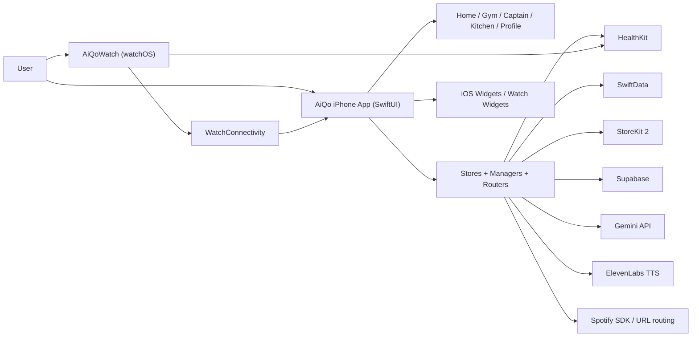
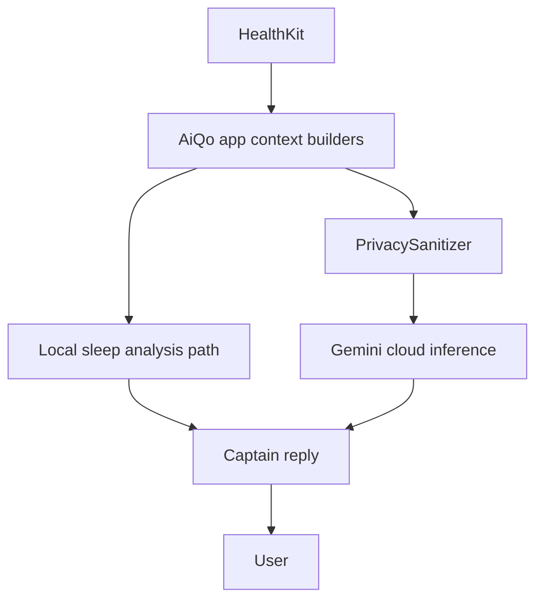

# AiQo Master Blueprint 15

## 0. Document Meta

- Version: `15`
- Generated date: `2026-04-11` (`Asia/Dubai`)
- Previous version: `AiQo_Master_Blueprint_14.md`
- Author: `Mohammed Raad (solo founder) + Codex`
- Purpose statement: `This document is the single source of truth for AiQo. Anyone reading this should understand the product 100% without needing any other file.`

### Evidence Policy

- **Live implementation truth** comes first from the repo itself: Swift files, plist/entitlements, StoreKit configs, project settings, assets, localizations, and workflow files.
- **Founder/product intent** comes second from `AiQo_Master_Blueprint_14.md` and the in-repo AI context pack:
  - `AiQo_AIContext_01_ProductOverview.md`
  - `AiQo_AIContext_03_CaptainHamoudi.md`
  - `AiQo_AIContext_04_TechStack.md`
  - `AiQo_AIContext_05_BusinessModel.md`
  - `AiQo_AIContext_06_BrandAndDesign.md`
  - `AiQo_AIContext_07_RoadmapAndState.md`
- When live code and founder intent disagree, this document shows both:
  - **Current implementation**
  - **Canonical intent**
  - **Implementation drift**
- If evidence is missing, the document says `**NOT YET IMPLEMENTED**` or `**TBD — needs Mohammed's input**`.

### Repo Snapshot Used For Blueprint 15

- Runtime targets reviewed: `AiQo`, `AiQoWatch Watch App`, `AiQoWidget`, `AiQoWatchWidget`
- Test targets reviewed: `AiQoTests`, `AiQoWatch Watch AppTests`, `AiQoWatch Watch AppUITests`
- Live code count at generation time:
  - `AiQo`: `401` Swift files / `104,855` lines
  - `AiQoWatch Watch App`: `25` Swift files / `4,665` lines
  - `AiQoWidget`: `9` Swift files / `1,518` lines
  - `AiQoWatchWidget`: `3` Swift files / `304` lines
  - `AiQoTests`: `15` Swift files / `1,716` lines
  - `AiQoWatch Watch AppTests`: `1` Swift file / `17` lines
  - `AiQoWatch Watch AppUITests`: `2` Swift files / `74` lines
  - **Total**: `456` Swift files / `113,149` lines
- StoreKit files reviewed:
  - `AiQo/Resources/AiQo.storekit`
  - `AiQo/Resources/AiQo_Test.storekit`
- Localization files reviewed:
  - `AiQo/Resources/ar.lproj/Localizable.strings`
  - `AiQo/Resources/en.lproj/Localizable.strings`
  - `AiQo/Resources/Prompts.xcstrings`
- Repo contains **no** checked-in `Package.swift`, `.metal` shaders, SQL migrations, or `supabase/` Edge Function source directory.

## 1. Executive Summary

AiQo is an Arabic-first, RTL-native iOS wellness product that turns Apple Health data, habit tracking, workout guidance, nutrition support, and AI coaching into a single “Bio-Digital OS” experience instead of a dashboard of raw metrics. The product centers on Captain Hamoudi, a culturally specific AI coach who speaks Iraqi/Gulf Arabic, remembers the user over time, and routes sensitive tasks between on-device and cloud intelligence depending on privacy and feature needs (`AiQo_AIContext_01_ProductOverview.md:1-22`, `AiQo/Features/Captain/BrainOrchestrator.swift:4-10`, `AiQo/Features/Captain/CaptainPromptBuilder.swift:3-11`). The live codebase is a pre-launch multi-target Apple ecosystem app consisting of the iPhone app, Apple Watch companion, and two widget targets, currently at app version `1.0` build `17` (`AiQo.xcodeproj/project.pbxproj:1048-1080`, `AiQo.xcodeproj/project.pbxproj:1326-1377`). The stated launch target remains **May 2026 at the American University of the Emirates (AUE)** (`AiQo_AIContext_01_ProductOverview.md:9`, `AiQo_AIContext_05_BusinessModel.md:144-151`, `AiQo_AIContext_07_RoadmapAndState.md:11-13`).

Current live scope includes onboarding, HealthKit-powered home summaries, Gym/Club, Captain chat, sleep analysis and Smart Wake, Kitchen and nutrition tracking, My Vibe, weekly reports, progress photos, XP/levels, in-app subscriptions, notification systems, and a functioning Apple Watch workout companion. Tribe/arena social systems exist in code and backend integration, but are still hidden behind feature flags in the shipping configuration (`AiQo/Tribe/Models/TribeFeatureModels.swift:22-31`, `AiQo/Info.plist`, `AiQo/Features/Tribe/TribeExperienceFlow.swift:188-205`).

## 2. Product Vision & Positioning

### 2.1 The Bio-Digital OS Thesis

AiQo is positioned in founder documentation as a **Bio-Digital Operating System**, not a calorie counter and not a workout library. The thesis is that the user should not have to translate body signals, HealthKit metrics, mood, sleep debt, and goals into action manually. AiQo interprets that context through Captain Hamoudi and product flows such as Home, Gym, Sleep, Kitchen, My Vibe, Legendary Challenges, and weekly memory/report systems (`AiQo_AIContext_01_ProductOverview.md:9-22`, `AiQo_AIContext_01_ProductOverview.md:102`, `AiQo/App/AppDelegate.swift:14-80`).

### 2.2 Arabic-First, RTL-Native Positioning

- App language support is currently only Arabic and English (`AiQo/Core/AppSettingsStore.swift:3-5`).
- The app defaults to Arabic (`AiQo/Core/AppSettingsStore.swift:16-27`).
- The main tab shell forces RTL layout (`AiQo/App/MainTabScreen.swift:66`).
- Captain Arabic mode explicitly locks to Iraqi Arabic dialect, not Modern Standard Arabic (`AiQo/Features/Captain/CaptainPromptBuilder.swift:89-146`, `AiQo_AIContext_03_CaptainHamoudi.md:13-31`).
- Localization is not “best effort only”; the repo contains `2,185` unique Localizable keys across Arabic/English plus a bilingual prompt catalog.

### 2.3 Brand Promise

**"ما تبدأ من صفر — تبدأ من تاريخك"**

This promise fits the live system because AiQo preserves:

- health history through HealthKit reads/writes (`AiQo/App/SceneDelegate.swift:129-159`)
- long-term Captain memory (`AiQo/Core/CaptainMemory.swift:5-40`, `AiQo/Core/MemoryStore.swift:45-79`)
- conversation timeline (`AiQo/Features/Captain/ConversationThread.swift:26-154`)
- weekly report history (`AiQo/Core/Models/WeeklyReportEntry.swift`, `AiQo/Core/Schema/CaptainSchemaV2.swift:9-18`)
- level/XP progression (`AiQo/Core/Models/LevelStore.swift`, `7f8c42f 2026-03-31 Unify XP and level state under LevelStore`)

### 2.4 Target User Personas

#### Persona A: Gulf University Student

- Age: `18–24`
- Arabic-speaking, UAE/GCC campus context
- Wants structure, energy, and visible progress
- Likely entry point: Gym, sleep recovery, My Vibe, social proof
- Evidence base: founder launch strategy is AUE-first (`AiQo_AIContext_05_BusinessModel.md:144-151`)

#### Persona B: Arabic-Speaking Young Adult

- Age: `25–35`
- Fitness-curious, not fitness-expert
- Wants a friendly coach, not a spreadsheet
- Likely entry point: Home dashboard, Captain, Kitchen, weekly reports
- Evidence base: product overview and Captain positioning docs (`AiQo_AIContext_01_ProductOverview.md:9-22`, `AiQo_AIContext_03_CaptainHamoudi.md:1-12`)

#### Persona C: Wellness User Who Hates Generic Apps

- Feels alienated by literal Arabic translations or cold Western UX
- Wants dialect-native coaching and culturally familiar tone
- Likely entry point: Captain Hamoudi voice, Arabic system text, RTL-first flows

### 2.5 Positioning Against Named Competitors

This table is a **founder-positioning summary**, not a market-audit claim.

| Product | Category | AiQo Positioning Difference |
|---|---|---|
| MyFitnessPal | Logging-first nutrition tracker | AiQo is coaching-first, Arabic-first, and combines nutrition with AI memory, sleep, and workout context. |
| Fitbod | Workout programming | AiQo includes workouts, but also sleep, nutrition, Home intelligence, Captain chat, and Arabic dialect voice. |
| Whoop | Hardware-driven readiness/recovery subscription | AiQo uses HealthKit and Apple devices already owned by the user; no dedicated hardware is required in the repo design. |
| Apple Fitness+ | Guided content and classes | AiQo is personalized, conversational, and memory-driven rather than class-library-first. |
| Arabic-region competitors | **TBD — needs Mohammed's input** | No named competitive set is stored in the repo. The documented positioning claim is that AiQo is native Arabic/RTL/dialect-first rather than a translated shell. |

## 3. Brand & Design System

### 3.1 Canonical Product Intent

The following items come from the founder brief for Blueprint 15 and should be treated as canonical brand intent even where code still drifts.

| Element | Canonical Intent |
|---|---|
| Primary mint | `#B7E5D2` |
| Deep mint / CTA mint | `#5ECDB7` |
| Sand / gold accent | `#EBCF97` |
| Ink | `**TBD — needs Mohammed's input**` |
| Sub-text | `**TBD — needs Mohammed's input**` |
| Surface colors | `**TBD — needs Mohammed's input**` |
| Latin typography | `SF Pro Rounded` |
| Arabic typography | `Noto Naskh Arabic / system Arabic for RTL` |
| Captain voice/tone | Iraqi/Gulf Arabic dialect for Captain; formal Arabic for system text; English technical labels allowed |
| Captain visual spec | 3D character, beige tee, grey sweatpants, red sneakers |
| App icon spec | mint background + sand brain+bicep |
| Brand promise | `ما تبدأ من صفر — تبدأ من تاريخك` |

### 3.2 Live Implementation Tokens In Repo

#### Current color sources

- `AiQo/Core/Colors.swift:11-23`
  - `mint = #C4F0DB`
  - `sand = #F8D6A3`
  - `accent = #FFE68C`
  - `aiqoBeige = #FADEB3`
- `AiQo/DesignSystem/AiQoColors.swift:3-5`
  - `mint = #CDF4E4`
  - `beige = #F5D5A6`
- `AiQo/DesignSystem/AiQoTheme.swift:5-12`
  - `primaryBackground = #F5F7FB` / dark `#0B1016`
  - `surface = #FFFFFF` / dark `#121922`
  - `surfaceSecondary = #EEF2F7` / dark `#18212B`
  - `textPrimary = #0F1721` / dark `#F6F8FB`
  - `textSecondary = #5F6F80` / dark `#A3AFBC`
  - `accent = #5ECDB7` / dark `#8AE3D1`
- `AiQo/UI/Purchases/PaywallView.swift:82-225`
  - already uses canonical-matching palette values `#5ECDB7`, `#B7E5D2`, `#EBCF97`

#### Current typography

- The codebase heavily uses `.font(.system(..., design: .rounded))` across screens such as `PaywallView`, `CaptainScreen`, `WeeklyReportView`, `ProgressPhotosView`, `MyVibeScreen`, and onboarding.
- `AiQo_AIContext_06_BrandAndDesign.md:48-55` says the live brand system uses SF Pro Rounded with **no custom font files** and system Arabic handling.
- No checked-in custom font asset or explicit Noto font registration was found during repo review.

#### Current material / glass rules

- `AiQo_AIContext_06_BrandAndDesign.md:64-66` defines glassmorphism through `.ultraThinMaterial` and says “No drop shadows”.
- Live screens do use material frequently:
  - `AiQo/UI/Purchases/PaywallView.swift:225,726`
  - `AiQo/Features/Tribe/TribeHeroCard.swift:31-34`
  - `AiQo/Features/MyVibe/MyVibeScreen.swift:66-77`
- Live screens also use visible shadows:
  - `AiQo/UI/Purchases/PaywallView.swift:473,552,686`
  - `AiQo/Features/MyVibe/MyVibeScreen.swift:106`
  - `AiQo/Tribe/Galaxy/TribeHeroCard.swift:59`

### 3.3 Implementation Drift Notes

1. **Palette drift exists across the app.**
   - Older/global color helpers still point to `#C4F0DB` / `#F8D6A3` / `#CDF4E4` / `#F5D5A6`.
   - The new paywall is closest to the Blueprint 15 palette.

2. **Typography drift exists between founder brief and live code/docs.**
   - The brief calls for `Noto Naskh Arabic / system Arabic`.
   - Live code/docs show system fonts only, with rounded design and no custom Arabic font asset.

3. **Shadow policy drift exists.**
   - AI context design rules say “no drop shadows”.
   - Several live premium/hero screens still use soft shadows.

4. **Icon/avatar spec is partially implicit, not codified.**
   - Assets exist: `AiQo/Resources/Assets.xcassets/AppIcon.appiconset`, `Captain_Hamoudi_DJ.imageset`, `Hammoudi5.imageset`.
   - No checked-in visual specification file defines the avatar outfit or app-icon construction precisely.

### 3.4 RTL Implementation Rules

- Global main shell uses `.rightToLeft` (`AiQo/App/MainTabScreen.swift:66`).
- Login and app language UI switch between Arabic and English direction dynamically (`AiQo/App/LoginViewController.swift:111-116`).
- Some local UI intentionally opts out for usability:
  - `ClubRootView` sets its top header environment to `.leftToRight` for the segmented tab strip (`AiQo/Features/Gym/Club/ClubRootView.swift:130-131`).
- Memory settings force RTL (`AiQo/Core/CaptainMemorySettingsView.swift:41`).

## 4. Information Architecture

### 4.1 Top-Level Tab Structure

The live main shell has **three tabs**, not more:

- `الرئيسية / Home`
- `النادي / Club` (Gym)
- `الكابتن / Captain`

Evidence: `AiQo/App/MainTabScreen.swift:28-52`.

### 4.2 Full Screen-by-Screen Map

#### Launch and onboarding flow

Current root flow in code (`AiQo/App/SceneDelegate.swift:22-30`):

1. `languageSelection`
2. `login`
3. `profileSetup`
4. `legacy`
5. `captainPersonalization`
6. `featureIntro`
7. `main`

Notes:

- `profileSetup` is the current user-profile step, but some persistence keys still use legacy naming like `didCompleteDatingProfile` (`AiQo/App/SceneDelegate.swift:67`, `AiQo/App/AppDelegate.swift:129-135`).
- `legacy` maps to the older level-reveal calculation flow (`AiQo/Features/First screen/LegacyCalculationViewController.swift`).
- On onboarding completion, the app immediately requests permissions and starts core services (`AiQo/App/SceneDelegate.swift:82-99`).

#### Main shell

##### Home

- Entry file: `AiQo/Features/Home/HomeView.swift`
- Primary sections:
  - top chrome with profile access and vibe action
  - `DailyAuraView`
  - six stat tiles
  - kitchen shortcut
  - detail sheets / destinations

Home sheets and destinations confirmed in `HomeView.swift:91-121,229-255`:

- metric detail sheet
- vibe sheet / DJ chat support
- kitchen destination
- water detail
- profile sheet

##### Club / Gym

- Entry file: `AiQo/Features/Gym/Club/ClubRootView.swift`
- Live top-sub-tab order: `impact`, `battle`, `peaks`, `plan`, `body` (`ClubRootView.swift:57`)
- Current implementation label drift:
  - founder brief says `Trace`
  - live code says `Impact`

Gym presentation hierarchy (`ClubRootView.swift:75-114`):

- workout session sheet
- cinematic workout full-screen cover
- gratitude session full-screen cover
- profile sheet

##### Captain

- Entry file: `AiQo/Features/Captain/CaptainScreen.swift`
- Current live screen includes:
  - Captain avatar presentation
  - chat history
  - message input / response UI
  - cognitive state UI
  - profile/customization/history subflows

Related files:

- `AiQo/Features/Captain/ChatHistoryView.swift`
- `AiQo/Core/CaptainVoiceService.swift`
- `AiQo/Features/Captain/CaptainIntelligenceManager.swift`

### 4.3 Modal / Sheet Hierarchy

| Area | Modal / Sheet / Cover | Evidence |
|---|---|---|
| Home | metric detail, vibe control, kitchen, profile | `AiQo/Features/Home/HomeView.swift:96-121` |
| Club | workout session sheet | `AiQo/Features/Gym/Club/ClubRootView.swift:79-101` |
| Club | cinematic grind full screen | `AiQo/Features/Gym/Club/ClubRootView.swift:102-112` |
| Club | gratitude session full screen | `AiQo/Features/Gym/Club/ClubRootView.swift:113-115` |
| Captain | chat history / customization / profile flows | `AiQo/Features/Captain/CaptainScreen.swift` and related subviews |
| Weekly Report | share sheet, Instagram Stories export, PDF export, CSV export | `AiQo/Features/WeeklyReport/WeeklyReportView.swift:52-87,116-172` |
| Progress Photos | add-photo sheet, camera full screen, compare sheet | `AiQo/Features/ProgressPhotos/ProgressPhotosView.swift:79-101` |
| Tribe | premium shell flow and paywall sheet | `AiQo/Features/Tribe/TribeExperienceFlow.swift:47-84` |

### 4.4 Deep Link Routes

Live routes from `AiQo/Services/DeepLinkRouter.swift:10-19,71-113`:

- `aiqo://home`
- `aiqo://captain`
- `aiqo://chat`
- `aiqo://gym`
- `aiqo://workout`
- `aiqo://kitchen`
- `aiqo://settings`
- `aiqo://referral?code=...`
- `aiqo://premium`
- `aiqo://paywall?source=...`
- `aiqo://memory?section=...`

Universal-link equivalents from `https://aiqo.app/...`:

- `/captain`
- `/chat`
- `/gym`
- `/kitchen`
- `/settings`
- `/refer/{code}`
- `/premium`

### 4.5 Siri / Shortcut Entry Points

`NSUserActivityTypes` in `AiQo/Info.plist` declare:

- `com.aiqo.startWalk`
- `com.aiqo.startRun`
- `com.aiqo.startHIIT`
- `com.aiqo.openCaptain`
- `com.aiqo.todaySummary`
- `com.aiqo.logWater`
- `com.aiqo.openKitchen`
- `com.aiqo.weeklyReport`

## 5. Features — Complete Inventory

### Status Legend

- `Shipped`: implemented and reachable in the current codebase
- `In Progress`: implemented partially or with material backend/content gaps
- `Hidden behind flag`: code exists but current shipping config disables it
- `Planned`: not implemented in live code

### Tier Legend Used In This Section

Blueprint 15 uses the **live monetization model**, not the older 3-tier wording:

- `Free`
- `Core`
- `Intelligence Pro`
- `Trial behaves as Intelligence Pro` while active (`AiQo/Premium/AccessManager.swift:24-26`, `AiQo/Premium/FreeTrialManager.swift:7-96`)

### 5.1 Onboarding — اختيار اللغة → Apple Sign In / Guest → Profile → HealthKit → Notifications → Level Reveal

- Feature name: `الإعداد الأولي / Onboarding`
- Status: `Shipped`
- Subscription tier required: `Free`
- Files involved:
  - `AiQo/App/SceneDelegate.swift`
  - `AiQo/App/LanguageSelectionView.swift`
  - `AiQo/App/LoginViewController.swift`
  - `AiQo/App/ProfileSetupView.swift`
  - `AiQo/Features/First screen/LegacyCalculationViewController.swift`
  - `AiQo/Features/Onboarding/CaptainPersonalizationOnboardingView.swift`
  - `AiQo/Features/Onboarding/FeatureIntroView.swift`
- Dependencies:
  - Apple Sign In
  - Supabase Auth
  - HealthKit
  - Notifications
  - FamilyControls
  - UserDefaults onboarding state
- Known issues:
  - Some onboarding state keys still carry legacy names like `didCompleteDatingProfile` and `didCompleteLegacyCalculation`, which reflect older flow naming rather than current UX (`AiQo/App/SceneDelegate.swift:67,106`, `AiQo/App/AppDelegate.swift:129-135`).

### 5.2 Home Dashboard — الرئيسية / Home

- Feature name: `الرئيسية / Home Dashboard`
- Status: `Shipped`
- Subscription tier required: `Core` for premium intelligence context; top-level screen exists in app shell
- Files involved:
  - `AiQo/Features/Home/HomeView.swift`
  - `AiQo/Features/Home/HomeViewModel.swift`
  - `AiQo/Features/Home/MetricKind.swift`
  - `AiQo/App/MainTabScreen.swift`
- Dependencies:
  - HealthKit
  - Daily Aura data
  - User profile
  - Kitchen entry point
  - Vibe control
- Known issues:
  - No repo-level bug specific to the Home shell was found during this pass beyond broader product gating and notification drift.

Live metrics inventory (`AiQo/Features/Home/MetricKind.swift:3-47`):

- steps
- calories
- stand
- water
- sleep
- distance

### 5.3 Captain Hamoudi Chat — الكابتن

- Feature name: `الكابتن حمّودي / Captain Hamoudi Chat`
- Status: `Shipped`
- Subscription tier required: `Core`
- Files involved:
  - `AiQo/Features/Captain/CaptainScreen.swift`
  - `AiQo/Features/Captain/CaptainPromptBuilder.swift`
  - `AiQo/Features/Captain/CaptainIntelligenceManager.swift`
  - `AiQo/Features/Captain/CaptainContextBuilder.swift`
  - `AiQo/Core/CaptainVoiceAPI.swift`
  - `AiQo/Core/CaptainVoiceService.swift`
  - `AiQo/Core/MemoryStore.swift`
  - `AiQo/Core/CaptainMemory.swift`
  - `AiQo/Features/Captain/ConversationThread.swift`
- Dependencies:
  - SwiftData
  - Gemini
  - Apple Foundation Models / local intelligence path
  - ElevenLabs
  - HealthKit
  - App language
- Known issues:
  - Older docs and wording still refer to a six-layer prompt architecture; live implementation is seven layers (`AiQo/Features/Captain/CaptainPromptBuilder.swift:3-11`).

### 5.4 BrainOrchestrator — LocalBrain vs CloudBrain Routing

- Feature name: `منظّم الدماغ / BrainOrchestrator`
- Status: `Shipped`
- Subscription tier required: `Core`, with `Intelligence Pro` unlocking reasoning model selection
- Files involved:
  - `AiQo/Features/Captain/BrainOrchestrator.swift`
  - `AiQo/Features/Captain/CloudBrainService.swift`
  - `AiQo/Features/Captain/HybridBrainService.swift`
  - `AiQo/Features/Captain/PrivacySanitizer.swift`
- Dependencies:
  - local Apple intelligence path
  - Gemini API
  - MemoryStore
  - HealthKit-derived context
- Known issues:
  - Hardcoded Gemini endpoint and timeout remain in code (`AiQo/Features/Captain/HybridBrainService.swift:89-90`).

### 5.5 Sleep Architecture + Smart Wake Calculator

- Feature name: `النوم + المنبّه الذكي / Sleep Architecture + Smart Wake`
- Status: `Shipped`
- Subscription tier required: `Core`
- Files involved:
  - `AiQo/Features/Sleep/SmartWakeEngine.swift`
  - `AiQo/Features/Sleep/SmartWakeCalculatorView.swift`
  - `AiQo/Features/Sleep/SleepSessionObserver.swift`
  - `AiQo/Features/Sleep/AppleIntelligenceSleepAgent.swift`
  - `AiQo/Services/Notifications/AlarmSchedulingService.swift`
  - `AiQo/Features/Sleep/AlarmSetupCardView.swift`
- Dependencies:
  - HealthKit sleep analysis
  - AlarmKit
  - Notifications
  - Captain / morning briefing
- Known issues:
  - None specific beyond the broader notification scheduling hardcoding noted in Section 13.

### 5.6 Alchemy Kitchen — المطبخ / Kitchen

- Feature name: `Alchemy Kitchen / المطبخ`
- Status: `Shipped`
- Subscription tier required: `Core`
- Files involved:
  - `AiQo/Features/Kitchen/KitchenScreen.swift`
  - `AiQo/Features/Kitchen/NutritionTrackerView.swift`
  - `AiQo/Features/Kitchen/SmartFridgeCameraViewModel.swift`
  - `AiQo/Features/Kitchen/SmartFridgeScannedItemRecord.swift`
  - `AiQo/Features/Kitchen/InteractiveFridgeView.swift`
  - `AiQo/Features/Kitchen/SmartFridgeScannerView.swift`
  - `AiQo/Features/Kitchen/FridgeInventoryView.swift`
- Dependencies:
  - AVFoundation camera access
  - Gemini image understanding
  - PrivacySanitizer for image hygiene
  - SwiftData for scanned inventory
- Known issues:
  - Kitchen scanner is implemented, but no separate backend schema/migration source is stored in repo for cloud-side fridge persistence.

### 5.7 Gym Tab — Body / Plan / Peaks / Battle / Impact

- Feature name: `النادي / Club`
- Status: `Shipped`
- Subscription tier required:
  - `Core` for Body, Plan, Battle
  - `Intelligence Pro` for full Peaks access
- Files involved:
  - `AiQo/Features/Gym/Club/ClubRootView.swift`
  - `AiQo/Features/Gym/Club/Body/BodyView.swift`
  - `AiQo/Features/Gym/Club/Plan/PlanView.swift`
  - `AiQo/Features/Gym/Club/Impact/ImpactContainerView.swift`
  - `AiQo/Features/Gym/Quests/Views/QuestsView.swift` (`PeaksRecordsView`, `BattleChallengesView`)
  - `AiQo/Features/LegendaryChallenges/Views/LegendaryChallengesSection.swift`
  - `AiQo/Features/Gym/QuestKit/QuestSwiftDataStore.swift`
- Dependencies:
  - HealthKit
  - Quest/XP systems
  - Captain coaching
  - Live workouts
- Known issues:
  - Current implementation uses `impact`; founder brief for Blueprint 15 expected `Trace` (`AiQo/Features/Gym/Club/ClubRootView.swift:3-18`).

### 5.8 Zone 2 Cardio Coaching

- Feature name: `Zone 2 / تدريب الكارديو الذكي`
- Status: `Shipped`
- Subscription tier required: `Core`
- Files involved:
  - `AiQo/Features/Gym/HandsFreeZone2Manager.swift`
  - `AiQo/Features/Gym/AudioCoachManager.swift`
  - `AiQo/Features/Gym/WorkoutSessionViewModel.swift`
  - `AiQo/Features/Gym/LiveWorkoutSession.swift`
  - `AiQo/Features/Gym/WorkoutLiveActivityManager.swift`
- Dependencies:
  - HKWorkoutSession / HealthKit
  - Audio coaching
  - Live Activities
  - Watch connectivity
- Known issues:
  - No feature-specific blocker found beyond general watch-connectivity / coaching hardcoded values.

### 5.9 Strength Workouts

- Feature name: `تمارين القوة / Strength Workouts`
- Status: `Shipped`
- Subscription tier required: `Core`
- Files involved:
  - `AiQo/Features/Gym/WorkoutSessionViewModel.swift`
  - `AiQo/Features/Gym/WorkoutSessionSheetView.swift`
  - `AiQo/Features/Gym/LiveWorkoutSession.swift`
  - `AiQo/Features/Gym/Club/ClubRootView.swift`
- Dependencies:
  - HealthKit workouts
  - Live workout state
  - Captain coaching
- Known issues:
  - No dedicated bug found in this pass.

### 5.10 HRR Assessment — قياس المحرّك

- Feature name: `قياس المحرّك / HRR Assessment`
- Status: `Shipped`
- Subscription tier required: `Core`
- Files involved:
  - `AiQo/Features/LegendaryChallenges/Views/FitnessAssessmentView.swift`
  - `AiQo/Features/LegendaryChallenges/ViewModels/HRRWorkoutManager.swift`
- Dependencies:
  - HealthKit
  - workout tracking
  - watch support
- Known issues:
  - Live implementation expects real workout/heart-rate context; no backend dependency issue was found.

### 5.11 Legendary Challenges — Projects / Peaks

- Feature name: `التحديات الأسطورية / Legendary Challenges`
- Status: `Shipped`
- Subscription tier required:
  - `Core`: browse/view-only
  - `Intelligence Pro`: full access
- Files involved:
  - `AiQo/Features/LegendaryChallenges/Views/LegendaryChallengesSection.swift`
  - `AiQo/Features/LegendaryChallenges/Models/RecordProject.swift`
  - `AiQo/Features/LegendaryChallenges/Models/WeeklyLog.swift`
  - `AiQo/Features/LegendaryChallenges/ViewModels/RecordProjectManager.swift`
- Dependencies:
  - SwiftData
  - Level/XP
  - Captain memory
- Known issues:
  - No obvious code blocker, but product gating should be documented carefully because Core only gets view-only access (`AiQo/Premium/AccessManager.swift:45-56`).

### 5.12 XP + Levels System

- Feature name: `الخبرة والمستويات / XP + Levels`
- Status: `Shipped`
- Subscription tier required: `Core`
- Files involved:
  - `AiQo/Core/Models/LevelStore.swift`
  - `AiQo/App/MainTabScreen.swift`
  - `AiQo/Features/Gym/QuestKit/QuestSwiftDataStore.swift`
  - `AiQo/Features/LegendaryChallenges/Models/RecordProject.swift`
  - `AiQo/Features/LegendaryChallenges/Models/WeeklyLog.swift`
- Dependencies:
  - UserDefaults
  - Quest SwiftData store
  - Legendary Challenges
- Known issues:
  - Non-current Tribe member cards still default to zero points / level one instead of backend-synced values (`AiQo/Tribe/Galaxy/TribeMembersList.swift:25-30`).

### 5.13 Tribe / إمارة / Arena / Galaxy

- Feature name: `القبيلة / Tribe`, `الإمارة / Emirate`, `Arena`, `Galaxy`
- Status: `Hidden behind flag`
- Subscription tier required:
  - Current shipping config: hidden
  - Current access code if unhidden: subscription gate is bypassed while `TRIBE_SUBSCRIPTION_GATE_ENABLED = false` (`AiQo/Premium/AccessManager.swift:102-115`)
- Files involved:
  - `AiQo/Tribe/Models/TribeFeatureModels.swift`
  - `AiQo/Features/Tribe/TribeExperienceFlow.swift`
  - `AiQo/Features/Tribe/TribeView.swift`
  - `AiQo/Services/SupabaseArenaService.swift`
  - `AiQo/Tribe/Galaxy/ArenaModels.swift`
- Dependencies:
  - Supabase
  - SwiftData
  - LevelStore
  - Profile data
- Known issues:
  - All live TODOs in the repo are here (`AiQo/Features/Tribe/TribeExperienceFlow.swift:190,205,299,348,369`).
  - Feature flags are all false in `AiQo/Info.plist`.
  - Founder prompt wording about “القبيلة active, العالمية + الارينا hidden” does **not** match the live build; current implementation hides the overall feature.

### 5.14 My Vibe

- Feature name: `My Vibe / مزاجك الحيوي`
- Status: `Shipped`
- Subscription tier required: `Core` in live code
- Files involved:
  - `AiQo/Features/MyVibe/MyVibeScreen.swift`
  - `AiQo/Core/SpotifyVibeManager.swift`
  - `AiQo/Core/VibeAudioEngine.swift`
  - `AiQo/Features/MyVibe/VibeOrchestrator.swift`
  - `AiQo/Features/Home/DJCaptainChatView.swift`
- Dependencies:
  - Spotify SDK / URL handling
  - audio engine
  - Captain
- Known issues:
  - Founder/context docs sometimes describe My Vibe as a higher-tier feature, but live `AccessManager` grants it at Core (`AiQo/Premium/AccessManager.swift:29-35`).

### 5.15 Captain Memory

- Feature name: `ذاكرة الكابتن / Captain Memory`
- Status: `Shipped`
- Subscription tier required:
  - `Core`: `200` memories
  - `Intelligence Pro`: `500` memories
- Files involved:
  - `AiQo/Core/CaptainMemory.swift`
  - `AiQo/Core/MemoryStore.swift`
  - `AiQo/Core/CaptainMemorySettingsView.swift`
  - `AiQo/Core/Schema/CaptainSchemaV1.swift`
  - `AiQo/Core/Schema/CaptainSchemaV2.swift`
  - `AiQo/Core/Schema/CaptainSchemaV3.swift`
- Dependencies:
  - dedicated SwiftData container
  - AccessManager tiering
  - Captain prompt pipeline
- Known issues:
  - None beyond normal retention/gating drift; this is one of the clearer systems in the repo.

### 5.16 AiQoWatch Standalone Target

- Feature name: `AiQoWatch / Apple Watch Companion`
- Status: `Shipped`
- Subscription tier required: `Core` for meaningful use with workout flows
- Files involved:
  - `AiQoWatch Watch App/AiQoWatchApp.swift`
  - `AiQoWatch Watch App/Services/WatchHealthKitManager.swift`
  - `AiQoWatch Watch App/Services/WatchWorkoutManager.swift`
  - `AiQoWatch Watch App/Services/WatchConnectivityService.swift`
  - `AiQoWatch Watch App/WatchConnectivityManager.swift`
  - `AiQo/PhoneConnectivityManager.swift`
- Dependencies:
  - HealthKit
  - WatchConnectivity
  - workout sessions
- Known issues:
  - Watch-side connectivity service still uses a repeating `Timer` every `2` seconds (`AiQoWatch Watch App/Services/WatchConnectivityService.swift:12-18`), which is functional but not ideal.

### 5.17 Notifications

- Feature name: `الإشعارات الذكية / Notifications`
- Status: `Shipped`
- Subscription tier required: `Core`
- Files involved:
  - `AiQo/Services/Notifications/NotificationService.swift`
  - `AiQo/Core/SmartNotificationScheduler.swift`
  - `AiQo/Services/Notifications/MorningHabitOrchestrator.swift`
  - `AiQo/Services/Trial/TrialJourneyOrchestrator.swift`
  - `AiQo/Features/Captain/ProactiveEngine.swift`
  - `AiQo/Services/Notifications/NotificationCategoryManager.swift`
- Dependencies:
  - UserNotifications
  - BackgroundTasks
  - HealthKit
  - Captain personalization
- Known issues:
  - Quiet hours are still hardcoded in `SmartNotificationScheduler` (`23:00` to `07:00`) even though personalization-aware logic also exists elsewhere (`AiQo/Core/SmartNotificationScheduler.swift:12-13,855-856`, `AiQo/Features/Captain/ProactiveEngine.swift`).
  - Notification language setting key is `notificationLanguage`, not `captainLanguage`.

### 5.18 Profile + Body Data + Weekly Report + Progress Photos

- Feature name: `الملف الشخصي + التقرير الأسبوعي + صور التقدم`
- Status: `Shipped`
- Subscription tier required: `Core`
- Files involved:
  - `AiQo/Features/Profile/ProfileScreen.swift`
  - `AiQo/Features/Profile/ProfileScreenLogic.swift`
  - `AiQo/Features/WeeklyReport/WeeklyReportView.swift`
  - `AiQo/Features/ProgressPhotos/ProgressPhotosView.swift`
  - `AiQo/Features/ProgressPhotos/ProgressPhotoStore.swift`
- Dependencies:
  - HealthKit
  - UserDefaults
  - file storage for photos
  - Instagram Stories share path
- Known issues:
  - Profile username formatter can generate `@@username` if the underlying username already includes a leading at-sign (`AiQo/Features/Profile/ProfileScreenLogic.swift:102-105`).

### 5.19 Paywall + Subscription System

- Feature name: `الاشتراك / Paywall + Subscription`
- Status: `Shipped`
- Subscription tier required: `Core` or `Intelligence Pro`
- Files involved:
  - `AiQo/UI/Purchases/PaywallView.swift`
  - `AiQo/Premium/PremiumPaywallView.swift`
  - `AiQo/Premium/PremiumStore.swift`
  - `AiQo/Premium/AccessManager.swift`
  - `AiQo/Premium/FreeTrialManager.swift`
  - `AiQo/Core/Purchases/PurchaseManager.swift`
  - `AiQo/Core/Purchases/EntitlementStore.swift`
  - `AiQo/Core/Purchases/ReceiptValidator.swift`
  - `AiQo/Core/Purchases/SubscriptionTier.swift`
  - `AiQo/Core/Purchases/SubscriptionProductIDs.swift`
  - `AiQo/Resources/AiQo.storekit`
  - `AiQo/Resources/AiQo_Test.storekit`
- Dependencies:
  - StoreKit 2
  - Supabase Edge Function `validate-receipt`
  - free-trial manager
- Known issues:
  - Live `.storekit` price for Intelligence Pro is `$29.99`, but fallback display price in code is still `$19.99` (`AiQo/Core/Purchases/SubscriptionProductIDs.swift:37-38`, `AiQo/Resources/AiQo.storekit:56-76`).
  - `PremiumPaywallView` is a wrapper around the new paywall, not a fully separate legacy implementation (`AiQo/Premium/PremiumPaywallView.swift:3-9`).

### 5.20 Settings

- Feature name: `الإعدادات / Settings`
- Status: `Shipped`
- Subscription tier required: `Free` for basic account/language toggles; memory and premium state tie into paid features
- Files involved:
  - `AiQo/Core/AppSettingsScreen.swift`
  - `AiQo/Core/AppSettingsStore.swift`
  - `AiQo/Core/CaptainMemorySettingsView.swift`
- Dependencies:
  - UserDefaults
  - Supabase
  - notifications
  - legal links
- Known issues:
  - Account deletion exists via Supabase RPC call, but the full backend implementation is not stored in repo (`AiQo/Core/AppSettingsScreen.swift:371`).

## 6. Technical Architecture

### 6.1 High-Level System Diagram



### 6.2 App Targets

| Target | Bundle ID | Notes |
|---|---|---|
| `AiQo` | `com.mraad500.aiqo` | Main iPhone app |
| `AiQoWatch Watch App` | `com.mraad500.aiqo.watchkitapp` | Watch companion app |
| `AiQoWidgetExtension` | `com.mraad500.aiqo.AiQoWidget` | iPhone widget extension |
| `AiQoWatchWidgetExtension` | `com.mraad500.aiqo.watchkitapp.AiQoWatchWidget` | Watch widget extension |

Evidence: `AiQo.xcodeproj/project.pbxproj:1275,1341,1567`.

Version/build:

- `MARKETING_VERSION = 1.0`
- `CURRENT_PROJECT_VERSION = 17`

Evidence: `AiQo.xcodeproj/project.pbxproj:1048-1080,1114-1146,1326-1377`.

### 6.3 SwiftData and Persistence Model Inventory

#### Main app container mounted at app root

Mounted in `AiQo/App/AppDelegate.swift:70-80`:

- `AiQoDailyRecord`
- `WorkoutTask`
- `ArenaTribe`
- `ArenaTribeMember`
- `ArenaWeeklyChallenge`
- `ArenaTribeParticipation`
- `ArenaEmirateLeaders`
- `ArenaHallOfFameEntry`

#### Dedicated Captain container (`captain_memory.store`)

Dedicated store path:

- `AiQo/App/AppDelegate.swift:14-36`
- file name: `captain_memory.store`

Captain schema versions:

- `CaptainSchemaV1` = `CaptainMemory`, `CaptainPersonalizationProfile`, `PersistentChatMessage`, `RecordProject`, `WeeklyLog` (`AiQo/Core/Schema/CaptainSchemaV1.swift:7-16`)
- `CaptainSchemaV2` adds `WeeklyMetricsBuffer`, `WeeklyReportEntry` (`AiQo/Core/Schema/CaptainSchemaV2.swift:6-18`)
- `CaptainSchemaV3` adds `ConversationThreadEntry` (`AiQo/Core/Schema/CaptainSchemaV3.swift:6-19`)
- migration plan is lightweight additive for both transitions (`AiQo/Core/Schema/CaptainSchemaMigrationPlan.swift:4-23`)

#### Quest / XP SwiftData container

Separate container `QuestLootEngine`:

- `PlayerStats`
- `QuestStage`
- `QuestRecord`
- `Reward`

Evidence: `AiQo/Features/Gym/QuestKit/QuestSwiftDataStore.swift:22-42`.

#### Kitchen local SwiftData container

Local scanner/inventory scenes mount `SmartFridgeScannedItemRecord` directly:

- `AiQo/Features/Kitchen/InteractiveFridgeView.swift:62`
- `AiQo/Features/Kitchen/FridgeInventoryView.swift:24`
- writes occur in `AiQo/Features/Kitchen/SmartFridgeScannerView.swift:306`

#### Progress photo persistence

Progress photos are **not SwiftData**. They use:

- image JPEG files in Documents/`ProgressPhotos`
- metadata in `UserDefaults` under `aiqo.progressPhotos.entries`

Evidence: `AiQo/Features/ProgressPhotos/ProgressPhotoStore.swift:14-25,108-121`.

### 6.4 Full `@Model` Inventory

All `@Model` declarations found during repo sweep:

- `AiQoDailyRecord` (`AiQo/NeuralMemory.swift:5-6`)
- `WorkoutTask` (`AiQo/NeuralMemory.swift:46-47`)
- `WeeklyReportEntry` (`AiQo/Core/Models/WeeklyReportEntry.swift:6-7`)
- `CaptainPersonalizationProfile` (`AiQo/Core/CaptainPersonalization.swift:217-218`)
- `WeeklyMetricsBuffer` (`AiQo/Core/Models/WeeklyMetricsBuffer.swift:7-8`)
- `CaptainMemory` (`AiQo/Core/CaptainMemory.swift:5-6`)
- `SmartFridgeScannedItemRecord` (`AiQo/Features/Kitchen/SmartFridgeScannedItemRecord.swift:4-5`)
- `WeeklyLog` (`AiQo/Features/LegendaryChallenges/Models/WeeklyLog.swift:5-6`)
- `RecordProject` (`AiQo/Features/LegendaryChallenges/Models/RecordProject.swift:5-6`)
- `ConversationThreadEntry` (`AiQo/Features/Captain/ConversationThread.swift:26-27`)
- `PersistentChatMessage` (`AiQo/Features/Captain/CaptainModels.swift:7-8`)
- `ArenaTribe` (`AiQo/Tribe/Galaxy/ArenaModels.swift:6-7`)
- `ArenaTribeMember` (`AiQo/Tribe/Galaxy/ArenaModels.swift:41-42`)
- `ArenaWeeklyChallenge` (`AiQo/Tribe/Galaxy/ArenaModels.swift:94-95`)
- `ArenaTribeParticipation` (`AiQo/Tribe/Galaxy/ArenaModels.swift:122-123`)
- `ArenaEmirateLeaders` (`AiQo/Tribe/Galaxy/ArenaModels.swift:141-142`)
- `ArenaHallOfFameEntry` (`AiQo/Tribe/Galaxy/ArenaModels.swift:162-163`)
- `PlayerStats` (`AiQo/Features/Gym/QuestKit/QuestSwiftDataModels.swift:10-11`)
- `QuestStage` (`AiQo/Features/Gym/QuestKit/QuestSwiftDataModels.swift:41-42`)
- `QuestRecord` (`AiQo/Features/Gym/QuestKit/QuestSwiftDataModels.swift:73-74`)
- `Reward` (`AiQo/Features/Gym/QuestKit/QuestSwiftDataModels.swift:185-186`)

### 6.5 HealthKit Reads and Writes

#### iPhone app HealthKit reads

`AiQo/App/SceneDelegate.swift:129-142` requests read access to:

- step count
- active energy burned
- walking/running distance
- cycling distance
- heart rate
- HRV
- resting heart rate
- walking heart rate average
- oxygen saturation
- VO2 max
- body mass
- dietary water
- stand time
- sleep analysis
- activity summary
- workouts

#### iPhone app HealthKit writes

`AiQo/App/SceneDelegate.swift:153-159` requests write access to:

- heart rate
- HRV
- resting heart rate
- VO2 max
- walking/running distance
- dietary water
- body mass
- workouts

#### Watch health usage

- Root watch plist includes Arabic HealthKit usage text (`AiQoWatch-Watch-App-Info.plist`)
- Project settings for the watch target also generate HealthKit usage descriptions (`AiQo.xcodeproj/project.pbxproj:1332-1333,1369-1370`)

### 6.6 Networking

#### Supabase

- `SupabaseClient` is initialized from xcconfig-provided `SUPABASE_URL` and `SUPABASE_ANON_KEY` (`AiQo/Services/SupabaseService.swift:10-37`)
- The app supports:
  - auth via Apple Sign In token exchange
  - profile lookup
  - device-token sync
  - tribe/arena network calls

#### Gemini

- Base endpoint: `https://generativelanguage.googleapis.com/v1beta/models` (`AiQo/Features/Captain/HybridBrainService.swift:89`)
- Current live models:
  - `gemini-2.5-flash`
  - `gemini-3-flash-preview`
- Used by:
  - Captain cloud brain
  - Smart fridge image scan
  - some weekly review / extractor helpers

#### Other external services

- ElevenLabs TTS (`AiQo/Core/CaptainVoiceAPI.swift:8-9`)
- Spotify iOS framework embedded in project (`AiQo.xcodeproj/project.pbxproj:154`)

### 6.7 Third-Party Libraries and SDKs

No `Package.swift` is checked into the repo. Dependency truth comes from `AiQo.xcodeproj/project.pbxproj`.

| Dependency | Source | Version / note | Evidence |
|---|---|---|---|
| `supabase-swift` | Swift Package Manager | `upToNextMajor from 2.5.1` | `AiQo.xcodeproj/project.pbxproj:1709-1714` |
| `SDWebImageSwiftUI` | Swift Package Manager | `upToNextMajor from 3.1.4` | `AiQo.xcodeproj/project.pbxproj:1725-1730` |
| `swift-system` | Swift Package Manager | `upToNextMajor from 1.6.4` | `AiQo.xcodeproj/project.pbxproj:1717-1722` |
| `SpotifyiOS.framework` | bundled binary framework | exact framework version not surfaced in project file | `AiQo.xcodeproj/project.pbxproj:154` |

Notable absences:

- no Firebase package declared in the checked-in project
- no subscription abstraction SDK
- no remote analytics SDK

### 6.8 State Management

The app uses a mix of `ObservableObject`, `@Observable`, singletons, routers, and environment objects rather than one global architecture framework.

#### Key app-wide routers / stores / singletons

- `AppFlowController.shared`
- `MainTabRouter.shared`
- `AppRootManager.shared`
- `DeepLinkRouter.shared`
- `PurchaseManager.shared`
- `EntitlementStore.shared`
- `PremiumStore.shared`
- `AccessManager.shared`
- `FreeTrialManager.shared`
- `SupabaseService.shared`
- `SupabaseArenaService.shared`
- `HealthKitManager.shared`
- `HealthKitService.shared`
- `NotificationService.shared`
- `CaptainSmartNotificationService.shared`
- `SmartNotificationScheduler.shared`
- `MorningHabitOrchestrator.shared`
- `TrialJourneyOrchestrator.shared`
- `SleepSessionObserver.shared`
- `AIWorkoutSummaryService.shared`
- `AnalyticsService.shared`
- `CrashReporter.shared`
- `CrashReportingService.shared`
- `MemoryStore.shared`
- `CaptainPersonalizationStore.shared`
- `ConversationThreadManager.shared`
- `LevelStore.shared`
- `UserProfileStore.shared`
- `SpotifyVibeManager.shared`
- `VibeAudioEngine.shared`
- `VibeOrchestrator.shared`
- `QuestEngine.shared`
- `QuestPersistenceController.shared`
- `RecordProjectManager.shared`
- `WorkoutLiveActivityManager.shared`
- `PhoneConnectivityManager.shared`
- `WatchConnectivityManager.shared` (watch)

Evidence sweep: `rg "static let shared ="` over `AiQo`, watch, and widget targets during blueprint generation.

### 6.9 UserDefaults, App Group, Keychain, and Local Persistence

#### Important UserDefaults keys confirmed in live code

- onboarding:
  - `didSelectLanguage`
  - `didShowFirstAuthScreen`
  - `didContinueWithoutAccount`
  - `didCompleteDatingProfile`
  - `didCompleteLegacyCalculation`
  - `didCompleteCaptainPersonalization`
  - `didCompleteFeatureIntro`
- language:
  - `aiqo.app.language`
  - `AppleLanguages`
  - `notificationLanguage`
- premium / trial:
  - `aiqo.freeTrial.startDate`
  - `push_device_token`
- captain / memory:
  - `captain_memory_enabled`
  - `aiqo.captain.customization.calling`
  - `aiqo.captain.customization.name`
- levels:
  - `aiqo.user.level`
  - `aiqo.user.currentXP`
  - `aiqo.user.totalXP`
- progress photos:
  - `aiqo.progressPhotos.entries`
- nutrition goals:
  - `aiqo.nutrition.calorieGoal`
  - `aiqo.nutrition.proteinGoal`
  - `aiqo.nutrition.carbGoal`
  - `aiqo.nutrition.fatGoal`
  - `aiqo.nutrition.fiberGoal`

#### App group storage

App groups in entitlements:

- `group.com.aiqo.kernel2`
- `group.aiqo`

Widgets use `group.aiqo` (`AiQo/AiQo.entitlements`, `AiQoWidget/AiQoWidgetExtension.entitlements`, `AiQoWatchWidget/AiQoWatchWidgetExtension.entitlements`).

#### Keychain

Free trial start date is persisted across reinstalls via Keychain:

- service: `com.aiqo.trial`
- account: `trialStartDate`

Evidence: `AiQo/Premium/FreeTrialManager.swift:145-170`.

### 6.10 Background Tasks

From `AiQo/Info.plist`:

- `aiqo.notifications.refresh`
- `aiqo.notifications.inactivity-check`

Background modes:

- iPhone app:
  - `audio`
  - `remote-notification`
  - `fetch`
  - `processing`
- Watch:
  - `workout-processing`

Relevant code:

- registration: `AiQo/Core/SmartNotificationScheduler.swift`
- app start/activation scheduling: `AiQo/App/AppDelegate.swift:120-146,194-204`

### 6.11 Info.plist Feature Flags and Capabilities

#### Feature flags

From `AiQo/Info.plist`:

- `CAPTAIN_BRAIN_V2_ENABLED = true`
- `TRIBE_BACKEND_ENABLED = false`
- `TRIBE_FEATURE_VISIBLE = false`
- `TRIBE_SUBSCRIPTION_GATE_ENABLED = false`

#### App capabilities and route affordances

- URL schemes:
  - `aiqo`
  - `aiqo-spotify`
- `LSApplicationQueriesSchemes`:
  - `spotify`
  - `instagram-stories`
  - `instagram`
- user activities:
  - `com.aiqo.startWalk`
  - `com.aiqo.startRun`
  - `com.aiqo.startHIIT`
  - `com.aiqo.openCaptain`
  - `com.aiqo.todaySummary`
  - `com.aiqo.logWater`
  - `com.aiqo.openKitchen`
  - `com.aiqo.weeklyReport`

#### Entitlement summary

Main app entitlements (`AiQo/AiQo.entitlements`):

- push: `aps-environment = production`
- Apple Sign In
- HealthKit
- HealthKit background delivery
- Siri
- app groups `group.com.aiqo.kernel2`, `group.aiqo`

Watch entitlements (`AiQoWatch Watch App/AiQoWatch Watch App.entitlements`):

- HealthKit
- HealthKit background delivery
- app group `group.aiqo`

### 6.12 Push Notifications

- APNS entitlement is `production` (`AiQo/AiQo.entitlements`)
- permissions requested via `NotificationService.shared.requestPermissions()`
- device token synced to Supabase `profiles` (`AiQo/Services/SupabaseService.swift:118-139`)

### 6.13 Crash Reporting

Current live state:

- local crash logger is active: `AiQo/Services/CrashReporting/CrashReporter.swift`
- Firebase Crashlytics wrapper exists: `AiQo/Services/CrashReporting/CrashReportingService.swift`
- wrapper only does real work if Firebase SDKs are linked via `canImport`
- no Firebase SPM package was found in the checked-in project, so remote Crashlytics is **not active in this repo checkout**

## 7. AI System Deep Dive

### 7.1 Captain Hamoudi Prompt Architecture

Live implementation is a **7-layer** prompt builder (`AiQo/Features/Captain/CaptainPromptBuilder.swift:3-27`):

1. **Identity**
   - defines who Captain Hamoudi is
   - locks Arabic mode to Iraqi dialect
   - locks English mode to English only
   - bans generic AI phrasing
2. **Stable Profile**
   - durable user profile facts and preferences
3. **Working Memory**
   - activated long-term memories for the current reply
   - recent interaction timeline
4. **Bio-State**
   - internal body metrics for calibration
   - explicitly not for direct dump to the user
5. **Circadian Tone**
   - adjusts tone by time of day and current state
6. **Screen Context**
   - changes behavior for Gym, Kitchen, Sleep, Peaks, My Vibe, or main chat
7. **Output Contract**
   - forces strict JSON structure

**Drift note:** older wording in docs and prompts still says “six-layer”; current code is seven-layer.

### 7.2 Local vs Cloud Routing Decision Tree

From `AiQo/Features/Captain/BrainOrchestrator.swift:7-10,89-93`:

- `sleepAnalysis` routes **local**
- `gym`, `kitchen`, `peaks`, `myVibe`, `mainChat` route **cloud**

Additional live behavior:

- sleep-like intent can be intercepted and rerouted into the local sleep path even if the originating screen was different (`BrainOrchestrator.swift:100-109`)
- if local sleep analysis fails, the app can fall back to cloud using an aggregated summary, not raw sleep stages (`BrainOrchestrator.swift:142-174`)
- cloud failure handling:
  - for some failure modes the app skips known-broken local fallback
  - otherwise it tries local fallback
  - if both fail, it returns a deterministic localized error response (`BrainOrchestrator.swift:195-207,345-389`)

### 7.3 Cloud Brain and Gemini Models

Current live model policy (`AiQo/Features/Captain/CloudBrainService.swift:8-13,39-69`):

- Core / non-Intelligence users: `gemini-2.5-flash`
- Intelligence Pro: `gemini-3-flash-preview`

Transport config (`AiQo/Features/Captain/HybridBrainService.swift:89-90,238`):

- endpoint: `https://generativelanguage.googleapis.com/v1beta/models`
- timeout: `35s`

### 7.4 PrivacySanitizer

Documented guarantees in `AiQo/Features/Captain/PrivacySanitizer.swift:9-24,59-86,199-294`:

- redacts:
  - emails
  - phone numbers
  - UUIDs
  - IP addresses
  - URLs
  - `@mentions`
  - long base64-like tokens
  - long numeric sequences
- normalizes names to `User`
- conversation truncation:
  - only last `4` messages are sent for cloud sanitization context
- numeric bucketing:
  - steps bucketed by `50`
  - calories bucketed by `10`
- kitchen image sanitization:
  - strips EXIF/GPS by re-encoding
  - max dimension `1280`
  - JPEG quality `0.78`

### 7.5 Memory System

#### Storage model

- Memory entries live in `CaptainMemory`
- fields include:
  - `key`
  - `value`
  - `category`
  - `confidence`
  - `source`
  - `createdAt`
  - `updatedAt`
  - `accessCount`

Evidence: `AiQo/Core/CaptainMemory.swift:5-40`.

#### Write behavior

From `AiQo/Core/MemoryStore.swift:45-79`:

- `set(...)` either updates an existing memory or inserts a new one
- updating an existing memory bumps confidence by `+0.05`, capped at `1.0`
- if memory count reaches the tier limit, the store deletes the lowest-confidence non-record-project memory before inserting

#### Read / ranking behavior

Relevant memory retrieval (`AiQo/Core/MemoryStore.swift:117-180,540-590`):

- base score starts from `confidence * 3.0`
- boosts are added for:
  - intent-category weight
  - screen-context weight
  - direct category boost
  - token overlap with the current message
  - source trust
  - recency
- penalty is applied for overused memories via `accessCount`
- special boost exists for `active_record_project` in challenge/Peaks contexts

#### Cloud-safe memory rules

- categories allowed for cloud-safe context:
  - `goal`
  - `preference`
  - `mood`
  - `injury`
  - `nutrition`
  - `insight`

Evidence: `AiQo/Core/MemoryStore.swift:187-203,260-278`.

#### Retention / pruning

- Core memory limit: `200`
- Intelligence Pro memory limit: `500`
- stale cleanup removes memories older than `90` days with confidence below `0.3`
- `active_record_project` is protected from stale cleanup

Evidence: `AiQo/Premium/AccessManager.swift:73-78`, `AiQo/Core/MemoryStore.swift:301-315`.

#### Conversation timeline retention

- `ConversationThreadEntry` records notifications, user messages, captain replies, workout events, goal completions, and app opens
- pruning deletes entries older than `7` days

Evidence: `AiQo/Features/Captain/ConversationThread.swift:10-18,138-151`.

### 7.6 Voice System

#### Current live TTS

- Provider: ElevenLabs
- API base: `https://api.elevenlabs.io/v1/text-to-speech`
- model: `eleven_multilingual_v2`
- network timeout: request `8s`, resource `10s`

Evidence: `AiQo/Core/CaptainVoiceAPI.swift:8-9,22-28,118`.

#### Playback fallback

- `CaptainVoiceService` races remote speech against a strict timeout
- on timeout or error, it falls back to local `AVSpeechSynthesizer`

Evidence: `AiQo/Core/CaptainVoiceService.swift:203-235`.

#### Planned migration

Founder roadmap, not live code:

- Fish Speech S1-mini on RunPod Serverless
- intended as a post-launch replacement for ElevenLabs

Evidence: `AiQo_AIContext_07_RoadmapAndState.md:205-206`, `AiQo_AIContext_04_TechStack.md:57-58`.

## 8. Backend (Supabase)

### 8.1 Current Backend Surface Visible In Repo

The repo does **not** contain Supabase SQL migrations, checked-in Edge Function source, or RLS policy files. This section lists only backend objects directly evidenced in Swift code.

### 8.2 Tables Visible In Code

| Table | Code-visible columns | Evidence |
|---|---|---|
| `profiles` | `user_id`, `display_name`, `username`, `level`, `total_points`, `is_profile_public`, `device_token`, plus legacy search fields `name`, `age`, `height_cm`, `weight_kg`, `goal_text`, `is_private` | `AiQo/Services/SupabaseService.swift:42-71,118-139`, `AiQo/Services/SupabaseArenaService.swift:77-109` |
| `arena_tribes` | `id`, `name`, `owner_id`, `invite_code`, `created_at`, `is_active`, `is_frozen`, `frozen_at` | `AiQo/Services/SupabaseArenaService.swift:23-31` |
| `arena_tribe_members` | `id`, `tribe_id`, `user_id`, `role`, `contribution_points`, `joined_at` | `AiQo/Services/SupabaseArenaService.swift:33-40` |
| `arena_weekly_challenges` | `id`, `title`, `description_text`, `metric`, `start_date`, `end_date` | `AiQo/Services/SupabaseArenaService.swift:132-139` |
| `arena_tribe_participations` | `id`, `tribe_id`, `challenge_id`, `score`, `rank`, `joined_at` | `AiQo/Services/SupabaseArenaService.swift:50-56` |
| `arena_hall_of_fame_entries` | `id`, `tribe_name`, `challenge_title`, `achieved_at` | `AiQo/Services/SupabaseArenaService.swift:58-63` |

### 8.3 RPC / Backend Actions

- `delete_user_account`
  - called from settings deletion flow
  - evidence: `AiQo/Core/AppSettingsScreen.swift:371`

### 8.4 Edge Functions

- `validate-receipt`
  - used for server-side StoreKit validation
  - evidence: `AiQo/Core/Purchases/ReceiptValidator.swift:31-43`

### 8.5 Auth Flow

Current login flow:

1. Apple Sign In provides ID token and nonce (`AiQo/App/LoginViewController.swift:131-138`)
2. app sends token to Supabase Auth with `signInWithIdToken` (`AiQo/App/LoginViewController.swift:175-181`)
3. user metadata is updated in Supabase when available (`AiQo/App/LoginViewController.swift:183-197`)
4. returning user ID is bound to crash reporting (`AiQo/App/AppDelegate.swift:101-103`)

Guest path also exists:

- `continueWithoutAccount()` in `LoginScreenViewModel` (`AiQo/App/LoginViewController.swift:154-158`)

### 8.6 RLS Policies

`**TBD — needs Mohammed's input**`

No checked-in policy files or migrations were found in the repo.

### 8.7 Storage Buckets

`**TBD — needs Mohammed's input**`

No checked-in bucket configuration or storage schema was found in the repo.

## 9. Monetization

### 9.1 Source of Truth

For Blueprint 15, monetization truth comes from:

1. `AiQo/Resources/AiQo.storekit` for current catalog/pricing/trial
2. `AiQo/Core/Purchases/SubscriptionProductIDs.swift`
3. `AiQo/Core/Purchases/SubscriptionTier.swift`
4. `AiQo/Premium/PremiumStore.swift`
5. `AiQo/Premium/AccessManager.swift`
6. `AiQo/UI/Purchases/PaywallView.swift`

`AiQo/Resources/AiQo_Test.storekit` is **DEBUG/testing config only** and currently mismatches live Intelligence Pro pricing.

### 9.2 Live Implemented Tiers

Current live implementation is **two-tier**, not three-tier.

| Tier | Product ID | Live monthly price | Trial | StoreKit evidence |
|---|---|---|---|---|
| `AiQo Core` | `com.mraad500.aiqo.standard.monthly` | `$9.99` | `1 week free (P1W)` | `AiQo/Resources/AiQo.storekit:25-45` |
| `AiQo Intelligence Pro` | `com.mraad500.aiqo.intelligencepro.monthly` | `$29.99` | `1 week free (P1W)` | `AiQo/Resources/AiQo.storekit:56-76` |

### 9.3 DEBUG / Testing StoreKit Drift

`AiQo/Resources/AiQo_Test.storekit` differs from the live source of truth:

- Core remains `$9.99`
- Intelligence Pro is still `$19.99`

Evidence: `AiQo/Resources/AiQo_Test.storekit:56-76`.

### 9.4 Legacy / Compatibility IDs Still In Code

These remain in code for entitlement compatibility, not as live catalog truth:

- `com.mraad500.aiqo.pro.monthly`
- `aiqo_core_monthly_9_99`
- `aiqo_pro_monthly_19_99`
- `aiqo_intelligence_monthly_39_99`

Evidence: `AiQo/Core/Purchases/SubscriptionProductIDs.swift:3-29`.

### 9.5 Free Trial

- Length: `7 days`
- Trial manager is local + Keychain-backed (`AiQo/Premium/FreeTrialManager.swift:7-170`)
- During trial, `AccessManager.activeTier` behaves as `Intelligence Pro` (`AiQo/Premium/AccessManager.swift:22-26`)

### 9.6 Live Feature Gating Matrix

| Feature | Free | Core | Intelligence Pro | Notes |
|---|---|---|---|---|
| Onboarding / account creation | Yes | Yes | Yes | Pre-subscription flow |
| Home shell | Partial app shell | Yes | Yes | Current premium entry experience is paywall-led |
| Captain chat | No | Yes | Yes | `AccessManager.canAccessCaptain` |
| Gym / Club | No | Yes | Yes | `AccessManager.canAccessGym` |
| Kitchen | No | Yes | Yes | `AccessManager.canAccessKitchen` |
| My Vibe | No | Yes | Yes | live code grants Core access |
| HRR assessment | No | Yes | Yes | `AccessManager.canAccessHRRAssessment` |
| Weekly AI workout plan | No | Yes | Yes | `AccessManager.canAccessWeeklyAIWorkoutPlan` |
| Record projects | No | Yes | Yes | `AccessManager.canAccessRecordProjects` |
| Legendary Challenges browse | No | View-only | Full | `legendaryChallengeAccess` |
| Peaks | No | No | Yes | `AccessManager.canAccessPeaks` |
| Extended Captain memory | No | `200` | `500` | `captainMemoryLimit` |
| Reasoning model | No | No | Yes | `canAccessIntelligenceModel` |
| Tribe creation | Hidden | Hidden | Hidden now | current feature flag off |

### 9.7 Annual Tier

- Status: `Planned, not implemented`
- Evidence: `AiQo_AIContext_05_BusinessModel.md:122`, `AiQo_AIContext_07_RoadmapAndState.md:194-201`

### 9.8 Roadmap / Older Monetization Drift

- The founder brief that requested Blueprint 15 mentioned `Core / Pro / Intelligence`.
- Live code does **not** implement a separate middle `Pro` tier.
- Older legacy IDs remain in code, but the active runtime model is `Core` + `Intelligence Pro`.

## 10. Privacy, Security, App Store Compliance

### 10.1 HealthKit Usage Strings (verbatim)

From `AiQo/Info.plist`:

- `NSHealthShareUsageDescription`
  - `"AiQo reads selected Health data like steps, sleep, and hydration to power your daily and weekly summaries."`
- `NSHealthUpdateUsageDescription`
  - `"AiQo writes the Health entries you choose, such as hydration logs and workouts, back to the Health app."`

From `AiQo/Info.plist`:

- `NSAlarmKitUsageDescription`
  - `"AiQo uses alarm access to save your smart wake time as an alarm on your device."`

From `AiQoWatch-Watch-App-Info.plist`:

- watch share:
  - `"يستخدم AiQo بيانات الصحة على Apple Watch لقراءة نبض القلب والسعرات والمسافة وبدء جلسات التمرين وعرضها مباشرة."`
- watch update:
  - `"يحتاج AiQo إلى حفظ جلسات التمرين وبياناتها في Apple Health من خلال Apple Watch بعد انتهاء النشاط."`

### 10.2 Data Flow: Health Data vs Cloud Data



### 10.3 What Leaves the Device

#### Stays on device

- raw HealthKit data used for local summaries and sleep analysis
- SwiftData memory stores
- progress photo files
- most notification scheduling state
- crash JSONL logs

#### Can leave the device

- sanitized chat context sent to Gemini for cloud routes
- sanitized kitchen images sent to Gemini for fridge scan
- StoreKit receipt-validation payload sent to Supabase function
- Apple Sign In / Supabase auth token exchange
- device push token synced to Supabase profile
- ElevenLabs TTS requests when remote speech is used

### 10.4 Security Configuration

- secrets are configured through xcconfig / plist substitution
  - `Configuration/AiQo.xcconfig`
  - `Configuration/Secrets.xcconfig`
- **Real secret values are intentionally omitted from this document**
- CI also injects secrets in GitHub Actions (`.github/workflows/swift.yml`)

### 10.5 App Store Guideline Notes

These are implementation-based notes, not legal advice.

#### Guideline 5.1.1 — Health data

Positive signals:

- clear HealthKit share/update strings exist
- sleep routing is intentionally local-first
- privacy sanitizer exists for cloud routes
- privacy manifest declares health/fitness as linked but not tracked (`AiQo/PrivacyInfo.xcprivacy`)

Residual risk:

- reviewer notes should explicitly explain what sleep data stays local and what only leaves after sanitization

#### Guideline 3.1.1 — In-App Purchase

Positive signals:

- StoreKit 2 purchase flow exists
- server-side validation hook exists
- two-tier runtime implementation is clear in code

Residual risk:

- English Terms of Service copy is stale and conflicts with live StoreKit data (`AiQo/Resources/en.lproj/Localizable.strings:50`)

#### Guideline 4.0 — Design

Positive signals:

- branded UI is not template-stock
- RTL-aware shell exists
- product has custom identity

Residual risk:

- Tribe still contains placeholder/premium-shell screens and should remain hidden until real backend and copy are ready

### 10.6 App Privacy Nutrition Labels

From `AiQo/PrivacyInfo.xcprivacy`:

- Accessed API:
  - `UserDefaults` reason `CA92.1`
- Collected data types:
  - `Fitness`
  - `Health`
- Both are marked:
  - linked to user: `true`
  - tracking: `false`
  - purpose: `App Functionality`

### 10.7 GDPR / Regional Considerations

- Account deletion path exists in-app through RPC `delete_user_account` (`AiQo/Core/AppSettingsScreen.swift:371`)
- No formal GDPR workflow documentation, export flow spec, or DPA documentation was found in repo
- Current stance should therefore be described as **partial operational support, but documentation/compliance packaging is TBD**

## 11. Internationalization

### 11.1 Supported Languages

Current supported app languages:

- Arabic (`ar`)
- English (`en`)

Evidence: `AiQo/Core/AppSettingsStore.swift:3-5`.

### 11.2 Localization Coverage

Computed from live string files at blueprint generation time:

| Catalog | Arabic | English | Notes |
|---|---|---|---|
| `Localizable.strings` | `2183 / 2185` = `99.91%` | `2184 / 2185` = `99.95%` | one missing key on each side |
| `Prompts.xcstrings` | `2 / 2` = `100%` | `2 / 2` = `100%` | prompt catalog fully translated |

Current missing keys:

- Arabic missing:
  - `meal.eggVeggies`
  - `meal.eggVeggies.calories`
- English missing:
  - `screen.kitchen.calorie`

Evidence derived from live localization diff during blueprint generation.

### 11.3 Captain Dialect Rules

Current live behavior:

- Arabic Captain = Iraqi Arabic dialect, no fusha, no English except certain feature names (`AiQo/Features/Captain/CaptainPromptBuilder.swift:89-146`)
- English Captain = casual English only (`AiQo/Features/Captain/CaptainPromptBuilder.swift:36-87`)
- AI context doc reinforces the same persona rules (`AiQo_AIContext_03_CaptainHamoudi.md:13-31`)

### 11.4 RTL Handling By Screen

| Screen / Area | RTL behavior |
|---|---|
| Main tab shell | forced RTL |
| Login / auth | dynamic based on app language |
| Captain memory settings | forced RTL |
| Club header segmented control | locally forced LTR |
| Weekly report / many legacy screens | mixed, but strings are localized |

## 12. Roadmap & Current State

### 12.1 What Is Shipped In Code Today

- onboarding flow
- Apple Sign In + guest path
- HealthKit integration
- Home dashboard
- Captain chat
- Brain V2 routing and proactive engine
- sleep analysis + Smart Wake
- Kitchen and nutrition tracking
- Gym / Zone 2 / workout sessions
- HRR assessment
- Legendary Challenges / Peaks
- XP + levels
- weekly reports
- progress photos
- StoreKit paywall
- watch companion
- widgets

### 12.2 What Is In Progress

- Tribe backend + final social rollout
- premium/social shell cleanup
- pricing/legal copy cleanup
- Crashlytics remote enablement
- broader backend formalization (RLS/storage/migrations absent from repo)

### 12.3 What Is Blocking TestFlight

Based on live repo + AI context notes:

- secrets must be configured correctly through xcconfig for Supabase, Gemini, ElevenLabs, Spotify
- Firebase Crashlytics wrapper exists but SDK is not linked in current repo checkout
- Tribe is hidden, so social flows cannot be validated end-to-end in current shipping config
- live legal copy drift around subscriptions should be corrected before external testing

### 12.4 What Is Blocking App Store Submission

- Terms/privacy/legal copy need final audit against live StoreKit pricing and renewal behavior
- App Store Connect listing, screenshots, and review notes are still operational tasks, not repo artifacts
- review notes should clearly explain HealthKit usage and local-vs-cloud AI data flow

### 12.5 Launch Target

- AUE campus launch target: **May 2026**
- Evidence:
  - `AiQo_AIContext_01_ProductOverview.md:9,102`
  - `AiQo_AIContext_05_BusinessModel.md:144-151`
  - `AiQo_AIContext_07_RoadmapAndState.md:11-13`

### 12.6 Post-Launch Roadmap

From founder context docs (`AiQo_AIContext_07_RoadmapAndState.md:194-216`):

- annual subscription tier
- remote analytics (Mixpanel / PostHog / Amplitude)
- link Firebase Crashlytics SDK
- finish Tribe backend and enable flags
- Fish Speech S1-mini migration
- RunPod Serverless hosting
- 3D Captain Avatar V1, then V2 with lip sync
- avatar builder / appearance customization
- broader UAE and GCC rollout

## 13. Known Issues & Tech Debt

### 13.1 Live TODO / FIXME Sweep

Fresh live grep result:

- total active TODO/FIXME in Swift files: **5**
- all 5 are in `AiQo/Features/Tribe/TribeExperienceFlow.swift`
- lines: `190`, `205`, `299`, `348`, `369`
- each TODO says: replace placeholder flow with live `SupabaseTribeRepository`

This differs from older references to **11 Tribe TODOs**. Blueprint 15 uses the live grep result only.

### 13.2 Monetization / Legal Drift

1. **Intelligence Pro fallback price mismatch**
   - code fallback: `$19.99` (`AiQo/Core/Purchases/SubscriptionProductIDs.swift:37-38`)
   - live StoreKit: `$29.99` (`AiQo/Resources/AiQo.storekit:56-76`)

2. **Terms of Service copy is stale**
   - English legal string still says:
     - Individual plan `$5.99`
     - Family plan `$10.00`
     - subscriptions do not auto-renew
   - evidence: `AiQo/Resources/en.lproj/Localizable.strings:50`
   - this is materially inconsistent with current StoreKit 2 subscriptions

### 13.3 Tribe / Social Drift

1. **Feature hidden globally**
   - `TRIBE_FEATURE_VISIBLE = false`
   - `TRIBE_BACKEND_ENABLED = false`
   - `TRIBE_SUBSCRIPTION_GATE_ENABLED = false`

2. **Placeholder hero stats**
   - `#2` ranking and `12` challenges are hardcoded in `AiQo/Tribe/Galaxy/TribeHeroCard.swift:26-28`

3. **Username double-@ risk**
   - `AiQo/Tribe/Galaxy/TribeMemberRow.swift:44`
   - `AiQo/Features/Tribe/TribeView.swift:630,710`
   - `AiQo/Features/Profile/ProfileScreenLogic.swift:102-105`

4. **Tribe member XP/level bug**
   - non-current members default to `points = 0` and `level = 1`
   - evidence: `AiQo/Tribe/Galaxy/TribeMembersList.swift:28-29`

### 13.4 Notification / Scheduling Hardcoding

- `SmartNotificationScheduler` still hardcodes quiet hours start/end (`23`, `7`) and fallback bedtime/wake strings (`23:00`, `07:00`) (`AiQo/Core/SmartNotificationScheduler.swift:12-13,855-856`)
- notification language key is `notificationLanguage`, not `captainLanguage` (`AiQo/Core/SmartNotificationScheduler.swift:52`)
- `HybridBrainService` hardcodes Gemini endpoint and 35-second timeout (`AiQo/Features/Captain/HybridBrainService.swift:89-90`)
- `CaptainVoiceService` hardcodes 10-second remote timeout (`AiQo/Core/CaptainVoiceService.swift:203`)

### 13.5 Analytics / Crash Instrumentation Fragmentation

The app currently spreads instrumentation across multiple local/runtime paths:

- `AnalyticsService` local event tracking
- `CrashReporter` JSONL crash/error logs
- optional `CrashReportingService` wrapper for Firebase Crashlytics
- ad hoc log/print statements in backend and purchase flows

This is enough for a solo-founder pre-launch build, but it is not yet a unified telemetry stack.

### 13.6 Naming / Product Drift

- `Impact` vs `Trace` in Gym tab naming
- six-layer vs seven-layer Captain prompt wording
- live two-tier monetization vs older three-tier language in some planning prompts
- My Vibe Core access vs older docs suggesting higher-tier restriction
- some onboarding key names still reflect older “dating/legacy” naming

## 14. Operations & Tooling

### 14.1 Development Workflow

Founder context states the workflow is:

- `Claude.ai` for architecture and product prompting
- `Claude Code CLI` for implementation
- `Xcode` for build/test/debug

Evidence: `AiQo_AIContext_04_TechStack.md:211-213`.

### 14.2 Repository

- GitHub repo: `mraad500/AiQo`
- repo is described as private in founder docs
- solo developer: Mohammed

### 14.3 Branch Strategy

`**TBD — needs Mohammed's input**`

What is visible in repo:

- GitHub Actions runs on pushes and PRs to `main` (`.github/workflows/swift.yml`)
- recent history contains both direct commits and merge commits

### 14.4 Build / Release Process

From `.github/workflows/swift.yml`:

- runner: `macos-15`
- Xcode: `16.3`
- CI creates `Configuration/Secrets.xcconfig` from GitHub secrets
- CI build command:
  - `xcodebuild build -project AiQo.xcodeproj -scheme AiQo -destination 'platform=iOS Simulator,name=iPhone 16'`

### 14.5 Secrets and Config Management

- `Configuration/AiQo.xcconfig` includes optional `Secrets.xcconfig`
- `Configuration/SETUP.md` documents secret setup
- secrets are no longer hardcoded; commit history confirms cleanup (`108a8f1 2026-04-09 Remove hardcoded secrets from xcconfig and harden .gitignore`)

### 14.6 Crash Monitoring

- local crash log path exists via `CrashReporter`
- remote Crashlytics is prepared in wrapper form but not fully linked

## 15. Marketing & Launch

### 15.1 AUE Campus Launch Plan

Founder context source: `AiQo_AIContext_05_BusinessModel.md:146-160`.

Phases:

1. Pre-launch: finish development, App Store prep, run Instagram campaign
2. May 2026 campus launch at AUE
3. post-campus UAE expansion based on evidence

### 15.2 Instagram Strategy

The repo context pack documents a **12-post Instagram plan** on `@aiqoapp`:

- brand reveal
- feature teasers
- social proof
- launch countdown / launch day

Evidence: `AiQo_AIContext_05_BusinessModel.md:150-160`.

### 15.3 Brand Hooks

Working marketing hooks evidenced in founder context and product positioning:

- Arabic-first wellness OS
- Captain Hamoudi as a real character, not generic AI
- “ما تبدأ من صفر — تبدأ من تاريخك”
- no ads / no selling user data / no dark patterns (`AiQo_AIContext_05_BusinessModel.md:179-186`)

### 15.4 TikTok Distribution

`**TBD — needs Mohammed's input**`

No repo document reviewed during Blueprint 15 contains the founder TikTok audience size or an approved TikTok launch plan line. The repo only documents Instagram directly (`AiQo_AIContext_05_BusinessModel.md:150-160`).

## 16. IP & Legal

### 16.1 Trademark

Founder-context status:

- UAE trademark filed via Ministry of Economy for the AiQo name and logo

Evidence: `AiQo_AIContext_05_BusinessModel.md:211`.

### 16.2 Copyright

Founder-context status:

- code and design are copyrighted by Mohammed

Evidence: `AiQo_AIContext_05_BusinessModel.md:212`.

### 16.3 Patent Exploration Areas

Founder-context areas under consideration:

- hybrid brain routing architecture
- PrivacySanitizer pattern
- My Vibe biometric playlist control
- circadian tone adaptation

Evidence: `AiQo_AIContext_05_BusinessModel.md:213-217`.

### 16.4 Legal Maturity

Current repo reality:

- legal links exist in app UI
- account deletion hook exists
- privacy manifest exists
- subscription legal strings still need cleanup before submission

## 17. Glossary

### 17.1 Arabic Product Terms

| Arabic | English meaning |
|---|---|
| `الرئيسية` | Home |
| `النادي` | Club / Gym |
| `الكابتن` | Captain |
| `القبيلة` | Tribe |
| `الإمارة` | Emirate / leadership layer |
| `العالمية` | Global / galaxy-layer social expansion |
| `القمم` | Peaks |
| `قياس المحرّك` | HRR / engine assessment |
| `التحديات الأسطورية` | Legendary Challenges |
| `ذاكرة الكابتن` | Captain Memory |
| `التقرير الأسبوعي` | Weekly Report |
| `صور التقدم` | Progress Photos |
| `المطبخ` | Kitchen |
| `المنبّه الذكي` | Smart Wake |

### 17.2 Internal Codenames / System Names

| Term | Meaning |
|---|---|
| `BrainOrchestrator` | AI routing engine between local and cloud inference |
| `CloudBrainService` | privacy-wrapped Gemini path |
| `HybridBrainService` | low-level Gemini transport |
| `PrivacySanitizer` | redaction + bucketing + image sanitation layer |
| `CaptainSchemaV3` | current dedicated SwiftData schema for Captain systems |
| `QuestLootEngine` | Gym quests / reward persistence container |
| `My Vibe` | biometric + music mood surface |
| `DJ Hamoudi` | Captain persona inside My Vibe |
| `RecordProject` | long-form Legendary Challenge project |
| `Daily Aura` | home-ring style summary state |
| `Impact` | current live gym tab label where founder brief expected `Trace` |

## 18. File Map

This is a repo-level tree focused on product-relevant structure. Local tooling and build-artifact folders are listed but marked out of product scope.

```text
.
├── AiQo/
│   ├── App/
│   │   ├── AppDelegate.swift                Main iPhone app entry, containers, launch wiring
│   │   ├── SceneDelegate.swift              Root onboarding/app-flow controller
│   │   ├── MainTabScreen.swift              Main 3-tab shell
│   │   ├── MainTabRouter.swift              Programmatic tab navigation
│   │   ├── LoginViewController.swift        Apple Sign In + guest login
│   │   ├── ProfileSetupView.swift           User profile setup step
│   │   └── LanguageSelectionView.swift      First-time language picker
│   ├── Core/
│   │   ├── Purchases/                       StoreKit 2, entitlements, receipt validation
│   │   ├── Schema/                          Captain SwiftData schemas and migrations
│   │   ├── Localization/                    Language manager
│   │   ├── Models/                          Weekly report, level, notification preferences, buffers
│   │   ├── MemoryStore.swift                Captain long-term memory manager
│   │   ├── CaptainMemory.swift              Captain memory model
│   │   ├── CaptainPersonalization.swift     Personalization profile/store
│   │   ├── CaptainVoiceAPI.swift            ElevenLabs client
│   │   ├── CaptainVoiceService.swift        Voice playback + fallback
│   │   ├── SmartNotificationScheduler.swift Background notification engine
│   │   ├── AppSettingsScreen.swift          Settings screen
│   │   ├── AppSettingsStore.swift           App language / notifications store
│   │   └── Colors.swift                     Older shared color tokens
│   ├── DesignSystem/
│   │   ├── AiQoTheme.swift                  Semantic theme tokens
│   │   └── AiQoColors.swift                 Newer color helpers
│   ├── Features/
│   │   ├── Captain/                         Captain UI, routing, prompts, context, notification handoff
│   │   ├── Home/                            Home dashboard, aura, metric surfaces
│   │   ├── Gym/                             Club, workouts, Zone 2, quests, watch connectivity
│   │   ├── Kitchen/                         Kitchen, scanner, fridge inventory, nutrition tracking
│   │   ├── Sleep/                           Smart Wake, sleep analysis, sleep observer
│   │   ├── LegendaryChallenges/             Peaks, HRR, record projects, weekly logs
│   │   ├── MyVibe/                          DJ Hamoudi, Spotify/music state
│   │   ├── Tribe/                           Hidden social/community experience
│   │   ├── Profile/                         Profile UI + body/level logic
│   │   ├── WeeklyReport/                    Weekly report UI and export
│   │   ├── ProgressPhotos/                  Before/after photo tracking
│   │   ├── Onboarding/                      Feature intro and Captain personalization onboarding
│   │   └── First screen/                    Legacy calculation / level reveal
│   ├── Premium/
│   │   ├── AccessManager.swift              Live tier gating rules
│   │   ├── PremiumStore.swift               Product loading and purchase UI state
│   │   ├── FreeTrialManager.swift           7-day trial logic and Keychain persistence
│   │   └── PremiumPaywallView.swift         Thin wrapper to new paywall
│   ├── Services/
│   │   ├── SupabaseService.swift            Auth/profile/device-token bridge
│   │   ├── SupabaseArenaService.swift       Tribe/Arena backend bridge
│   │   ├── DeepLinkRouter.swift             URL + universal link parser
│   │   ├── Notifications/                   Notification pipeline and orchestrators
│   │   ├── Trial/                           Trial journey notifications
│   │   ├── CrashReporting/                  Local crash logger + optional Crashlytics wrapper
│   │   └── Analytics/                       Local analytics events/service
│   ├── Shared/                              Cross-feature managers (HealthKit, CoinManager, etc.)
│   ├── Resources/
│   │   ├── Assets.xcassets/                 Main assets, icons, images, datasets
│   │   ├── AiQo.storekit                    Live StoreKit source of truth
│   │   ├── AiQo_Test.storekit               DEBUG StoreKit config
│   │   ├── ar.lproj/                        Arabic localizations
│   │   ├── en.lproj/                        English localizations
│   │   └── Prompts.xcstrings                Prompt localization catalog
│   ├── Frameworks/
│   │   └── SpotifyiOS.framework             Embedded Spotify iOS SDK
│   ├── Info.plist                           Main app plist and feature flags
│   ├── AiQo.entitlements                    Main app capabilities
│   └── PrivacyInfo.xcprivacy                App privacy manifest
├── AiQoWatch Watch App/
│   ├── AiQoWatchApp.swift                   Watch app entry
│   ├── Services/                            Watch HealthKit, workout, and connectivity services
│   ├── Views/                               Watch home, active workout, summary views
│   ├── Shared/                              Watch sync codec/models
│   └── AiQoWatch Watch App.entitlements     Watch entitlements
├── AiQoWatch-Watch-App-Info.plist           Root watch HealthKit usage plist
├── AiQoWidget/                              iPhone widget extension
├── AiQoWatchWidget/                         Watch widget extension
├── AiQoTests/                               Main app tests
├── AiQoWatch Watch AppTests/                Watch unit tests
├── AiQoWatch Watch AppUITests/              Watch UI tests
├── AiQo.xcodeproj/                          Project graph, packages, build settings, generated plist keys
├── Configuration/
│   ├── AiQo.xcconfig                        Base config with optional Secrets include
│   ├── Secrets.xcconfig                     Local secrets file (redacted here)
│   └── SETUP.md                             Secret/bootstrap instructions
├── .github/workflows/swift.yml              CI build workflow
├── AiQo_AIContext_*.md                      In-repo founder context pack
├── AiQo_Master_Blueprint_14.md              Previous blueprint baseline
├── aiqo-web/                                Sibling web workspace artifact, out of current iOS product scope
├── .claude/                                 Local AI tooling/worktrees, out of product scope
├── .codex/                                  Local AI tooling, out of product scope
└── build/                                   Local/derived build artifacts, out of product scope
```

## 19. Decision Log

This log blends live git history, Blueprint 14 continuity, and the AI context pack. Dates below are exact where derived from git; otherwise the row is labeled as doc-level intent.

| Date | Decision | Evidence | Rationale |
|---|---|---|---|
| `2026-03-30` | Full localization became a first-class requirement | `8206ee9 Full localization: replace all hardcoded strings with NSLocalizedString across 35+ screens` | Made Arabic-first positioning operational, not just marketing. |
| `2026-03-31` | Hybrid Brain rebuilt around Gemini + privacy hardening | `2cb8c6f Rebuild Hybrid Brain architecture with Gemini API + privacy hardening` | Formalized local/cloud split and privacy sanitization. |
| `2026-03-31` | XP and levels unified under `LevelStore` | `7f8c42f Unify XP and level state under LevelStore` | Reduced duplicate progression state. |
| `2026-04-01` | Subscription model aligned to `Intelligence Pro` naming | `4de9790 Align subscription tiers with Intelligence Pro access` | Moved runtime gating toward current two-tier naming. |
| `2026-04-08` | App architecture and paywall redesigned | `2797a11 Refactor app architecture and redesign the subscription paywall` | Simplified premium positioning and modernized flow. |
| `2026-04-09` | Hardcoded secrets removed from repo config | `108a8f1 Remove hardcoded secrets from xcconfig and harden .gitignore` | Security cleanup before broader testing/release. |
| `2026-04-09` | Guest login path added | `7033469 Add guest login path and defer post-launch warmup` | Reduced onboarding friction. |
| `2026-04-09` | Onboarding localization and layout direction fixed | `f0770ff Fix onboarding localization, dynamic layout direction, and prominent guest login` | Strengthened Arabic-first UX correctness. |
| `2026-04-10` | Weekly memory consolidation and challenge gates added | `0de4b3e Add weekly memory consolidation and challenge paywall gates` | Connected memory, weekly reporting, and challenge monetization. |
| `2026-04-10` | Pricing app icon updated and HealthKit energy query refined | `0e0c7de Update pricing app icon and HealthKit energy query` | Brand/art monetization polish plus health accuracy improvement. |
| `2026-04-10` | Brain V2 proactive notifications enabled | `e5730e8 Enable Brain V2 proactive captain notifications` | Moved Captain from reactive chat toward proactive coaching. |
| `2026-04-11` | Brain V2 trend caching and captain tests added | `345a443 Add Brain V2 trend caching and captain engine tests` | Improved Captain statefulness and system confidence ahead of launch. |
| Doc-level founder intent | Two-tier monetization should remain stable through AUE launch | `AiQo_AIContext_05_BusinessModel.md:9`, `AiQo_AIContext_07_RoadmapAndState.md:288` | Avoid feature/pricing churn before campus launch. |
| Doc-level founder intent | AUE campus launch is the priority milestone | `AiQo_AIContext_05_BusinessModel.md:144-151`, `AiQo_AIContext_07_RoadmapAndState.md:296-298` | Scope decisions should optimize for May 2026 campus release. |

## 20. Open Questions for Mohammed

These are genuine ambiguities the repo could not settle on its own.

1. **Should Intelligence Pro fallback pricing be updated to `$29.99`, or is the `$19.99` code fallback intentionally stale for resilience/testing?**
   - Evidence:
     - `AiQo/Core/Purchases/SubscriptionProductIDs.swift:37-38`
     - `AiQo/Resources/AiQo.storekit:56-76`

2. **Is the Gym sub-tab officially `Impact`, or was it supposed to be renamed to `Trace` per the newer product brief?**
   - Evidence:
     - `AiQo/Features/Gym/Club/ClubRootView.swift:3-18`

3. **What concrete repository/service should replace the Tribe placeholders that still say `SupabaseTribeRepository`?**
   - Evidence:
     - `AiQo/Features/Tribe/TribeExperienceFlow.swift:188-205`
     - `AiQo/Features/Tribe/TribeExperienceFlow.swift:297-370`

4. **Are the hardcoded Tribe hero stats (`#2`, `12`) meant to stay as cosmetic placeholders, or should they bind to real backend values before the feature is unhidden?**
   - Evidence:
     - `AiQo/Tribe/Galaxy/TribeHeroCard.swift:26-28`

5. **Should the localized legal terms be treated as a placeholder only, or do you want them updated to exactly match the live StoreKit catalog before TestFlight/App Review?**
   - Evidence:
     - `AiQo/Resources/en.lproj/Localizable.strings:50`

6. **If Blueprint 15 should mention TikTok distribution and follower count, what is the approved source wording?**
   - Evidence:
     - `AiQo_AIContext_05_BusinessModel.md:150-160` documents Instagram only, not TikTok

7. **Do you want username normalization enforced globally at model/write time, or only in UI renderers?**
   - Evidence:
     - `AiQo/Features/Profile/ProfileScreenLogic.swift:102-105`
     - `AiQo/Tribe/Galaxy/TribeMemberRow.swift:44`
     - `AiQo/Features/Tribe/TribeView.swift:630,710`

## Verification Footer

- [x] Every feature labeled `Shipped` in this document was traced to live file paths in the repo.
- [x] Product IDs, prices, and trial period were rechecked against `AiQo/Resources/AiQo.storekit`.
- [x] `AiQo/Resources/AiQo_Test.storekit` was documented as DEBUG/testing only, with mismatch noted.
- [x] Feature flags were rechecked against `AiQo/Info.plist`.
- [x] Supabase objects listed in Section 8 were limited to names directly visible in code references.
- [x] TODO/FIXME section was rebuilt from a fresh live grep:
  - `rg -n 'TODO|FIXME' --glob '*.swift' .`
- [x] Localization coverage was recomputed from live `ar.lproj`, `en.lproj`, and `Prompts.xcstrings`.
- [x] Repo Swift-file and line counts were recomputed for Blueprint 15.
- [x] Real secret values from `Configuration/Secrets.xcconfig` were not printed.
- [x] Drift between founder intent and current implementation was called out explicitly where found.
