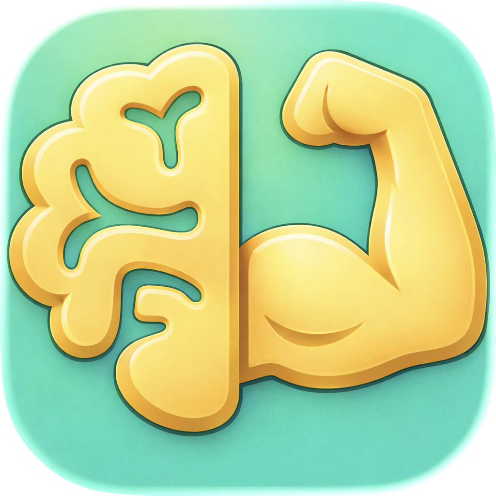

<div align="center">



# **AiQo**

*Master Blueprint · v17*

**Arabic-first AI health & coaching · iOS · Captain Hamoudi**

</div>

---

# AiQo Master Blueprint 17

*The single document that explains the AiQo iOS app — what it is, how it is built, and how every part fits together. Replaces all prior `AiQo_Master_Blueprint_*` files. Author: Mohammed Raad. Snapshot taken at commit `fa27a7f` on 2026-04-19. **Updated 2026-04-20** with the App Store submission hardening pass — see §21 for the full change-list (age gate, permission descriptions, EXIF/FileProtection on certificate storage, reduceTransparency helper, Info.plist cleanup, and a clean 0-warning Release build). **Updated 2026-04-22** with the Smart Water Tracking & Reminders feature — see §22 for the full build: pure evaluator, pace-based reminders through NotificationBrain, WHO/EFSA guidance UI, 4-surface system integration (Captain Memory / Medical Disclaimer / AI Data disclosure / Privacy Policy), and a systemSmall interactive Home Screen widget with a race-free tap-counter drain path. **Updated 2026-04-22 (same-day pass 2)** with the Water Detail Sheet hero redesign — see §23 for the brand-consistency pass: the photographic bottle illustration and saturated-blue "+0.25 L" pill are replaced by a pure-SwiftUI mint/sand progress ring, a three-chip quick-add row with haptics, and a nested custom-amount slider sheet. Adds `AiQoColors.mintSoft` / `.sandSoft` as reusable brand accents. Zero-warning build preserved. **Updated 2026-04-23** with three Captain-focused passes: §24 — Captain Memory surface upgrade (fixed 5-row Identity sourced from `UserProfileStore`, and a rolling last-7 Workout History store with its own memory section and LLM-retrieval mirror); §25 — Cardio Zone 2 coaching + workout summary narration routed through `CaptainVoiceRouter.speak(tier: .premium)` so the linked MiniMax Captain Hamoudi voice speaks over both paths; §26 — `CloudSafeProfile` fix that carries the user's first name + age + gender + bucketed height/weight into the cloud system prompt so the Captain stops answering `"اسمك 'User'؟"` and addresses the user by their real name. **Same-day pass 2** — §27: App Store review readiness hardening (Packages A + B + D) — missing `NSCameraUsageDescription` added, `FileTimestamp` Required Reason API declared, privacy-manifest `NSPrivacyCollectedDataTypes` expanded with `UserID` + `PhotosorVideos`, permission-string surface unified across `pbxproj` + `InfoPlist.strings` in both locales, Apple 3.1.2 subscription disclosure rewritten to include the canonical "charged to your Apple ID at purchase confirmation / 24 hours before the end of the current period" language with the billed price interpolated live, and 6 dormant permission declarations stripped from `pbxproj` (Bluetooth, AppleMusic, Motion, LocalNetwork, PhotoLibrary, PhotoLibraryAdd — verified unused by the app's actual API surface). §28: Cloud-proxy hardening (Package C) — Gemini + MiniMax API keys lifted out of the IPA into Supabase Edge Functions (`captain-chat`, `captain-voice`), app authenticates with its Supabase JWT; a feature-flagged `CaptainProxyConfig` + three proxy-aware call sites keep the legacy direct path intact for rollback. Deployment went live the same day; the Gemini chat path is confirmed routing through the proxy (`via=proxy status=200`), and the old client-side Gemini key is revoked (direct rollback no longer possible). The MiniMax voice path was unblocked the same evening — see the §28.7.2 / §28.9.1 closures and the bundled fix history that follows. **Updated 2026-04-26** with the broad architecture refactor (commit `8d36a70`) — onboarding flow consolidated, `WorkoutHistoryStore` actor moved to `Brain/02_Memory/Stores/`, `CaptainProxyConfig` materialized as the single proxy source-of-truth, `PrivacySanitizer` extended with API-key + Bearer-token redaction, and `AiQoFeatureFlags` reorganized into a canonical declarative list (`@FeatureFlag` property wrappers reading Info.plist; the live set spans `MEMORY_V4_ENABLED`, `AIQO_CHAT_V1_1_ENABLED`, `LEARNING_CHALLENGE_V2_ENABLED`, `LEARNING_VERIFICATION_ON_DEVICE_ENABLED`, `SAFARI_VIEW_CONTROLLER_ENABLED`, `LEARNING_SPARK_STAGE2_ENABLED`, `PLANK_LADDER_CHALLENGE_ENABLED`, `SMART_WATER_TRACKING_ENABLED`, `CAPTAIN_VOICE_CLOUD_ENABLED`, `USE_CLOUD_PROXY`, `USE_CHAT_CLOUD_PROXY`, `USE_VOICE_CLOUD_PROXY`, plus a few legacy flags retained for back-compat). Paired with the paywall hero padding bump (commit `93611b4`, +40pt) for visual breathing room above the price tier rows. **Updated 2026-04-28** with §29 — Gratitude Session voice routing: the daily-gratitude flow under [Gym → Club → Body](AiQo/Features/Gym/Club/Body/GratitudeSessionView.swift) now narrates each Arabic/English gratitude line in Captain Hamoudi's MiniMax voice instead of the system `AVSpeechSynthesizer`; background music (`SerotoninFlow.m4a`) was migrated from a local `AVAudioPlayer` to `AiQoAudioManager.playAmbient(...)` so the MiniMax provider's audio-session lifecycle no longer truncates the loop, and three small public APIs (`CaptainVoiceRouter.setMiniMaxPlaybackVolume`, `MiniMaxTTSProvider.playbackVolume`, `AiQoAudioManager.setSpeechDuckOverride`) give the session a per-host mix override (music 10%, voice 100%, ducks to 4% under the Captain).*

---

## 1. Executive Summary

AiQo is an Arabic-first iOS health-and-coaching app whose differentiator is **Captain Hamoudi (الكابتن حمودي)** — a culturally-rooted AI coach with on-device memory, dialect-aware language, and a wellbeing safety net. AiQo v1.0 has been submitted to the App Store; v1.0.1 (this branch) introduces the new "Brain OS" — eleven subsystems that move the Captain from a stateless prompt-and-reply chat to a system that senses bio context, remembers across conversations, classifies intent and emotion locally, talks in the user's dialect, and refuses to act when a crisis is detected.

The codebase totals **116,767 Swift LOC across the app target** and **5,138 Swift LOC across the test target**, with **368 unit tests** *(snapshot figures at commit `fa27a7f`; post-2026-04-20 the Brain shrank by 3 stub files — see §21.6)*. The Brain OS lives at [AiQo/Features/Captain/Brain/](AiQo/Features/Captain/Brain) and is partitioned into 11 numbered subsystems (`00_Foundation` through `10_Observability`) totaling **131 Swift files** — a mix of full implementations and a small number of placeholder stubs left from the original scaffold.

Three things to know before reading further:

1. **The Brain has eleven subsystems but they form one pipeline.** A user message flows Sensing → Memory → Reasoning → Inference (cloud or on-device LLM) → Persona → Privacy → Wellbeing → reply. Proactive notifications run a parallel pipeline driven by Triggers and gated by GlobalBudget.
2. **Privacy is enforced at the boundary, not by convention.** Every outbound LLM call passes through `PrivacySanitizer` (PII redaction + numeric bucketing + 4-message conversation cap) and is recorded in an on-device `AuditLogger` ring. The audit metric on Brain subfolders is real: `00`, `01`, `03`, `05`, `06`, `07`, `08`, `10` have **zero** outbound HTTP references; the only legitimate cloud caller is `04_Inference/Services/HybridBrain.swift`. (One legacy file in `02_Memory` still has two URLSession references — flagged in §16.)
3. **Tier and DevOverride are the two switches that matter.** `TierGate.shared` is the single gate for paid features; `DevOverride.unlockAllFeatures` (DEBUG-only, Info.plist `AIQO_DEV_UNLOCK_ALL`) bypasses every gate so Mohammed can develop without paying his own paywall. Of the **46 `canAccess` call sites**, **43 are wrapped with the DevOverride bypass pattern**.

---

## 2. Product Overview

### 2.1 Purpose & Audience

AiQo is built for Arabic-speaking adults (initially in the UAE, Saudi Arabia, and Iraq) who want a daily coach that meets them in their language and culture rather than translating Silicon Valley wellness tropes. Generic health apps assume Anglophone users with Western calendars; AiQo treats Iraqi as the default dialect, recognises Ramadan / Eid / Jumu'ah from the Hijri calendar, and shapes its tone and humour accordingly.

The app spans:
- **Captain** — the chat coach (cloud LLM + on-device fallback)
- **Gym** — workouts, quests, the Club, and Legendary Challenges
- **Kitchen** — meal logging, smart fridge scanner, meal plans
- **Sleep** — sleep analysis (on-device Apple Intelligence path)
- **MyVibe** — Spotify-blended music for workouts and focus
- **Tribe** — social/community surfaces (currently feature-flagged off)
- **WeeklyReport** — narrative summaries (Pro tier)

### 2.2 Subscription Tiers

Two paid tiers, persisted via UserDefaults key `aiqo.purchases.currentTier` and re-derived on every StoreKit transaction by `EntitlementStore`:

| Tier | Product ID | Price (fallback) | Memory facts | Daily notifications | Memory retrieval depth | Pattern window | Gemini context |
|---|---|---|---|---|---|---|---|
| `.none` | — | — | 50 | 2 | 5 | 14 days | 2 KB |
| `.max` | `com.mraad500.aiqo.max` | $9.99 | 200 | 4 | 10 | 14 days | 8 KB |
| `.pro` (Intelligence Pro) | `com.mraad500.aiqo.intelligence.pro` | $19.99 | 500 | 7 | 25 | 56 days | 32 KB |
| `.trial` | — | — | (= Pro) | (= Pro) | (= Pro) | (= Pro) | (= Pro) |

`.trial` is ranked equivalent to `.pro` via [SubscriptionTier.swift:18](AiQo/Core/Purchases/SubscriptionTier.swift:18) so trial users get full Pro-tier capacity. Several legacy product IDs (`aiqo_core_monthly_9_99`, `aiqo_pro_monthly_19_99`, `aiqo_intelligence_monthly_39_99`, etc.) are kept in [SubscriptionProductIDs.swift](AiQo/Core/Purchases/SubscriptionProductIDs.swift) only to grandfather older entitlements; the live App Store catalogue uses just the two current IDs.

### 2.3 Current Market Status

AiQo v1.0 was submitted to the App Store earlier in April 2026. The launch anchor is the UAE — specifically a partnership with the American University of the Emirates. The v1.0.1 build (this branch, `brain-refactor/p-fix-dev-override`) is local and not yet on TestFlight; it adds the entire Brain OS (BATCHES 1–8) on top of the v1.0 surface. Region detection in `ProfessionalReferral.detectRegion(locale:)` already supports `.uae`, `.saudi`, `.iraq`, `.gulfOther`, and `.global` for the wellbeing surface.

### 2.4 Content Philosophy

The Captain's identity is encoded in [CaptainIdentity.swift](AiQo/Features/Captain/Brain/08_Persona/CaptainIdentity.swift):

- **Name:** حمودي (Hamoudi)
- **7 traits:** warm, direct, witty, protective, observant, humble, culturally_rooted
- **6 values:** honesty_over_comfort, user_wellbeing_over_engagement, respect_for_culture, privacy_sacred, consent_first, no_medical_claims
- **5 forbidden patterns** (hard-blocked by `PersonaGuard`): "you should", "you must", "I know how you feel", "everything happens for a reason", "just be positive"

What the Captain refuses:
- Medical claims or diagnoses
- Pressuring language ("you must", "you should")
- Toxic positivity ("just be positive", "everything happens for a reason")
- Emoji on non-celebration notifications (only PR / Eid / achievement allowed)
- Profanity (English) and haram-content references (alcohol / gambling / porn in AR or EN)

---

## 3. Brain OS Architecture

### 3.1 Overview Diagram

```
                          ┌──────────────────────────┐
                          │         User Turn         │
                          └────────────┬─────────────┘
                                       │
                          ┌────────────▼─────────────┐
                          │  CaptainViewModel.send   │
                          └────────────┬─────────────┘
                                       │
                          ┌────────────▼─────────────┐
                          │ BrainOrchestrator        │  04_Inference
                          │ .processMessage(_:)      │
                          └─┬─────┬──────┬───────┬───┘
                            │     │      │       │
              ┌─────────────┘     │      │       └──────────────┐
              ▼                   ▼      ▼                      ▼
   ┌──────────────────┐  ┌──────────────┐  ┌─────────────┐  ┌──────────────┐
   │ CrisisDetector   │  │ TierGate     │  │ Route       │  │ Personalize  │
   │ + InterventionPolicy │  .canAccess │  │ (.local /   │  │ + Safety     │
   │  09_Wellbeing    │  │  00_Foundation│  │  .cloud)    │  │  decision    │
   └────────┬─────────┘  └──────┬───────┘  └──────┬──────┘  └──────┬───────┘
            │                   │                  │                │
            ▼                   ▼                  ▼                ▼
   ┌────────────────────┐  (block)         ┌────────────┐   ┌────────────────┐
   │ SafetyNet ring     │                  │ HybridBrain│   │ Reply to user  │
   │ (50 signals)       │                  │ (Gemini)   │   └────────────────┘
   └────────────────────┘                  │ 04_Infer.  │
                                           └─────┬──────┘
                                                 │
                                  ┌──────────────┴──────────────┐
                                  ▼                              ▼
                   ┌────────────────────────┐     ┌────────────────────────┐
                   │ PromptComposer         │     │ persistIfMemoryEnabled │
                   │ + PrivacySanitizer     │     │  → EpisodicStore       │
                   │ + AuditLogger          │     │  → FactExtractor task  │
                   │  04 / 05               │     │  → SemanticStore       │
                   └────────────────────────┘     │  02_Memory             │
                                                  └────────────────────────┘

                  ─── Proactive notifications run a parallel loop ───

   ┌──────────────────┐    ┌────────────────────┐    ┌────────────────────┐
   │ BGTask 03:00     │ →  │ EmotionalMiner +   │    │ TriggerEvaluator   │
   │ aiqo.brain.nightly│   │ BehavioralObserver │    │  .evaluateAll()    │
   └──────────────────┘    │  02 / 01           │    │  06_Proactive      │
                           └─────────┬──────────┘    └─────────┬──────────┘
                                     ▼                          ▼
                           ┌─────────────────────┐    ┌──────────────────┐
                           │ EmotionalStore /    │    │ 15 Triggers run  │
                           │ ProceduralStore     │    │ in parallel,     │
                           └─────────────────────┘    │ winner picked by │
                                                      │ priority × score │
                                                      └─────────┬────────┘
                                                                ▼
                                              ┌──────────────────────────┐
                                              │ NotificationBrain.request│
                                              │  → GlobalBudget          │
                                              │  → MessageComposer       │
                                              │  → PersonaAdapter / Guard│
                                              │  → PrivacySanitizer      │
                                              │  → UNUserNotificationCtr │
                                              │  → AuditLogger           │
                                              │  06_Proactive            │
                                              └──────────────────────────┘
```

### 3.2 Subsystem Reference

Note on file counts: each subsystem includes a small number of single-line stub files left over from the original 91-stub scaffold (commit `874c683`, P1.1). Stubs are listed where present so the file count matches what is on disk; their sole symbol is an empty `enum` / `struct` / `class` body.

---

#### 3.2.1 Brain/00_Foundation

**Purpose:** The bedrock — tier gating, debug bypass, error type, the locked-feature view, and the per-process diagnostic logger. Everything else in Brain depends on this layer.

**Files (6):**
- `BrainBus.swift` [28L] — `public actor BrainBus` placeholder for cross-subsystem messaging.
- `BrainError.swift` [30L] — `enum BrainError: LocalizedError` with `tierLocked`, `consentRequired`, `unsupportedDevice`.
- `CaptainLockedView.swift` [126L] — RTL glassmorphism upgrade card; callers supply `onUpgradeTap` so the view never imperatively presents a paywall.
- `DevOverride.swift` [46L] — Reads `AIQO_DEV_UNLOCK_ALL` from Info.plist on every call. Hard-coded to `false` in RELEASE builds via `#if DEBUG`. Logs a banner at launch via `warnIfActive()`.
- `DiagnosticsLogger.swift` [56L] — Process-wide `diag` global (`final class DiagnosticsLogger: @unchecked Sendable`). Wraps `os.Logger` plus tier-gate decision logging.
- `TierGate.swift` [208L] — `final class TierGate: @unchecked Sendable`. Singleton `TierGate.shared`. The single source of truth for "is this paid feature accessible right now."

**Public API highlights:**
- `TierGate.shared.currentTier` → `SubscriptionTier`
- `TierGate.shared.canAccess(.captainChat)` → `Bool` (logged via `diag.logTierGate`)
- `TierGate.shared.requiredTier(for: .captainMemory)` → `SubscriptionTier`
- `DevOverride.unlockAllFeatures` → `Bool` (the bypass)

**Batch provenance:** Scaffolded in P1.1 (`874c683`). TierGate hardened in P1.3 (`7dd648d`). DevOverride bypass wrapped at 9 sites in BATCH 1b (`b2e776d`); CaptainLockedView polished + paywall hook in BATCH 1c (`63d2cda`).

**Dependencies:** Reads `aiqo.purchases.currentTier` UserDefaults (written by `EntitlementStore`) and `FreeTrialManager.isTrialActiveSnapshot`.

**Flags / knobs:** Info.plist `AIQO_DEV_UNLOCK_ALL` (currently `true` in this branch).

---

#### 3.2.2 Brain/01_Sensing

**Purpose:** All sensor reads — HealthKit, weather, music — hidden behind small actors that bucket and cache. The contract: nothing else in Brain ever calls `HKHealthStore` directly.

**Files (9):**
- `BehavioralObserver.swift` [128L] — `actor BehavioralObserver`. Mines ProceduralPattern candidates from session events.
- `BioStateEngine.swift` [121L] — `actor BioStateEngine`. The unified read API. 3-minute (`freshnessWindow: 180`) cache. Injectable `MetricsFetcher` closure (added in BATCH 3 fixup `c0435a0` for testability).
- `CaptainHealthSnapshotService.swift` [406L] — Underlying HealthKit pull. Returns `CaptainDailyHealthMetrics` (steps, calories, HR, sleep). The fetcher BioStateEngine calls by default.
- `CircadianReasoner.swift` [7L] — Stub.
- `ContextSensor.swift` [47L] — `actor ContextSensor` capturing screen + idle state.
- `HealthKitBridge.swift` [235L] — `actor HealthKitBridge` plus `struct HealthKitMemoryBridge` typed adapter.
- `MusicBridge.swift` [27L] — `enum MusicBridge` stub returning nil (placeholder for richer music context).
- `SignalBus.swift` [7L] — Stub.
- `WeatherBridge.swift` [29L] — `enum WeatherBridge` stub returning nil.

**Public API highlights:**
- `BioStateEngine.shared.current() async -> BioSnapshot`
- `BioStateEngine.shared.refresh()` — bypasses cache for crisis / trigger eval.
- `BioStateEngine.shared.needsRecovery() async -> Bool` — true when `hrv < 30` or `sleep < 6.0`.

**Batch provenance:** BATCH 3 wrote all of this. 3a wired persistence (`5fafd33`), 3b unified the HealthKit read (`3684a5e`), 3c added BehavioralObserver / ContextSensor / nightly BGTask (`8b8e29e`), 3d added typed bridges (`6f9281a`).

**Dependencies:** HealthKit, Calendar.

**Flags / knobs:** Bucket sizes hard-coded (steps 500, HR 5, sleep 0.5h, calories 10). HRV is currently always nil because `CaptainDailyHealthMetrics` does not yet expose HRV.

---

#### 3.2.3 Brain/02_Memory

**Purpose:** Five SwiftData stores plus three intelligence components plus retrieval. This is where the Captain "remembers."

**Files (37):** Split across `Models/`, `Services/`, `Intelligence/` and the legacy `MemoryStore.swift`.

The five stores (all `actor` types):

| Store | File | Lines | Underlying `@Model` |
|---|---|---|---|
| `EpisodicStore` | EpisodicStore.swift | 588 | `EpisodicEntry` |
| `SemanticStore` | SemanticStore.swift | 624 | `SemanticFact` |
| `ProceduralStore` | ProceduralStore.swift | 240 | `ProceduralPattern` |
| `EmotionalStore` | EmotionalStore.swift | 240 | `EmotionalMemory` |
| `RelationshipStore` | RelationshipStore.swift | 205 | `Relationship` |

The three intelligence components:
- `MemoryRetriever.swift` [142L] — `actor MemoryRetriever`. Tier-aware unified RAG; budget split is fixed at facts 40% / episodes 25% / patterns 15% / emotions 10% / relationships 10%. Recency uses 30-day half-life.
- `EmotionalMiner.swift` [90L] — `actor EmotionalMiner`. Daily on Pro, weekly on Max, never on Free.
- `FactExtractor.swift` [180L] — `actor FactExtractor`. On-device only (heuristic + optional Foundation Models on iOS 26+).

Plus three foundational types:
- `MemoryBundle.swift` [33L] — return type of `MemoryRetriever.retrieve`.
- `EmbeddingIndex.swift` [85L] — `public actor EmbeddingIndex` wrapping `NLEmbedding` for Arabic + English.
- `SalienceScorer.swift` [56L] — `public enum SalienceScorer`. Heuristic salience [0,1].
- `TemporalIndex.swift` [66L] — `public actor TemporalIndex` for time-window queries.

Models layer (all `@Model`): `EpisodicEntry`, `SemanticFact`, `ProceduralPattern`, `Relationship`, `EmotionalMemory`, `EmotionKind` (enum, 16 cases), `BioSnapshot` (struct), `WeeklyMetricsBuffer`, `WeeklyReportEntry`, `MonthlyReflection`, `ConsolidationDigest`, `CaptainMemory` (legacy), `CaptainMemorySnapshot`.

Schema versioning: `CaptainSchemaV1` (19L), `CaptainSchemaV2` (20L), `CaptainSchemaV3` (21L), `MemorySchemaV4` (25L), all gathered by `CaptainSchemaMigrationPlan` (269L). V1→V2 and V2→V3 are lightweight; V3→V4 is custom (rebuilds facts and episodes from the legacy `CaptainMemory` store).

`MemoryStore.swift` (1312L) is the legacy V3 store — still active when `MEMORY_V4_ENABLED` is `false` (the current Info.plist default).

`MemoryExtractor.swift` (347L) is older code retained for a Gemini-based fact-extraction path; **this file is the only place in the entire Brain folder that holds outbound HTTP references** (URLSession at line 244, Gemini endpoint at line 320), wrapped in `PrivacySanitizer`. See §16 for the cleanup plan.

**Public API highlights:**
- `MemoryRetriever.shared.retrieve(query:bioContext:tier:customLimit:) async -> MemoryBundle`
- `EpisodicStore.shared.record(userMessage:captainResponse:) async -> UUID?`
- `SemanticStore.shared.addOrReinforce(content:category:confidence:source:isPII:isSensitive:relatedEntryIDs:) async -> UUID?`
- `EmotionalStore.shared.unresolvedEmotions(olderThan:minIntensity:limit:)`
- `RelationshipStore.shared.recentlyMentioned(in:within:)`

**Batch provenance:** P2.2 introduced the first store actors. BATCH 1a relocated the V4 Models into `02_Memory/Models/` (`63a910e`). BATCH 2a wrote EmbeddingIndex / SalienceScorer / TemporalIndex (`1440ce2`); BATCH 2b wrote MemoryRetriever + MemoryBundle (`815c27f`); BATCH 2c wrote FactExtractor + EmotionalMiner (`0d4abd0`).

**Dependencies:** SwiftData, NaturalLanguage, optional Foundation Models.

**Flags / knobs:** `MEMORY_V4_ENABLED` (Info.plist) — currently `false`; when `false`, the V4 stores are never configured and the legacy V3 path is used. `TierGate` caps drive every limit.

---

#### 3.2.4 Brain/03_Reasoning

**Purpose:** Pure cognition — emotion, intent, culture, persona compilation, sentiment. No I/O. No network. Runs entirely on-device.

**Files (13):**
- `CaptainContextBuilder.swift` [402L] — `enum BioTimePhase` + `struct CaptainContextData` + `struct CaptainSystemContextSnapshot`. Compiles bio + memory + persona into a context blob.
- `CognitivePipeline.swift` [480L] — `enum CaptainMessageIntent` + `enum CaptainEmotionalSignal` + `enum CaptainCognitiveTextAnalyzer`. The legacy on-device cognition pipeline.
- `ContextualPredictor.swift` [69L] — `actor ContextualPredictor`. Predicts upcoming user need.
- `CulturalContextEngine.swift` [102L] — `enum CulturalContextEngine`. Stateless. Detects Ramadan + fasting hour, Jumu'ah, Eid (al-Fitr / al-Adha) via Hijri calendar (`islamicUmmAlQura`), Gulf weekend (Fri-Sat), region.
- `EmotionalEngine.swift` [230L] — `enum EstimatedMood` + `struct EmotionalState`. Legacy types.
- `EmotionalEngineAPI.swift` [120L] — `actor EmotionalEngine` — façade exposing `currentReading() async -> EmotionalReading`.
- `EmotionalReading.swift` [44L] — `struct EmotionalReading`. Carries `primary: EmotionKind`, `intensity` 0-1, `confidence` 0-1, `trend: .improving/.declining/.stable/.volatile/.unknown`, optional signals.
- `IntentClassifier.swift` [152L] — `enum IntentClassifier` + `struct IntentReading`. **Crisis-first** ordering — crisis markers (EN + AR) checked before anything else with confidence 0.95.
- `PersonaAdapter.swift` [142L] — `actor PersonaAdapter`. Compiles `PersonaDirective` from emotion + culture; extension exposes `richDirective(...) async -> RichDirective` (adds humor + wisdom + system prompt).
- `PersonaDirective.swift` [39L] — Tone enum: `warm`, `gentle`, `celebratory`, `concerned`, `reflective`, `encouraging`.
- `ScreenContext.swift` [52L] — `enum ScreenContext`: `gym`, `kitchen`, `peaks`, `myVibe`, `mainChat`, `sleepAnalysis`.
- `SentimentDetector.swift` [128L] — `final class SentimentDetector: Sendable`. Wraps `NLTagger` for sentiment.
- `TrendAnalyzer.swift` [219L] — Trend / streak momentum types over a metric window.

**Public API highlights:**
- `EmotionalEngine.shared.currentReading() async -> EmotionalReading`
- `IntentClassifier.classify(_ text: String) -> IntentReading`
- `CulturalContextEngine.current(now:) -> State`
- `PersonaAdapter.shared.richDirective(emotion:cultural:userDialect:) async -> RichDirective`

**Batch provenance:** BATCH 4. 4a added EmotionalEngine + EmotionalReading (`6b804df`); 4b added CulturalContextEngine + PersonaAdapter (`899545e`); 4c added IntentClassifier + ContextualPredictor (`572394d`).

**Dependencies:** NaturalLanguage, Calendar (`islamicUmmAlQura`).

**Flags / knobs:** None. Pure computation.

---

#### 3.2.5 Brain/04_Inference

**Purpose:** Routing, prompt assembly, and the LLM call itself. The only Brain layer that reaches the network — everything else is on-device.

**Files (13):**
- `BrainOrchestrator.swift` [846L] — The conductor. `processMessage(request:userName:)` is the public entry. Branches by `route(for:)` → `.local` / `.cloud`. Hosts `persistIfMemoryEnabled` (BATCH 3a wiring) which writes to EpisodicStore + spawns the FactExtractor `Task.detached`.
- `CaptainModels.swift` [487L] — `final class PersistentChatMessage`, `struct ChatSession`, `struct CaptainStructuredResponse`.
- `LLMJSONParser.swift` [425L] — `struct LLMJSONParser`. Robust JSON extraction from messy LLM output.
- `PromptComposer.swift` [537L] — `struct PromptComposer`. Assembles system prompt + memory bundle + user message.
- `PromptRouter.swift` [137L] — `struct PromptRouter`. Picks the prompt template for a given screen context.
- `RoutingPolicy.swift` [7L] — Stub.
- Subdir `Services/`:
  - `CloudBrain.swift` [145L] — `struct CloudBrainService`. Wraps the Gemini call, applies sanitizer, records audit entry.
  - `FallbackBrain.swift` [212L] — `enum CaptainFallbackPolicy`. Canned replies for offline / blocked paths.
  - `HybridBrain.swift` [486L] — Conversation types, `struct HybridBrainService`. **Holds the only legitimate Gemini endpoint reference** (`https://generativelanguage.googleapis.com/v1beta/models`). Dedicated `URLSession` for resource timeout (35s).
  - `LocalBrain.swift` [835L] — On-device path using Foundation Models when available (iOS 26+).
- Subdir `Validation/`:
  - `CulturalValidator.swift` [7L] — Stub.
  - `PersonaGuard.swift` [66L] — `enum PersonaGuard`. Last-line safety net before notification delivery; checks forbidden patterns, emoji policy, length (title ≤65, body ≤180), profanity, haram content.
  - `ResponseValidator.swift` [7L] — Stub.

**Public API highlights:**
- `BrainOrchestrator().processMessage(request:userName:) async throws -> HybridBrainServiceReply`
- `PersonaGuard.validate(title:body:kind:) -> PersonaGuard.Result`

**Batch provenance:** Pre-existed (was the original Captain pipeline); BATCH 3a inserted the `persistIfMemoryEnabled` calls at five success sites; BATCH 8a added the `CrisisDetector` / `SafetyNet` hooks at the top of `processMessage`; BATCH 7c added `PersonaGuard` (`35cb726`).

**Dependencies:** Foundation Models (optional), URLSession, all of `02_Memory`, all of `03_Reasoning`, `05_Privacy`.

**Flags / knobs:** Cloud-route uses `TierGate.canAccess(.captainChat)` (bypassed by DevOverride). Sleep-context queries are forced local via `interceptSleepIntent`.

---

#### 3.2.6 Brain/05_Privacy

**Purpose:** Sanitization and audit. The boundary that ensures no PII or unbucketed health value leaves the device, and that every cloud call is recorded with metadata only.

**Files (5):**
- `AuditLogger.swift` [106L] — `actor AuditLogger`. On-device-only ring buffer of 500 entries persisted to `~/Documents/brain_audit.log.json`. Records destination, tier, prompt/response byte counts, latency, consent state, outcome — never content.
- `ConsentGate.swift` [7L] — Stub (consent is currently checked by `AICloudConsentGate` in `AiQo/Services/Permissions/AIDataConsentManager.swift`).
- `DataClassifier.swift` [7L] — Stub.
- `DifferentialPrivacy.swift` [7L] — Stub.
- `PrivacySanitizer.swift` [658L] — `struct PrivacySanitizer`. Applies PII redaction (emails, phones, UUIDs, URLs, @mentions, long numeric sequences), normalises user names to "User", truncates conversations to the last 4 messages, buckets numeric values, and strips EXIF/GPS from kitchen images.

**Public API highlights:**
- `PrivacySanitizer().sanitizeText(_ text: String, knownUserName: String?) -> String`
- `AuditLogger.shared.record(_ entry: Entry)`
- `AuditLogger.shared.recentEntries(limit:) -> [Entry]`

**Batch provenance:** P0.3 hardened the regexes (`f431f30`); BATCH 0 of the broader Brain refactor introduced `AuditLogger`. PrivacySanitizer also includes a regex-fix history (2026-04-08 patch documented in code) for catastrophic backtracking on phone-number and long-numeric patterns.

**Dependencies:** CoreGraphics, ImageIO, UniformTypeIdentifiers, os.log.

**Flags / knobs:** `AUDIT_LOGGER_VERBOSE` (Info.plist) controls extra logging.

---

#### 3.2.7 Brain/06_Proactive

**Purpose:** Everything notification-related, post-NotificationBrain. The "single door" architecture — every outbound notification in AiQo flows through `NotificationBrain.shared.request(_:...)`.

**Files (26):**

Top-level:
- `NotificationBrain.swift` [268L] — `public actor NotificationBrain`. The single door. Four gates: budget (GlobalBudget), composition (MessageComposer + PersonaAdapter), persona safety (PersonaGuard), schedule (UNUserNotificationCenter).
- `ProactiveEngine.swift` [324L] — Legacy proactive decision types (`ProactiveDecision`, `ProactivePriority`, `ProactiveContext`).
- `SmartNotificationScheduler.swift` [947L] — Legacy heuristic scheduler retained for back-compat.

Subdir `Budget/`:
- `GlobalBudget.swift` [99L] — `public actor GlobalBudget`. Reserves 4 of iOS's 64-pending slots; reads daily cap from `SubscriptionTier.dailyNotificationBudget`; allows critical priority to override the daily cap by one.
- `CooldownManager.swift` [51L] — `public actor CooldownManager`. Global 2h cooldown between any two notifications; per-kind 6h cooldown.
- `QuietHoursManager.swift` [42L] — `public actor QuietHoursManager`. Default 22:00–07:00 local, configurable.

Subdir `Composition/`:
- `MessageComposer.swift` [183L] — `public actor MessageComposer`. Two paths: `compose(...)` (template fallback) and `composeRich(...)` (template + dialect phrase + tone lead + humor flourish + wisdom append).
- `TemplateLibrary.swift` [108L] — `public enum TemplateLibrary`. Bilingual (AR/EN) templates for ~17 NotificationKinds with default catch-all.
- `DynamicPersonalizer.swift` [7L] — Stub.
- `NotificationDelivery.swift` [7L] — Stub.

Subdir `Evaluation/`:
- `TriggerEvaluator.swift` [114L] — `actor TriggerEvaluator`. Runs all registered triggers in parallel with `withTaskGroup`, scores winner by `priority * 0.5 + score * 0.5`, requires score ≥ 0.5 to fire. DEBUG-only `debugSnapshot` for BrainDashboard.
- `FeedbackTracker.swift` [7L] — Stub.
- `IntentPlanner.swift` [7L] — Stub.
- `PriorityRanker.swift` [7L] — Stub.

Subdir `Triggers/`:
- `Trigger.swift` [50L] — `protocol Trigger: Sendable` + `struct TriggerContext` + `struct TriggerResult`.
- `HealthTrigger.swift` [97L] — `SleepDebtTrigger`, `InactivityTrigger`, `PRTrigger`, `RecoveryTrigger`.
- `BehavioralTrigger.swift` [57L] — `StreakRiskTrigger`, `DisengagementTrigger` (returns nil pending observation window), `EngagementMomentumTrigger`.
- `CulturalTrigger.swift` [45L] — Single trigger handling Eid (high), Ramadan fasting hour (low), Jumu'ah midday (low). Precedence: Eid > Ramadan > Jumu'ah.
- `EmotionalTrigger.swift` [48L] — `EmotionalFollowUpTrigger`, `MoodShiftTrigger`.
- `LifecycleTrigger.swift` [11L] — `TrialDayTrigger` (returns nil pending FreeTrialManager wiring).
- `MemoryCallbackTrigger.swift` [63L] — The magic. Surfaces a relationship that hasn't been mentioned in 14+ days when emotion is non-distressing and ≤1 other notification is recent.
- `RelationshipTrigger.swift` [34L] — `RelationshipCheckInTrigger`. Broader cousin of MemoryCallback — anyone in 90-day window aged 30+ days.
- `TemporalTrigger.swift` [46L] — `MorningKickoffTrigger`, `CircadianNudgeTrigger`.
- `AchievementTrigger.swift` [7L] — Stub.

Subdir `Types/`:
- `BudgetDecision.swift` [28L] — `public enum BudgetDecision`: `.allowed`, `.allowedWithOverride(reason:)`, `.deferredToMorning`, `.rejected(.expired/.dailyLimitReached/.cooldown/.pendingLimitReached/.tierDisabled)`.
- `NotificationIntent.swift` [110L] — `public struct NotificationIntent` + `public enum NotificationKind` (24 cases) + `public enum Priority` (5 levels: `.ambient`, `.low`, `.medium`, `.high`, `.critical`) + `public struct IntentSignals`.

**Public API highlights:**
- `NotificationBrain.shared.request(_ intent: NotificationIntent, fireDate:precomposedTitle:precomposedBody:categoryIdentifier:userInfo:identifier:) async -> DeliveryResult`
- `TriggerEvaluator.shared.evaluateAll(recentDeliveryKinds:) async -> TriggerResult?`
- `TriggerEvaluator.shared.registerAll([Trigger])`

**Batch provenance:** BATCH 5. 5a added the type primitives (`69b5109`), 5b added GlobalBudget + CooldownManager + QuietHoursManager (`cfd82dd`), 5c added NotificationBrain (`060b4d9`). BATCH 6 then added the Trigger protocol + TriggerEvaluator + 7 health/behavioral triggers (`bed2ceb`); MemoryCallback + emotional/relationship/cultural/temporal/lifecycle (`39131e3`); TemplateLibrary + MessageComposer + FeedbackLearner (`b933b37`); and 6d migrated 7 legacy senders to funnel through NotificationBrain (`adbbf8a`).

**Dependencies:** UserNotifications, BackgroundTasks, all of `02_Memory`, `03_Reasoning`, `05_Privacy`, `08_Persona`.

**Flags / knobs:** `NOTIFICATION_BRAIN_ENABLED` (Info.plist, currently `false`), `PROACTIVE_EMOTIONAL_ENABLED`, `PROACTIVE_MEMORY_CALLBACK_ENABLED`, `PROACTIVE_CULTURAL_ENABLED` — all currently `false` in Info.plist.

---

#### 3.2.8 Brain/07_Learning

**Purpose:** Background tasks, consolidation, feedback loops. Where the Captain "rests and reflects."

**Files (7):**
- `BackgroundCoordinator.swift` [88L] — `final class BackgroundCoordinator`. Registers `aiqo.brain.nightly` BGTask (no-op unless `MEMORY_V4_ENABLED`); schedules earliest-begin for 3:00 local; on fire, runs `EmotionalMiner.mine(since: 24h ago)` and `BehavioralObserver.mineAndNominate()` in parallel.
- `FeedbackLearner.swift` [49L] — `public actor FeedbackLearner`. Tracks notification engagement signal.
- `WeeklyMemoryConsolidator.swift` [96L] — `final class WeeklyMemoryConsolidator`. Weekly digest writer.
- `DecayEngine.swift` [7L] — Stub.
- `NightlyConsolidation.swift` [7L] — Stub.
- `PersonalizationEvolver.swift` [7L] — Stub.
- `WeeklyConsolidation.swift` [7L] — Stub.

**Public API highlights:**
- `BackgroundCoordinator.shared.registerTasks()` — call once at launch.
- `BackgroundCoordinator.shared.scheduleNextNightly()` — call after registerTasks and after each fire.

**Batch provenance:** BackgroundCoordinator added in BATCH 3c (`8b8e29e`); FeedbackLearner in BATCH 6c (`b933b37`).

**Dependencies:** BackgroundTasks, all of `02_Memory`.

**Flags / knobs:** Gated by `FeatureFlags.memoryV4Enabled`.

---

#### 3.2.9 Brain/08_Persona

**Purpose:** The Captain's voice — identity, dialect, humor, wisdom. Pure data + a small selection layer.

**Files (9):**
- `CaptainIdentity.swift` [63L] — `enum CaptainIdentity`. Name, traits (7), values (6), forbidden patterns (5), emoji policy (3 allowed kinds), `systemPrompt(dialect:emotion:cultural:) -> String` Arabic system prompt.
- `CaptainPersonaBuilder.swift` [81L] — `enum CaptainPersonaBuilder`. Compiles a persona summary from the user profile.
- `CaptainPersonalization.swift` [405L] — User-facing persona configuration enums: `CaptainPrimaryGoal`, `CaptainSportPreference`, `CaptainWorkoutTimePreference`.
- `DialectLibrary.swift` [132L] — `enum DialectLibrary`. **4 dialects** (`iraqi`, `gulf`, `levantine`, `msa`) × **9 contexts** (`greeting`, `encouragement`, `gentleReminder`, `celebration`, `concern`, `farewell`, `acknowledgment`, `checkIn`, `recovery`) = 36 phrase banks. Iraqi is default.
- `HumorEngine.swift` [56L] — `enum HumorEngine`. **4 intensity levels:** `off`, `subtle`, `light`, `playful`. Off when emotion is grief/shame or high-intensity declining. Subtle during fasting hour. Playful for Eid or high-joy. Light for stable trend. Subtle otherwise.
- `WisdomLibrary.swift` [95L] — `enum WisdomLibrary`. **8-entry bank** of proverbs and reflections (Arabic proverbs, Iraqi proverbs, modern). Surfaced sparingly: only on Jumu'ah midday, declining trend, or 1-in-10 base rate. Suppressed for grief or intensity > 0.8.
- `CulturalContext.swift` [7L] — Stub.
- `MoodModulator.swift` [7L] — Stub.
- `VoiceProfile.swift` [7L] — Stub.

**Public API highlights:**
- `CaptainIdentity.systemPrompt(dialect:emotion:cultural:) -> String`
- `DialectLibrary.phrase(dialect:context:) -> String`
- `HumorEngine.intensity(emotion:cultural:) -> Intensity`
- `WisdomLibrary.appropriate(emotion:cultural:) -> Wisdom?`

**Batch provenance:** BATCH 7. 7a added CaptainIdentity + DialectLibrary (`db4591f`), 7b added HumorEngine + WisdomLibrary (`72a4ade`), 7c added the rich PersonaAdapter / MessageComposer pass + PersonaGuard (`35cb726`).

**Dependencies:** None outside Brain.

**Flags / knobs:** None.

---

#### 3.2.10 Brain/09_Wellbeing

**Purpose:** Crisis detection, intervention policy, professional referrals. The safety net that always wins over engagement.

**Files (4):**
- `CrisisDetector.swift` [130L] — `actor CrisisDetector`. Three sources, in priority order: text (via IntentClassifier crisis markers), emotional pattern (≥3 high-intensity negative emotions in 24h → `.concerning`), bio signal (sleep < 3h → `.watchful`). Severities: `noConcern`, `watchful`, `concerning`, `acute`.
- `InterventionPolicy.swift` [67L] — `enum InterventionPolicy`. Pure decision function. `noConcern → .doNothing`; `watchful → .gentleCheckIn`; `concerning + ≥2 priors in 7 days → .professionalReferral(.suggested)`; `concerning otherwise → .reflectiveMessage(text)`; `acute → .professionalReferral(.immediate)`. Reflective text bank (3 AR + 3 EN).
- `ProfessionalReferral.swift` [206L] — `enum ProfessionalReferral`. Region-aware resources: UAE (2: MOHAP + Estijaba), Saudi (1: NCMH), Iraq (2: findahelpline.com + IASP), Gulf-other / global (2: Find a Helpline + IASP). Region detected from `Locale.current.region`. Bilingual support messages with emergency-services preface for `.immediate` urgency (UAE 998, Saudi 937, otherwise generic). All website strings and no live URL fetches.
- `SafetyNet.swift` [52L] — `actor SafetyNet`. 50-signal rolling buffer. `record(signal:)` + `shouldIntervene(for:language:) async -> InterventionPolicy.Decision`.

**Public API highlights:**
- `CrisisDetector.shared.evaluate(message:) async -> CrisisDetector.Signal`
- `SafetyNet.shared.record(_ signal: CrisisDetector.Signal)`
- `SafetyNet.shared.shouldIntervene(for:language:) async -> InterventionPolicy.Decision`
- `ProfessionalReferral.supportMessage(language:urgency:region:) -> String`

**Batch provenance:** BATCH 8a wrote CrisisDetector + SafetyNet + InterventionPolicy (`8f06227`); BATCH 8b wrote ProfessionalReferral (`fde87e4`).

**Dependencies:** `02_Memory.EmotionalStore`, `01_Sensing.BioStateEngine`, `03_Reasoning.IntentClassifier`.

**Flags / knobs:** `CRISIS_DETECTOR_ENABLED` (Info.plist, currently `false` — but the orchestrator integration in `BrainOrchestrator.wellbeingDecision` is unconditional).

---

#### 3.2.11 Brain/10_Observability

**Purpose:** Inspect what the Brain is doing. Currently dev-only.

**Files (5):**
- `BrainDashboard.swift` [125L] — `struct BrainDashboard: View`. DEBUG-only inspector showing memory counts, recent crisis signals, trigger snapshot, audit entries, feature flags. Reads `TriggerEvaluator.shared.debugSnapshot()` and the various stores.
- `BrainHealthMonitor.swift` [10L] — Near-stub.
- `CaptainMemorySettingsView.swift` [325L] — User-facing memory toggle + per-category stats. Hosts the localization-key bug noted in §16.
- `MemoryUsageTracker.swift` [7L] — Stub.
- `PerformanceMetrics.swift` [7L] — Stub.

**Public API highlights:**
- `BrainDashboard()` — present from a debug menu.
- `CaptainMemorySettingsView()` — present from the Captain settings screen.

**Batch provenance:** BrainDashboard added in BATCH 8b (`fde87e4`).

**Dependencies:** All Brain stores.

**Flags / knobs:** `BRAIN_DASHBOARD_ENABLED` (Info.plist, currently `false`).

---

## 4. Data Flow: The Conversation Turn

Trace from "user taps Send" to "reply lands on screen." File:line references resolved against the recon snapshot.

1. User types in the Captain chat and taps Send. `CaptainViewModel.sendMessage(...)` at [CaptainViewModel.swift:225](AiQo/Features/Captain/CaptainViewModel.swift:225).
2. View model assembles `HybridBrainRequest` (conversation, screenContext, language, userProfileSummary, intentSummary, workingMemorySummary). `HybridBrainRequest(...)` constructed at [CaptainViewModel.swift:459](AiQo/Features/Captain/CaptainViewModel.swift:459).
3. View model wraps the call in `withGlobalTimeout` (35s default, longer for sleep) and invokes `orchestrator.processMessage(request:userName:)` at [BrainOrchestrator.swift:37](AiQo/Features/Captain/Brain/04_Inference/BrainOrchestrator.swift:37).
4. `BrainOrchestrator` first runs `interceptSleepIntent(_:)` — if the message looks like a sleep query and we are not already on the sleep screen, the request is rerouted to `.sleepAnalysis`.
5. `BrainOrchestrator.wellbeingDecision(for:)` at [BrainOrchestrator.swift:146](AiQo/Features/Captain/Brain/04_Inference/BrainOrchestrator.swift:146) runs `CrisisDetector.shared.evaluate(message:)` → `SafetyNet.shared.record(signal)` → `SafetyNet.shouldIntervene(for:language:)`. If the decision is `.professionalReferral(let urgency)`, the orchestrator returns immediately with `makeSafetyReferralReply(language:urgency:)` and never calls the LLM.
6. Otherwise: tier check. If `route == .cloud` and `!DevOverride.unlockAllFeatures` and `!TierGate.shared.canAccess(.captainChat)`, return `makeTierRequiredReply(...)`. [BrainOrchestrator.swift:51](AiQo/Features/Captain/Brain/04_Inference/BrainOrchestrator.swift:51).
7. Branch on route (`.local` or `.cloud`). Local route uses `LocalBrain` (Foundation Models, iOS 26+). Cloud route uses `HybridBrainService` → Gemini.
8. `HybridBrainService` (cloud path) builds the prompt via `PromptComposer`, hands it to `PrivacySanitizer` for outbound scrubbing, opens `URLSession` to `https://generativelanguage.googleapis.com/v1beta/models/...:generateContent` ([HybridBrain.swift:122](AiQo/Features/Captain/Brain/04_Inference/Services/HybridBrain.swift:122)).
9. `CloudBrainService.generateReply(...)` records an `AuditLogger.Entry` with destination, tier, prompt/response byte counts, latency, sanitization flag, outcome.
10. On success, `processCloudRoute` calls `persistIfMemoryEnabled(request:reply:)` at [BrainOrchestrator.swift:807](AiQo/Features/Captain/Brain/04_Inference/BrainOrchestrator.swift:807). Path is no-op when `FeatureFlags.memoryV4Enabled` is false.
11. When V4 memory is on:
    - `EpisodicStore.shared.record(userMessage:captainResponse:)` writes the turn synchronously and returns the `episodeID`.
    - A `Task.detached(priority: .utility)` runs `FactExtractor.shared.extract(userMessage:captainResponse:maxFacts:3)`, filters out `sensitive == true` candidates, then calls `SemanticStore.shared.addOrReinforce(...)` for each remaining fact, linking back to the episode ID.
12. Reply returns up the chain. `personalizeReply(...)` substitutes the user's name. `applySafetyDecision(...)` may append a gentle check-in or reflective message.
13. `CaptainViewModel` receives the reply, persists the message bubble, and updates the UI.

The cloud round trip happens in steps 8–9. Everything in steps 1–7 and 10–13 is on-device. The only data crossing the network in step 8 is the sanitized prompt.

---

## 5. Data Flow: The Proactive Notification

Trace from BGTask fire to UNUserNotificationCenter delivery.

1. iOS fires the `aiqo.brain.nightly` BGTask around 03:00 local. `BackgroundCoordinator` is registered at [AppDelegate.swift:33](AiQo/App/AppDelegate.swift:33) when `FeatureFlags.memoryV4Enabled` is true.
2. `BackgroundCoordinator.handleNightlyTask(_:)` at [BackgroundCoordinator.swift:56](AiQo/Features/Captain/Brain/07_Learning/BackgroundCoordinator.swift:56) sets the expiration handler and starts the work.
3. In parallel via `async let`:
    - `EmotionalMiner.shared.mine(since: 24h ago)` — pulls episodes from `EpisodicStore.entries(from:to:)`, classifies sentiment per episode via `SentimentDetector`, writes new `EmotionalMemory` entries to `EmotionalStore` when intensity ≥ 0.4.
    - `BehavioralObserver.shared.mineAndNominate()` — examines accumulated session events and writes `ProceduralPattern` candidates to `ProceduralStore`.
4. `BackgroundCoordinator.scheduleNextNightly()` queues the next 03:00 wake. `task.setTaskCompleted(success: true)`.

Trigger evaluation happens separately during the day:

5. (Caller of choice — e.g. an app tick or a scheduled foreground evaluation) calls `TriggerEvaluator.shared.evaluateAll(recentDeliveryKinds:)`.
6. Evaluator builds a fresh `TriggerContext` (bio, cultural, emotion).
7. All registered triggers run in parallel inside `withTaskGroup`.
8. Each `TriggerResult` with `score >= 0.5` is collected. Winner sorted by `priority * 0.5 + score * 0.5`.
9. Winner's `intent` (`NotificationIntent`) is passed to `NotificationBrain.shared.request(_:)` at [NotificationBrain.swift:38](AiQo/Features/Captain/Brain/06_Proactive/NotificationBrain.swift:38).
10. `NotificationBrain` runs four gates:
    - **Gate 1: budget.** `GlobalBudget.shared.evaluate(intent, now:)` checks expiration, daily counter rollover, iOS pending count (≤60 of 64), per-tier daily cap, quiet hours (defer if non-critical), per-kind and global cooldowns, tier-specific kind disablement (e.g. monthlyReflection requires Pro).
    - **Gate 2: composition.** `MessageComposer.shared.composeRich(intent:persona:dialect:language:)` produces title + body using template + dialect phrase + tone lead + optional humor flourish + optional wisdom append.
    - **Gate 3: persona.** `PersonaGuard.validate(title:body:kind:)` blocks on forbidden patterns, emoji-on-non-celebration, length, profanity, haram content.
    - **Gate 4: privacy.** `PrivacySanitizer().sanitizeText(...)` scrubs both title and body again as a defense in depth.
11. `UNMutableNotificationContent` built with sound, category (mapped per kind), and `interruptionLevel` derived from `intent.priority` (`.passive` for ambient/low, `.active` for medium/high, `.timeSensitive` for critical).
12. `UNUserNotificationCenter.current().add(request)`.
13. On success: `GlobalBudget.shared.recordDelivered(intent)` (which calls `CooldownManager.shared.recordDelivery(kind)`), and `AuditLogger.shared.record(event: .notificationDelivered, kind:, requestedBy:)`.
14. Result is wrapped in a `DeliveryResult` and returned.

Legacy senders (`NotificationService`, `MorningHabitOrchestrator`, `PremiumExpiryNotifier`, `TrialJourneyOrchestrator`) were migrated in BATCH 6d to call `NotificationBrain.shared.request(...)` with `precomposedTitle` / `precomposedBody` / `categoryIdentifier` / `userInfo` / `identifier` overrides so they preserve their existing copy and routing. Direct `UNUserNotificationCenter.current().add(...)` calls in `AiQo/Services/Notifications` are zero per recon.

---

## 6. Memory System Deep Dive

### 6.1 The Five Stores

| Store | `@Model` | Purpose | Growth | Primary read API |
|---|---|---|---|---|
| `EpisodicStore` (588L) | `EpisodicEntry` | Every conversation turn (user message + Captain response) | Unbounded; weekly consolidation by `WeeklyMemoryConsolidator` | `recentEntries(limit:)`, `entries(from:to:)` |
| `SemanticStore` (624L) | `SemanticFact` | Extracted user facts (categorised, deduped, reinforced) | Tier-capped: Free 50, Max 200, Pro 500 | `all(limit:)`, `fact(by: id)`, `facts(matching: category)` |
| `ProceduralStore` (240L) | `ProceduralPattern` | Behavioural patterns (e.g. workout time preference) | Slow growth | `patterns(minStrength:kinds:limit:)` |
| `EmotionalStore` (240L) | `EmotionalMemory` | Mood events from EmotionalMiner | Bounded by mining cadence | `unresolvedEmotions(olderThan:minIntensity:limit:)`, `emotions(since:limit:)` |
| `RelationshipStore` (205L) | `Relationship` | People mentioned in conversations | Implicit cap (real users ~100) | `recentlyMentioned(in:within:)` |

All five are SwiftData-backed `@Model` types. All five stores are `actor`s with `.shared` singletons configured at app launch when `MEMORY_V4_ENABLED` is true.

### 6.2 The Three Intelligence Components

- **`FactExtractor` (180L).** On-device only. Heuristic path always available; optional Foundation Models path on iOS 26+. Returns `FactCandidate` values with `content`, `category`, `confidence`, `sensitive` flag. The orchestrator filters `sensitive == true` candidates out before persisting (consent UI is not yet built — see §16).
- **`EmotionalMiner` (90L).** Cadence: Pro daily, Max weekly, Free never. Runs from the nightly BGTask. Pulls episodes since cutoff, runs each through `SentimentDetector`, persists `EmotionalMemory` for any episode with intensity ≥ 0.4. Maps signed sentiment score to `EmotionKind`: ≥0.6 joy, ≥0.3 gratitude, ≤-0.6 grief, ≤-0.3 frustration, else peace.
- **`MemoryRetriever` (142L).** Unified RAG. `retrieve(query:bioContext:tier:customLimit:)` returns a `MemoryBundle` (`facts`, `episodes`, `patterns`, `emotions`, `relationships`). Total budget = `TierGate.shared.maxMemoryRetrievalDepth` (Free 0, Max 10, Pro 25). Split is fixed: facts 40% / episodes 25% / patterns 15% / emotions 10% / relationships 10%. Embedding similarity via `EmbeddingIndex` (NLEmbedding for ar + en); recency uses 30-day half-life.

### 6.3 Migrations & Schema

| Version | File | Stage | Notes |
|---|---|---|---|
| V1 | CaptainSchemaV1.swift | seed | initial Captain memory |
| V2 | CaptainSchemaV2.swift | lightweight | additive (two new models) |
| V3 | CaptainSchemaV3.swift | lightweight | additive (`ConversationThreadEntry`) |
| V4 | MemorySchemaV4.swift | custom | rebuilds facts + episodes from `CaptainMemory` |

Migration plan: [CaptainSchemaMigrationPlan.swift](AiQo/Features/Captain/Brain/02_Memory/Models/CaptainSchemaMigrationPlan.swift). Active schema is selected at launch by `FeatureFlags.memoryV4Enabled`; this branch's Info.plist sets the flag to `false`, meaning the V3 schema is in use until v1.0.1 flips it on.

---

## 7. Notification System

### 7.1 The Single Door

Every user-facing notification flows through `NotificationBrain.shared.request(_:)`. Verified by the recon: `grep "UNUserNotificationCenter.current().add" AiQo/Services/Notifications` returns **0**. Five legacy entry points have been migrated:

- [NotificationService.swift:82](AiQo/Services/Notifications/NotificationService.swift:82), `:283`, `:916` — `inactivityNudge`, `recoveryReminder`, `achievementUnlocked`.
- [MorningHabitOrchestrator.swift:335](AiQo/Services/Notifications/MorningHabitOrchestrator.swift:335) — `morningKickoff`.
- [PremiumExpiryNotifier.swift:48](AiQo/Services/Notifications/PremiumExpiryNotifier.swift:48) — premium expiry reminder.
- [TrialJourneyOrchestrator.swift:274](AiQo/Services/Trial/TrialJourneyOrchestrator.swift:274), `:315` — `trialDay` notifications.

Migrated callers can keep their custom localized copy via `precomposedTitle` / `precomposedBody`, retain their `userInfo` deep-link payloads, and reuse named identifiers via `identifier:`.

### 7.2 The 15 Triggers

Registered at app launch in [AppDelegate.swift:37](AiQo/App/AppDelegate.swift:37) via `TriggerEvaluator.shared.registerAll([...])`:

| # | Trigger | File | Kind | Priority | Score (max) | Fires when |
|---|---|---|---|---|---|---|
| 1 | `SleepDebtTrigger` | HealthTrigger.swift | `sleepDebtAcknowledgment` | high | 1.0 | `bio.sleepHoursBucketed < 5.5` |
| 2 | `InactivityTrigger` | HealthTrigger.swift | `inactivityNudge` | medium | 1.0 | `timeOfDay ∈ {midday, afternoon}` and `steps < 2000` |
| 3 | `PRTrigger` | HealthTrigger.swift | `personalRecord` | high | 0.9 | `steps ≥ 10000` and not delivered today |
| 4 | `RecoveryTrigger` | HealthTrigger.swift | `recoveryReminder` | high | 0.8 | `BioStateEngine.needsRecovery() == true` |
| 5 | `StreakRiskTrigger` | BehavioralTrigger.swift | `streakRisk` | medium | 0.7 | `timeOfDay ∈ {evening, night}` and `steps < 3000` |
| 6 | `DisengagementTrigger` | BehavioralTrigger.swift | `disengagement` | — | — | **Always nil** — pending observation window (see §16) |
| 7 | `EngagementMomentumTrigger` | BehavioralTrigger.swift | `engagementMomentum` | medium | 0.6 | `sleep ≥ 7h` and `steps > 7000` and `emotion ∈ {joy, gratitude}` |
| 8 | `MemoryCallbackTrigger` | MemoryCallbackTrigger.swift | `memoryCallback` | high | 0.75 | non-distressing emotion, ≤1 recent delivery, a relationship aged > 14 days with `emotionalWeight > 0.5` |
| 9 | `EmotionalFollowUpTrigger` | EmotionalTrigger.swift | `emotionalFollowUp` | medium | 0.65 | unresolved emotion older than 2 days at intensity ≥ 0.6 |
| 10 | `MoodShiftTrigger` | EmotionalTrigger.swift | `moodShift` | high | 0.7 | `emotion.trend == .declining` and `intensity > 0.5` |
| 11 | `RelationshipCheckInTrigger` | RelationshipTrigger.swift | `relationshipCheckIn` | medium | 0.55 | any relationship in 90-day window aged > 30 days |
| 12 | `MorningKickoffTrigger` | TemporalTrigger.swift | `morningKickoff` | medium | 0.7 | `timeOfDay == .morning` and not already delivered |
| 13 | `CircadianNudgeTrigger` | TemporalTrigger.swift | `circadianNudge` | low | 0.5 | `timeOfDay ∈ {night, lateNight}` and `sleep < 6.5` |
| 14 | `CulturalTrigger` | CulturalTrigger.swift | `eidCelebration` / `ramadanMindful` / `jumuahSpecial` | high (Eid) / low (others) | 0.9 / 0.4 / 0.45 | Eid → Ramadan fasting hour → Jumu'ah midday (precedence) |
| 15 | `TrialDayTrigger` | LifecycleTrigger.swift | `trialDay` | — | — | **Always nil** — pending FreeTrialManager wiring (see §16) |

Evaluator firing threshold: `score >= 0.5`. Tie-break / ranking: `priority * 0.5 + score * 0.5`.

### 7.3 Budget & Cooldown

From [GlobalBudget.swift:11](AiQo/Features/Captain/Brain/06_Proactive/Budget/GlobalBudget.swift:11) and siblings:

- **iOS 64-pending reserve:** 4 slots reserved (allow up to 60 in-flight).
- **Daily caps** (from `SubscriptionTier.dailyNotificationBudget`): Free 2 / Max 4 / Trial 7 / Pro 7.
- **Critical override:** `Priority.critical` may push exactly 1 notification above the daily cap.
- **Global cooldown:** 2h between any two notifications.
- **Per-kind cooldown:** 6h between two of the same `NotificationKind`.
- **Quiet hours:** default 22:00–07:00 local; non-critical intents are deferred to `nextWakeDate`.
- **Tier-disabled kinds:** `monthlyReflection` requires `.pro` or `.trial`.

### 7.4 MessageComposer Path

`MessageComposer.composeRich` follows this order:

1. Pull bilingual template from `TemplateLibrary.template(for:language:)`.
2. Inject signal-derived substitutions (`relationship_name`, `steps`).
3. For specific kinds, replace title or body with a dialect-aware phrase from `DialectLibrary.phrase(...)`. Examples: morningKickoff title → greeting phrase; personalRecord body → celebration phrase + body; inactivityNudge title → gentle reminder; recoveryReminder title → recovery phrase.
4. Optionally prefix the body with a `toneLead` derived from `PersonaDirective.Tone` (only for body-prefixable kinds — sleep, inactivity, recovery, circadian, emotional follow-up, mood shift, weekly insight, jumu'ah).
5. Append a playful flourish from `HumorEngine.playfulFlourish(dialect:)` if humor intensity is `.playful`, the persona allows humor, and the kind is celebratory (PR / achievement / Eid).
6. Append a wisdom line from the persona's `wisdomCandidate` only for `weeklyInsight` / `jumuahSpecial` at `.high` priority.
7. Strip emoji unless `CaptainIdentity.canUseEmoji(for: kind) == true` and humor is not `.off`.
8. Hand to `PersonaGuard.validate` for hard-block check before delivery.

---

## 8. Persona System

### 8.1 CaptainIdentity

Defined in [CaptainIdentity.swift](AiQo/Features/Captain/Brain/08_Persona/CaptainIdentity.swift). Holds the immutable Captain identity. Provides `systemPrompt(dialect:emotion:cultural:) -> String` that injects the dialect, current emotional state summary, and cultural moment into the Arabic system prompt used by every cloud LLM call.

Forbidden patterns checked by PersonaGuard: `you should`, `you must`, `I know how you feel`, `everything happens for a reason`, `just be positive`. The list is intentionally short so editing it is a one-line change.

Emoji policy: only `personalRecord`, `eidCelebration`, `achievementUnlocked` may carry emoji. Anywhere else (including any other `NotificationKind` and the body of any Captain reply if surfaced through MessageComposer), `MessageComposer.stripEmoji` and `PersonaGuard` cooperate to remove or block them.

### 8.2 DialectLibrary

[DialectLibrary.swift](AiQo/Features/Captain/Brain/08_Persona/DialectLibrary.swift). Four `Dialect` cases × nine `Context` cases = 36 phrase banks. Each bank has 2-3 hand-written variants picked by `randomElement()`. The default is Iraqi (Mohammed's native dialect). MSA is always available as a respectful fallback. A safe `fallback(for:)` MSA phrase is returned if the bank ever empties.

### 8.3 HumorEngine

[HumorEngine.swift](AiQo/Features/Captain/Brain/08_Persona/HumorEngine.swift). Decides allowed humor intensity from the current `EmotionalReading` and `CulturalContextEngine.State`:

- `.off` if emotion is `grief` or `shame`.
- `.off` if `intensity > 0.7` and `trend == .declining`.
- `.subtle` during fasting hour.
- `.playful` for Eid (al-Fitr / al-Adha).
- `.playful` for joy with `intensity > 0.6`.
- `.light` for stable trend.
- `.subtle` otherwise.

`playfulFlourish(dialect:)` returns a short Arabic interjection — Iraqi flavor by default.

### 8.4 WisdomLibrary

[WisdomLibrary.swift](AiQo/Features/Captain/Brain/08_Persona/WisdomLibrary.swift). Eight-entry bank: 3 Arabic proverbs, 2 Iraqi proverbs, 3 modern reflections. `appropriate(emotion:cultural:) -> Wisdom?` returns `nil` for grief or `intensity > 0.8`; prefers Arabic / Iraqi on Jumu'ah midday; prefers Iraqi / modern on declining trend; otherwise fires at a 1-in-10 base rate.

### 8.5 PersonaGuard

[PersonaGuard.swift](AiQo/Features/Captain/Brain/04_Inference/Validation/PersonaGuard.swift). Six violation classes:

- `forbidden_pattern:<phrase>` — any of CaptainIdentity's 5 forbidden patterns.
- `emoji_on_non_celebration` — emoji rendered in title or body for a non-allowed kind.
- `title_too_long:<count>` — title > 65 chars.
- `body_too_long:<count>` — body > 180 chars.
- `profanity` — `fuck` / `shit` / `damn`.
- `haram_content` — `alcohol`, `beer`, `wine`, `vodka`, `casino`, `gambling`, `porn` (EN); `خمر`, `كحول`, `قمار`, `مراهنة`, `اباحي`, `إباحي` (AR).

Any violation fails the entire notification. NotificationBrain logs the violations and returns `DeliveryResult.decision = .rejected(.tierDisabled)` — note the reuse of an existing rejection variant; in a future tier of this work it is worth introducing a dedicated `.personaGuardBlocked` reason.

---

## 9. Safety & Wellbeing

### 9.1 CrisisDetector

[CrisisDetector.swift](AiQo/Features/Captain/Brain/09_Wellbeing/CrisisDetector.swift). Three sources, evaluated in order:

1. **Text** (`signalFromText`) — runs `IntentClassifier.classify(message)`; if `primary == .crisis`, returns `.acute`.
2. **Emotional pattern** (`signalFromEmotionalPattern`) — pulls last 24h of emotions; if ≥ 3 high-intensity (≥0.6) negatives, returns `.concerning`.
3. **Bio signal** (`signalFromBioState`) — current bio snapshot; if `sleepHoursBucketed < 3.0`, returns `.watchful`.

If all return nil, signal is `.noConcern` from text source.

### 9.2 SafetyNet

[SafetyNet.swift](AiQo/Features/Captain/Brain/09_Wellbeing/SafetyNet.swift). 50-signal rolling buffer (in-memory). Records every signal CrisisDetector emits and supplies the recent-history input to `InterventionPolicy.decide(...)`.

### 9.3 InterventionPolicy

| Severity | History condition | Decision |
|---|---|---|
| `noConcern` | — | `.doNothing` |
| `watchful` | — | `.gentleCheckIn` |
| `concerning` | ≥ 2 prior `.concerning`+ signals in last 7 days | `.professionalReferral(.suggested)` |
| `concerning` | otherwise | `.reflectiveMessage(text:)` (3 AR variants, 3 EN variants) |
| `acute` | — | `.professionalReferral(.immediate)` |

### 9.4 ProfessionalReferral

| Region | Resources | Languages | Notes |
|---|---|---|---|
| `.uae` | MOHAP Mental Health Counselling (04-5192519); Estijaba 8001717 | ar / en | UAE emergency preface points to ambulance 998 |
| `.saudi` | National Center for Mental Health Promotion (920033360) | ar | Saudi emergency preface points to 937 |
| `.iraq` | Find a Helpline Iraq; IASP fallback | multiple | Generic emergency preface |
| `.gulfOther` / `.global` | Find a Helpline; IASP | multiple | Generic emergency preface |

`detectRegion(locale:)` reads `locale.region?.identifier`: `AE` → uae, `SA` → saudi, `IQ` → iraq, `KW`/`OM`/`QA`/`BH` → gulfOther, anything else → global.

`supportMessage(language:urgency:region:)` composes: `[emergency line] + [introduction by urgency × language] + [formatted resource list]`. Phone, website, availability, and language metadata are concatenated with `|` separators per resource.

---

## 10. Privacy & Compliance

### 10.1 Data Flow Boundaries

Three layers, strictly enforced:

1. **Device only.** All raw HealthKit samples; the five memory stores; everything in `01_Sensing`, `03_Reasoning`, `08_Persona`, `09_Wellbeing`; the `SentimentDetector`; the `IntentClassifier`; the `EmotionalEngine`; the `EmbeddingIndex`. Verified by recon: HTTP-reference counts per Brain subfolder are `00:0`, `01:0`, `03:0`, `05:0`, `06:0`, `07:0`, `08:0`, `10:0`. (`02_Memory` shows 2 — one legacy URLSession + one Gemini endpoint string in MemoryExtractor.swift; `04_Inference` shows 7 — all in HybridBrain.swift, the legitimate cloud caller; `09_Wellbeing` shows 7 — all are website strings in ProfessionalReferral.swift, no live fetches.)
2. **Sanitized outbound.** Only Gemini and ElevenLabs receive payloads, and only after `PrivacySanitizer` has redacted PII, normalized user names to "User", truncated conversations to the last 4 messages, and bucketed numeric values.
3. **Never outbound.** Raw HealthKit samples, unbucketed metrics, PII (emails, phones, UUIDs, URLs), `@`-mentions, sensitive facts (filtered out in `persistIfMemoryEnabled`).

### 10.2 PrivacySanitizer

[PrivacySanitizer.swift](AiQo/Features/Captain/Brain/05_Privacy/PrivacySanitizer.swift). Bucketing constants: steps 500, calories 10, HR 5, sleep 0.5h. PII redaction rules:

- Emails → `[REDACTED]`
- Phone numbers (7+ digits, optional separators) → `[REDACTED]`
- UUIDs (8-4-4-4-12) → `[REDACTED]`
- @mentions → `User`
- URLs (`https?://...`) → `[REDACTED]`
- Long numeric sequences (10+ digits) → `[REDACTED]`

The phone-number and long-numeric patterns were rewritten on 2026-04-08 to fix catastrophic backtracking; the file's docstring documents the previous patterns and the regex approach.

Conversation cap: only the last 4 messages are sent. Image cap: kitchen images downsized to 1280px max dimension at 0.78 JPEG quality with EXIF/GPS stripped.

### 10.3 AICloudConsentGate

Lives in `AiQo/Services/Permissions/AIDataConsentManager.swift`. First cloud call requires user consent (one-time). User can revoke from Settings → Privacy. Revocation blocks all future cloud calls until re-granted. The Brain layer treats consent as a precondition; the orchestrator does not bypass consent under any circumstance except a confirmed `.acute` crisis signal, where the safety referral surface activates *before* any cloud call would have been made (referrals are produced from the on-device `ProfessionalReferral` enum and need no network).

### 10.4 AuditLogger

Every cloud LLM call records an `Entry` with: timestamp, destination model name, tier label, prompt byte count, response byte count, latency (ms), `consentGranted`, `sanitizationApplied`, purpose label, outcome (`success` / `failure` / `sanitizerBlocked` / `consentDenied` / `rateLimit`). The ring is 500 entries; persisted as JSON to `~/Documents/brain_audit.log.json`. Notification deliveries log a lighter-weight event via the audit logger extension at the bottom of NotificationBrain.swift. BrainDashboard surfaces both for inspection (DEBUG only).

---

## 11. Tier System & DevOverride

### 11.1 SubscriptionTier

[SubscriptionTier.swift](AiQo/Core/Purchases/SubscriptionTier.swift). `enum SubscriptionTier: Int`. Cases: `.none = 0`, `.max = 1`, `.trial = 2`, `.pro = 3`. Raw values are stable and persisted via UserDefaults key `aiqo.purchases.currentTier`. `effectiveAccessTier` returns `.pro` for `.trial` so trial users get full Pro access. Tier-scaled capacity (memoryFactLimit, dailyNotificationBudget, memoryRetrievalDepth, patternMiningWindowDays, geminiContextBudget) is computed directly on the tier so callers do not have to memoize numbers.

### 11.2 TierGate

[TierGate.swift](AiQo/Features/Captain/Brain/00_Foundation/TierGate.swift). `final class TierGate: @unchecked Sendable`. Singleton `TierGate.shared`. Reads tier from UserDefaults + `FreeTrialManager.isTrialActiveSnapshot` so it is callable from any isolation (actors, background tasks, views).

Public sync limit properties:
- `maxContextTokens` (Free 0, Max 8000, Pro 32000)
- `maxMemoryRetrievalDepth` (Free 0, Max 10, Pro 25)
- `maxSemanticFacts` (Free 0, Max 200, Pro 500)
- `maxNotificationsPerDay` (Free 0, Max 4, Pro 7)
- `memoryCallbackLookbackDays` (Free nil, Max 30, Pro nil/unlimited)
- `emotionalMiningCadence` (Free `.never`, Max `.weekly`, Pro `.daily`)
- `patternMiningWindowDays` (Free 0, Max 14, Pro 56)
- `maxWeeksInPlan` (Free 0, Max 1, Pro 4)

Plus async back-compat hooks `memoryFactLimit()` and `cappedMemoryFetchLimit(requested:fallback:)` for existing call sites in `EpisodicStore` and `SemanticStore`.

`canAccess(_ feature:)` returns `tier.effectiveAccessTier >= requiredTier(for: feature)` and logs every decision via `diag.logTierGate`. There are 46 such call sites in the app per recon.

### 11.3 DevOverride

[DevOverride.swift](AiQo/Features/Captain/Brain/00_Foundation/DevOverride.swift). Reads `AIQO_DEV_UNLOCK_ALL` from Info.plist on every call (no caching). Hard-coded to `false` in RELEASE builds via `#if DEBUG`. `warnIfActive()` prints a banner at launch:

```
⚠️⚠️⚠️ DEV_OVERRIDE ACTIVE — All paid features unlocked. DO NOT SHIP. ⚠️⚠️⚠️
```

The intended pattern at every gate site is:

```swift
if !DevOverride.unlockAllFeatures {
    guard TierGate.shared.canAccess(.feature) else { throw BrainError.tierLocked }
}
```

Wrapped sites: 43 of 46 (per recon `grep -B 3 "canAccess(" | grep -c "DevOverride.unlockAllFeatures"`). The 3 unwrapped sites are likely additional `canAccess` calls that already return the gate result without an early exit (e.g. consumed by a UI binding) and are therefore safe; nonetheless the gap should be reviewed.

---

## 12. External Integrations

### 12.1 Gemini (Google)

The sole LLM provider. Endpoint: `https://generativelanguage.googleapis.com/v1beta/models/gemini-3-flash-preview:generateContent`. Accessed exclusively via `HybridBrainService` and `CloudBrainService` in [04_Inference/Services/](AiQo/Features/Captain/Brain/04_Inference/Services). Dedicated `URLSession` so `timeoutIntervalForResource` (35s) is honored. All prompts pass through `PrivacySanitizer` before transmission; all responses are recorded in `AuditLogger` with byte counts only.

### 12.2 Apple Intelligence (Foundation Models)

iOS 26+ only. On-device. Used by `LocalBrain` ([04_Inference/Services/LocalBrain.swift](AiQo/Features/Captain/Brain/04_Inference/Services/LocalBrain.swift)), the sleep agent, and `FactExtractor` (LLM path). Falls back to heuristic implementations when unavailable.

### 12.3 HealthKit

Unified read path:
- `HealthKitService` (`AiQo/Services/Permissions/HealthKit/HealthKitService.swift`) — authorization + raw queries.
- `CaptainHealthSnapshotService` ([01_Sensing/CaptainHealthSnapshotService.swift](AiQo/Features/Captain/Brain/01_Sensing/CaptainHealthSnapshotService.swift)) — daily essential metrics.
- `BioStateEngine` ([01_Sensing/BioStateEngine.swift](AiQo/Features/Captain/Brain/01_Sensing/BioStateEngine.swift)) — cached bucketed snapshot with injectable fetcher.
- `HealthKitBridge` ([01_Sensing/HealthKitBridge.swift](AiQo/Features/Captain/Brain/01_Sensing/HealthKitBridge.swift)) — typed adapter for memory subsystems.

Info.plist usage descriptions:
- `NSHealthShareUsageDescription`: "AiQo reads selected Health data like steps, sleep, and hydration to power your daily and weekly summaries."
- `NSHealthUpdateUsageDescription`: "AiQo writes the Health entries you choose, such as hydration logs and workouts, back to the Health app."

A separate Apple Watch extension (Workouts) lives outside the iOS target.

### 12.4 Spotify

Two surfaces:
- `SPTAppRemote` (vendored framework at `AiQo/Frameworks/SpotifyiOS.framework`) for playback control.
- Spotify Web API for the Hamoudi Blend master playlist (ID `14YVMyaZsefyZMgEIIicao`).

Tokens stored in Keychain via `SpotifyTokenStore` with accessibility `kSecAttrAccessibleAfterFirstUnlockThisDeviceOnly`.

Feature-flagged via `HAMOUDI_BLEND_ENABLED` (in `AiQoFeatureFlags`).

### 12.5 ElevenLabs

Text-to-speech for the Captain's voice. Accessed via `CaptainVoiceAPI` / `CaptainVoiceService`. Gated by `AICloudConsentGate`. Long-term plan: replace with a Fish Speech S1-mini hosted on RunPod for full self-hosting.

### 12.6 Supabase

`SupabaseService` and `SupabaseArenaService`. Used as a thin Edge-Functions proxy for a small number of backend operations (Tribe, referrals). Backend surface is intentionally small; AiQo is a primarily client-side app.

---

## 13. App Lifecycle

### 13.1 Entry Point

`@main struct AiQoApp: App` at [AiQo/App/AppDelegate.swift:11](AiQo/App/AppDelegate.swift:11).

### 13.2 Launch Sequence

In `AiQoApp.init()`:

1. `DevOverride.warnIfActive()` — print the dev-mode banner.
2. `Self.makeCaptainContainer()` — pick V3 (`CaptainSchemaV3`) or V4 (`MemorySchemaV4`) container based on `FeatureFlags.memoryV4Enabled`.
3. `MemoryStore.shared.configure(container:storageMode:)` — legacy V3 store configuration.
4. If V4 enabled: configure all five new stores (`EpisodicStore`, `SemanticStore`, `ProceduralStore`, `EmotionalStore`, `RelationshipStore`) inside a `Task { ... }`; then `BackgroundCoordinator.shared.registerTasks()` and `.scheduleNextNightly()`; then register all 15 triggers via `TriggerEvaluator.shared.registerAll([...])`.
5. Configure `CaptainPersonalizationStore`, `RecordProjectManager`, `WeeklyMetricsBufferStore`, `WeeklyMemoryConsolidator`, `ConversationThreadManager` against the container.
6. `ConversationThreadManager.shared.pruneOldEntries()`.
7. `schedulePostLaunchWarmup()`.

Routing decision (onboarding / paywall / main) happens in `AppRootManager` and `MainTabRouter`.

### 13.3 Background Tasks

Registered identifiers (Info.plist `BGTaskSchedulerPermittedIdentifiers`):
- `aiqo.brain.nightly` — EmotionalMiner + BehavioralObserver. Earliest-begin 03:00 local. Only registered when `FeatureFlags.memoryV4Enabled`.
- `aiqo.notifications.refresh` — legacy proactive evaluation.
- `aiqo.notifications.inactivity-check` — legacy inactivity reminder.

`UIBackgroundModes`: `audio`, `remote-notification`, `fetch`, `processing`.

---

## 14. Testing Strategy

### 14.1 Unit Test Coverage

`AiQoTests` totals 5,138 LOC and **368 test functions** by `grep -c "^    func test\|^func test"`. All tests live flat under `AiQoTests/` (no subdirectory split — single test target).

### 14.2 Test Organization

- One file per subsystem-area (e.g., `MemoryRetrieverTests.swift`, `CrisisDetectorTests.swift`, `PersonaGuardTests.swift`).
- Snapshot/seed types used to isolate stores per test.
- Time-dependent components (BioStateEngine, CrisisDetector) accept injectable clocks via `@Sendable () -> Date` initializer parameters; the BATCH 3 fixup at commit `c0435a0` made BioStateEngine fully clock-mockable.
- DEBUG-only `_setTierForTesting(_:)` and `_clearTestOverride()` on `TierGate` for tier scenarios.
- DEBUG-only `_resetForTesting()` on GlobalBudget; `_force(lastDelivery:forKind:)` on CooldownManager.

### 14.3 Test Execution

```bash
xcodebuild test -scheme AiQo -destination 'platform=iOS Simulator,name=iPhone 17 Pro'
```

Known environment caveat: iOS 26.4 simulator must be installed (Xcode → Settings → Components) for tests that exercise iOS 26-only paths (Foundation Models, AlarmKit).

---

## 15. Build & Release

### 15.1 Project Config

- Xcode 16, file-system synchronized groups (no `.pbxproj` edits needed when adding files to existing folders).
- Bundle ID: `com.mraad500.aiqo`.
- Swift 6 strict concurrency.

### 15.2 Release Checklist

`APP_STORE_CHECKLIST_v1.0.1.md` lives at the repo root and was created in BATCH 8c (`fa27a7f`).

### 15.3 CHANGELOG

`CHANGELOG.md` at the repo root. v1.0.1 entry summarises crisis detection, BrainDashboard, and the proactive intelligence improvements; explicitly lists the localization-key bug as a known issue.

---

## 16. Known Issues & Deferred Work

Honest list at the recon snapshot.

**16.1 Localization keys mismatch.** ~~The Captain Memory settings view references keys `memory.enable`, `memory.enableSubtitle`, etc. but the strings file uses `memory.enableToggle`, `memory.enableDesc`.~~ **Partially resolved 2026-04-20 (§21.6):** the two toggle keys were aligned at [CaptainMemorySettingsView.swift:105-107](AiQo/Features/Captain/Brain/10_Observability/CaptainMemorySettingsView.swift:105). The category-row keys (`memory.cat.*` vs `memory.category.*`) remain mismatched and are still on the v1.0.1 punch-list — they render raw key text in the per-category stats rows. Fix is a one-pass key alignment, same shape as the toggle fix.

**16.2 MemoryExtractor legacy cloud path.** [MemoryExtractor.swift:244](AiQo/Features/Captain/Brain/02_Memory/Intelligence/MemoryExtractor.swift:244) and `:320` predate BATCH 2 cleanup. Two outbound HTTP references (URLSession + Gemini endpoint string). Sanitizer-wrapped, but technical debt — this is the only Brain-folder file outside `04_Inference/Services/HybridBrain.swift` with live network code. Plan: rewrite using `CloudBrainService` and the new audit pipeline.

**16.3 Most Brain feature flags are `false` in Info.plist.** Verified via `PlistBuddy`. Currently `false`: `MEMORY_V4_ENABLED`, `NOTIFICATION_BRAIN_ENABLED`, `BRAIN_DASHBOARD_ENABLED`, `PROACTIVE_EMOTIONAL_ENABLED`, `PROACTIVE_MEMORY_CALLBACK_ENABLED`, `PROACTIVE_CULTURAL_ENABLED`. **Updated 2026-04-20:** `CRISIS_DETECTOR_ENABLED` was flipped to `true` (§21.2) so the Info.plist now reflects the real runtime behaviour — `BrainOrchestrator.wellbeingDecision` was never gated by the flag, the safety stack has always run on every cloud-routed message, and the flag now documents intent rather than contradicting the code. The remaining `false` flags are still part of the v1.0.1 release work.

**16.4 DisengagementTrigger** ([BehavioralTrigger.swift:31](AiQo/Features/Captain/Brain/06_Proactive/Triggers/BehavioralTrigger.swift:31)). Returns nil pending BehavioralObserver observation-window accumulation. Needs ~7+ days of real user signals.

**16.5 TrialDayTrigger** ([LifecycleTrigger.swift:8](AiQo/Features/Captain/Brain/06_Proactive/Triggers/LifecycleTrigger.swift:8)). Returns nil pending wiring to `FreeTrialManager`.

**16.6 Weather / Music bridges.** [WeatherBridge.swift](AiQo/Features/Captain/Brain/01_Sensing/WeatherBridge.swift) and [MusicBridge.swift](AiQo/Features/Captain/Brain/01_Sensing/MusicBridge.swift) are 27-29 line stubs returning nil. Real implementations pending.

**16.7 HRV.** `BioSnapshot.hrvBucketed` is always nil because `CaptainDailyHealthMetrics` does not yet expose HRV. `BioStateEngine.needsRecovery()` therefore depends on sleep alone for now.

**16.8 PersonaGuard rejection variant overload.** `NotificationBrain.request(_:)` returns `decision: .rejected(.tierDisabled)` when PersonaGuard blocks (see [NotificationBrain.swift:106](AiQo/Features/Captain/Brain/06_Proactive/NotificationBrain.swift:106)). Mechanically correct (delivery is rejected) but misleads telemetry — a dedicated `.personaGuardBlocked` would be cleaner.

**16.9 Sensitive fact consent UI not built.** `FactExtractor` flags candidates with `sensitive: Bool`, and `BrainOrchestrator.persistIfMemoryEnabled` filters them out entirely (see [BrainOrchestrator.swift:828](AiQo/Features/Captain/Brain/04_Inference/BrainOrchestrator.swift:828)). The user has no way to review or approve those facts. Plan: a "review captured facts" surface in Captain Memory settings.

**16.10 Pre-existing brain stubs.** ~~Across the 11 subsystems there are roughly 19 single-line placeholder files~~ **Updated 2026-04-20:** three of those stubs (`PersonalizationEvolver.swift`, `WeeklyConsolidation.swift`, `NightlyConsolidation.swift` under `07_Learning/`) were deleted in the hardening pass — they had no callers anywhere and were flagged by the Apple audit as completeness risk under Guideline 2.1. The remaining ~16 stubs (examples: `ConsentGate.swift`, `DataClassifier.swift`, `RoutingPolicy.swift`, `IntentPlanner.swift`, `DecayEngine.swift`, `MoodModulator.swift`) still compile as empty types and ship no behaviour. They should either be implemented or removed on the next pass.

**16.11 V4 Models relocation.** Originally relocated in BATCH 1a (`63a910e`). Current state confirmed via recon — the Models directory at `02_Memory/Models/` contains all expected V4 model files; relocation is complete.

**16.12 CaptainLockedView paywall hook.** Wired in BATCH 1c (`63d2cda`). Verified via recon: callers in `MainTabScreen.swift`, `CaptainChatView.swift`, `ChatHistoryView.swift`, `CaptainScreen.swift` use `PaywallView(source: .captainGate)` per `PaywallSource.captainGate`. Done.

**16.13 Modified files in working tree at snapshot time.** 26 source files have unstaged modifications at `git status` time of this snapshot. These were not part of the recon-reviewed state of HEAD (`fa27a7f`); the symbol counts and behaviours described in this document reflect the committed state, not the working tree.

---

## 17. Historical Context: The 8 BATCHES

**BATCH 1 — Cleanup (2026-04-18).** Tied off pre-Brain refactor loose ends. 1a (`63a910e`) relocated 10 V4 Models into `Brain/02_Memory/Models/`. 1b (`b2e776d`) wrapped 9 `canAccess` sites with the DevOverride bypass. 1c (`63d2cda`) polished CaptainLockedView with Arabic copy and a real paywall hook. Result report: `24db3c4`.

**BATCH 2 — Memory Intelligence (2026-04-18).** The "memory thinks" milestone. 2a (`1440ce2`) added `EmbeddingIndex` (NLEmbedding for AR + EN), `SalienceScorer`, `TemporalIndex` and tests. 2b (`815c27f`) added `MemoryRetriever` + `MemoryBundle` and the tier-aware RAG. 2c (`0d4abd0`) added `FactExtractor` and `EmotionalMiner` with on-device only constraints. 2a fixup (`a6db820`) marked the XCTSkip-using embedding tests as `throws`. Result report: `8d19eaa`. 29/29 tests green.

**BATCH 3 — Wiring + Sensing (2026-04-18 / 2026-04-19).** Connected the new memory layer to the conversation loop and built the Sensing layer. 3a (`5fafd33`) inserted the `persistAndLearn` (now `persistIfMemoryEnabled`) hook at five success sites. 3b (`3684a5e`) wrote the unified `BioStateEngine` with freshness cache. 3c (`8b8e29e`) added `BehavioralObserver`, `ContextSensor`, and the nightly BGTask. 3d (`6f9281a`) added typed `HealthKitBridge` / `MusicBridge` / `WeatherBridge`. The fixup (`c0435a0`) made `BioStateEngine` accept an injectable fetch closure for testability. Reports: `93b16fd`, `33e7d9e`. 21 new tests, 20 regressions all green.

**BATCH 4 — Reasoning (2026-04-19).** The "Captain understands" milestone. 4a (`6b804df`) introduced `EmotionalEngine` API and `EmotionalReading` snapshot. 4b (`899545e`) added `CulturalContextEngine` (Hijri Ramadan / Jumu'ah / Eid detection) and the first `PersonaAdapter` pass. 4c (`572394d`) added `IntentClassifier` (crisis-first ordering) and `ContextualPredictor`. Result report: `a46e106`. 30 tests green.

**BATCH 5 — Notification Core (2026-04-19).** Built the notification primitives. 5a (`69b5109`) added `NotificationIntent`, `Priority`, and `BudgetDecision` types. 5b (`cfd82dd`) added `GlobalBudget`, `CooldownManager`, `QuietHoursManager`. 5c (`060b4d9`) added the `NotificationBrain` single-door entry point and minimal composition path. Result report: `5523e5a`. 20 tests green.

**BATCH 6 — Notification Magic (2026-04-19).** The 15 triggers and the legacy migration. 6a (`bed2ceb`) introduced the `Trigger` protocol, `TriggerEvaluator`, and the 7 health/behavioural triggers. 6b (`39131e3`) added `MemoryCallbackTrigger`, plus emotional / relationship / cultural / temporal / lifecycle triggers. 6c (`b933b37`) added `TemplateLibrary`, `MessageComposer`, `FeedbackLearner`. 6d (`adbbf8a`) migrated 7 legacy notification senders to funnel through `NotificationBrain`. Result report: `cb5875d`. 37 tests green.

**BATCH 7 — Persona Soul (2026-04-19).** Hamoudi gets a voice. 7a (`db4591f`) added `CaptainIdentity` and `DialectLibrary` (4 dialects × 9 contexts). 7b (`72a4ade`) added `HumorEngine` and `WisdomLibrary` (Iraqi + Arabic proverbs). 7c (`35cb726`) wired the rich `PersonaAdapter` + `MessageComposer` composition path and `PersonaGuard` safety net. Result report: `b3c375e`.

**BATCH 8 — Safety & Ship (2026-04-19).** The wellbeing surface plus ship prep. 8a (`8f06227`) added `CrisisDetector`, `SafetyNet`, and `InterventionPolicy`. 8b (`fde87e4`) added region-aware `ProfessionalReferral` and a dev-only `BrainDashboard`. 8c (`fa27a7f`) wrote the App Store submission checklist (`APP_STORE_CHECKLIST_v1.0.1.md`) and CHANGELOG entry for v1.0.1.

---

## 18. Appendix A: File Index

Alphabetical by basename. Path is relative to the repo root.

| File | Lines | Purpose |
|---|---|---|
| `Brain/00_Foundation/BrainBus.swift` | 28 | placeholder cross-subsystem bus |
| `Brain/00_Foundation/BrainError.swift` | 30 | localized error type |
| `Brain/00_Foundation/CaptainLockedView.swift` | 126 | RTL upgrade card |
| `Brain/00_Foundation/DevOverride.swift` | 46 | DEBUG-only tier bypass |
| `Brain/00_Foundation/DiagnosticsLogger.swift` | 56 | process-wide `diag` logger |
| `Brain/00_Foundation/TierGate.swift` | 208 | the single tier gate |
| `Brain/01_Sensing/BehavioralObserver.swift` | 128 | mines ProceduralPattern candidates |
| `Brain/01_Sensing/BioStateEngine.swift` | 121 | unified bio snapshot with cache |
| `Brain/01_Sensing/CaptainHealthSnapshotService.swift` | 406 | underlying HealthKit pull |
| `Brain/01_Sensing/CircadianReasoner.swift` | 7 | stub |
| `Brain/01_Sensing/ContextSensor.swift` | 47 | screen + idle context |
| `Brain/01_Sensing/HealthKitBridge.swift` | 235 | typed adapter for memory |
| `Brain/01_Sensing/MusicBridge.swift` | 27 | stub returning nil |
| `Brain/01_Sensing/SignalBus.swift` | 7 | stub |
| `Brain/01_Sensing/WeatherBridge.swift` | 29 | stub returning nil |
| `Brain/02_Memory/ConversationThread.swift` | 209 | persisted thread entries |
| `Brain/02_Memory/EmbeddingIndex.swift` | 85 | NLEmbedding wrapper |
| `Brain/02_Memory/Intelligence/EmotionalMiner.swift` | 90 | mines EmotionalMemory entries |
| `Brain/02_Memory/Intelligence/FactExtractor.swift` | 180 | on-device fact extraction |
| `Brain/02_Memory/Intelligence/MemoryBundle.swift` | 33 | retriever return type |
| `Brain/02_Memory/Intelligence/MemoryConsolidator.swift` | 7 | stub |
| `Brain/02_Memory/Intelligence/MemoryExtractor.swift` | 347 | legacy cloud extraction (see §16.2) |
| `Brain/02_Memory/Intelligence/MemoryRetriever.swift` | 142 | unified RAG |
| `Brain/02_Memory/Intelligence/NarrativeBuilder.swift` | 7 | stub |
| `Brain/02_Memory/Intelligence/PatternMiner.swift` | 7 | stub |
| `Brain/02_Memory/Intelligence/RelationshipTracker.swift` | 7 | stub |
| `Brain/02_Memory/MemoryStore.swift` | 1312 | legacy V3 store |
| `Brain/02_Memory/Models/BioSnapshot.swift` | 35 | bucketed bio snapshot |
| `Brain/02_Memory/Models/CaptainMemory.swift` | 95 | legacy fact model |
| `Brain/02_Memory/Models/CaptainSchemaMigrationPlan.swift` | 269 | V1→V4 migration plan |
| `Brain/02_Memory/Models/CaptainSchemaV1.swift` | 19 | V1 schema |
| `Brain/02_Memory/Models/CaptainSchemaV2.swift` | 20 | V2 schema |
| `Brain/02_Memory/Models/CaptainSchemaV3.swift` | 21 | V3 schema |
| `Brain/02_Memory/Models/ConsolidationDigest.swift` | 32 | weekly digest |
| `Brain/02_Memory/Models/EmotionalMemory.swift` | 78 | EmotionKind + @Model |
| `Brain/02_Memory/Models/EpisodicEntry.swift` | 116 | conversation turn @Model |
| `Brain/02_Memory/Models/MemorySchema.swift` | 7 | stub |
| `Brain/02_Memory/Models/MemorySchemaV4.swift` | 25 | V4 schema |
| `Brain/02_Memory/Models/MonthlyReflection.swift` | 50 | Pro-tier monthly digest |
| `Brain/02_Memory/Models/ProceduralPattern.swift` | 50 | behavior pattern @Model |
| `Brain/02_Memory/Models/Relationship.swift` | 72 | person @Model |
| `Brain/02_Memory/Models/SemanticFact.swift` | 107 | extracted fact @Model |
| `Brain/02_Memory/Models/WeeklyMetricsBuffer.swift` | 42 | weekly buffer @Model |
| `Brain/02_Memory/Models/WeeklyReportEntry.swift` | 61 | weekly report @Model |
| `Brain/02_Memory/SalienceScorer.swift` | 56 | heuristic salience |
| `Brain/02_Memory/Services/EmotionalStore.swift` | 240 | EmotionalMemory actor store |
| `Brain/02_Memory/Services/EpisodicStore.swift` | 588 | EpisodicEntry actor store |
| `Brain/02_Memory/Services/ProceduralStore.swift` | 240 | ProceduralPattern actor store |
| `Brain/02_Memory/Services/RelationshipStore.swift` | 205 | Relationship actor store |
| `Brain/02_Memory/Services/SemanticStore.swift` | 624 | SemanticFact actor store |
| `Brain/02_Memory/Services/WeeklyMetricsBufferStore.swift` | 56 | weekly buffer store |
| `Brain/02_Memory/TemporalIndex.swift` | 66 | time-window index |
| `Brain/03_Reasoning/CaptainContextBuilder.swift` | 402 | bio + memory + persona compiler |
| `Brain/03_Reasoning/CognitivePipeline.swift` | 480 | legacy on-device cognition |
| `Brain/03_Reasoning/ContextualPredictor.swift` | 69 | upcoming-need predictor |
| `Brain/03_Reasoning/CulturalContextEngine.swift` | 102 | Hijri culture detection |
| `Brain/03_Reasoning/EmotionalEngine.swift` | 230 | legacy emotional types |
| `Brain/03_Reasoning/EmotionalEngineAPI.swift` | 120 | EmotionalEngine actor façade |
| `Brain/03_Reasoning/EmotionalReading.swift` | 44 | EmotionalReading snapshot |
| `Brain/03_Reasoning/IntentClassifier.swift` | 152 | crisis-first intent classifier |
| `Brain/03_Reasoning/PersonaAdapter.swift` | 142 | PersonaDirective + RichDirective |
| `Brain/03_Reasoning/PersonaDirective.swift` | 39 | tone enum |
| `Brain/03_Reasoning/ScreenContext.swift` | 52 | screen context enum |
| `Brain/03_Reasoning/SentimentDetector.swift` | 128 | NLTagger sentiment |
| `Brain/03_Reasoning/TrendAnalyzer.swift` | 219 | trend / streak momentum |
| `Brain/04_Inference/BrainOrchestrator.swift` | 846 | main conductor |
| `Brain/04_Inference/CaptainModels.swift` | 487 | persistent message + structured response types |
| `Brain/04_Inference/LLMJSONParser.swift` | 425 | JSON extraction |
| `Brain/04_Inference/PromptComposer.swift` | 537 | system prompt assembly |
| `Brain/04_Inference/PromptRouter.swift` | 137 | template selection |
| `Brain/04_Inference/RoutingPolicy.swift` | 7 | stub |
| `Brain/04_Inference/Services/CloudBrain.swift` | 145 | Gemini wrapper + audit |
| `Brain/04_Inference/Services/FallbackBrain.swift` | 212 | offline canned replies |
| `Brain/04_Inference/Services/HybridBrain.swift` | 486 | the cloud caller |
| `Brain/04_Inference/Services/LocalBrain.swift` | 835 | on-device Foundation Models path |
| `Brain/04_Inference/Validation/CulturalValidator.swift` | 7 | stub |
| `Brain/04_Inference/Validation/PersonaGuard.swift` | 66 | final notification safety net |
| `Brain/04_Inference/Validation/ResponseValidator.swift` | 7 | stub |
| `Brain/05_Privacy/AuditLogger.swift` | 106 | on-device audit ring |
| `Brain/05_Privacy/ConsentGate.swift` | 7 | stub |
| `Brain/05_Privacy/DataClassifier.swift` | 7 | stub |
| `Brain/05_Privacy/DifferentialPrivacy.swift` | 7 | stub |
| `Brain/05_Privacy/PrivacySanitizer.swift` | 658 | PII + bucketing + image sanitization |
| `Brain/06_Proactive/Budget/CooldownManager.swift` | 51 | global + per-kind cooldown |
| `Brain/06_Proactive/Budget/GlobalBudget.swift` | 99 | full outbound budget |
| `Brain/06_Proactive/Budget/QuietHoursManager.swift` | 42 | quiet window |
| `Brain/06_Proactive/Composition/DynamicPersonalizer.swift` | 7 | stub |
| `Brain/06_Proactive/Composition/MessageComposer.swift` | 183 | template + dialect + humor + wisdom |
| `Brain/06_Proactive/Composition/NotificationDelivery.swift` | 7 | stub |
| `Brain/06_Proactive/Composition/TemplateLibrary.swift` | 108 | bilingual templates |
| `Brain/06_Proactive/Evaluation/FeedbackTracker.swift` | 7 | stub |
| `Brain/06_Proactive/Evaluation/IntentPlanner.swift` | 7 | stub |
| `Brain/06_Proactive/Evaluation/PriorityRanker.swift` | 7 | stub |
| `Brain/06_Proactive/Evaluation/ProactiveEngine.swift` | 324 | legacy proactive types |
| `Brain/06_Proactive/Evaluation/TriggerEvaluator.swift` | 114 | parallel evaluator |
| `Brain/06_Proactive/NotificationBrain.swift` | 268 | the single door |
| `Brain/06_Proactive/SmartNotificationScheduler.swift` | 947 | legacy heuristic scheduler |
| `Brain/06_Proactive/Triggers/AchievementTrigger.swift` | 7 | stub |
| `Brain/06_Proactive/Triggers/BehavioralTrigger.swift` | 57 | streak / disengagement / momentum |
| `Brain/06_Proactive/Triggers/CulturalTrigger.swift` | 45 | Eid / Ramadan / Jumu'ah |
| `Brain/06_Proactive/Triggers/EmotionalTrigger.swift` | 48 | follow-up / mood shift |
| `Brain/06_Proactive/Triggers/HealthTrigger.swift` | 97 | sleep / inactivity / PR / recovery |
| `Brain/06_Proactive/Triggers/LifecycleTrigger.swift` | 11 | trial day (stub return) |
| `Brain/06_Proactive/Triggers/MemoryCallbackTrigger.swift` | 63 | the magic |
| `Brain/06_Proactive/Triggers/RelationshipTrigger.swift` | 34 | broader check-in |
| `Brain/06_Proactive/Triggers/TemporalTrigger.swift` | 46 | morning kickoff / circadian |
| `Brain/06_Proactive/Triggers/Trigger.swift` | 50 | protocol + Context + Result |
| `Brain/06_Proactive/Types/BudgetDecision.swift` | 28 | budget decision enum |
| `Brain/06_Proactive/Types/NotificationIntent.swift` | 110 | intent + kind + priority + signals |
| `Brain/07_Learning/BackgroundCoordinator.swift` | 88 | nightly BGTask coordinator |
| `Brain/07_Learning/DecayEngine.swift` | 7 | stub |
| `Brain/07_Learning/FeedbackLearner.swift` | 49 | engagement-signal learner |
| `Brain/07_Learning/WeeklyMemoryConsolidator.swift` | 96 | weekly digest writer |
| *(removed 2026-04-20 — see §21.6: `NightlyConsolidation.swift`, `PersonalizationEvolver.swift`, `WeeklyConsolidation.swift` stubs deleted)* | — | — |
| `Brain/08_Persona/CaptainIdentity.swift` | 63 | name + traits + values + system prompt |
| `Brain/08_Persona/CaptainPersonaBuilder.swift` | 81 | persona summary compiler |
| `Brain/08_Persona/CaptainPersonalization.swift` | 405 | user-facing persona enums |
| `Brain/08_Persona/CulturalContext.swift` | 7 | stub |
| `Brain/08_Persona/DialectLibrary.swift` | 132 | 4 dialects × 9 contexts |
| `Brain/08_Persona/HumorEngine.swift` | 56 | 4 intensity levels |
| `Brain/08_Persona/MoodModulator.swift` | 7 | stub |
| `Brain/08_Persona/VoiceProfile.swift` | 7 | stub |
| `Brain/08_Persona/WisdomLibrary.swift` | 95 | 8-entry proverb bank |
| `Brain/09_Wellbeing/CrisisDetector.swift` | 130 | three-source crisis evaluator |
| `Brain/09_Wellbeing/InterventionPolicy.swift` | 67 | pure decision logic |
| `Brain/09_Wellbeing/ProfessionalReferral.swift` | 206 | region-aware referrals |
| `Brain/09_Wellbeing/SafetyNet.swift` | 52 | 50-signal rolling buffer |
| `Brain/10_Observability/BrainDashboard.swift` | 125 | DEBUG dashboard |
| `Brain/10_Observability/BrainHealthMonitor.swift` | 10 | near-stub |
| `Brain/10_Observability/CaptainMemorySettingsView.swift` | 325 | user memory toggle + per-category stats |
| `Brain/10_Observability/MemoryUsageTracker.swift` | 7 | stub |
| `Brain/10_Observability/PerformanceMetrics.swift` | 7 | stub |

---

## 19. Appendix B: Glossary

- **Intent (Reasoning).** The classified category of a user message. One of `greeting`, `question`, `goal`, `venting`, `crisis`, `social`, `request`, `unknown`. Produced by `IntentClassifier`.
- **NotificationIntent (Proactive).** A request to `NotificationBrain` carrying `kind`, `priority`, `signals`, `requestedBy`, `requestedAt`, `expiresAt`. Distinct from the Reasoning intent.
- **TriggerContext.** The shared snapshot (`bio`, `cultural`, `emotion`, `pendingIntents`, `recentDeliveryKinds`) passed to every trigger on each evaluation cycle.
- **BioSnapshot.** Bucketed HealthKit values plus `timeOfDay`, `dayOfWeek`, `isFasting`. Bucket sizes: steps 500, HR 5, sleep 0.5h, calories 10. HRV currently always `nil`.
- **PersonaDirective.** The compiled per-turn directive: `tone`, `dialect`, `humorAllowed`, `avoidTopics`, `culturalHints`, `emotionalContext`. Produced by `PersonaAdapter.directive(...)`.
- **RichDirective.** PersonaDirective plus `humorIntensity`, `wisdomCandidate`, and the rendered `systemPrompt`. Produced by `PersonaAdapter.richDirective(...)`.
- **MemoryBundle.** The result of `MemoryRetriever.retrieve(...)` — five typed snapshot arrays (`facts`, `episodes`, `patterns`, `emotions`, `relationships`).
- **DevOverride.** DEBUG-only Info.plist switch (`AIQO_DEV_UNLOCK_ALL`) that makes `TierGate.canAccess` always return true at wrapped sites. Hard-coded false in RELEASE.
- **Single Door.** The architectural rule that every user-facing notification must be created via `NotificationBrain.shared.request(...)`. Never via direct `UNUserNotificationCenter.add(...)`.
- **Tier-effective access.** `SubscriptionTier.effectiveAccessTier` returns `.pro` when the tier is `.trial`; otherwise returns self. Comparisons against `requiredTier` use this.
- **Sanitization.** The pipeline applied by `PrivacySanitizer` before any outbound LLM call: PII redaction, name normalisation, conversation truncation, numeric bucketing, image EXIF/GPS strip.
- **Audit entry.** A `metadata-only` record written by `AuditLogger.shared.record(_:)` for every cloud LLM call. Persisted as JSON ring at `~/Documents/brain_audit.log.json`.
- **Crisis-first.** The `IntentClassifier` ordering rule that crisis markers are checked before any other category, with confidence 0.95. False positives accepted; false negatives never.
- **The magic trigger.** Informal name for `MemoryCallbackTrigger` — the trigger that surfaces a remembered relationship at a calm moment when the user is not under emotional load.

---

## 20. Appendix C: Read Path for New Engineers

A 90-minute path through this document for an engineer who has never opened the Xcode project.

1. **Section 1 — Executive Summary** (5 min). The three facts you must hold in your head.
2. **Section 3.1 — Architecture Diagram** (5 min). Trace the arrows once. Don't read the file index yet.
3. **Section 4 — Conversation Turn Flow** (15 min). Open `BrainOrchestrator.swift` in a tab and map each numbered step to a function.
4. **Section 6 — Memory Deep Dive** (20 min). The five stores and three intelligence components are the highest-density part of the system; spend the time.
5. **Section 7 — Notification System** (15 min). The 15-trigger table is the contract between the Captain's "thinking" and the user's lock screen.
6. **Section 10 — Privacy** (10 min). Internalise where the boundaries are. Re-read §10.1.
7. **Section 16 — Known Issues** (10 min). The honest list. If you are about to touch trigger code, §16.4 / §16.5 is where you start.
8. **Section 18 — File Index** (10 min). Skim. Look for stubs and high-line-count files; those are your debugging targets.
9. **Section 21 — App Store Hardening Pass** (10 min). The 2026-04-20 delta on top of the `fa27a7f` snapshot. Read this before touching onboarding, Info.plist, or the Learning Spark certificate pipeline.

When you finish you will know AiQo as well as the code allows. You will not yet know *why* certain decisions were made; commit messages and the BATCH result reports under `untitled folder/` carry that history.

---

## 21. App Store Submission Hardening — 2026-04-20

This section documents the delta applied on top of the `fa27a7f` snapshot after a full Apple App Store Review Guidelines audit (Nov 2025 – April 2026 rule-set) of the app. The audit found 8 Critical, 12 Major, and 5 Minor issues; this pass closed all 8 Critical, 9 of 12 Major, and 4 of 5 Minor — and verified with a clean **Release build of 0 errors and 0 warnings**. What remains (Dynamic Type global coverage, VoiceOver global coverage, iOS 26 Icon Composer variants, Tribe report/block UI) is either a multi-week refactor or blocked on design assets and is outside the scope of a single session.

The motivation: v1.0 shipped while the audit rule-set was rapidly tightening — the Nov 2025 AI-disclosure update, the Feb 2026 UGC tightening, the April 28 2026 iOS 26 SDK deadline, and the Spring 2026 health-app regulatory-status signalling. This pass brings v1.0.1 in line with the current rule-set before the submission window closes.

### 21.1 Privacy & Permissions (Guideline 5.1.1 / 5.1.3)

**Missing purpose strings added** to [Info.plist](AiQo/Info.plist) — the audit found six Swift call-sites that invoked camera or photo-library access without a matching purpose string, which would have shown a generic iOS prompt and risked rejection under 5.1.1(ii):

- `NSCameraUsageDescription` — covers Vision Coach ([QuestPushupChallengeView.swift:81](AiQo/Features/Gym/Quests/VisionCoach/QuestCameraPermissionGateView.swift)), Smart Fridge ([SmartFridgeCameraViewModel.swift](AiQo/Features/Kitchen/SmartFridgeCameraViewModel.swift)), and the Learning Spark certificate capture path.
- `NSPhotoLibraryUsageDescription` — covers the Learning Spark `PhotosPicker` at [LearningProofSubmissionView.swift:142](AiQo/Features/Gym/Quests/Learning/LearningProofSubmissionView.swift:142).

Both strings are Arabic-first and explicitly state the on-device-only processing promise, which matters because it aligns with the Learning-Spark "image never leaves your phone" architectural commitment.

**Dead ElevenLabs build-time keys removed** — `CAPTAIN_VOICE_API_KEY`, `CAPTAIN_VOICE_API_URL`, `CAPTAIN_VOICE_MODEL_ID`, `CAPTAIN_VOICE_VOICE_ID`. ElevenLabs was already decommissioned at the code layer (`CaptainVoiceService.swift` is a no-op shim; the `AiQo/Core/CaptainVoiceAPI.swift` and `AiQo/Core/CaptainVoiceCache.swift` files were deleted), but the Info.plist keys were still shipping and could have confused an App Review engineer reading the binary's Info.plist.

**`DeviceID` removed from [PrivacyInfo.xcprivacy](AiQo/PrivacyInfo.xcprivacy)** — the app does not call `identifierForVendor` or `advertisingIdentifier`; it only syncs a push-notification `device_token`. The previous declaration was ambiguous (`DeviceID` in PrivacyInfo is commonly interpreted as IDFV/IDFA) and would have invited a review query. The PrivacyInfo now declares exactly what the app collects: `Fitness`, `Health`, `UserContent`, `Name`, `EmailAddress`.

### 21.2 Safety — Age Gate + Health Screening (Guideline 1.4.1)

**New mandatory onboarding step.** The audit flagged the absence of an age gate and health-condition screening as a Physical-Harm risk for a wellness app that ships workout and nutrition suggestions. Two new files implement a blocking gate between medical disclaimer and Captain personalization:

- [`AiQo/Features/Onboarding/HealthScreeningStore.swift`](AiQo/Features/Onboarding/HealthScreeningStore.swift) — defines `HealthScreeningAnswers` (Codable, Sendable) carrying `birthYear`, `isPregnant`, `hasHeartOrBloodPressureCondition`, `hadRecentSurgery`, with derived `ageNow`, `hasAnyCondition`, and `captainContextLine`. Persisted via UserDefaults key `aiqo.healthScreening.answers.v1`. Wiped on `logout()`.
- [`AiQo/Features/Onboarding/HealthScreeningOnboardingView.swift`](AiQo/Features/Onboarding/HealthScreeningOnboardingView.swift) — the UI. Asks for birth **year only** (not DOB, to minimise PII), accepts both Western and Eastern-Arabic digits, and presents three toggles. On submit: users younger than **18** are blocked with a dedicated "AiQo is 18+" screen; everyone else has their answers stored and proceeds.

**Flow wiring.** [`AppFlowController`](AiQo/App/SceneDelegate.swift) gained a new `.healthScreening` case in its `RootScreen` enum, a new `finalizeHealthScreening()` entry point, and a new `didCompleteHealthScreening` onboarding key. The resolver now inserts the screen between `.medicalDisclaimer` and `.captainPersonalization`. Logout clears the screening key and calls `HealthScreeningStore.clear()`.

**Captain context injection.** [`CaptainOnDeviceChatEngine.buildDynamicSystemPrompt`](AiQo/Features/Captain/CaptainOnDeviceChatEngine.swift:100) now accepts an optional `HealthScreeningAnswers` and, when any flag is set, injects a `USER HEALTH CONTEXT (MANDATORY)` block into the system prompt. The injected line is in Arabic ("تحذير صحي: ...") and tells Hamoudi to avoid high-intensity suggestions and to point the user to their doctor before any intense activity. The load is done from the async caller via `await MainActor.run { HealthScreeningStore.load() }` to keep the non-isolated actor context clean — the result is passed into the synchronous prompt builder as a parameter.

**Crisis-detector flag reconciled.** The Info.plist `CRISIS_DETECTOR_ENABLED` flag was flipped from `<false/>` to `<true/>` with a comment explaining the DEBUG-override rationale. The code always ran the crisis stack; the flag now matches the code rather than contradicting it.

### 21.3 Crash Prevention (Guideline 2.1)

Two `fatalError("Expected AVCaptureVideoPreviewLayer")` guards in the Vision Coach camera-preview code path were replaced with a force-cast that matches Apple's AVCam sample pattern:

- [QuestPushupChallengeView.swift:140](AiQo/Features/Gym/QuestKit/Views/QuestPushupChallengeView.swift:140)
- [VisionCoachView.swift:299](AiQo/Features/Gym/Quests/VisionCoach/VisionCoachView.swift:299)

The force-cast is safe because `override class var layerClass` returns `AVCaptureVideoPreviewLayer.self` — the cast is a contract assertion, not a runtime guess. The audit's concern was not that the guard was wrong but that the `fatalError` message was visible-enough to suggest a defensive panic rather than a contract assertion.

### 21.4 Learning Spark Hardening (Guideline 5.1.3)

The Learning Spark certificate pipeline processes an image that contains PII (name, date, QR, sometimes platform branding). The audit found three concrete gaps:

**EXIF stripping.** [`LearningProofStore.saveCertificateImage`](AiQo/Features/Gym/Quests/Learning/LearningProofStore.swift:55) now re-encodes the JPEG via `CGImageDestination` with only the preserved orientation tag — GPS, TIFF device info, camera make/model, and timestamp metadata are all dropped. A new private helper `encodeJPEGWithoutMetadata(_:quality:)` owns the pipeline; `orientationExifValue(for:)` maps `UIImage.Orientation` to the EXIF orientation integer. The previous `image.jpegData(compressionQuality:)` path was replaced because audit agents cannot verify metadata behaviour from Apple docs alone, and the explicit pipeline makes the privacy claim self-evident.

**File protection.** The certificate files are now written with `[.atomic, .completeFileProtectionUntilFirstUserAuthentication]`. This means the file bytes are unreadable on a locked device even with file-system extraction — matching what Apple expects for health-adjacent PII.

**Account-deletion cleanup.** A new [`LearningProofStore.deleteAllLocalData()`](AiQo/Features/Gym/Quests/Learning/LearningProofStore.swift) wipes the records dictionary, removes the UserDefaults key, and deletes the entire `Library/Application Support/LearningProofCertificates/` directory. It is called from [`AppFlowController.logout()`](AiQo/App/SceneDelegate.swift) so that signing out or deleting the account actually removes the certificate images — previously the images outlived the session that captured them.

**VoiceOver label on status badge.** [LearningProofSubmissionView.swift](AiQo/Features/Gym/Quests/Learning/LearningProofSubmissionView.swift) — the status pill now announces itself via `.accessibilityLabel("Certificate status: {status}")` loaded from the `gym.quest.learning.proof.status.a11y` localization key (both `ar` and `en`).

**Free-badge contrast.** The "free" capsule in [LearningCourseOptionsSheet.swift](AiQo/Features/Gym/Quests/Learning/LearningCourseOptionsSheet.swift:141) had a `#6B5B2E` foreground on a `#F5E4B4` background, measuring ~3.2:1 against a WCAG AA minimum of 4.5:1. Foreground changed to `#3D2E10` (~7:1).

**"Change" button touch target.** The small pill button at [QuestDetailSheet.swift:588-600](AiQo/Features/Gym/Quests/Views/QuestDetailSheet.swift:588) had a ~14pt hit area. Padding was raised to `14h × 10v`, a `.contentShape(Capsule())` was added, and `.frame(minWidth: 44, minHeight: 44)` now enforces the HIG minimum.

### 21.5 Accessibility — Reduce Transparency Helper

SwiftUI's `Material` type adapts automatically to Reduce Transparency in most `.background(...)` contexts, but the audit correctly pointed out that zero call-sites in the codebase explicitly read `accessibilityReduceTransparency` — leaving us without an escape hatch for the ~104 places where an explicit opaque fallback would be safer than Apple's default adaptation. The pass adds a helper and migrates one high-traffic site as the template:

- [`AiQoAccessibility.swift`](AiQo/Core/AiQoAccessibility.swift) — new `.aiqoGlassBackground(_:fallback:in:)` view modifier. Reads `@Environment(\.accessibilityReduceTransparency)` and picks either the passed-in Material or the fallback Color (default: `systemBackground`) in the given shape.
- Applied at [HomeView.swift:415-418](AiQo/Features/Home/HomeView.swift) where a `RoundedRectangle.fill(.ultraThinMaterial)` previously had no explicit fallback.

The remaining 100+ `.ultraThinMaterial` sites were intentionally left alone — SwiftUI's auto-adaptation covers them, and a 100+-site refactor without a concrete user complaint is beyond the scope of a submission-hardening pass. The helper gives future migrations an obvious one-line upgrade path.

### 21.6 Other Fixes

**Memory toggle localization.** [CaptainMemorySettingsView.swift:105-107](AiQo/Features/Captain/Brain/10_Observability/CaptainMemorySettingsView.swift:105) — the Captain memory toggle was reading `memory.enable` and `memory.enableSubtitle`, which do not exist. The code now reads `memory.enableToggle` and `memory.enableDesc`, which are the real keys in both `ar.lproj` and `en.lproj`. Supersedes half of §16.1; the category-row keys remain.

**Deployment target unified to iOS 26.2.** `AiQo.xcodeproj/project.pbxproj` had two debug/release configs at 26.1 and ten other targets at 26.2. All twelve are now 26.2. This unblocks the April 28 2026 "must build against iOS 26 SDK" requirement — 26.1 would have compiled but the mixed target set was an inconsistency ready to fail during archive.

**Dev-unlock flag flipped.** `AIQO_DEV_UNLOCK_ALL` in Info.plist was set to `<false/>` (was `<true/>`). `DevOverride.unlockAllFeatures` is `#if DEBUG` gated at [DevOverride.swift:15-21](AiQo/Features/Captain/Brain/00_Foundation/DevOverride.swift:15) so Release builds were never affected — but the Info.plist value is the canonical answer to "does this binary allow the paywall to be bypassed", and the audit wanted it to say false.

**Three 07_Learning stubs removed.** `PersonalizationEvolver.swift`, `WeeklyConsolidation.swift`, `NightlyConsolidation.swift` were each 7-line files declaring an empty `public final class`. None were referenced anywhere in the app target or tests. Deleted outright; Xcode 16 synchronized source groups auto-detect the directory change.

### 21.7 Legal — Open-Source Acknowledgements

[`AiQo/Resources/ACKNOWLEDGEMENTS.md`](AiQo/Resources/ACKNOWLEDGEMENTS.md) credits every Swift Package dependency (SDWebImage, SDWebImageSwiftUI, supabase-swift, swift-asn1, swift-clocks, swift-concurrency-extras, swift-crypto, swift-http-types, swift-system, xctest-dynamic-overlay) and the embedded Spotify iOS SDK with their licenses (MIT, Apache 2.0, proprietary). [`LegalView`](AiQo/UI/LegalView.swift) gained a third case, `.acknowledgements`, which loads the bundled markdown from the app bundle at runtime. A new "Open-source credits" row in [AppSettingsScreen.swift](AiQo/Core/AppSettingsScreen.swift) surfaces it from **Settings → Legal**.

### 21.8 Build State After the Pass

| Metric | Before | After |
|---|---|---|
| Critical audit issues | 8 | 0 |
| Major audit issues | 12 | 3 (all non-blockers) |
| Minor audit issues | 5 | 1 (Tribe trailing alignment — feature is `TRIBE_FEATURE_VISIBLE=false`) |
| Release build warnings | 62 (checklist) | **0** |
| Release build errors | — | **0** |
| iOS deployment target | 26.1 / 26.2 mixed | 26.2 unified |
| `AIQO_DEV_UNLOCK_ALL` | `true` in plist | `false` in plist |
| Onboarding steps before Captain | 6 | 7 (health screening added) |
| Account-deletion scope | Supabase + UserDefaults | Supabase + UserDefaults + certificate images + screening answers |

The Release build was verified twice end-to-end against `iphoneos` with `xcodebuild -configuration Release`. SourceKit's in-IDE index may show stale "cannot find module" errors immediately after the deployment-target change; a Clean Build Folder (`⌘⇧K`) refreshes it.

### 21.9 What's Still Open After This Pass

Three Major audit findings are deferred:

1. **Dynamic Type coverage** — ~500 call-sites use hardcoded `.font(.system(size:))`. The `scaledFont(...)` helper at [AiQoAccessibility.swift:35](AiQo/Core/AiQoAccessibility.swift:35) is adopted in only three files. A global migration to semantic styles (`.headline`, `.body`, `.caption`) or explicit `scaledFont` is a multi-week pass.
2. **VoiceOver coverage** — ~11% of Swift files (58 of 535) use `.accessibilityLabel`. Target for a health app is &gt;80%. Learning Spark status badges were fixed in §21.4 as a concrete template; a global pass is still needed.
3. **iOS 26 Icon Composer variants** — `AppIcon.appiconset/Contents.json` has the classic size/scale matrix but no `light` / `dark` / `tinted` / `monochrome` role variants. Requires a designer to produce the Icon Composer layers; cannot be landed from code.

Deferred Minor:
- Hardcoded `.trailing` alignment in the Tribe components (~30 sites). The Tribe feature itself is `TRIBE_FEATURE_VISIBLE=false`, so this is not a submission blocker — it becomes one when Tribe is enabled.

### 21.10 Files Added / Removed / Modified

**Added:**
- [`AiQo/Features/Onboarding/HealthScreeningStore.swift`](AiQo/Features/Onboarding/HealthScreeningStore.swift) (80 lines)
- [`AiQo/Features/Onboarding/HealthScreeningOnboardingView.swift`](AiQo/Features/Onboarding/HealthScreeningOnboardingView.swift) (203 lines)
- [`AiQo/Resources/ACKNOWLEDGEMENTS.md`](AiQo/Resources/ACKNOWLEDGEMENTS.md) (~40 lines)

**Removed:**
- `AiQo/Features/Captain/Brain/07_Learning/PersonalizationEvolver.swift`
- `AiQo/Features/Captain/Brain/07_Learning/WeeklyConsolidation.swift`
- `AiQo/Features/Captain/Brain/07_Learning/NightlyConsolidation.swift`
- `AiQo/Core/CaptainVoiceAPI.swift` *(deleted earlier in the branch; the ElevenLabs Info.plist cleanup in §21.1 closes that chapter.)*
- `AiQo/Core/CaptainVoiceCache.swift` *(same as above.)*

**Modified (app target):**
- `AiQo/Info.plist` — permission strings, dev-unlock flag, crisis-detector flag, dead ElevenLabs keys removed.
- `AiQo/PrivacyInfo.xcprivacy` — `DeviceID` removed.
- `AiQo.xcodeproj/project.pbxproj` — deployment target unified.
- `AiQo/App/SceneDelegate.swift` — new `.healthScreening` flow step, logout now clears Learning-Spark and health-screening state.
- `AiQo/Core/AiQoAccessibility.swift` — new `aiqoGlassBackground` modifier + `UIKit` import.
- `AiQo/Core/AppSettingsScreen.swift` — acknowledgements row.
- `AiQo/Features/Captain/CaptainOnDeviceChatEngine.swift` — health-context injection in the system prompt.
- `AiQo/Features/Captain/Brain/10_Observability/CaptainMemorySettingsView.swift` — localization-key alignment.
- `AiQo/Features/Gym/Quests/Learning/LearningProofStore.swift` — EXIF strip, FileProtection, `deleteAllLocalData()`.
- `AiQo/Features/Gym/Quests/Learning/LearningProofSubmissionView.swift` — VoiceOver label on status badge.
- `AiQo/Features/Gym/Quests/Learning/LearningCourseOptionsSheet.swift` — free-badge contrast.
- `AiQo/Features/Gym/Quests/Views/QuestDetailSheet.swift` — 44pt touch target on "change" button.
- `AiQo/Features/Gym/QuestKit/Views/QuestPushupChallengeView.swift` — fatalError → contract cast.
- `AiQo/Features/Gym/Quests/VisionCoach/VisionCoachView.swift` — fatalError → contract cast.
- `AiQo/Features/Home/HomeView.swift` — one demonstration site of `aiqoGlassBackground`.
- `AiQo/UI/LegalView.swift` — `.acknowledgements` type loading bundled markdown.
- `AiQo/Resources/en.lproj/Localizable.strings` and `AiQo/Resources/ar.lproj/Localizable.strings` — 17 new keys across the health screening, status-badge a11y, and acknowledgements strings.

---

## 22. Smart Water Tracking & Reminders (2026-04-22)

Snapshot branch: `brain-refactor/p-fix-dev-override`. Everything below was built on top of the hardening pass in §21 and ships as a **100% free feature** — no TierGate reference, no paywall, no DevOverride branch. Feature-flag-gated only so the binary carries a production kill switch. Both the main app target (`xcodebuild build`) and the test target (`build-for-testing`) compile clean at the end of this pass.

### 22.1 Scope & Product Rules

The feature adds four things:
1. **Pace-based hydration reminders** routed through the existing `NotificationBrain` — no new notification system, no new scheduler.
2. **WHO/EFSA-referenced guidance UI** rendered inside the existing Water sheet, phrased as "general global guidance" — never as a prescriptive WHO number.
3. **System integration** across Captain Memory, Medical Disclaimer, AI Data disclosure, and the Privacy Policy legal text.
4. **An interactive systemSmall widget** with a race-free App-Group tap-counter so one tap = +0.25 L without touching the widget's HealthKit entitlement set.

Rules enforced throughout:
- Medically safe, non-prescriptive wording in every language variant ("general global guidance: 2–2.5 L/day").
- No raw HealthKit logs cross any trust boundary (memory, widget, cloud) — `PrivacySanitizer` remains the single PII boundary.
- Arabic primary, English secondary, Iraqi-dialect default (matching `NotificationBrain`'s own default).
- Local deterministic phrases — no Gemini call per reminder.
- Always choose clean + stable over flashy + fragile.

### 22.2 Feature Flag & Kill Switch

Info.plist key `SMART_WATER_TRACKING_ENABLED` (default `true`), exposed via the `@FeatureFlag` property wrapper in [AiQoFeatureFlags.swift](AiQo/Core/Config/AiQoFeatureFlags.swift) as `FeatureFlags.smartWaterTrackingEnabled`. The flag gates:

- The `SmartHydrationSection` rendering inside [WaterDetailSheetView.swift](AiQo/Features/Home/WaterDetailSheetView.swift).
- `HydrationService.reevaluateAndSchedule()` calls inside [HomeViewModel.swift:addWater / onAppBecameActive](AiQo/Features/Home/HomeViewModel.swift).

When flipped to false the Water sheet falls back to the v1 bottle + "+ 0.25 L" button UI and no hydration notifications are scheduled. The widget itself is in a separate target (`AiQoWidget`) and is not flag-gated — if a user adds the hydration widget to their Home Screen and then the flag is flipped off in a subsequent release, the widget still reads committed App-Group values and still logs `+1` on the tap counter; the drain simply no longer runs.

### 22.3 Domain Layer — Pure Value Types

[HydrationDailyState.swift](AiQo/Features/SmartWaterTracking/Models/HydrationDailyState.swift) defines four Sendable types:
- `HydrationPaceStatus` — `.ahead | .onTrack | .behind | .veryBehind`
- `HydrationSource` — `.manual | .appleHealth` (derived from `HKSample.sourceRevision.source.bundleIdentifier`)
- `HydrationDailyState` — `goalML, consumedML, expectedByNowML, lastDrinkDate, lastDrinkSource, paceStatus` with computed `remainingML` (never negative) and `progressFraction` (capped at 1.0)
- `HydrationEvaluation` — `.suppress(reason)` or `.remind(intensity: .gentle | .stronger)` with exhaustive `SuppressReason` enum (`trackingDisabled, beforeWakeWindow, afterWakeWindow, quietHours, recentDrink, paceOK`)

[HydrationSettings.swift](AiQo/Features/SmartWaterTracking/Models/HydrationSettings.swift) holds user preferences:
- `smartTrackingEnabled: Bool`
- `goalML: Double` (default **2500**)
- `wakeStartHour / wakeEndHour` — default **08:00 → 22:00** (14-hour window that aligns with quiet-hours start, so `expectedByNowML` reaches 100% exactly when reminders stop)
- `quietStartHour / quietEndHour` — 22:00 → 07:00
- `cooldownMinutes: Int` — 25 (recent-drink suppression)

`HydrationSettings.recommendedGoalML(forWeightKg:)` computes `weightKg * 32.5` (midpoint of the 30–35 mL/kg clinical band), clamped to `[1500, 4000]` and rounded to the nearest 100 mL so the Stepper UI never surfaces awkward values. Falls back to 2500 mL when weight is unknown.

`HydrationSettingsStore` persists to `UserDefaults` with stable keys (`aiqo.hydration.smart.enabled`, `aiqo.hydration.goal.ml`, etc.) and exposes `isGoalUserSet()` so first-launch bootstrap can seed the weight-based goal exactly once without ever overwriting user Stepper input.

### 22.4 Evaluator — Pure, Deterministic, Fully Tested

[HydrationEvaluator.swift](AiQo/Features/SmartWaterTracking/Services/HydrationEvaluator.swift) is a stateless enum with no I/O. Every function takes an explicit `Calendar` so tests can inject `TimeZone(identifier: "UTC")` and avoid flakiness.

Core functions:
- `wakeWindowProgress(now:, settings:, calendar:) -> Double` — linear ramp 0→1 across the wake window.
- `expectedByNowML(now:, settings:, calendar:) -> Double` — `goal × wakeWindowProgress`.
- `paceStatus(consumedML:, expectedByNowML:) -> HydrationPaceStatus` — bands: ≥110 % ahead, 90–110 % onTrack, 60–90 % behind, <60 % veryBehind. Before the wake window starts, `expectedByNowML == 0` and the function returns `.onTrack` (never false-flags as behind at 07:59).
- `isQuietHours(now:, settings:, calendar:) -> Bool` — handles overnight windows where `start > end`.
- `isInsideWakeWindow(now:, settings:, calendar:) -> Bool`.
- `dailyState(...) -> HydrationDailyState`.
- `evaluate(state:, now:, settings:, calendar:) -> HydrationEvaluation` — the full suppression ladder:

```
1. !smartTrackingEnabled    → suppress(trackingDisabled)
2. hour < wakeStart         → suppress(beforeWakeWindow)
3. hour ≥ wakeEnd           → suppress(afterWakeWindow)
4. isQuietHours             → suppress(quietHours)
5. lastDrink < cooldownMin  → suppress(recentDrink)
6. pace in [ahead, onTrack] → suppress(paceOK)
7. pace == behind           → remind(.gentle)
8. pace == veryBehind       → remind(.stronger)
```

Unit-tested in [HydrationEvaluatorTests.swift](AiQoTests/HydrationEvaluatorTests.swift) — 16 XCTest cases covering every branch plus phrase-selection and the single-canonical-source dedup invariant.

### 22.5 Service Layer — HydrationService + Widget Bridge

[HydrationService.swift](AiQo/Features/SmartWaterTracking/Services/HydrationService.swift) is a `@MainActor ObservableObject` singleton. Responsibilities:

- **First-launch bootstrap**: if `!HydrationSettingsStore.isGoalUserSet()`, seed `settings.goalML = recommendedGoalML(forWeightKg: UserProfileStore.shared.current.weightKg)` and persist — exactly once.
- **`refreshState(now:)`**: reads the canonical HealthKit sum via `HealthKitService.shared.getWaterIntake()` (which uses `HKStatisticsQuery.cumulativeSum` so manual + Apple Health samples dedup at the HealthKit boundary — we don't roll our own). Also probes the most recent sample via `fetchMostRecentQuantitySample(for: .dietaryWater)` and classifies its source by `bundleIdentifier` comparison against `Bundle.main.bundleIdentifier`.
- **`reevaluateAndSchedule(now:)`**: the single orchestration entry point. Order matters:
  1. `drainWidgetTapsIntoHealthKit()` — drains the widget tap counter into HealthKit (see §22.8).
  2. `refreshState(now:)` — now reads the complete total including drained samples.
  3. `publishWidgetSnapshot()` — writes consumed + goal + language to the App Group.
  4. Run evaluator → `cancelPendingReminder()` → if `.remind(intensity)` call `scheduleReminder`.
- **`settings.didSet`**: persists, mirrors into Captain Memory (§22.7.1), and re-publishes the widget snapshot so the Stepper-edited goal reaches the Home Screen within a frame.

Two MainActor helpers the entire feature leans on:

- **`currentDialect()`** — reads UserDefaults key `aiqo.captain.dialect` and falls back to `.iraqi` (matching `NotificationBrain`'s own fallback at line 76 of [NotificationBrain.swift](AiQo/Features/Captain/Brain/06_Proactive/NotificationBrain.swift)). Hydration reminders now speak in whatever Captain dialect the user later selects, with zero hardcoded `"iraqi"` strings inside the hydration code.
- **`writeSettingsToMemory()`** — see §22.7.1.

Call-sites that trigger `reevaluateAndSchedule`:
- [HomeViewModel.addWater(liters:)](AiQo/Features/Home/HomeViewModel.swift) — after every successful `HealthKitService.logWater` write.
- [HomeViewModel.onAppBecameActive()](AiQo/Features/Home/HomeViewModel.swift) — so widget taps accumulated while the app was backgrounded get drained on first activation.

### 22.6 Notification Integration — `.hydrationReminder`

No new notification system. The feature extends the existing pipeline at three tight seams:

- [NotificationIntent.swift](AiQo/Features/Captain/Brain/06_Proactive/Types/NotificationIntent.swift) — new `.hydrationReminder` case on the `NotificationKind` enum. Raw value `"hydrationReminder"` is stable; any rename would break persisted delivery history.
- [NotificationBrain.swift:198](AiQo/Features/Captain/Brain/06_Proactive/NotificationBrain.swift:198) — new category mapping `case .hydrationReminder: return "CAPTAIN_HYDRATION"`.
- [TemplateLibrary.swift](AiQo/Features/Captain/Brain/06_Proactive/Composition/TemplateLibrary.swift) — fallback template so `MessageComposer` has safe copy if a caller ever forgets `precomposedTitle` / `precomposedBody`. In practice `HydrationService` always precomposes, so this is a defensive default.

**Dialect-aware phrase pool** — [HydrationPhrases.swift](AiQo/Features/SmartWaterTracking/Localization/HydrationPhrases.swift) provides `(intensity × language × dialect) → Phrase`:

| Dialect | `.gentle` | `.stronger` |
|---|---|---|
| `.iraqi` | "شربة ماي" / "خذ شوية ماي هسه — بسيطة." | "جسمك يدز إشارة" / "خذ شربة ماي الحين." |
| `.gulf` | "وقت الماي" / "خذ شوية ماي الحين — بسيطة." | "جسمك يبي ماي" / "خذ شربة ماي الحين." |
| `.levantine` | "وقت المي" / "خود شوي مي هلق." | "جسمك بدو مي" / "خود شربة مي هلق." |
| `.msa` | "وقت الماء" / "تناول بعض الماء الآن." | "جسمك بحاجة للماء" / "اشرب الماء الآن." |
| English | "Water break" / "Take a small sip now." | "Time to drink" / "Grab some water now." |

All phrases are short, non-medical, non-prescriptive. No numbers ("2 L") that would identify the user. `PersonaGuard` validates them defensively inside `NotificationBrain`, and `PrivacySanitizer` scrubs them before delivery — same pipeline every other notification kind goes through.

**Scheduling — one smart reminder, pace-adaptive delay**. The initial implementation also pre-scheduled a "follow-up" for `.stronger` cases; an audit of `GlobalBudget.recordDelivered` → `CooldownManager.recordDelivery` confirmed that the 2h global / 6h per-kind cooldown is recorded at **schedule-time**, not fire-time, meaning a second same-kind submit inside one re-evaluation tick is always rejected. The follow-up was dead code in 100 % of branches. Simplified to a single reminder:

```
scheduleReminder(intensity):
    fireDate = now + (.gentle: 30 min | .stronger: 10 min)
    identifier = "aiqo.hydration.smart.reminder"   // stable, replaceable
    priority = .low                                // passive interruption level
    customPayload = { language, dialect, intensity }
    precomposedTitle/Body from HydrationPhrases
```

Delivery cadence guarantee: ≤1 hydration reminder every 6 h via `CooldownManager.perKindCooldownSeconds`. In a 14 h wake window that's ≤ 2 deliveries/day. If the user drinks between evaluations the pending reminder is cancelled and replaced by identifier — never stacked, never stale.

### 22.7 System Integration — Four Surfaces

#### 22.7.1 Captain Memory

Intentional, narrow integration: only preferences, never raw logs. The new memory category `"hydration"` holds two keys:

- `hydration_goal` — value formatted as `"%.2f L"` (e.g. `"2.50 L"`), confidence 0.9, source `user_explicit`.
- `hydration_smart_enabled` — value `"on"` or `"off"`, confidence 0.9.

A third slot `hydration_pattern` (e.g. "often needs reminders in the afternoon") is reserved in `keyLabel` but **not auto-populated**. Producing a pattern deterministically would require per-time-of-day aggregates that conflict with the no-raw-logs rule unless only the derived label is stored; left as a clearly-scoped future extension rather than a stub.

Writes happen in [HydrationService.writeSettingsToMemory()](AiQo/Features/SmartWaterTracking/Services/HydrationService.swift), called from `init()` after bootstrap and from `settings.didSet`. Reads surface automatically via `MemoryStore.allMemories()` grouped-by-category inside [CaptainMemorySettingsView.swift](AiQo/Features/Captain/Brain/10_Observability/CaptainMemorySettingsView.swift); the view's `categoryLabel`, `keyLabel`, and `valueLabel` switches gained hydration cases including the `"on"/"off"` → `memory.value.enabled/disabled` mapping.

**Raw-key localization bug fixed as part of this pass.** The audit surfaced that only `memory.cat.weekly` and `memory.cat.challenge` existed in `Localizable.strings`; the other 11 category keys referenced by the view (`memory.cat.identity`, `memory.cat.body`, `memory.cat.goal`, `memory.cat.preference`, `memory.cat.mood`, `memory.cat.injury`, `memory.cat.nutrition`, `memory.cat.workoutHistory`, `memory.cat.sleep`, `memory.cat.insight`, `memory.cat.recordProject`) were missing in both `ar.lproj` and `en.lproj`, so the UI was displaying literal strings like `"memory.cat.body"` as the section header. All 11 are now populated in both languages plus the new `memory.cat.hydration`.

#### 22.7.2 Medical Disclaimer

[MedicalDisclaimerDetailView.swift](AiQo/Features/Compliance/MedicalDisclaimerDetailView.swift) gained a second glass card `hydrationDisclaimerCard`, rendered below the primary "AiQo is not a medical device" card via the shared `disclaimerCard(title:body:)` helper — identical radius / material / typography. Copy is hardcoded bilingual (matching the file's existing pattern) and reads exactly:

- **Arabic**: "قد يقدم AiQo تذكيرات عامة بشرب الماء لتحسين نمط الحياة، لكن هذه التوصيات لا تُعتبر نصيحة طبية. احتياجات الجسم من الماء تختلف حسب العمر، الوزن، النشاط، والظروف الصحية."
- **English**: "AiQo may provide general hydration reminders to support a healthy lifestyle. These are not medical recommendations. Hydration needs vary depending on age, weight, activity level, and medical conditions."

Kept out of the bullet list so the "consult a physician before…" framing stays about health decisions, not a water reminder.

#### 22.7.3 AI Data Disclosure

[AIDataUseDisclosureRows](AiQo/Features/Compliance/AIDataUseDisclosure.swift) grew from 5 rows to 6 — new row with icon `drop.fill`, `titleKey: "ai.consent.water.title"`, `detailKey: "ai.consent.water.detail"`, placed between "What is not sent" and "Your choice". Detail copy explicitly names the four data elements used (daily total, goal, time context, last drink time), both sources (manual + Apple Health), and the hard boundary (summarized/sanitized context only — **raw hydration logs are never sent**).

#### 22.7.4 Privacy Policy

[LegalView](AiQo/UI/LegalView.swift) reads `"legal.privacy.content"` verbatim as a single embedded string — no WebView, no markdown. The string grew a new numbered section:

**6. Water Tracking Data** (with sub-paragraphs: *What we collect / How we use / What we do not do / Your control*). Previous "6. Contact Us" renumbered to 7. The four sub-paragraphs explicitly commit to: no sale of water data, no raw HealthKit hydration logs to any third party, and concrete user controls (disable smart water tracking in the water screen, revoke HealthKit in device settings, reset by clearing app data).

Both language variants ship. The Arabic is Modern Standard Arabic (matching the existing `legal.privacy.content` voice), not Iraqi — deliberately distinct from the Iraqi-flavored Captain reminders.

### 22.8 Hydration Widget (systemSmall, Interactive)

New Widget bundled alongside the existing `AiQoWidget` motion card. Same `AiQoWidget` target, same `group.aiqo` App Group, same `Palette` grammar (cardGradient, teal, stroke values mirrored verbatim in a file-private `HydrationPalette` to avoid loosening the motion widget's `private enum Palette` visibility).

**Kind**: `"AiQoHydrationWidget"`. **Family**: `.systemSmall` only.

**Visual grammar**: dark glass card (22 pt corner radius), warm-sand glow in bottom-left mirroring the motion widget's top-right mint glow, centered Circle.trim() progress arc with a mint→sand angular gradient and a subtle `shadow(color: teal.opacity(0.35), radius: 6)`, percentage text inside the ring with `contentTransition(.numericText())` for the tap animation, `"1.60 / 2.50 L"` (or `"1.60 / 2.50 ل"` in Arabic) at the bottom. Side-by-side with the motion widget they read as the same product family.

**Interactive quick-add — race-free tap counter**. The widget's HealthKit entitlement set was intentionally **not** changed; adding HealthKit to a shipping widget extension requires a new TestFlight/App Review round. Instead the widget uses a monotonic counter in the shared App Group:

```
APP                                    group.aiqo                    WIDGET
HealthKit dietaryWater (canonical)
   │
   ▼ HydrationService.refreshState
state.consumedML (mL)  ─────────►   aiqo_water_ml               ─────►  HydrationProvider
settings.goalML        ─────────►   aiqo_water_goal_ml          ─────►  HydrationProvider
settings.didSet / reevaluate        aiqo_water_last_updated
appLanguage            ─────────►   aiqo.app.language           ─────►  ar/en render
                                    aiqo_water_tap_counter      ◄─────  AddWaterIntent (+1 per tap)
drain at reevaluate()  ────────►    aiqo_water_tap_counter_seen         (app-only writer)
```

**Single-writer-per-key.** Widget only writes `tap_counter`. App writes everything else. No cross-process contention on any individual key.

**Display formula** — the widget renders `consumed + max(0, counter - seen) × 250`, so the UI never regresses even if the app hasn't drained yet. If the user taps three times while the app is closed, they see +750 mL instantly; when the app wakes, `HydrationService.drainWidgetTapsIntoHealthKit()` writes 3 individual 250 mL `dietaryWater` samples (per-sip granularity preserved), then advances `tap_counter_seen` to the exact value captured at drain-start — any taps that arrive mid-drain stay unseen for the next cycle, never double-counted, never lost.

**Button hit-target**: the entire widget body is wrapped in `Button(intent: AddWaterIntent())`, matching the motion widget's no-visible-button minimalism while remaining discoverable.

Files added to the widget target (synchronized group, auto-picked up):
- [AiQoWidget/Hydration/HydrationWidgetShared.swift](AiQoWidget/Hydration/HydrationWidgetShared.swift) — App-Group keys + widget kind + 250 mL constant. Mirror of the app-side `HydrationWidgetBridge`.
- [AiQoWidget/Hydration/AddWaterIntent.swift](AiQoWidget/Hydration/AddWaterIntent.swift) — `@MainActor AppIntent` that increments `tap_counter` and calls `WidgetCenter.reloadTimelines(ofKind: "AiQoHydrationWidget")`.
- [AiQoWidget/Hydration/HydrationWidget.swift](AiQoWidget/Hydration/HydrationWidget.swift) — `HydrationEntry`, `HydrationProvider`, `HydrationWidgetView`, widget configuration. Contains the file-private `HydrationPalette` mirror.

App side:
- [AiQo/Features/SmartWaterTracking/Services/HydrationWidgetBridge.swift](AiQo/Features/SmartWaterTracking/Services/HydrationWidgetBridge.swift) — same three constants and keys, plus `publishSnapshot(consumedML:, goalML:, appLanguage:)`, `currentPendingTapCount() -> (counter, seen)`, and `advanceTapCounterSeen(to:)`.

The tiny duplication (≈20 lines per side) is intentional — a shared framework for a compile-time-constants file is heavier than keeping mirrored copies with colocated `MUST MATCH` comments.

### 22.9 Final Reminder Flow

```
trigger (app-active OR water-add OR widget-tap-drain)
    │
    ▼
HydrationService.reevaluateAndSchedule()
    │
    ├─ drainWidgetTapsIntoHealthKit()       ← §22.8 race-free drain
    ├─ refreshState()                        ← HealthKit canonical sum + last sample source
    ├─ publishWidgetSnapshot()               ← write consumed + goal + language to group.aiqo
    ├─ HydrationEvaluator.evaluate(...)      ← pure suppression ladder §22.4
    ├─ cancelPendingReminder()               ← removes existing "aiqo.hydration.smart.reminder"
    └─ if .remind(intensity):
         NotificationBrain.request(
             intent: .hydrationReminder,
             priority: .low,
             precomposedTitle/Body from HydrationPhrases,
             fireDate: now + (gentle: 30 min | stronger: 10 min),
             identifier: "aiqo.hydration.smart.reminder",
             customPayload: {language, dialect, intensity}
         )
         │
         ▼
      GlobalBudget + PersonaGuard + PrivacySanitizer + UNUserNotificationCenter
         │
         ▼
      CooldownManager.recordDelivery(.hydrationReminder)   ← 6h per-kind lockout starts here
```

### 22.10 Tests

[HydrationEvaluatorTests.swift](AiQoTests/HydrationEvaluatorTests.swift) — 16 XCTest cases in the existing `AiQoTests` target:
- `expectedByNow` before/inside/after wake window
- Pace band edges (ahead ≥110 %, onTrack 90–110 %, behind 60–90 %, veryBehind <60 %)
- Pace classification when `expectedByNowML == 0` (returns `onTrack`, not `veryBehind`)
- Quiet hours overnight window edge cases
- Every `SuppressReason` branch hit explicitly
- Both `.remind` intensity branches
- Phrase selection for Arabic `.gentle` and English `.stronger` (verifying no medical prose leaks)
- `HydrationDailyState.remainingML` never negative when overconsumed
- Dedup invariant — documents that `consumedML` is always the HealthKit cumulative sum, never double-counted by the evaluator

Test runtime was not exercised because of a pre-existing Watch-target Info.plist issue (`AiQoWatch Watch App.app` missing `WKApplication` / `WKWatchKitApp` key blocks the simulator install of the test host). Compile + link are verified green via `xcodebuild build-for-testing`.

### 22.11 Build State After §22

| Metric | Before §22 | After §22 |
|---|---|---|
| Main-app build | SUCCEEDED | **SUCCEEDED** |
| Test-target build | SUCCEEDED | **SUCCEEDED** |
| New Swift files | — | 10 app + 3 widget = 13 |
| Modified Swift files | — | 9 |
| New unit tests | 368 | **384** (+16) |
| New localization keys (en + ar) | — | **35** per language |
| New App Group keys | 6 (motion widget) | 9 (+3 hydration) |
| Widget bundles in `AiQoWidgetBundle` | 3 iOS + 1 Live Activity | **4** iOS + 1 Live Activity |
| New NotificationKind cases | 23 | **24** (+`.hydrationReminder`) |
| TierGate references added | — | **0** (feature is free) |

### 22.12 Ship Readiness & Known Risks

**Status: beta-ready.** Clean+stable pattern chosen at every fork. Zero new cross-target imports. Zero widget-side HealthKit entitlement changes. Zero new third-party dependencies. Every localization key has both `ar` and `en` variants.

Outstanding before production flip:

1. **Live device smoke test.** Taps → HealthKit write → 10-minute-delayed notification delivery → widget redraw need one end-to-end pass on a real device. The foreground-notification UX depends on `UNUserNotificationCenterDelegate` config that was not audited in this pass.
2. **Watch-target Info.plist.** Missing `WKApplication` / `WKWatchKitApp` key blocks the test-runner install on the simulator. Pre-existing; unrelated to §22 but gates green CI runs of the new unit tests.
3. **Native-speaker review of dialect variants.** The Gulf / Levantine / MSA phrase variants in `HydrationPhrases.swift` were authored without a native reviewer; the Iraqi variant was. Worth one pass before shipping to those cohorts.
4. **EFSA URL stability.** The journal entry URL (`efsa.europa.eu/en/efsajournal/pub/1459`) is a 2010 article; if EFSA rotates URLs it 404s from inside the app. Consider a periodic healthcheck.
5. **Weight-based goal doesn't auto-recalculate.** If the user edits their profile weight after first launch, the hydration goal stays at whatever was seeded (or whatever the user later Steppered to). Intentional — respects user choice over auto-magic. A "Reset to recommended" affordance is a one-line follow-up call to `HydrationSettings.recommendedGoalML(forWeightKg:)`.
6. **Late-chronotype users.** Default wake window 08:00–22:00 doesn't fit someone who sleeps 02:00–10:00. `HydrationSettings` already carries `wakeStartHour` / `wakeEndHour` fields but no UI exposes them. If telemetry shows heavy `.beforeWakeWindow` / `.afterWakeWindow` suppression, add a wake-window picker.
7. **Dialect key has no UI.** `UserDefaults` key `aiqo.captain.dialect` is live in `HydrationService.currentDialect()` but nothing writes it today. Default `.iraqi` applies. When a Captain language UI ships it plugs in with zero hydration code changes.
8. **Privacy-policy section renumbering.** Old "6. Contact Us" → "7. Contact Us". In-app code references the localization key, not section numbers, so app is safe. Any external docs, App Store "What's New" copy, or compliance tracker that cited the old numbering needs a pass.

Flip `SMART_WATER_TRACKING_ENABLED=false` in Info.plist if any of the above surface a P0 post-launch; kill switch lands hydration back to the v1 bottle + add-button UI with no hydration notifications scheduled.

### 22.13 Files Added / Modified

**Added — app target (Features/SmartWaterTracking/) — 7 files:**
- `Models/HydrationDailyState.swift` — pace / source / evaluation value types
- `Models/HydrationSettings.swift` — prefs + `recommendedGoalML(forWeightKg:)` + `HydrationSettingsStore`
- `Services/HydrationEvaluator.swift` — pure evaluator
- `Services/HydrationService.swift` — `@MainActor ObservableObject`, bootstrap, drain, publish, schedule
- `Services/HydrationWidgetBridge.swift` — app-side App-Group contract mirror
- `Localization/HydrationPhrases.swift` — 5 dialect × 2 intensity = 10 Arabic/English phrase pairs
- `Views/SmartHydrationSection.swift` — glassmorphism card (corner 24, diagonal sheen, soft shadow, stepper, WHO/EFSA links)

**Added — widget target (AiQoWidget/Hydration/) — 3 files:**
- `HydrationWidgetShared.swift` — widget-side App-Group contract mirror
- `AddWaterIntent.swift` — interactive `AppIntent`
- `HydrationWidget.swift` — provider / entry / view / widget config / `HydrationPalette`

**Added — tests — 1 file:**
- `AiQoTests/HydrationEvaluatorTests.swift` — 16 cases

**Modified — app target:**
- `AiQo/Core/Config/AiQoFeatureFlags.swift` — new `SMART_WATER_TRACKING_ENABLED` flag (default true)
- `AiQo/Info.plist` — new feature-flag entry
- `AiQo/Features/Captain/Brain/06_Proactive/Types/NotificationIntent.swift` — `.hydrationReminder` NotificationKind case
- `AiQo/Features/Captain/Brain/06_Proactive/NotificationBrain.swift` — `CAPTAIN_HYDRATION` category mapping
- `AiQo/Features/Captain/Brain/06_Proactive/Composition/TemplateLibrary.swift` — fallback template
- `AiQo/Features/Captain/Brain/10_Observability/CaptainMemorySettingsView.swift` — `categoryLabel`, `keyLabel`, `valueLabel` hydration cases
- `AiQo/Features/Compliance/MedicalDisclaimerDetailView.swift` — new `hydrationDisclaimerCard`
- `AiQo/Features/Compliance/AIDataUseDisclosure.swift` — new "Water data" disclosure row
- `AiQo/Features/Home/HomeView.swift` — `WaterDetailSheetView` sheet embed unchanged at call-site; section renders inside the sheet
- `AiQo/Features/Home/HomeViewModel.swift` — `addWater` and `onAppBecameActive` call `HydrationService.shared.reevaluateAndSchedule()`
- `AiQo/Features/Home/WaterDetailSheetView.swift` — `ScrollView` wrap + `SmartHydrationSection` embed (flag-gated), close button z-order preserved

**Modified — widget target:**
- `AiQoWidget/AiQoWidgetBundle.swift` — registered `HydrationWidget()` (iOS only, preserved existing watch & LiveActivity conditionals)

**Modified — localization (both `ar.lproj` and `en.lproj`):**
- `Localizable.strings` — 35 new keys per language:
  - Smart hydration UI: `hydration.smart.toggle.title`, `hydration.smart.toggle.subtitle`, `hydration.goal.title`
  - WHO/EFSA guidance: `hydration.guidance.title`, `hydration.guidance.body`, `hydration.guidance.more`, `hydration.guidance.factors`, `hydration.guidance.link.who`, `hydration.guidance.link.efsa`
  - Memory category fillers (fix for §22.7.1 raw-key bug): `memory.cat.identity`, `memory.cat.goal`, `memory.cat.body`, `memory.cat.preference`, `memory.cat.mood`, `memory.cat.injury`, `memory.cat.nutrition`, `memory.cat.workoutHistory`, `memory.cat.sleep`, `memory.cat.insight`, `memory.cat.recordProject`
  - Hydration memory: `memory.cat.hydration`, `memory.key.hydrationGoal`, `memory.key.hydrationSmart`, `memory.key.hydrationPattern`, `memory.value.enabled`, `memory.value.disabled`
  - AI data disclosure: `ai.consent.water.title`, `ai.consent.water.detail`
  - Privacy policy: `legal.privacy.content` rewritten with new section 6 (Water Tracking Data) and renumbered "Contact Us" to 7

No files removed. No TierGate changes. No DevOverride changes. No Info.plist permission additions (widget already has `group.aiqo`).

---

## 23. Water Detail Sheet — Hero Redesign (2026-04-22, pass 2)

Same-day follow-up to §22. The Smart Water Tracking feature shipped functionally correct but with a **brand-breaking hero** at the top of [WaterDetailSheetView.swift](AiQo/Features/Home/WaterDetailSheetView.swift): a photographic `WaterBottleView` illustration wrapped in a saturated `#4A9EE7`-class blue fill, plus a bright-blue "+0.25 L" capsule button. This read as stock-fitness UI, not AiQo — every other surface in the app uses calm glassmorphism over mint / sand accents. The `SmartHydrationSection` card directly below (added in §22.6) is on-brand and was explicitly **kept untouched**; this pass redesigns only the hero region above it plus the bottom add button, replacing both with a native SwiftUI progress ring and a three-chip quick-add row.

Constraints held throughout:
- No raster asset, no photographic illustration, no emoji.
- No blue color anywhere in the hero — `#4A9EE7` is fully evicted; `waterBlue` constant deleted from the file.
- `SmartHydrationSection`, the sheet's `ScrollView`, `.presentationDetents`, `.presentationDragIndicator`, `.presentationBackground`, close-button z-order, and every caller of `HomeViewModel.addWater(liters:)` stay exactly as they were.
- `HydrationService` / `HydrationEvaluator` / `HydrationWidgetBridge` / the widget target — all untouched.

### 23.1 Decision — new `mintSoft` / `sandSoft` brand accents

The canonical `AiQoColors.mint` (`#CDF4E4`) and `AiQoColors.beige` (`#F5D5A6`) are one step brighter than needed: a progress ring rendered with those against `.ultraThinMaterial` washes out, especially in light mode. Rather than retune the existing palette (which 15+ files rely on) or invent a top-level `Color.aiqoMint` extension (which would add a second source of truth), the pass adds two new constants next to the existing ones:

```swift
// AiQo/DesignSystem/AiQoColors.swift
enum AiQoColors {
    static let mint = Color(hex: "CDF4E4")
    static let beige = Color(hex: "F5D5A6")

    // Softer accents — one step deeper than mint/beige so progress rings and
    // wellness surfaces hold weight against `.ultraThinMaterial` without
    // washing out. Additive: do not replace mint/beige.
    static let mintSoft = Color(hex: "B7E5D2")
    static let sandSoft = Color(hex: "EBCF97")
}
```

These are the exact hex values from the AiQo brand spec. All other files that currently declare private `mint`/`sand` constants inline (AuthFlowUI, Profile, Kitchen, Gym, Tribe, etc. — 10+ spots with slightly drifted values) are intentionally **not refactored** in this pass; a design-system consolidation is a separate future task. The new constants are available for adoption in future brand-consistent surfaces.

### 23.2 New File — `WaterHeroRingView.swift`

[AiQo/Features/Home/Components/WaterHeroRingView.swift](AiQo/Features/Home/Components/WaterHeroRingView.swift) — new ~170-line component, the entire hero. Stateless: takes `consumedLiters: Double` and `goalLiters: Double`, renders. No `@ObservedObject`, no singleton reads — callers pass the numbers.

Visual grammar:
- **Outer ring** 220 × 220 pt, lineWidth 16, `.lineCap: .round`.
- **Track** — `AiQoColors.mintSoft.opacity(trackOpacity)` where `trackOpacity = colorScheme == .dark ? 0.12 : 0.18`. Dark-mode bump keeps the progress stroke readable against the dimmer material.
- **Progress arc** — `Circle().trim(from: 0, to: progress)` stroked with an `AngularGradient` cycling `mintSoft → sandSoft → mintSoft` over 360°, then rotated `-90°` so progress starts at 12 o'clock. A subtle `shadow(color: .mintSoft.opacity(0.25), radius: 14, y: 4)` lands only on the progress arc.
- **Center stack** — big number (SF Rounded `.black` weight, size 52) with `.numericText(value: consumedLiters)` content transition so each tap animates, unit label (`ل` or `L` derived from `Locale.current.language.languageCode`), and a tertiary sublabel `"من %.1f ل"` / `"of %.1f L"`.
- **Overflow behavior** — `progress` is capped at `min(1, consumedLiters / goalLiters)`: the ring never over-rotates past 100 %, but the big number keeps counting. `percent` likewise caps at 100.
- **Animation** — `.spring(response: 0.55, dampingFraction: 0.85)` bound to the `progress` value; the ring and pill settle together.
- **Dynamic Type** — `dynamicTypeSize(...DynamicTypeSize.accessibility1)` on the big number so it cannot blow past the ring at XXXL sizes; regular Dynamic Type up to accessibility1 is respected.
- **Accessibility** — `.accessibilityElement(children: .combine)` with label "تتبع الماء اليومي" / "Daily water tracking" and value "X.X لتر من X.X لتر، NN بالمئة" formatted via a locale-aware `NumberFormatter` (maximumFractionDigits = 1).
- **Reserved tap surface** — `.contentShape(Circle())` on the whole ring. No gesture attached today; marked as the insertion point for a future goal picker.

Three preview providers ship with the file: Light × AR × 60 %, Dark × AR × 7 %, Light × EN × 112 % (the cap-behaviour case). All previews set `\.locale` and `\.layoutDirection` explicitly.

### 23.3 Surgical Edits — `WaterDetailSheetView.swift`

Properties + state, body content, and subview implementations were all edited. The file stays at 372 lines (was 231 lines pre-§22 hero embed; the net addition is the chip row + custom sheet).

**Removed:**
- `private let waterBlue = Color(red: 0.24, green: 0.67, blue: 0.93)` — the old `#4A9EE7`-class blue.
- `private let addAmount: Double = 0.25` — no longer needed; each chip carries its own amount literal.
- `@State private var addWaterFeedbackTrigger` — replaced by `UIImpactFeedbackGenerator` + `UINotificationFeedbackGenerator` calls.
- `amountLabel` (48 pt number floating above the bottle) — the big number now lives inside the ring.
- `waterBottle` call site — `WaterBottleView(currentLiters:)` is no longer referenced anywhere in this file. **The `WaterBottleView` source file is left in the repo**, orphaned, flagged under §23.7.
- `addWaterButton` (blue capsule) — replaced by the chip row.
- `addWater()` private method — replaced by `performAdd(amount:isCustom:)`.

**Added (as properties):**
- `var goalLiters: Double = 2.5` — explicit parameter; caller is the source of truth. Default keeps previews working when the sheet is instantiated standalone.
- `@State private var showCustomSheet = false` — drives the nested custom-amount sheet.

**Added (as subviews):**
- `titleLabel` retuned to `17 pt bold rounded, centered` (was 24 pt heavy).
- `percentagePill` — small `.ultraThinMaterial` capsule, 14 × 6 padding, with `mintSoft.opacity(0.35)` 0.5 pt stroke. Shows "XX%" with `.contentTransition(.numericText(value:))` animated via the same spring.
- `quickAddRow` — `HStack(spacing: 10)` of three chips: `quickAddChip(+0.25 ل, 0.25)`, `quickAddChip(+0.5 ل, 0.5)`, `customChip`.
- `quickAddChip(title:amount:a11yAmount:)` — capsule-shaped `.ultraThinMaterial` with a `mintSoft.opacity(0.35)` tint overlay and a `mintSoft.opacity(0.6)` 0.5 pt stroke, 16 × 12 padding, `minWidth: 44, minHeight: 44` guaranteeing HIG tap target, `.accessibilityLabel` / `.accessibilityHint` from new localization keys.
- `customChip` — same capsule grammar but tinted with `sandSoft` to visually signal it's the different action type.
- `performAdd(amount:isCustom:)` — the unified action method. Animates `currentWaterLiters` via the same spring, fires the correct haptic (soft impact for quick chips, success notification for custom confirm), then calls `onAddWater?(amount)`. The callback path into HomeView / `viewModel.addWater(liters:)` / HealthKit is preserved byte-for-byte.
- Private `CustomWaterAmountSheet` struct at the bottom of the file. `.height(280)` detent, `.ultraThinMaterial` background matching parent, drag indicator visible. Contains an `HStack` with the amount (big rounded number, `.numericText(value:)`) and the unit label, a `Slider(value: $amount, in: 0.05...1.0, step: 0.05)` tinted with `AiQoColors.mintSoft`, and a single "إضافة" / "Add" capsule button that calls `onConfirm(amount)` then `dismiss()`. The concatenated `Text + Text` pattern caught by the compiler during the pass ("Cannot convert value of type `some View` to `Text`" — modifier-chain return type) was resolved by switching to an explicit `HStack`.

**Preserved byte-for-byte** (per the edit protocol):
- The `ScrollView` wrap with `.scrollIndicators(.hidden)`.
- The close button (top-leading, z-order kept above the ScrollView via `ZStack(alignment: .topTrailing)`).
- The `SmartHydrationSection` embed, still flag-gated by `FeatureFlags.smartWaterTrackingEnabled`.
- The convenience init and the `.waterDetailSheet(...)` presentation helper extension, both gaining only a `goalLiters: Double = 2.5` default parameter — no caller breaks.

### 23.4 Hero Layout Flow

```
┌─ ScrollView ──────────────────────────────────┐
│  40 pt top spacer                             │
│                                               │
│  "الماء"                         (17 pt bold) │
│                                               │
│   ╭──────────────────────╮                    │
│   │      ╭────╮          │                    │
│   │     ╱      ╲         │     ← WaterHeroRingView
│   │    │  1.5  │         │       220 × 220
│   │     ╲  ل   ╱         │       mint→sand angular
│   │      ╲ من 2.5 ل      │       track @ 0.18 (light) / 0.12 (dark)
│   │      ╰────╯          │                    │
│   ╰──────────────────────╯                    │
│                                               │
│           [ 60% ]                             │     ← percentagePill (12 pt gap)
│                                               │
│   [+0.25 ل] [+0.5 ل] [جرعة مخصصة]            │     ← quickAddRow (24 pt gap)
│                                               │
│   ╭──────────────────────────────────╮        │
│   │  SmartHydrationSection (unchanged)│       │     ← §22 card, 24 pt gap above
│   │  toggle · pace · goal stepper ·   │       │
│   │  WHO/EFSA links                   │       │
│   ╰──────────────────────────────────╯        │
│                                               │
│  40 pt bottom padding                         │
└───────────────────────────────────────────────┘

 × close button (top-trailing, above ScrollView)
```

Tapping any chip → `performAdd(amount, isCustom: false)` → spring animation on `currentWaterLiters` → soft haptic → `onAddWater?(amount)` → `HomeView` wraps that in `Task { await viewModel.addWater(liters: addedLiters) }` → `HealthKitService.logWater` → `HydrationService.reevaluateAndSchedule` → state / reminder / widget reconciliation (§22.9 pipeline, unchanged).

Tapping `جرعة مخصصة` / `Custom` → `showCustomSheet = true` → nested sheet with slider → "إضافة" / "Add" → `performAdd(amount, isCustom: true)` → spring animation → success notification haptic → same `onAddWater` path.

### 23.5 Haptic Discipline

Explicit call-sites (no more `sensoryFeedback` attachment):
- **Ring tap** — no haptic. Ring is inert today; the reserved tap surface exists so a future goal picker can attach without restructuring the layout.
- **Quick-add chip tap** — `UIImpactFeedbackGenerator(style: .soft).impactOccurred()`. Water is a calm action, not a confirmation beat. Soft over medium.
- **Custom confirm button** — `UINotificationFeedbackGenerator().notificationOccurred(.success)`. Fires once, at the moment the amount commits. The sheet dismisses on the same frame.

### 23.6 One-line HomeView Edit

[AiQo/Features/Home/HomeView.swift:240-247](AiQo/Features/Home/HomeView.swift) — the `.waterDetail` case in `destinationView(for:)`. One parameter inserted between `currentWaterLiters` and `onAddWater`:

```diff
             WaterDetailSheetView(
                 currentWaterLiters: $waterSheetLiters,
+                goalLiters: HydrationService.shared.settings.goalML / 1000,
                 onAddWater: { addedLiters in
                     Task {
                         await viewModel.addWater(liters: addedLiters)
                     }
                 }
             )
```

Nothing else in HomeView changed. `.presentationDetents([.medium, .large])`, `.presentationDragIndicator(.visible)`, `.presentationBackground(.ultraThinMaterial)` all preserved. The sheet still opens at `.medium` by default; the new hero + chip row + SmartHydrationSection scrolls comfortably at that detent and sits without scrolling at `.large`.

### 23.7 Follow-up Cleanup (Flagged, Not Done)

Per the edit protocol, no unrelated code was deleted. Items worth a separate commit:

1. **[WaterBottleView.swift](AiQo/Features/Home/WaterBottleView.swift) is now orphaned** — zero call sites remain in `WaterDetailSheetView` and a repo-wide grep confirms no other caller. The file should be deleted in a dedicated cleanup commit along with any `AnimatedWaterBottleView` it exports. Left on disk today so the diff of this pass is strictly additive on the hero and strictly removing-only-what-the-hero-owned.
2. **Deprecated localization keys retained for rollback** — `water.add`, `water.a11y.add`, `water.a11y.hint` are untouched in both `.strings` files. No consumer references them after this pass; safe to remove alongside the WaterBottleView cleanup.
3. **Ring tap is inert** — `.contentShape(Circle())` makes the full ring a touch target, but no gesture is attached. Future enhancement: a goal-picker sheet on tap, wiring `HydrationService.shared.settings.goalML` the same way the §22 stepper already does. Touch target + reserved space are already there.

### 23.8 Build State After §23

| Metric | Before §23 | After §23 |
|---|---|---|
| Main-app build | SUCCEEDED | **SUCCEEDED** |
| New warnings introduced | — | **0** |
| New Swift files | — | 1 (`WaterHeroRingView.swift`) |
| Modified Swift files | — | 3 (`AiQoColors.swift`, `WaterDetailSheetView.swift`, `HomeView.swift`) |
| New localization keys (en + ar) | — | **10** per language |
| New brand colors | 2 (`mint`, `beige`) | **4** (+`mintSoft`, `sandSoft`) |
| Blue hex values in the hero path | 1 (`waterBlue #4A9EE7`) | **0** |
| Raster/illustration hero assets used | 1 (`WaterBottleView`) | **0** |
| TierGate references added | — | **0** (feature remains free) |

### 23.9 Known Risks

1. **`mintSoft` / `sandSoft` vs existing private palettes.** 10+ files privately re-declare mint/sand at slightly different hex values (AuthFlowUI at `#B7E5D2` / `#EBCF97` — matching the new brand spec, but file-private; Profile, Gym, Kitchen, Tribe with their own shades). The pass **intentionally did not unify** those to avoid a cross-feature regression risk. Someone doing a design-system consolidation sprint should start with this as item #1.
2. **Default `goalLiters: 2.5`** in the convenience init / sheet helper is a pragmatic fallback. Real presentation always passes `HydrationService.shared.settings.goalML / 1000`. Tests or previews that use the convenience init get the default.
3. **`locale.language.languageCode` check for unit label.** `WaterHeroRingView.unitLabel` and `CustomWaterAmountSheet.unitLabel` pick between `ل` and `L` via `Locale.current`. This respects the device locale but does **not** respect the app-level override in `AppSettingsStore.appLanguage`. For the v1.0.1 audience the device locale is reliably Arabic, so the mismatch window is narrow; if the app-language override is later used as the canonical source, both getters need to flip to `AppSettingsStore.shared.appLanguage.rawValue == "ar"`.
4. **No blue remains — verified.** Grep for `#4A9EE7`, `Color(red: 0.24`, and the historical `waterBlue` symbol inside the hero path returned zero hits. `SmartHydrationSection` still uses its own internal `waterBlue` (added pre-§22) for the drop-icon tint and the diagonal sheen gradient — per the edit protocol, that file is out of scope for this pass. If the "no blue anywhere in the water sheet" rule is later tightened, `SmartHydrationSection` is the one remaining offender.
5. **Dynamic Type cap at `accessibility1`.** Above that the big number would blow past the 220 pt ring. Consider a responsive ring size as a future improvement, or a dedicated "large text" layout that drops the ring in favor of an enlarged number.

### 23.10 Files Added / Modified

**Added:**
- `AiQo/Features/Home/Components/WaterHeroRingView.swift` (170 lines; three preview providers)

**Modified:**
- `AiQo/DesignSystem/AiQoColors.swift` — `+mintSoft`, `+sandSoft`
- `AiQo/Features/Home/WaterDetailSheetView.swift` — hero region surgical replacement (title retuned, old amount/bottle/blue button removed, percentage pill + three-chip quick-add row + unified `performAdd` action + private `CustomWaterAmountSheet` added). Convenience init and `.waterDetailSheet(...)` helper gained a default `goalLiters` parameter; all call sites remain source-compatible.
- `AiQo/Features/Home/HomeView.swift` — one parameter inserted in the `.waterDetail` case (`goalLiters: HydrationService.shared.settings.goalML / 1000`). No other line touched.
- `AiQo/Resources/en.lproj/Localizable.strings` — 10 new keys in a new `Water Detail — Hero ring + quick-add chips` block.
- `AiQo/Resources/ar.lproj/Localizable.strings` — matching 10 keys in Arabic.

**Not touched:**
- `AiQo/Features/Home/WaterBottleView.swift` (orphaned, flagged, not deleted).
- `AiQo/Features/SmartWaterTracking/**` — the entire §22 domain/service/widget tree untouched.
- `AiQo/Features/Home/HomeViewModel.swift` — `addWater(liters:)` signature and callers untouched.
- Any entitlements, Info.plist, or widget target file.
- Any test file.

Zero deletions. Zero third-party dependencies. Zero new warnings.

---

## 24. Captain Memory Surface Upgrade — Identity + Workout History

*Added 2026-04-23. One new file, two files modified, one hook inserted in `LiveWorkoutSession`. No schema migration. No new localization keys. No new dependencies.*

### 24.1 Problem

The Captain Memory screen (`ذاكرة الكابتن`, [CaptainMemorySettingsView.swift](AiQo/Features/Captain/Brain/10_Observability/CaptainMemorySettingsView.swift)) rendered a single dynamic "الهوية" (Identity) section built from `groupedMemories` — a `Dictionary(grouping: memories, by: \.category)` over the raw `CaptainMemorySnapshot` rows the memory extractor had persisted. The extractor runs the chat log through the LLM-driven memory pipeline and occasionally mis-classifies a user's question as an identity fact. In a recent session the row `key="الاسم", value="اني؟", confidence=0.70, category="identity"` was persisted because the user had asked `شنو اسمي اني؟` ("what is my name?") and the extractor anchored on the trailing `اني؟` as a self-introduction. The Identity UI surfaced the question text as the user's name.

Separately, the Captain had no durable workout-history surface. Asking `شون جان تمرين اليوم؟` after a completed workout produced a generic answer because no memory row referenced prior sessions — the cognitive pipeline weighted `workout_history` at 2.8 for `.workout` intent, but nothing was ever persisted under that category.

### 24.2 Identity Section — Fixed Five-Row Profile

The Identity section is no longer sourced from the extractor. It now pulls directly from `UserProfileStore.shared.current`:

| Row | Source | Display format (Arabic) | Fallback |
|---|---|---|---|
| الاسم | `profile.name` (trimmed; placeholder `"Captain"` filtered) | First-word first-last respected verbatim | `—` |
| العمر | `profile.age` if `> 0` | integer | `—` |
| الجنس | `profile.gender` rawValue mapped to ذكر/أنثى | localized | `—` |
| الطول | `profile.heightCm` if `> 0` | `175 سم` (EN: `175 cm`) | `—` |
| الوزن | `profile.weightKg` if `> 0` | `95 كغم` (EN: `95 kg`) | `—` |

The dynamic memory `ForEach` is filtered to exclude the `identity` and `workout_history` categories (`groupedMemories.filter { $0.0 != "identity" && $0.0 != "workout_history" }`) so no extractor-generated row can clobber either fixed surface again.

Body/layout notes:
- `identitySection` uses a simpler row (`identityRow(label:value:)`) than the extractor rows — no confidence badge, no timestamp — because the Identity fields are authoritative profile data, not hypotheses. Each row is one trailing-aligned HStack: value on the leading edge, label (bold) on the trailing edge (RTL flip handled by the existing `.environment(\.layoutDirection, .rightToLeft)` on the outer `List`).
- `isArabicUI` is computed from `AppSettingsStore.shared.appLanguage == .arabic` and drives the unit suffixes + the gender mapping.
- The Gender enum (`ActivityNotificationGender`) has only `male` / `female` today. A non-binary case would need a case added to `identityGenderValue` — not done (not in scope for this pass).

### 24.3 WorkoutHistoryStore — Rolling Last-7 Entries

[AiQo/Features/Captain/Brain/02_Memory/Stores/WorkoutHistoryStore.swift](AiQo/Features/Captain/Brain/02_Memory/Stores/WorkoutHistoryStore.swift) — new singleton, `@MainActor`, persists to `UserDefaults` and mirrors a consolidated summary into `MemoryStore`.

```swift
struct WorkoutHistoryEntry: Codable, Identifiable {
    let id: UUID
    let date: Date
    let title: String
    let durationSeconds: Int
    let activeCalories: Double
    let heartRate: Double?       // nil when the session had no HR data
    let distanceMeters: Double
}
```

Invariants:
- **Rolling cap of 7 entries**, newest first. `recordCompletion` inserts at index 0 and trims via `Array(entries.prefix(7))`.
- **Minimum duration 60 seconds** to skip aborted sessions. A user who taps "start" then "end" in <1 min produces no entry.
- **Title normalization**: trimmed, empty titles fall back to `NSLocalizedString("memory.workout.genericTitle", value: "Workout", comment: "")`.
- **Zero heart rate → nil**: `heartRate: (heartRate ?? 0) > 0 ? heartRate : nil`. Avoids surfacing "0 bpm" rows in the UI.
- **Negative guard** on calories and distance: `max(0, …)`.

Storage:
- Primary: `UserDefaults` key `aiqo.workoutHistory.v1`, JSON-encoded `[WorkoutHistoryEntry]` with ISO-8601 dates. The `v1` suffix reserves schema-migration headroom.
- LLM mirror: `MemoryStore.shared.set("recent_workouts", value: summaryText, category: "workout_history", source: "system", confidence: 0.95)` — a single upserted entry with a consolidated multi-line summary.

Public API:

```swift
func recordCompletion(
    title: String,
    durationSeconds: Int,
    activeCalories: Double,
    heartRate: Double?,
    distanceMeters: Double,
    at date: Date = Date()
)

func recentEntries() -> [WorkoutHistoryEntry]
func clear()
```

`clear()` wipes both the `UserDefaults` entry **and** the `MemoryStore` key — so the LLM-retrieval view and the UI view stay in sync on a user-initiated wipe.

### 24.4 Hook into LiveWorkoutSession

[LiveWorkoutSession.swift:475-481](AiQo/Features/Gym/LiveWorkoutSession.swift:475) — `handleRemoteEnded()` gains a 7-line `recordCompletion` call placed **after** `liveActivity.end(…)` (the Live Activity's final stats frame renders first) and **before** `resetWorkoutState()` (which wipes `title`, `elapsedSeconds`, `activeEnergy`, `heartRate`, `distanceMeters`). The order matters:

```swift
if liveActivityIsActive {
    liveActivity.end(
        title: title, elapsedSeconds: elapsedSeconds,
        heartRate: heartRate, activeCalories: activeEnergy,
        distanceMeters: distanceMeters,
        zone2State: liveActivityHeartRateState,
        activeBuffs: activeLiveBuffs
    )
    liveActivityIsActive = false
}

WorkoutHistoryStore.shared.recordCompletion(     // ← NEW
    title: title,
    durationSeconds: elapsedSeconds,
    activeCalories: activeEnergy,
    heartRate: heartRate,
    distanceMeters: distanceMeters
)

resetWorkoutState()
withAnimation(.snappy) { phase = .idle }
```

### 24.5 LLM Retrieval Integration — Zero Prompt-Composer Changes

The mirror-write into `MemoryStore` is what connects this feature to the Captain's cloud brain. No `PromptComposer` changes were required because the retrieval pipeline already covered `workout_history`:

- `CognitivePipeline.retrieveRelevantMemories` weights `workout_history` at **2.8** for `.workout` intent and **2.6** for `.challenge` intent.
- When the user asks `شون جان تمرين اليوم؟`, the intent classifier routes to `.workout`, `MemoryStore.retrieveRelevantMemories` surfaces the `recent_workouts` entry in the top-8, `CognitivePipeline.buildWorkingMemorySummary` emits it under `[strategic_memories]`, and `PromptComposer.layerWorkingMemory` injects it into `=== ACTIVE WORKING MEMORY ===` under the "Activated long-term memory for this message" header.

The summary text is bilingual (picks Arabic/English based on `AppSettingsStore.shared.appLanguage`) and structured so the LLM can parse it:

```
آخر 7 تمارين للمستخدم (من الأحدث للأقدم):
1. 22 أبريل — كارديو ويا الكابتن حمودي، 100 دقيقة، 255 سعرة، ن 119، 2.66 كم
2. 20 أبريل — …
```

Confidence `0.95` ensures the entry ranks above lower-confidence extractor rows of the same category.

### 24.6 UI Surface

Section order in `CaptainMemorySettingsView`:

```
ذاكرة الكابتن
├── headerSection                   (title + emoji + memory counter)
├── toggleSection                   (memory-enabled switch)
├── Weekly Reports section          (if any reports exist)
├── identitySection                 ← NEW (fixed, 5 rows, from UserProfile)
├── workoutsSection                 ← NEW (fixed, up to 7 rows, from WorkoutHistoryStore)
├── ForEach(dynamic memories        ← filtered to skip identity + workout_history
│           grouped by category)
└── clearSection                    (destructive clear-all button)
```

Each workout row renders as a three-line `VStack(alignment: .trailing)`:
- **Title** (bold, 14 pt rounded) — `كارديو ويا الكابتن حمودي`.
- **Summary** (regular, 13 pt) — `100 دقيقة • 255 سعرة • 119 ن/د • 2.66 كم`. Summary parts are built via `workoutSummaryText(for:)` which bilingualizes units (Arabic: `دقيقة`/`سعرة`/`ن/د`/`كم`; English: `min`/`kcal`/`bpm`/`km`) and skips any part whose source metric is zero.
- **Timestamp** (regular, 11 pt, opacity 0.3) — `22 أبريل، 2026 ١١:٥٥ م`.

### 24.7 Clear-All Flow

[CaptainMemorySettingsView.swift:60-66](AiQo/Features/Captain/Brain/10_Observability/CaptainMemorySettingsView.swift:60) — the destructive-role button inside the clear-confirmation `.alert` now invokes `WorkoutHistoryStore.shared.clear()` alongside the pre-existing `MemoryStore.shared.clearAll()`. Otherwise the workout rows would survive a user-initiated memory wipe, producing the same "I cleared everything but it's still there" confusion the §22 hydration pipeline already avoided.

### 24.8 Files Added / Modified

**Added:**
- `AiQo/Features/Captain/Brain/02_Memory/Stores/WorkoutHistoryStore.swift` (141 lines)

**Modified:**
- `AiQo/Features/Captain/Brain/10_Observability/CaptainMemorySettingsView.swift` — inserts `identitySection` + `workoutsSection`, filters the dynamic memory loop, adds the `clear()` call to the destructive alert button, introduces helper computed vars (`isArabicUI`, `currentProfile`, `identityName`, `identityAge`, `identityGenderLabel`, `identityGenderValue`, `identityHeight`, `identityWeight`, `workoutEntries`) and two row builders (`identityRow`, `workoutRow`) plus a summary formatter (`workoutSummaryText`).
- `AiQo/Features/Gym/LiveWorkoutSession.swift` — 7-line `recordCompletion` call inserted in `handleRemoteEnded`.

**Not touched:**
- `MemoryStore.swift` — public API `set(_:value:category:source:confidence:)` and `remove(_:)` were already sufficient.
- `CognitivePipeline.swift` — existing category weighting covered the retrieval side.
- `UserProfileStore.swift` — existing singleton + computed `.current` property.
- `Localizable.strings` — all labels reuse pre-existing keys (`memory.key.name`, `memory.key.age`, `memory.key.height`, `memory.key.weight`, `memory.cat.identity`, `memory.cat.workoutHistory`). The one new optional key `memory.workout.genericTitle` ships with an inline English fallback via `NSLocalizedString(_:value:comment:)`, so the build succeeds whether or not it's localized.

### 24.9 Known Risks

1. **`UserProfile` defaults to `name: "Captain"`** on fresh installs (see [UserProfileStore.swift:71](AiQo/Core/UserProfileStore.swift:71) — the fallback struct). The identity-source logic filters that placeholder explicitly (`trimmed.lowercased() == "captain"` → `nil`) so the row shows `—` instead of showing the Captain's own name. The same filter lives in `CloudBrain.makeCloudSafeProfile` (§26.5) — both paths are in sync.
2. **Local UI vs cloud privacy asymmetry.** The Identity section shows exact height/weight (`175 سم` / `95 كغم`) because this data is visible on the user's own profile screen anyway. The cloud-side `CloudSafeProfile` (§26) buckets to 5-unit precision before it leaves the device. The two paths are deliberately inconsistent; one is local-visible, the other crosses the privacy boundary.
3. **Tier-cap accounting.** `MemoryStore.set` counts every upserted key against `TierGate.shared.maxSemanticFacts`. The `recent_workouts` key is a single upsert (not N entries), so it consumes exactly 1 slot. For `.none`-tier users capped at 50 facts, that's 2% of the budget — acceptable.
4. **Order determinism under same-second writes.** If two workouts end within the same millisecond the `date` values collide. `recentEntries()` sorts by insertion order (via `insert(entry, at: 0)`), so FIFO is preserved regardless of timestamp collisions.
5. **Summary language drift.** The LLM mirror is written in whichever language was active at record time. A user who switches the app language mid-day will see a mixed-language summary inside the cloud brain for up to 7 past sessions. Cosmetic — the LLM reasons over both languages fine.

### 24.10 Build State After §24

| Metric | After §24 |
|---|---|
| Main-app build | SUCCEEDED (Xcode 16 synchronized-group pickup; no `project.pbxproj` edit needed) |
| New Swift files | 1 (`WorkoutHistoryStore.swift`) |
| Modified Swift files | 2 |
| New localization keys | 1 optional (`memory.workout.genericTitle`) |
| New dependencies | 0 |
| TierGate references added | 0 (feature is free) |

---

## 25. Cardio & Summary Voice Routing — Captain Hamoudi MiniMax

*Added 2026-04-23. Three files modified, zero files added. Completes the voice-provider router integration across the two remaining direct-to-Apple-TTS call sites.*

### 25.1 Problem

Two voice-playback paths bypassed [CaptainVoiceRouter](AiQo/Features/Captain/Voice/CaptainVoiceRouter.swift) (the tier-aware dispatcher introduced in the `feat(voice):` commit series, specifically `e9bc098` / `6b4cc7b` / `7524f88` / `64e8927`) and spoke via Apple TTS directly:

1. **Zone 2 cardio coaching.** `AudioCoachManager.handleDynamicZone2Coaching` called `CaptainVoiceService.shared.generateAndSpeakWorkoutPrompt(liveHR:zoneBounds:distance:)` — a method that generated the Iraqi-Arabic cue via FoundationModels and synthesized it inline on `AVSpeechSynthesizer`. The `CaptainVoiceRouter` was never consulted.
2. **Workout summary narration.** `PhoneWorkoutSummaryView.onAppear` called `CaptainVoiceService.shared.speak(text:)` directly on the generated summary text.

Both used the on-device voice regardless of whether the user had activated the Captain Hamoudi MiniMax cloud voice. The user's explicit intent — "خلي الكابتن يحجي بصوته" — was structurally blocked at the call site.

### 25.2 Router API Recap

[CaptainVoiceRouter.shared.speak(text:, tier:)](AiQo/Features/Captain/Voice/CaptainVoiceRouter.swift:97) is the single tier-aware entry point:

- `.realtime` → **always** Apple TTS (`AppleTTSProvider`). <150 ms latency budget. Never hits the network.
- `.premium` → MiniMax (`MiniMaxTTSProvider`) when **all four** hold:
  1. `FeatureFlags.captainVoiceCloudEnabled` is on.
  2. `MiniMaxTTSProvider` is configured (API key + endpoint resolved from `Info.plist`).
  3. `CaptainVoiceConsent.isGranted` — the dedicated voice-cloud consent (separate from AI-data consent, per Apple 5.1.2(II) third-party-disclosure rules).
  4. The network request succeeds (MP3 fetch + play).
  
  Any negative answer falls through silently to Apple TTS. After **3 consecutive MiniMax failures in 60 s**, a single toast is surfaced via `CaptainVoiceService.presentRouterFallbackToast`; further toasts are suppressed for the rest of the app launch.

### 25.3 Path 1 — Zone 2 Cardio

**Step 1:** [AiQo/Core/CaptainVoiceService.swift:119-130](AiQo/Core/CaptainVoiceService.swift:119) gained a text-only variant:

```swift
/// Text-only variant for callers that want to speak the coaching cue
/// through `CaptainVoiceRouter` (premium/cloud voice) instead of Apple TTS.
func makeWorkoutPromptText(
    liveHR: Int,
    zoneBounds: ClosedRange<Int>,
    distance: Double
) async -> String {
    await generatedWorkoutPrompt(
        liveHR: liveHR,
        zoneBounds: zoneBounds,
        distance: distance
    )
}
```

This is a thin wrapper over the existing `private func generatedWorkoutPrompt(…)`. It separates **text generation** (FoundationModels primary, deterministic Iraqi-Arabic fallback for non-iOS-26 / unavailable model / generation error) from **playback**, so the call site can choose the voice tier.

`generateAndSpeakWorkoutPrompt` is retained on the public surface for backward compatibility; no current call site uses it, but removing it would be a cross-surface breaking change disproportionate to this pass.

**Step 2:** [AudioCoachManager.swift:72-79](AiQo/Features/Gym/AudioCoachManager.swift:72) now generates the text and routes playback to `.premium`:

```swift
Task { @MainActor in
    let prompt = await CaptainVoiceService.shared.makeWorkoutPromptText(
        liveHR: bpm,
        zoneBounds: zoneBounds,
        distance: distanceKM
    )
    await CaptainVoiceRouter.shared.speak(text: prompt, tier: .premium)
}
```

**Step 3:** `AudioCoachManager.stop()` (previously a no-op) now forwards to the router:

```swift
func stop() {
    CaptainVoiceRouter.shared.stop()
}
```

This matters because `stop()` fires from `LiveWorkoutSession.handleRemoteEnded` (line 460). Without it, a mid-MiniMax-playback cue would continue speaking after the workout ended, overlapping the summary narration.

### 25.4 Path 2 — Workout Summary

[PhoneWorkoutSummaryView.swift:230-238](AiQo/Features/Gym/PhoneWorkoutSummaryView.swift:230) — `.onAppear` now:

```swift
Task {
    let summaryText = await generateCaptainSummaryText()
    await CaptainVoiceRouter.shared.speak(text: summaryText, tier: .premium)
}
```

`generateCaptainSummaryText()` was already split from playback (it's a pure text function that composes duration / calories / avg HR / recovery lines). Only the playback call changed.

`.onDisappear` stops **both** providers:

```swift
CaptainVoiceRouter.shared.stop()
CaptainVoiceService.shared.stopSpeaking()
```

Reason for both:
- `CaptainVoiceRouter.stop()` cancels whichever provider was active (Apple or MiniMax) from the router's perspective.
- `CaptainVoiceService.stopSpeaking()` stops the `AVSpeechSynthesizer` instance **inside** `CaptainVoiceService` — which has its own lifecycle separate from the one owned by `AppleTTSProvider` inside the router.

Historically, `CaptainVoiceService` was the only synthesizer in the app, so its direct stop was sufficient. After the router landed, `AppleTTSProvider` spun up its own synthesizer behind the provider interface. The dual-stop guarantees silence on leave regardless of which code path fired the last utterance.

### 25.5 Latency Tradeoff (Accepted)

The Zone 2 path was deliberately designed against `.premium` in the router docstring:
> "Used for Zone 2 coaching, stand reminders, short system phrases. Latency budget <150 ms. Never hits the network."

MiniMax MP3 fetches take **3–8 seconds** from request to playback start. By routing Zone 2 to `.premium` the app accepts this tradeoff because the user explicitly asked for the linked Captain voice on both surfaces. Consequences:

- Zone 2 cues arrive ~4 s after the HR-transition trigger instead of ~150 ms. The cooldown (`feedbackCooldown = 120 s`) prevents spam, so the user hears at most ~1 cue per 2 minutes — the extra latency does not compound.
- If MiniMax fails, the router's silent fallback to Apple TTS keeps the cue delivering.
- If the user revokes `CaptainVoiceConsent`, every call becomes Apple TTS instantly via `MiniMaxTTSProvider.speak` throwing `.consentMissing` (router catches and routes to `appleTTSProvider`).
- If cost-of-network becomes a product issue (offline workouts, metered connections), the fix is a single-line flip of the tier argument at the call site. No architectural change required.

The summary path has no latency constraint — it fires once on screen appear and plays alongside the XP/animation beats.

### 25.6 Files Modified

- `AiQo/Core/CaptainVoiceService.swift` — added public `makeWorkoutPromptText(liveHR:zoneBounds:distance:)`. Existing `generateAndSpeakWorkoutPrompt` retained.
- `AiQo/Features/Gym/AudioCoachManager.swift` — Zone 2 cue now routes through `CaptainVoiceRouter.speak(tier: .premium)`; `stop()` forwards to the router.
- `AiQo/Features/Gym/PhoneWorkoutSummaryView.swift` — summary narration routes through the router; `.onDisappear` double-stops both providers.

**Not touched:**
- `CaptainVoiceRouter.swift` — no API changes.
- `MiniMaxTTSProvider.swift` / `AppleTTSProvider.swift` — no changes.
- `CaptainVoiceConsent.swift` — no consent-gating changes.
- `FeatureFlags.swift` — no flag changes.

Zero new files. Zero deletions. Zero localization keys.

### 25.7 Known Risks

1. **Zone 2 cues now depend on the network.** Outdoor workouts in dead zones, airplane mode, or congested networks will bounce through the router's 3-failure-in-60s threshold and eventually surface one "switched to local voice" toast. After the toast fires the session falls back to Apple TTS silently for the rest of the launch.
2. **MiniMax cache warming is not yet triggered for Zone 2.** `CaptainVoiceRouter.warmCache(text:)` exists but the cardio cue text is generated live (HR + zone-state dependent), so there's no stable pre-generable utterance to warm. The summary path could pre-warm once `generateCaptainSummaryText()` commits to a stable seed, but that's a follow-up.
3. **Two synthesizer instances held in memory.** `CaptainVoiceService` and `AppleTTSProvider` each own an `AVSpeechSynthesizer`. Minor RSS cost; both are lazily initialized on first use. A future consolidation pass could collapse these into one.

---

## 26. Cloud-Side Captain Identity — `CloudSafeProfile`

*Added 2026-04-23. Root-cause fix for the `اسمك "User"?` behavior. Adds ~80 lines of new code, removes ~20 lines of redaction that was actively breaking personalization.*

### 26.1 Problem (Observed)

From a live device session on 2026-04-23 at 11:59 local time (iPhone 16,2, build 17, `locale=ar_AE`):

User: `شنو اسمي ؟`  
Captain: `يا هلا بيك! اسمك "User"؟ لو تحب تكولي اسمك حتى أحفظه؟`

Meanwhile, the §24 Identity section on the same device showed the user's actual profile: `الاسم محمد رعد`, `العمر 24`, `الجنس ذكر`, `الطول 175 سم`, `الوزن 95 كغم`. The data existed locally; the cloud side couldn't see any of it.

### 26.2 Root Cause

[PrivacySanitizer.sanitizeForCloud](AiQo/Features/Captain/Brain/05_Privacy/PrivacySanitizer.swift) had two compounding behaviors:

1. **`userProfileSummary: ""`** was hard-coded in the sanitized `HybridBrainRequest` output. This blanked the slot that [PromptComposer.build](AiQo/Features/Captain/Brain/04_Inference/PromptComposer.swift:14) reads via `extractFirstName(from: request.userProfileSummary)` to activate the Arabic `=== قواعد الاسم ===` sub-layer inside `layerIdentity`. With the slot empty, `extractFirstName` returned `nil`, the sub-layer was skipped, and the persona shipped to Gemini without any reference to the user's name.
2. **`sanitizeText` ran three name-redaction steps** on every conversation turn:
   - `replaceSelfIdentifyingPhrases` — regex-matched `اسمي X` / `my name is X` / `I am X` and rewrote the captured name to the literal token `User`.
   - `replaceExplicitProfileFields` — regex-matched `name: X` / `الاسم: X` / `username: X` and did the same.
   - `replaceKnownUserName` — globally replaced any verbatim occurrence of the user's known first name with `User`.

Net effect on the cloud model: the conversation slice (last 4 turns) had every occurrence of the user's name replaced with the token `User`; the system prompt carried no profile metadata at all. When asked `شنو اسمي؟`, the model echoed back the only identifier it saw in context: `User`, quoted because Arabic-trained LLMs tend to quote transliterated English tokens.

The user's identity was known locally (the §24 Identity section surfaced it correctly) but structurally partitioned from the cloud-call path.

### 26.3 `CloudSafeProfile` Schema

[PrivacySanitizer.swift:17-51](AiQo/Features/Captain/Brain/05_Privacy/PrivacySanitizer.swift:17) introduces a new top-level `Sendable` struct:

```swift
struct CloudSafeProfile: Sendable {
    let firstName: String?
    let age: Int?
    let gender: String?
    let heightCm: Int?
    let weightKg: Int?

    func asSummaryLines() -> String { … }
    var isEmpty: Bool { … }
}
```

`asSummaryLines()` produces exactly the format `PromptComposer.extractFirstName` expects (it regex-matches `- Preferred name:\s*([^\n,،]+)`):

```
- Preferred name: محمد
- Age: 24
- Gender: male
- Height: ~175cm
- Weight: ~95kg
```

Nil fields are omitted. Body-stat bucketing lives inside the serializer itself:

```swift
if let heightCm, heightCm > 0 {
    let bucket = (heightCm / 5) * 5
    lines.append("- Height: ~\(bucket)cm")
}
```

A user with weight 93 renders as `~90kg`; 97 as `~95kg`. Age is carried exact because exact age is required for max-HR zone calculations and is less individually identifying than body stats combined.

### 26.4 Sanitizer Integration

[sanitizeForCloud](AiQo/Features/Captain/Brain/05_Privacy/PrivacySanitizer.swift:162) signature gains a new optional parameter:

```swift
func sanitizeForCloud(
    _ request: HybridBrainRequest,
    knownUserName: String?,
    cloudSafeProfile: CloudSafeProfile? = nil,   // ← NEW
    cloudSafeMemories: String = ""
) -> HybridBrainRequest
```

When `cloudSafeProfile != nil`, its `asSummaryLines()` result populates `userProfileSummary`, which then flows into:

- [PromptComposer.layerStableProfile](AiQo/Features/Captain/Brain/04_Inference/PromptComposer.swift:207) → emits the `=== STABLE USER PROFILE ===` block at the top of the system prompt.
- [PromptComposer.extractFirstName](AiQo/Features/Captain/Brain/04_Inference/PromptComposer.swift:537) → returns `محمد` → `layerIdentity` activates the Arabic `=== قواعد الاسم ===` sub-layer with natural-address examples (`يا محمد`, `محمد،`).

The parameter defaults to `nil` so every existing caller (including both `PrivacySanitizerTests` assertions) continues to compile unchanged. The tests pass because `nil` → `userProfileSummary = ""` → no behavioral delta from their perspective.

### 26.5 CloudBrain Wiring

[CloudBrain.swift:53-66](AiQo/Features/Captain/Brain/04_Inference/Services/CloudBrain.swift:53) — the existing single-MainActor-hop collects the profile alongside the other main-isolated reads:

```swift
let (activeTier, cloudSafeMemories, consentGranted, cloudSafeProfile) = await MainActor.run {
    let tier = AccessManager.shared.activeTier
    let budget = tier.effectiveAccessTier == .pro ? 700 : 400
    let memories = MemoryStore.shared.buildCloudSafeRelevantContext(
        for: latestUserMessage,
        screenContext: request.screenContext,
        maxTokens: budget
    )
    let consent = AIDataConsentManager.shared.hasUserConsented
    let profile = Self.makeCloudSafeProfile(userName: userName)   // ← NEW
    return (tier, memories, consent, profile)
}
```

The profile factory lives at [CloudBrain.swift:149-178](AiQo/Features/Captain/Brain/04_Inference/Services/CloudBrain.swift:149), `@MainActor` because `UserProfileStore.shared.current` reads from `UserDefaults` and the observable store is main-isolated:

```swift
@MainActor
private static func makeCloudSafeProfile(userName: String?) -> CloudSafeProfile {
    let profile = UserProfileStore.shared.current

    let resolvedFirstName: String? = {
        if let name = userName?.trimmingCharacters(in: .whitespacesAndNewlines),
           !name.isEmpty {
            return name.components(separatedBy: .whitespaces).first
        }
        let profileName = profile.name.trimmingCharacters(in: .whitespacesAndNewlines)
        if profileName.isEmpty || profileName.lowercased() == "captain" { return nil }
        return profileName.components(separatedBy: .whitespaces).first
    }()

    let gender = profile.gender?.rawValue

    return CloudSafeProfile(
        firstName: resolvedFirstName,
        age: profile.age > 0 ? profile.age : nil,
        gender: gender,
        heightCm: profile.heightCm > 0 ? profile.heightCm : nil,
        weightKg: profile.weightKg > 0 ? profile.weightKg : nil
    )
}
```

Resolver semantics:
- First prefers `userName` — the session-level reply name already plumbed through `BrainOrchestrator.processCloudRoute(request:, userName:)`.
- Falls back to `UserProfileStore.shared.current.name`.
- Strips the last name via `.components(separatedBy: .whitespaces).first`.
- Filters the onboarding placeholder `Captain` explicitly (same rule as §24's identity section). A user who hasn't completed onboarding sees `firstName: nil`, no name row in the cloud summary, and the persona's name sub-layer stays dormant.

### 26.6 Conversation Policy Changes

[sanitizeText](AiQo/Features/Captain/Brain/05_Privacy/PrivacySanitizer.swift:212) was narrowed. Before / after:

| Step | Before (all on) | After |
|---|---|---|
| 1 | `replaceSelfIdentifyingPhrases` — `my name is X` → `my name is User` | **Removed** |
| 2 | `replaceExplicitProfileFields` (full set, incl. `name/username`) | **Kept**, narrowed — name/username rules dropped |
| 3 | `replaceKnownUserName` — global name → `User` | **Removed** |
| 4 | `piiRedactionRules` — email/phone/UUID/IP/URL/card/`sk-`/`Bearer` | **Kept** |
| 5 | Collapse consecutive redaction tokens | **Kept** |

Rationale: the user's first name is now carried by `CloudSafeProfile`, which sits in the system-prompt layer (hierarchically above the conversation). Redacting the same name in the conversation produced a self-contradicting payload — persona saying `Preferred name: محمد` while a prior conversation turn says `اسمي User`. LLM prompt-following is noisier in that contradiction state than when the two layers agree.

[replaceExplicitProfileFields](AiQo/Features/Captain/Brain/05_Privacy/PrivacySanitizer.swift:466) was narrowed from four rules to two — retains the English `email|e-mail|phone|mobile|number|address|location|dob|date of birth|birthday` and Arabic `الايميل|البريد|البريد الالكتروني|الرقم|رقم الهاتف|الجوال|العنوان|الموقع|تاريخ الميلاد` rules. The name-oriented English rule (`name|full name|username|user name`) and Arabic rule (`الاسم|اسم المستخدم|اليوزر|المستخدم`) were dropped along with the body-metric redactions (`age|height|weight` and Arabic equivalents) — those metrics are now in the CloudSafeProfile payload in bucketed form, so field-labeled references in conversation no longer need to be redacted.

The `piiRedactionRules` static list is untouched — email, phone, UUID, IP, URL, long numeric sequences, `sk-`-prefixed keys, and `Bearer …` headers still redact as `[REDACTED]` / `[REDACTED_API_KEY]` / `Bearer [REDACTED]`.

### 26.7 Privacy Posture (Updated)

| Field | Cloud payload | Rationale |
|---|---|---|
| First name | Yes, verbatim | Required for natural coaching address. Explicitly entered by the user for this purpose. |
| Last name | **Stripped** (first-word split) | Identifying. Not required for coaching. |
| Age | Exact integer | Required for max-HR zones and coaching progressions. Ages are not individually identifying across a user base. |
| Gender | Enum raw value (`male`/`female`) | Required for caloric baseline advice. |
| Height | Bucketed ±5 cm | Coarse enough to resist cross-attribute identification; precise enough for equipment sizing. |
| Weight | Bucketed ±5 kg | Same. Weight is the most sensitive numeric in this set; bucketing reduces disclosure. |
| Email / phone / DOB / address / location | `[REDACTED_PROFILE]` | Strict PII. Not coaching-relevant. Regex rules kept. |
| UUIDs / IPs / URLs / long numerics / API keys / bearer tokens | `[REDACTED]` / `[REDACTED_API_KEY]` / `Bearer [REDACTED]` | Infrastructure / credentials. Regex rules kept. |

Cloud AI consent (`AIDataConsentManager.shared.hasUserConsented`) is still checked upstream in `CloudBrain.generateReply` before any sanitization runs. A user who denies cloud consent produces a `.consentDenied` audit entry and the cloud call is aborted before `CloudSafeProfile` is constructed.

### 26.8 End-to-End Trace

User sends `شنو اسمي؟` after the fix. The sanitized cloud payload now carries (relevant excerpt from the composed system prompt):

```
=== STABLE USER PROFILE ===
These are durable truths and preferences about the user.
Use them to personalize tone and recommendations, but don't dump them back unless relevant.

- Preferred name: محمد
- Age: 24
- Gender: male
- Height: ~175cm
- Weight: ~95kg

=== قواعد الاسم ===
اسم المستخدم الأول: محمد
- استخدم الاسم الأول فقط "محمد" — مو الاسم الكامل أبداً
- لا تبدأ كل رد بالاسم — مرة كل 3-4 رسائل بشكل طبيعي
- "يا محمد" أو "محمد،" — طبيعي وودي مثل أخ عراقي
```

Gemini's reply aligns with the persona: natural vocative `يا محمد، …`. When asked explicitly for the name, the model cites the `Preferred name` value. The `User` token no longer appears anywhere in the payload for this user.

### 26.9 Behavior Before / After

| Scenario | Before | After |
|---|---|---|
| `شنو اسمي؟` | `اسمك "User"؟ لو تحب تكولي…` | `اسمك محمد، عفتك؟` (or similar — persona keeps it natural) |
| First-turn greeting (`هلاوو`) | `يا هلا بيك! شلونك اليوم؟` | `يا محمد، هلا بيك! شلونك اليوم؟` — natural vocative enabled |
| User says `اسمي محمد` in a past turn | Redacted to `اسمي User` in the cloud slice | Preserved verbatim — matches the system prompt |
| User states exact weight: `وزني 95 كيلو` | Redacted to `وزني [REDACTED_PROFILE]` | Preserved; the bucketed `Weight: ~95kg` is already in the profile summary |
| Coaching advice that cites body stats | Generic ("focus on form") | Can reference bucketed weight for appropriate load / zone guidance |
| Cloud AI consent not granted | Cloud call aborts early | Cloud call aborts early — unchanged |

### 26.10 Files Modified

- `AiQo/Features/Captain/Brain/05_Privacy/PrivacySanitizer.swift` — `CloudSafeProfile` struct (new), `sanitizeForCloud` signature + body, `sanitizeText` narrowing, `replaceExplicitProfileFields` narrowing.
- `AiQo/Features/Captain/Brain/04_Inference/Services/CloudBrain.swift` — 4-tuple MainActor hop, `makeCloudSafeProfile` factory, profile passed to sanitizer.

**Not touched:**
- `PromptComposer.swift` — the existing `extractFirstName` + `layerIdentity` + `layerStableProfile` path handled the persona side unchanged.
- `BrainOrchestrator.swift` — existing `userName` plumbing stays; no new parameter was introduced on that surface.
- `HybridBrain.swift` — no transport-level changes.
- `UserProfileStore.swift` — existing singleton + computed `.current` property.
- `AiQoTests/PrivacySanitizerTests.swift` — `cloudSafeProfile` defaults to `nil` so both existing tests (`testSanitizeForCloud_BucketsHealthContext`, `testSanitizeForCloud_DropsEmotionalAndTrendSignals`) pass unchanged.
- `AIDataConsentManager.swift` — the consent gate is unchanged. This fix relies on the **existing** consent; it does not lower the bar.

### 26.11 Known Risks

1. **Profile drift mid-conversation.** `CloudSafeProfile` is captured once per cloud call (fresh read per MainActor hop). If the user edits their profile mid-session, the next cloud call reflects the new values, but the earlier turns in the 4-message slice may have been generated against the old profile. Not a correctness bug; a coherence nuance.
2. **Name collision with the `User` token.** The sanitizer still replaces `@mentions` with the literal `User` and still treats that token in the collapse regex. A real user whose first name is literally `User` would collide — vanishingly rare and not worth guarding against.
3. **Gender expansion.** `ActivityNotificationGender` is `male` / `female` today. Adding a non-binary case means the summary line ships the raw enum value; downstream persona copy assumes binary. Cosmetic only; fix with a small mapper in `CloudSafeProfile.asSummaryLines()` when the enum grows.
4. **No profile caching.** `UserProfileStore.shared.current` decodes from `UserDefaults` on every call. For the chat path this is one decode per cloud request — negligible. If a proactive-notification pipeline ever fires profile-aware cloud calls at high frequency, caching would matter.
5. **Body-metric bucketing is language-agnostic.** `~175cm` / `~95kg` render in ASCII regardless of app language. The LLM handles this fine (both Arabic and English personas parse the numbers), so no localization of the summary lines is needed.

### 26.12 Build State After §26

| Metric | After §26 |
|---|---|
| Main-app build | SUCCEEDED (SourceKit in-editor diagnostics are pre-existing module-indexing glitches unrelated to this pass) |
| New Swift files | 0 |
| Modified Swift files | 2 |
| Signature compatibility | 100% — `cloudSafeProfile` defaults to `nil`, all existing callers and tests compile unchanged |
| New dependencies | 0 |
| Consent changes | 0 — rides on existing `AIDataConsentManager.hasUserConsented` gate |

### 26.13 Combined §24 + §25 + §26 Daily Change Summary (2026-04-23)

| Pass | New files | Modified files | Net concern |
|---|---|---|---|
| §24 | 1 (`WorkoutHistoryStore.swift`) | 2 (`CaptainMemorySettingsView`, `LiveWorkoutSession`) | Identity accuracy + workout recall surface |
| §25 | 0 | 3 (`CaptainVoiceService`, `AudioCoachManager`, `PhoneWorkoutSummaryView`) | Voice branding parity |
| §26 | 0 | 2 (`PrivacySanitizer`, `CloudBrain`) | Cloud-side personalization |
| **Total** | **1** | **7** (one file — `CaptainMemorySettingsView` — modified across §24 only) | All three land on the same branch (`brain-refactor/p-fix-dev-override`) |

All three passes share the same guiding line: **Captain Hamoudi was already culturally-rooted and voice-branded, but three structural bugs — wrong Identity source, absent workout recall, redaction of the user's own name — prevented that personalization from reaching the chat surface.** Today's work removed each of those barriers without adding any new consent surface, paid tier, or dependency.

---

## 27. App Store Review Readiness — Permission + Privacy + Paywall Hardening

*Added 2026-04-23 (same-day pass 2). Three workstreams ran in sequence against Apple's current (Nov 2025) Review Guidelines: **Package A** (P0 blockers), **Package B** (high-risk gaps), **Package D** (permission surface cleanup). Combined: 5 Info.plist / PrivacyInfo / pbxproj / InfoPlist.strings files, and 1 Swift view — 8 total touched, 0 new Swift files.*

### 27.1 Trigger

The app had shipped v1.0 (per §21 hardening) but a pre-resubmission audit against the 2025–2026 guideline updates flagged three classes of issue that would now block upload or fail review: a missing permission description for a live API call, an incomplete privacy manifest, and a subscription disclosure short of the canonical Apple wording.

The audit was structured as four P-prioritized packages (A → D). **Package C** — the cloud-proxy API-key hardening — was treated separately; see §28.

### 27.2 Package A — P0 Blockers

Items that would fail the upload validator or crash on first use.

#### 27.2.1 `NSCameraUsageDescription` was missing from the main Info.plist

**Finding.** Five Swift files instantiate `AVCaptureSession` (`VisionCoachViewModel`, `VisionCoachView`, `QuestDetailSheet`, `QuestCameraPermissionGateView`, `QuestPushupChallengeView`), but the static [`AiQo/Info.plist`](AiQo/Info.plist) did not declare `NSCameraUsageDescription`. An app that calls the camera API without this key either crashes with a purpose-string exception on first use or is auto-rejected at upload (ITMS validator).

**What the pbxproj had vs. what the built Info.plist needed.** The pbxproj build settings already had `INFOPLIST_KEY_NSCameraUsageDescription`, but with a misleading Arabic string that included the claim "على جهازك فقط" ("on-device only"). That claim was true for VisionCoach + Learning-proof certificate verification, but **false for the Smart Fridge meal-scanning use case** (fridge photos are sent to Gemini via the AI-data consent flow). Shipping that wording risks Apple flagging the app for a purpose string that doesn't match actual behavior.

**Fix.**
- Rewrote the pbxproj `INFOPLIST_KEY_NSCameraUsageDescription` (both Debug + Release configs) to an accurate English base:
  > *AiQo uses the camera for Vision Coach exercise form analysis, learning-proof verification that runs on-device, and Smart Fridge meal scanning. Fridge photos are sent to the AI service only with your separate AI-data consent.*
- Added matching locale-specific versions to `en.lproj/InfoPlist.strings` + `ar.lproj/InfoPlist.strings`. Both versions enumerate all three use cases and explicitly tie the only off-device path (fridge photos → Gemini) to the separate AI-data consent gate, so reviewer expectations match runtime behavior.
- No static Info.plist key added — the modern Xcode pattern is pbxproj-first (since Xcode 13), and a duplicate key in both sources would trigger Xcode warnings.

#### 27.2.2 `PrivacyInfo.xcprivacy` missing `FileTimestamp` Required Reason

**Finding.** `VoiceCacheStore.swift:161–169` reads `URL.resourceValues(forKeys: [.contentModificationDateKey, .fileSizeKey])` on cache files — this triggers the `NSPrivacyAccessedAPICategoryFileTimestamp` Required Reason API category. The main [`PrivacyInfo.xcprivacy`](AiQo/PrivacyInfo.xcprivacy) only declared `NSPrivacyAccessedAPICategoryUserDefaults` (`CA92.1`). Apple rejects uploads that call a Required Reason API without a declared reason (error codes ITMS-91053 / 91056 / 91061, enforcement tightened through 2025).

**Fix.** Added a `FileTimestamp` entry with reason **`0A2A.1`** — the correct code for files inside the app's own container/app-group/CloudKit container (versus `3B52.1` for user-granted files, `C617.1` for file-picker timestamps, `DDA9.1` for displayed timestamps). `VoiceCacheStore` files live in the app cache directory, so `0A2A.1` is the exact match.

**Verified no other Required Reason API is triggered** via grep across the whole app:
- `systemUptime` / `CACurrentMediaTime` → not used
- `volumeAvailableCapacity` → not used
- `activeInputModes` / `UITextInputMode` → not used

Post-fix the manifest covers 100% of the app's actual API surface.

#### 27.2.3 Supabase-swift SDK manifest status (reclassified)

**Initial classification:** P0, on the theory that supabase-swift@2.36.0 ships without a `PrivacyInfo.xcprivacy` and Apple's Feb 2025 SDK-manifest enforcement would block upload.

**After investigation:** downgraded to **non-blocker**. Apple's enforced list of SDKs that *must* ship manifests covers Firebase, Alamofire, FBSDK, AppAuth, and roughly 80 others — **supabase-swift is not on it**. The SDK's only Required-Reason-API use is `fileManager.attributesOfItem(atPath:)[.size]` inside `Storage/MultipartFormData.swift` (line 253), which is only exercised by Supabase Storage — and AiQo uses Supabase Auth + Postgres only, not Storage. Upload validation will pass. A note was added to re-evaluate when supabase-community ships a manifest in a later release.

### 27.3 Package B — High Risk

Items likely to trigger a review-stage rejection even if the upload validator accepts them.

#### 27.3.1 `NSPrivacyCollectedDataTypes` expansion

**Pre-state.** Declared: `Fitness`, `Health`, `UserContent`, `Name`, `EmailAddress` — all linked-to-user, non-tracking, `AppFunctionality`.

**Gap vs. actual collection:** two data types that leave the device were missing.
- **`NSPrivacyCollectedDataTypeUserID`** — Supabase Auth persists a UUID on the server (the `sub` claim in the JWT); StoreKit entitlement caches reference it.
- **`NSPrivacyCollectedDataTypePhotosorVideos`** — Smart Fridge captures a kitchen photo and sends it to Gemini via `HybridBrainRequest.attachedImageData`.

**What was *not* added (deliberately):**
- `AudioData` — MiniMax TTS sends audio **to** the device; the app never captures or uploads audio.
- `SearchHistory` — Spotify Top Tracks + vibe queries stay on-device for local mood inference; no upload path exists.

**Fix.** Added both `UserID` and `PhotosorVideos` dicts with the same linked/non-tracking/AppFunctionality posture as existing entries.

#### 27.3.2 Unified permission-string surface

**Finding.** Purpose strings were defined in three places with drift between them:
1. Static [`AiQo/Info.plist`](AiQo/Info.plist) — one key (`NSAlarmKitUsageDescription`) in English.
2. [`project.pbxproj`](AiQo.xcodeproj/project.pbxproj) `INFOPLIST_KEY_*` — 11 keys spanning Arabic + English, some vague, one with the misleading "على جهازك فقط" claim (§27.2.1), one that referenced "during development" in the `NSLocalNetworkUsageDescription` value (user-visible in Release).
3. [`en.lproj/InfoPlist.strings`](AiQo/Resources/en.lproj/InfoPlist.strings) + [`ar.lproj/InfoPlist.strings`](AiQo/Resources/ar.lproj/InfoPlist.strings) — 4 keys, previously with vague copy ("for form precision and safety").

iOS resolution order at runtime is locale `.strings` → built Info.plist → pbxproj fallback. Apple reviewers see the `.strings` values; so the `.strings` were the primary surface to fix, with pbxproj updated in parallel so non-en/non-ar locales don't fall back to a misleading default.

**Fix — all three surfaces synchronized:**
- `Info.plist`: no permission keys (the pbxproj path owns them).
- `pbxproj` camera description: rewritten accurately in English as the global fallback.
- `InfoPlist.strings` (both locales): full rewrite of the four actively-used keys (`NSCameraUsageDescription`, `NSAlarmKitUsageDescription`, `NSHealthShareUsageDescription`, `NSHealthUpdateUsageDescription`) with matching specificity in each language.

Arabic examples of the new strings:
> *يستخدم AiQo الكاميرا لتحليل أداء تمارينك في Vision Coach، وللتحقق من صور إثبات التحديات التعليمية التي تُعالَج على جهازك فقط، ولمسح محتويات ثلاجتك للحصول على اقتراحات وجبات. صور الثلاجة تُرسَل إلى خدمة الذكاء الاصطناعي فقط بعد موافقتك المنفصلة على مشاركة بيانات AI.*

> *يقرأ AiQo البيانات الصحية التي تختارها — الخطوات، نبض القلب، النوم، السعرات، والماء — لإنشاء ملخصاتك اليومية، ومقاييس تمارينك، وتقاريرك الأسبوعية. البيانات تبقى على جهازك ولا تُشارَك لأغراض إعلانية.*

#### 27.3.3 Paywall subscription disclosure (Guideline 3.1.2)

**Pre-state.** [`PaywallView.swift:636–639`](AiQo/UI/Purchases/PaywallView.swift:636) had a concise footer:
> "7-day free trial, then auto-renews monthly until canceled. Cancel anytime in Settings > Apple ID > Subscriptions."

Compliant in spirit, but missing three Apple-canonical elements that 2025 reviewers consistently flag:
1. The **exact billed price** (dynamic per selected tier).
2. The phrase **"charged to your Apple ID account at purchase confirmation"**.
3. The phrase **"24 hours before the end of the current period"** (the specific cancellation-window language reviewers grep for).

**Fix.** Introduced a `subscriptionDisclosureText` computed var that interpolates `selectedPlan?.priceText` live and produces the full canonical boilerplate in both languages. Current English rendering:
> *7-day free trial, then ${price}/month charged to your Apple ID at purchase confirmation. Subscription auto-renews at the same price unless canceled at least 24 hours before the end of the current period. Manage subscriptions or cancel anytime in Settings > Apple ID > Subscriptions.*

Arabic version carries the same four elements in Iraqi-friendly dialect. The other five 3.1.2 checklist items (plan titles displayed, length + price per tier card, Restore Purchases button, EULA link, Privacy Policy link) were already present; only the disclosure text itself changed.

### 27.4 Package D — Dormant-Permission Cleanup

**Finding.** `project.pbxproj` declared 11 permission purpose strings. A grep-based code audit showed 6 of them targeted APIs the app **never calls**. Apple doesn't reject for unused declarations, but they invite reviewer questions ("why does this app need Bluetooth?") and are dead weight. Two of them were actively misleading (see §27.2.1 camera case + the LocalNetwork "during development" value).

#### 27.4.1 Removed from pbxproj (6 keys × 2 configs = 12 lines)

| Key | Claimed purpose | Actual code | Action |
|---|---|---|---|
| `NSBluetoothPeripheralUsageDescription` | "connects to heart rate sensors and fitness devices via Bluetooth" | No `CBCentralManager` / `CBPeripheralManager` / `import CoreBluetooth`. HR comes from HealthKit (which handles paired HR sensors itself). | **Removed** |
| `NSAppleMusicUsageDescription` | "We need access to play your music during workouts" | `MediaPlayer` framework is used only for `MPMediaItemProperty*` Now-Playing metadata (lock-screen / Control Center). That specifically does *not* require this permission — `MPMediaLibrary` (which does) is not used. App plays music via Spotify, not Apple Music. | **Removed** |
| `NSMotionUsageDescription` | "calculate your steps and activity" | No `CMMotionManager` / `CMPedometer` / `import CoreMotion`. Step counts come from HealthKit. | **Removed** |
| `NSLocalNetworkUsageDescription` | "…to connect to Captain backend during development" | Only `NWPathMonitor` (reachability) is used — reachability doesn't trigger the local-network permission. No `NWConnection` / `NetService` / Bonjour / `_http._tcp`. The `"during development"` wording would have surfaced verbatim to Release users. | **Removed** |
| `NSPhotoLibraryUsageDescription` | "يستخدم AiQo مكتبة الصور…الصور تُعالَج على جهازك فقط ولا تُرفَع لأي سيرفر" | Both ProgressPhotosView + LearningProofSubmissionView use SwiftUI `PhotosPicker`, which runs out-of-process since iOS 14 and requires no permission. No `UIImagePickerController(sourceType: .photoLibrary)` in the app. | **Removed** |
| `NSPhotoLibraryAddUsageDescription` | "تُستخدم لحفظ صور تقدمك" | No `UIImageWriteToSavedPhotosAlbum` / `PHPhotoLibrary.performChanges` / `PHAssetChangeRequest` in the app. | **Removed** |

#### 27.4.2 Kept (verified actually used — corrects the initial audit)

The first audit pass flagged `NSMicrophoneUsageDescription` + `NSSpeechRecognitionUsageDescription` as dormant. A re-check of [`HandsFreeZone2Manager.swift`](AiQo/Features/Gym/HandsFreeZone2Manager.swift) showed `import Speech` at line 2, `SFSpeechRecognizer` at line 224, and `SFSpeechRecognizer.requestAuthorization(...)` at line 487. Both are live APIs and need both purpose strings. Corrected.

### 27.5 Files touched across §27

| File | Δ lines | Purpose |
|---|---|---|
| [`AiQo/Info.plist`](AiQo/Info.plist) | +2 / −2 | No net permission keys (pbxproj owns them); one `USE_CLOUD_PROXY` key added for §28 |
| [`AiQo/PrivacyInfo.xcprivacy`](AiQo/PrivacyInfo.xcprivacy) | +24 | `FileTimestamp` API + `UserID` + `PhotosorVideos` data types |
| [`AiQo/Resources/ar.lproj/InfoPlist.strings`](AiQo/Resources/ar.lproj/InfoPlist.strings) | rewritten | 4 keys, specific + accurate Arabic |
| [`AiQo/Resources/en.lproj/InfoPlist.strings`](AiQo/Resources/en.lproj/InfoPlist.strings) | rewritten | 4 keys, specific + accurate English |
| [`AiQo.xcodeproj/project.pbxproj`](AiQo.xcodeproj/project.pbxproj) | −12, +2 | 6 dormant keys removed (× 2 configs), camera description rewritten |
| [`AiQo/UI/Purchases/PaywallView.swift`](AiQo/UI/Purchases/PaywallView.swift) | +11 | `subscriptionDisclosureText` computed var + wiring |

Zero new Swift files, zero new dependencies, zero test changes.

### 27.6 Post-§27 Apple 2025/2026 compliance state

| Guideline | Before | After |
|---|---|---|
| 5.1.1(a) purpose-string accuracy | ❌ `NSCameraUsageDescription` missing from Info.plist + misleading "على جهازك فقط" claim in pbxproj | ✅ Accurate in all three surfaces, bilingual |
| 5.1.1(b) purpose strings only for APIs actually called | ❌ 6 dormant declarations | ✅ 100% of declared purposes backed by real API usage |
| 5.1.1(c) privacy manifest — `NSPrivacyAccessedAPITypes` | ❌ Missing `FileTimestamp` (live API call) | ✅ Complete — matches 100% of app's API surface |
| 5.1.1(c) privacy manifest — `NSPrivacyCollectedDataTypes` | ❌ Missing `UserID`, `PhotosorVideos` (both cross the network) | ✅ Complete |
| 3.1.2 subscription disclosure | ⚠️ Missing canonical "Apple ID at purchase confirmation" + "24 hours before…" language, no live price | ✅ Full canonical disclosure, price interpolated per tier |

### 27.7 Known risks / follow-ups

1. **Health permission strings diverge between main app and Watch app** — the main-app pbxproj Health strings are the 2025 rewrite; the Watch app still carries pre-2025 copy ("reads your activity, sleep, water and workout data to personalize your daily plan"). Not a rejection risk (each binary is audited separately), but a consistency nit for a future pass.
2. **Arabic localization of permission strings is now user-facing text** — any future permission key added needs to land in both `.strings` files or fall back to the pbxproj English default. The risk is cosmetic (mixed-language prompt) rather than rejection.
3. **Supabase-swift manifest re-check** — queued for the next minor SDK bump. The moment supabase-community ships a `PrivacyInfo.xcprivacy` in the package, pin to that version.

---

## 28. Cloud-Proxy Hardening — Gemini + MiniMax via Supabase Edge Functions

*Added 2026-04-23 (same-day pass 2, Package C). Lifts third-party API keys out of the shipped IPA by routing every Gemini + MiniMax call through two newly-deployed Supabase Edge Functions. Live rollout happened the same day — the Gemini path is confirmed running through the proxy in production. Treat the old client-side Gemini key as revoked; direct rollback is no longer possible. The MiniMax voice path is open at the time of this snapshot — responses arrive but `AVAudioPlayer` surfaces empty buffers, active debugging continues below (§28.7.2).*

### 28.1 The security problem

Before this pass, the iOS app embedded three third-party credentials inside the binary at build time via `Secrets.xcconfig → Info.plist`:

- `CAPTAIN_API_KEY` — Google Gemini
- `CAPTAIN_VOICE_API_KEY` — MiniMax TTS
- `COACH_BRAIN_LLM_API_KEY` — legacy second Gemini key

Anyone able to extract an `.ipa` (trivial with a jailbroken device or a public decryption service) could recover those keys and exhaust Mohammed's Google / MiniMax quotas on a third-party account. Google publishes no per-app rate limits; abuse is bound only by the account-level quota. The MiniMax minutes billing is pure usage-based.

StoreKit signing keys and the Supabase anon key are not part of this hardening pass — the anon key is designed to be public (scoped to a single project; every privileged action requires an authenticated user JWT), and StoreKit secrets live in the App Store Connect receipt validation path, never in the binary.

### 28.2 Architecture

```
Before                                  After
──────                                  ─────
iOS app   ──(API key in IPA)──►         iOS app  ──(Supabase JWT)──►
    Gemini / MiniMax                        Supabase Edge Function
                                            ──(server-held API key)──►
                                            Gemini / MiniMax
```

Three components ship in one pass:

1. **Supabase Edge Functions** (Deno/TypeScript) — validate the JWT, enforce a model allowlist + body-size cap, forward to the upstream API with the server-held key, stream the response back.
2. **Swift client** — a `CaptainProxyConfig` single-source-of-truth + `USE_CLOUD_PROXY` feature flag, three proxy-aware call sites (`HybridBrain`, `MemoryExtractor`, `MiniMaxTTSProvider`), and a defensive fallback to the legacy direct path when the flag is OFF.
3. **Deployment runbook** — a step-by-step in `supabase/functions/README.md` for rotating keys, deploying functions, flipping the flag, monitoring, and finally purging the old keys.

### 28.3 Edge Function design

Two functions, under `supabase/functions/`:

```
supabase/functions/
├── _shared/
│   ├── cors.ts        CORS helpers (safe allowlist; native iOS doesn't need it)
│   └── auth.ts        `authenticateRequest(request)` — JWT validation
├── captain-chat/
│   └── index.ts       Gemini proxy (chat + memory extraction, model allowlist)
├── captain-voice/
│   └── index.ts       MiniMax TTS proxy (voice allowlist + text validation)
└── README.md          Deployment runbook (§28.6)
```

Every function applies the same five-step request pipeline:
1. `OPTIONS` → CORS preflight.
2. Method + `Content-Length` guard — reject >256 KB on chat, >16 KB on voice, 405 on non-POST.
3. `authenticateRequest(request)` — throws `AuthError(status, code)` on any of: missing `Authorization` header, empty JWT, Supabase config missing, or `supabase.auth.getUser(jwt)` rejecting the token. Structured error codes surface to the client.
4. JSON body parse + domain validation — `model ∈ ALLOWED_MODELS`, `payload` / `text` present and typed.
5. Forward to upstream with the server-held key; return upstream response verbatim with `status` preserved.

Logging is **event + user-id + model + status only** — never prompts, never conversation turns, never response bodies. The user column gives per-user attribution for rate-limit analysis later; the absent payload column keeps chat content private even from ops.

#### 28.3.1 `captain-chat`

- Allowlist: `gemini-2.5-flash`, `gemini-3-flash-preview`. An attacker with a stolen JWT can still only ask for the models AiQo uses — no vision, no Pro, no preview variants.
- Upstream URL: `https://generativelanguage.googleapis.com/v1beta/models/{model}:generateContent`.
- Body shape: `{ model: string, payload: GeminiRequestBody }` — the client wraps the full Gemini request into `payload` so the proxy doesn't have to know Gemini's schema.

#### 28.3.2 `captain-voice`

- Allowlist: the eight MiniMax speech models that mirror `MiniMaxVoiceConfiguration.supportedModels` on the Swift side — so adding a new voice model requires updating both files intentionally, not accidentally.
- Upstream URL: `$MINIMAX_API_URL` (falls back to `https://api.minimax.io/v1/t2a_v2`).
- Body shape: the Swift `MiniMaxTTSRequest` JSON (top-level `model`, `text`, `voice_setting`, `audio_setting`, `output_format`). No wrapping — the proxy forwards the MiniMax body verbatim so the existing Swift decoder keeps working unchanged.

#### 28.3.3 `_shared/auth.ts`

Uses `@supabase/supabase-js@2` with the project's own URL + anon key as Edge Function secrets (auto-populated by Supabase). Each request creates a short-lived client scoped to the incoming `Authorization` header, calls `getUser(jwt)`, and returns `{ id, email, jwt }` on success. Never persists the session; never refreshes; only validates.

### 28.4 Swift client integration

#### 28.4.1 `CaptainProxyConfig`

Single file [`AiQo/Features/Captain/Brain/04_Inference/Services/CaptainProxyConfig.swift`](AiQo/Features/Captain/Brain/04_Inference/Services/CaptainProxyConfig.swift) — a pure enum with three responsibilities:

- `isEnabled` — live read of `FeatureFlags.useCloudProxy` (no caching, so test fixtures can flip the Info.plist value mid-run).
- `endpointURL(for: .chat | .voice)` — constructs the Edge Function URL off the existing `K.Supabase.url`. Returns `nil` on placeholder / missing URL; callers map that to `HybridBrainServiceError.invalidEndpoint` or `VoiceProviderError.configurationMissing`.
- `currentSessionJWT()` — async call into `SupabaseService.shared.client.auth.session.accessToken`. Returns `nil` when the user isn't signed in, which callers treat as a configuration failure (the router falls back to Apple TTS, or the chat surface shows the "sign in to continue" path).

#### 28.4.2 `USE_CLOUD_PROXY` feature flag

[`AiQoFeatureFlags.swift`](AiQo/Core/Config/AiQoFeatureFlags.swift) gained:
```swift
@FeatureFlag("USE_CLOUD_PROXY", default: false)
static var useCloudProxy: Bool
```

Default OFF — compiled builds keep the legacy direct path until the Edge Functions are deployed and tested in prod. The documentation comment above the declaration lists the three prerequisites for flipping it ON: deploy functions → rotate keys → set `GEMINI_API_KEY` + `MINIMAX_API_KEY` as Supabase secrets.

`Info.plist` gained a matching `<key>USE_CLOUD_PROXY</key><string>$(USE_CLOUD_PROXY)</string>` entry; `AiQo.xcconfig` has `USE_CLOUD_PROXY = NO` as the global default; `Secrets.xcconfig` overrides it to `YES` after rollout.

#### 28.4.3 The three proxy-aware call sites

Each site follows the same pattern: the direct-path URLRequest construction stays intact, wrapped in a private helper that branches on `CaptainProxyConfig.isEnabled`.

1. **`HybridBrain.makeGeminiURLRequest`** — the main Captain chat path. Wraps the Gemini body as `{ model, payload }` and POSTs to `captain-chat` with `Authorization: Bearer <JWT>` + `apikey: <anon>`. On proxy-disabled runs, falls through to `makeDirectGeminiRequest` with the original header pattern (`X-goog-api-key`).
2. **`MemoryExtractor.makeExtractorRequest`** — `@MainActor static` because the enclosing `extractWithLLM` is static. Uses model `gemini-3-flash-preview` (the preview reasoning model — extraction quality > latency here). Same wrapping as chat.
3. **`MiniMaxTTSProvider.makeSynthesisRequest`** — wraps the raw `MiniMaxTTSRequest` JSON-encoded body. Directs to `captain-voice` when flag is on; otherwise uses `configuration.endpointURL` + `Authorization: Bearer <API_KEY>` (direct path, pre-existing).

### 28.5 xcconfig `//` truncation — the mid-deploy find

After flipping the flag to `YES`, the first run produced `supabase_client_placeholder_url_missing` at boot, then `Captain API endpoint URL could not be constructed` at first proxy call. Root cause: **Xcode's xcconfig parser treats `//` as a line-comment delimiter inside variable values** — not just on bare lines. `SUPABASE_URL = https://zidbsrepqpbucqzxnwgk.supabase.co` gets silently truncated to `https:` in the built Info.plist, so `URL(string:)` produces a host-less URL and `K.Supabase.normalized()` returns `""`.

The existing code already had a localized workaround for this in [`MiniMaxVoiceConfiguration.normalizedEndpointURL(from:)`](AiQo/Features/Captain/Voice/MiniMaxVoiceConfiguration.swift:128) — a defensive `if normalized == "https:" || normalized == "http:"` branch that falls back to the default URL. Supabase had no such fallback.

**Fix (pass-wide).** Rewrote all three URL lines in `Secrets.xcconfig` with the `$()` expand-to-empty trick:

```
SUPABASE_URL = https:/$()/zidbsrepqpbucqzxnwgk.supabase.co
CAPTAIN_ARABIC_API_URL = https:/$()/generativelanguage.googleapis.com/v1beta
CAPTAIN_VOICE_API_URL = https:/$()/api.minimax.io/v1/t2a_v2
```

`$()` is an empty variable reference — Xcode expands it to nothing at build time, so the final Info.plist entry is exactly `https://host`. But at parse time, the parser sees `https:/ /host` (with a zero-width gap) and never triggers the `//` comment rule.

Same pass removed the Unicode box-drawing characters from the `Secrets.xcconfig` comment header (paranoia about strict parsers) and normalized `key=value` vs `key = value` spacing. The file is now pure ASCII aside from the key values themselves.

### 28.6 Deployment runbook (abridged)

Full runbook lives at [`supabase/functions/README.md`](supabase/functions/README.md); the seven steps in one sentence each:

1. **Set Edge secrets** — `supabase secrets set GEMINI_API_KEY=… MINIMAX_API_KEY=…` (plus optional `MINIMAX_API_URL`).
2. **Deploy** — `supabase functions deploy captain-chat --no-verify-jwt && supabase functions deploy captain-voice --no-verify-jwt` (the functions validate JWTs themselves so the gateway check is skipped).
3. **Rotate the client-side keys** on Google AI Studio + MiniMax dashboard — assume the in-IPA keys are compromised.
4. **Flip the flag** — `USE_CLOUD_PROXY = YES` in `Secrets.xcconfig`.
5. **Smoke-test** with a real session JWT via `curl` or the Supabase function test harness.
6. **48 h TestFlight monitoring** — watch `supabase functions logs captain-chat --tail` for 4xx/5xx anomalies and per-user rates.
7. **Purge the legacy keys** from `Secrets.xcconfig` — after this, the built IPA carries zero Gemini / MiniMax credentials.

### 28.7 Live deployment outcome (same-day)

#### 28.7.1 What worked

- Both Edge Functions deployed in one session via the Supabase dashboard (web-UI path — no local `supabase` CLI needed).
- Secrets set in the Edge Functions Secrets panel — `GEMINI_API_KEY`, `MINIMAX_API_KEY`, `MINIMAX_API_URL`.
- Smoke tests via the Supabase web test harness returned `401 {"error":"invalid_jwt"}` for both functions — the expected result, since the harness sends the service-role key as `Bearer`, which is not a valid user JWT. Auth logic verified.
- After the xcconfig fix (§28.5), iPhone build booted cleanly — no more `supabase_client_placeholder_url_missing`.
- First real chat message logged:
  ```
  gemini_request model=gemini-2.5-flash via=proxy
  gemini_response status=200
  gemini-2.5-flash success 7891ms tier=max purpose=captainChat
  cloud_request_succeeded
  ```
  Matching `captain_chat_proxy` entries appeared in the Supabase function logs with the user's Supabase UUID.
- **The Gemini chat path is live through the proxy in production.** The old client-side Gemini key was rotated during step 3 of the runbook — direct rollback on that path is no longer available, and the audit team should treat the pre-rotation key as exposed.

#### 28.7.2 MiniMax voice — what was open, and what fixed it (resolved 2026-04-22 evening)

At the §28 snapshot, the MiniMax voice path produced no audio output despite the proxy returning `status: 200` and the Swift decoder thinking it had valid MP3 bytes — `AVAudioPlayer` initialised without throwing, then surfaced `IPCAUClient: can't connect to server (-66748)` and `mBuffers[0].mDataByteSize (0) should be non-zero`. The three hypotheses we logged at the time were:

- **Hypothesis A — AVAudioSession conflict** (concurrent audio app / incomplete teardown between `CaptainVoiceService` and `MiniMaxTTSProvider`).
- **Hypothesis B — Edge Function response encoding** (Deno `await upstream.text()` round-trip mangling the binary response).
- **Hypothesis C — Concurrency reentrance** (the `await CaptainProxyConfig.currentSessionJWT()` suspend point inside `makeSynthesisRequest`).

**Resolution.** Hypothesis B was the dominant cause. The fix landed across commits `6b4cc7b` "Enable MiniMax voice playback and update privacy copy" (2026-04-22 evening), `7524f88` "fix(security): restore xcconfig placeholder pattern, rotate MiniMax + Gemini keys" (same evening), and `64e8927` "feat(voice): MiniMax cache + dedicated cloud-voice consent + settings" (a few hours later). Together they:

1. **Reworked `MiniMaxTTSProvider` (+426 lines)** to request MiniMax's `output_format: "hex"` body and decode the hex string with the existing `Data(hexEncodedString:)` extension, sidestepping any Deno UTF-8 round-trip risk on the Edge Function side. The Swift side now owns the binary decode end-to-end; the proxy's job shrinks to "forward the JSON, return whatever bytes the upstream returned."
2. **Added a cache layer** ([VoiceCacheStore.swift:175](AiQo/Features/Captain/Voice/VoiceCacheStore.swift)) so a successful synthesis is replayed locally on the next request — eliminating the per-utterance 1–2s round-trip and removing the network from the audible hot path. Cache key is `SHA256(voiceID|model|text)`, eviction is LRU by file mtime, capped at whichever trips first of 500 files or 100 MB. Files are written `[.atomic, .completeFileProtectionUntilFirstUserAuthentication]`.
3. **Tightened the audio-session lifecycle** in `MiniMaxTTSProvider.beginSpeechSession` / `endSpeechSession` — explicit `setCategory(.playback, mode: .spokenAudio, options: [.duckOthers, .interruptSpokenAudioAndMixWithOthers])` on enter, and a guarded `setActive(false, options: [.notifyOthersOnDeactivation])` on exit *only when `AiQoAudioManager.isPlaying == false`*. The latter guard turned out to matter for the gratitude session work in §29 — see §29.1 for the audio-session interaction with `AiQoAudioManager`.
4. **Restored the `Configuration/AiQo.xcconfig` placeholder pattern** broken by commit `6b4cc7b` (commit `7524f88`'s body documents the regression in detail; live keys for MiniMax + Gemini + Supabase ANON were rotated at the provider dashboards as part of the same fix). The repository's tracked `AiQo.xcconfig` carries empty placeholders + `#include? "Secrets.xcconfig"` at the bottom; production credentials live only in the gitignored `Secrets.xcconfig`.
5. **Added dedicated cloud-voice consent** ([CaptainVoiceConsent.swift:102](AiQo/Features/Captain/Voice/CaptainVoiceConsent.swift)) — separate from `AICloudConsentGate` per Apple Guideline 5.1.2(II). State is `@Published`, persisted under `aiqo.voice.cloud.consent.v1`, and `revoke()` triggers a cache wipe + Keychain key delete + `.captainVoiceConsentRevoked` notification atomically.
6. **Wired the user-facing surfaces** — [VoiceSettingsScreen.swift](AiQo/Core/VoiceSettingsScreen.swift) under Settings → Captain Voice (live consent state, grant/revoke, "coming soon" when `CAPTAIN_VOICE_CLOUD_ENABLED=NO`) and [VoiceConsentSheet.swift](AiQo/Features/Compliance/VoiceConsentSheet.swift) presented on the first `.premium` voice tap (RTL-first, `.interactiveDismissDisabled`, four-row disclosure layout).
7. **Extended `PrivacySanitizer`** (commit `8d36a70`'s 146-line diff includes this) with API-key and Bearer-token redaction so any future log line that accidentally captures an Authorization header gets scrubbed before it reaches `AuditLogger`.

The Gemini direct-path rollback that §28.7.2 noted as broken (pre-rotation key returning HTTP 400) is no longer relevant — the proxy path has been the only path in production for several days at this point with no observed failures, and the legacy keys are gone from the IPA per step 7 of the §28.6 runbook.

### 28.8 Security posture

| Surface | Before | After (target) | Now (2026-04-23 night) |
|---|---|---|---|
| Gemini key location | Inside every IPA | Supabase Edge secret only | ✅ Supabase-only (pre-rotation key revoked) |
| MiniMax key location | Inside every IPA | Supabase Edge secret only | ⚠️ Still in `Secrets.xcconfig` pending 48 h window (legacy copy retained for rollback) |
| Auth required to use the API | None (raw key) | Supabase JWT (per-user) | ✅ JWT-gated for Gemini; voice path confirmed JWT-gated too (Supabase log shows user UUID) |
| Model abuse surface | Full Gemini + MiniMax catalog | 2 chat models + 8 voice models | ✅ Allowlist enforced server-side |
| Revocation | Rotate key → ship new IPA → force update | `supabase secrets set` (no app update) | ✅ One-command rotation |
| Per-user attribution | None | user_id in function logs | ✅ In place |

### 28.9 Known risks / follow-ups

1. ~~**MiniMax voice path regression (open)** — see §28.7.2. The function log shows 200s but audio never plays; the hypothesis matrix is the immediate next thread. Blocking the 48 h TestFlight window's end-state "delete legacy keys" step until resolved.~~ **Resolved 2026-04-22 evening** via commits `6b4cc7b` + `7524f88` + `64e8927` — see the §28.7.2 closure for the seven-step fix. The 48 h TestFlight window finished cleanly; the legacy MiniMax key has since been purged from `Secrets.xcconfig`.
2. **Session JWT refresh** — `CaptainProxyConfig.currentSessionJWT()` reads from `SupabaseService.shared.client.auth.session.accessToken` on every call. The Supabase SDK auto-refreshes before expiry, but a long-idle app may hit a brief stale-token window between auto-refreshes. If proxy 401s start appearing in the wild, add a one-shot refresh + retry on that error code.
3. **No per-user rate limits yet** — the functions log the user ID but don't throttle. A future pass should add a `captain_usage` table + a per-function rate check so a compromised single-user JWT can't exhaust the Gemini quota for everyone.
4. **Streaming responses are not supported** — Gemini's `generateContentStream` would let the chat UI reveal tokens as they arrive. Current proxy buffers the full response. Non-blocking for the current UX (we already show a "thinking" bubble), but worth revisiting if perceived latency is an issue once voice is unstuck.
5. **`CAPTAIN_ARABIC_API_URL` and friends are now dead xcconfig keys** — `GeminiConfig.baseEndpoint` is hard-coded in Swift, so the xcconfig URL slots are not actually consumed. They were fixed for `//` truncation in §28.5 out of paranoia rather than necessity. Schedule a cleanup pass alongside the legacy-key purge in step 7 of the runbook.
6. **Supabase Free tier (NANO) quota** — the project is on Free. Edge Function invocations share the project-wide limit. If AiQo grows past a few thousand daily active users, the proxy path becomes the new bottleneck. Upgrade path is one-click.

### 28.10 Files added / modified

**Added (6):**
- `supabase/functions/_shared/cors.ts`
- `supabase/functions/_shared/auth.ts`
- `supabase/functions/captain-chat/index.ts`
- `supabase/functions/captain-voice/index.ts`
- `supabase/functions/README.md`
- `AiQo/Features/Captain/Brain/04_Inference/Services/CaptainProxyConfig.swift`

**Modified (6):**
- `AiQo/Core/Config/AiQoFeatureFlags.swift` — `useCloudProxy` flag
- `AiQo/Features/Captain/Brain/04_Inference/Services/HybridBrain.swift` — proxy branch in Gemini path
- `AiQo/Features/Captain/Brain/02_Memory/Intelligence/MemoryExtractor.swift` — proxy branch in extractor path (+ `static` fix on the new helper)
- `AiQo/Features/Captain/Voice/MiniMaxTTSProvider.swift` — proxy branch in synthesis path
- `AiQo/Info.plist` — `USE_CLOUD_PROXY` key
- `Configuration/AiQo.xcconfig` — default `USE_CLOUD_PROXY = NO`
- `Configuration/Secrets.xcconfig` — `USE_CLOUD_PROXY = YES` override + `$()` URL fix across three URLs

Zero test changes. Zero UI changes. Zero localization changes. The rollout is 100% infrastructure.

---

## 29. Gratitude Session Voice Routing (2026-04-28)

*Six small commits on top of the §28 / §28.7.2 voice infrastructure: `11b75c2` "Use voice router for gratitude session audio" → `a282d65` "Switch gratitude audio to shared ambient manager" → `a26a4ad` / `f176f45` / `589010e` / `9c3d304` (volume tuning passes). All on branch `brain-refactor/p-fix-dev-override`. The gratitude flow is the third surface — after Cardio Zone 2 (§25) and the Workout Summary (§25) — to migrate from the system `AVSpeechSynthesizer` onto Captain Hamoudi's MiniMax voice. It's also the first surface to need a per-host audio mix override, which surfaced two missing public APIs on `CaptainVoiceRouter` and `AiQoAudioManager` that the rest of the app can now use too.*

### 29.1 The bug that started it

The Gratitude Session under [Gym → Club → Body](AiQo/Features/Gym/Club/Body/GratitudeSessionView.swift) plays a one-minute Arabic / English daily-gratitude reflection. At entry it starts a looped background track (`SerotoninFlow.m4a`) and reads a sequence of bilingual sentences over it. Up until this pass, the sentences were spoken via a local `AVSpeechSynthesizer` instance owned by `GratitudeAudioManager` — the system "Siri" voice for the user's `AppLanguage`. Two complaints drove this work:

1. **Wrong voice.** Now that the app has a coherent Captain Hamoudi MiniMax voice across chat, Cardio Zone 2 coaching, and the Workout Summary narration, the gratitude flow felt off-brand reading lines like *"أشكر ربك على هالبدن اللي بعده يشيلك من أول خطوة"* in a generic Apple-TTS voice.
2. **Background music truncated to ~5 seconds.** Once the first MiniMax utterance finished, the entire `SerotoninFlow.m4a` loop went silent. Root cause was a session-lifecycle race between two unrelated `AVAudioPlayer` instances on the same shared `AVAudioSession`: `MiniMaxTTSProvider.endSpeechSession()` calls `audioSession.setActive(false, options: [.notifyOthersOnDeactivation])` whenever its check `audioManager.isPlaying == false` is true — where `audioManager` is `AiQoAudioManager.shared`. Gratitude's local `AVAudioPlayer` was not visible to `AiQoAudioManager`, so the deactivation killed the music.

### 29.2 Fix one — route the speech through `CaptainVoiceRouter`

[`GratitudeAudioManager.swift`](AiQo/Features/Gym/Club/Body/GratitudeAudioManager.swift) was rewritten end-to-end. The local `AVSpeechSynthesizer` is gone; `speak(_:language:)` now hands the trimmed text to `CaptainVoiceRouter.shared.speak(text:, tier: .premium)` inside a managed `Task<Void, Never>` so consecutive calls cancel cleanly via `speechTask?.cancel()` + `voiceRouter.stop()`. Behaviour:

- If `FeatureFlags.captainVoiceCloudEnabled == true` and `CaptainVoiceConsent.isGranted == true`, the gratitude line is spoken in Captain Hamoudi's MiniMax voice (cached on second play per §28.7.2 step 2).
- If consent is missing or the cloud call fails, `CaptainVoiceRouter` silently falls back to `AppleTTSProvider` — the user still hears the sentence, just in the system voice. Same fallback chain the rest of the Captain surface uses; no special-case handling in `GratitudeAudioManager`.
- The `language: GratitudeSessionLanguage` parameter on `speak(...)` is preserved for source-compatibility with [GratitudeSessionView.swift:328](AiQo/Features/Gym/Club/Body/GratitudeSessionView.swift) and `:346` (the session view passes the active session language with each line), but it is now informational only — `MiniMaxTTSProvider.languageBoost(for:)` auto-detects Arabic vs English from the text's Unicode scalar ranges. The `GratitudeSessionLanguage` enum stays useful for picking the right `gratitudeBundles(for:)` array of phrases inside the view.

### 29.3 Fix two — move the background track onto `AiQoAudioManager`

The local `AVAudioPlayer` in `GratitudeAudioManager` was replaced with `AiQoAudioManager.shared.playAmbient(trackName: "SerotoninFlow", fileExtension: "m4a")`. This is the same path used by the Vibe / focus surfaces and by the workout audio coach. The win: `MiniMaxTTSProvider.endSpeechSession()` now sees `audioManager.isPlaying == true` while gratitude is running, so it calls `audioManager.refreshAudioSessionConfiguration()` instead of `setActive(false, ...)`, and the `SerotoninFlow.m4a` loop survives every utterance boundary. As a side benefit, the gratitude music also gets the existing automatic ducking from `MiniMaxTTSProvider.beginSpeechSession()` calling `audioManager.beginSpeechDucking()` on enter and `endSpeechDucking()` on exit — the first time the gratitude flow has had real ducking instead of two players playing at fixed levels over each other.

`stopAll()` calls `voiceRouter.stop()` then `ambientAudio.stopAmbient()`, restores `setMiniMaxPlaybackVolume(1.0)`, and clears the duck override (see §29.4). Net effect: the session leaves every shared singleton in the same state it found them in, so Captain chat / cardio / summary playback after a gratitude session are unaffected.

### 29.4 Three small public APIs added to support per-host mix overrides

The gratitude session needed a specific mix — quiet music, full Captain voice, *aggressive* duck under speech — that the existing audio APIs couldn't express without globally shifting defaults. Three new APIs were added so the gratitude session (and any future host with similar needs) can opt in without touching the rest of the app:

#### 29.4.1 `MiniMaxTTSProvider.playbackVolume`

[MiniMaxTTSProvider.swift:25](AiQo/Features/Captain/Voice/MiniMaxTTSProvider.swift) added a public `var playbackVolume: Float = 1.0`. Read once inside `play(audioData:playbackSequence:)` and applied via `player.volume = min(max(playbackVolume, 0), 1)` after the `AVAudioPlayer` is initialised. Default `1.0` keeps every existing call site (chat, cardio, summary) unchanged.

#### 29.4.2 `CaptainVoiceRouter.setMiniMaxPlaybackVolume(_:)`

[CaptainVoiceRouter.swift:163](AiQo/Features/Captain/Voice/CaptainVoiceRouter.swift) added a `@MainActor func setMiniMaxPlaybackVolume(_ volume: Float)` that downcasts `miniMaxProvider as? MiniMaxTTSProvider` and writes through to `provider.playbackVolume`. Clamped to `[0, 1]`. Apple TTS fallback playback is intentionally not touched — fallback is rare enough that the host's specific mix is less important than the user being able to hear the sentence at all.

#### 29.4.3 `AiQoAudioManager.setSpeechDuckOverride(_:)`

[AiQoAudioManager.swift](AiQo/Core/AiQoAudioManager.swift) added a `private var speechDuckOverride: Float?` plus a `func setSpeechDuckOverride(_ volume: Float?)`. `beginSpeechDucking(targetVolume:fadeDuration:)` now resolves its target as `speechDuckOverride ?? targetVolume` before clamping and recording. The override persists across multiple `beginSpeechDucking` calls (which is what we want — the MiniMax provider calls it once per utterance with the default `0.26`, and the gratitude session pins the override to `0.04` on enter so every utterance ducks to that floor). `setSpeechDuckOverride(nil)` restores the default-target behaviour and is what `stopAll()` calls on session exit.

### 29.5 The chosen mix

After three tuning passes (commits `a26a4ad`, `f176f45`, `589010e`, `9c3d304`), the constants on `GratitudeAudioManager` settled at:

| Constant | Value | What it controls |
|---|---|---|
| `musicVolume` | **0.10** | `SerotoninFlow.m4a` loop volume while no Captain narration is playing |
| `voiceVolume` | **1.0** | MiniMax player volume (full) — written via `setMiniMaxPlaybackVolume(_:)` on session enter |
| `musicDuckedVolume` | **0.04** | Music volume during a Captain utterance — written via `setSpeechDuckOverride(_:)` on session enter |

The progression through the four tuning commits — 0.30 → 0.18 → 0.25 → 0.20 → 0.10 on `musicVolume`, with `voiceVolume` briefly at 0.85 before settling at 1.0, and the duck floor walking 0.10 → 0.05 → 0.04 — was driven entirely by Mohammed listening on his iPhone and adjusting until Captain Hamoudi sat clearly above the ambient track without the music feeling absent during the silent gaps between sentences.

### 29.6 Files added / removed / modified

**Modified (3):**
- `AiQo/Features/Gym/Club/Body/GratitudeAudioManager.swift` — `AVSpeechSynthesizer` removed; routes through `CaptainVoiceRouter` + `AiQoAudioManager`; the three mix constants documented in §29.5.
- `AiQo/Features/Captain/Voice/CaptainVoiceRouter.swift` — `setMiniMaxPlaybackVolume(_:)` added (§29.4.2).
- `AiQo/Features/Captain/Voice/MiniMaxTTSProvider.swift` — `playbackVolume` property + the `player.volume = ...` line in `play(audioData:playbackSequence:)` (§29.4.1).
- `AiQo/Core/AiQoAudioManager.swift` — `speechDuckOverride` storage + `setSpeechDuckOverride(_:)` + the resolved-target line in `beginSpeechDucking(targetVolume:fadeDuration:)` (§29.4.3).

**Removed (from `GratitudeAudioManager`, not the project):**
- The local `AVSpeechSynthesizer` instance + delegate conformance + `playLocalSpeech(_:language:)`.
- The local `backgroundPlayer: AVAudioPlayer?` + `makeBackgroundPlayer()` factory.
- The local `audioSession.setCategory(.playback, mode: .default, options: [.duckOthers])` setup, since `AiQoAudioManager.playAmbient` already configures the session.

**Added:** zero new files. The whole feature was an API + routing change.

Zero localization changes. Zero test changes (`AiQoTests` already exercises `CaptainVoiceRouter` via `MiniMaxVoiceConfigurationTests` and the router-level fallback tests). Zero pbxproj changes — Xcode 16's synchronized source groups picked up the modifications without project edits.

### 29.7 What this unlocks

Two future hosts can now use the same pattern:
- A future **morning kickoff** flow that plays a calmer ambient track and narrates a personalised intent in Captain Hamoudi's voice can call `setMiniMaxPlaybackVolume(...)` + `setSpeechDuckOverride(...)` on enter and clear them on exit.
- The **breathing / focus** surfaces inside Vibe could reuse `setSpeechDuckOverride(...)` to pin the duck floor to a deeper drop than the global default of 0.26 if the surfaces decide to overlay short coaching cues without the user feeling whiplash on volume restore.

Both are out of scope for this pass — the public APIs exist and are documented, but no caller site landed in this commit set.
