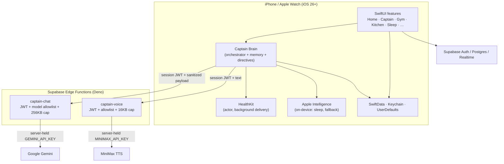
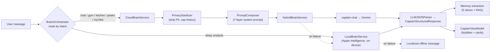
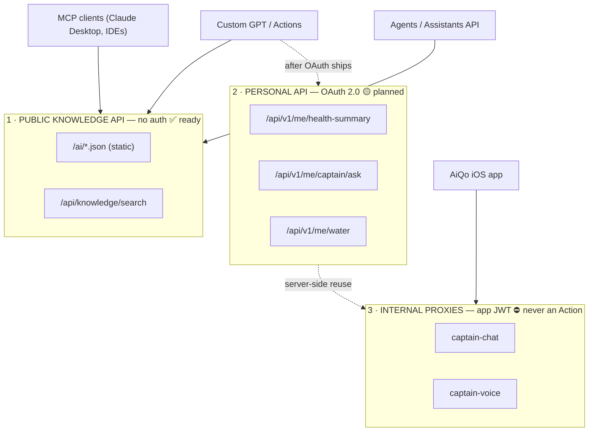
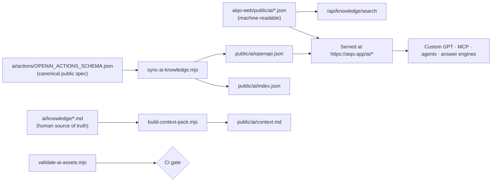
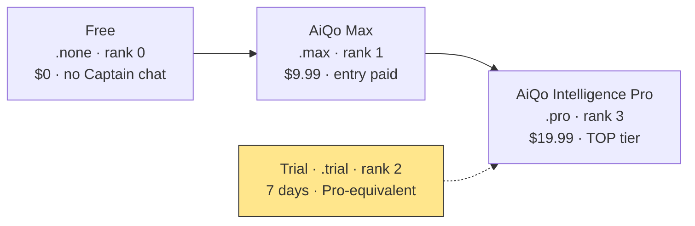

# AiQo — Architecture Diagrams

> Mermaid diagrams (render on GitHub and in most Markdown viewers). They cover the system, the Captain "Brain" pipeline, the GPT-integration topology, and the knowledge-asset data flow.

---

## 1. System architecture

---

## 2. Captain "Brain" request pipeline

---

## 3. GPT-integration topology (the three surfaces)

---

## 4. Knowledge-asset data flow

---

## 5. Tier model (note the enum quirk)

> `.max` is the **entry** paid tier, not the maximum. Always compare tiers by `rank`, never by the enum name.
