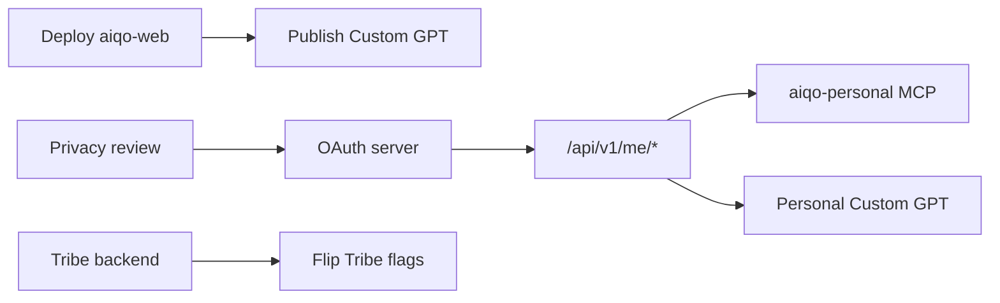

# AiQo — AI Integration Roadmap

> Forward roadmap for AiQo's AI-native and GPT-integration ambitions. Combines the GPT-integration work, product opportunities, and security hardening into one sequenced plan. Status reflects the end of this program.

---

## ✅ Now — done in this program

- **AI knowledge base** (human + machine-readable) covering the whole product.
- **Public Knowledge API** — `/ai/*.json` + `/api/knowledge/search` (verified locally; ready to deploy).
- **OpenAI Actions schema** — import-ready for a Custom GPT.
- **MCP server** — runnable, 7 tools + a resource.
- **Agent architecture** + reusable prompts.
- **Website answer-engine optimization** — `llms.txt`, AI-crawler robots rules, `WebSite`+`FAQPage` JSON-LD, `ai-plugin.json`, context pack.
- **Automation** — validate / sync / context-pack scripts.
- **Security review** + `SECURITY.md`.

## 🟢 Next (days–weeks) — deploy & activate

1. **Deploy the knowledge API:** push `aiqo-web` → verify `https://aiqo.app/ai/info.json` and `/api/knowledge/search?q=pricing`.
2. **Publish the "AiQo Guide" Custom GPT** (paste the Actions schema + system prompt).
3. **Wire CI:** run `validate-ai-assets.mjs` (and a secret scanner) on every push.
4. **Web security headers** (tested CSP) on `aiqo-web`.
5. **Annual subscription plans** (~$59 Max / ~$119 Pro) — monetization lift (see [PRODUCT_OPPORTUNITIES.md](PRODUCT_OPPORTUNITIES.md)).
6. **Streaming Captain replies (SSE)** — top perceived-latency win.

## 🟡 Soon (weeks–months) — personal & social

7. **OAuth 2.0 server** (Supabase-backed) + the `personal` API endpoints (`/api/v1/me/*`) — after a **privacy review** (health data leaving the device is a material change).
8. **`aiqo-personal` MCP server** (OAuth) mirroring the personal API.
9. **Ship Tribe** — flip the feature flags + complete the backend (top retention lever).
10. **Referral loop** (gift trial days) — growth, on-brand.
11. **Remote analytics** (Mixpanel/PostHog) — measure trial conversion to tune the day-6/7 beats.

## 🔵 Later (quarters) — deepen the AI-native edge

12. **Hosted/remote MCP** transport for zero-install access.
13. **Deeper on-device inference** (more Apple Intelligence) — latency, cost, privacy.
14. **3D Captain avatar V1/V2** (idle+voice → lip-sync) for the premium bar.
15. **Self-hosted voice** (Fish Speech on the founder's voice) replacing third-party TTS.
16. **Per-user rate limiting** + abuse analytics on Edge Functions.
17. **GCC expansion** content + localization; finish the site language toggle.

---

## Dependencies & gates

**Principle:** ship the public, no-risk surface now; gate anything touching user health data behind an explicit privacy review.
